# 基础策略框架

<cite>
**本文档中引用的文件**
- [base_strategy.py](file://src/strategies/base_strategy.py)
- [strategy_agent.py](file://src/agents/strategy_agent.py)
- [example_strategy.py](file://src/strategies/example_strategy.py)
- [custom/example_strategy.py](file://src/strategies/custom/example_strategy.py)
- [backtest_runner.py](file://src/agents/backtest_runner.py)
- [exchange_manager.py](file://src/exchange_manager.py)
- [config.py](file://src/config.py)
- [base_agent.py](file://src/agents/base_agent.py)
</cite>

## 目录
1. [简介](#简介)
2. [项目结构概览](#项目结构概览)
3. [BaseStrategy基类设计](#basestrategy基类设计)
4. [策略生命周期方法](#策略生命周期方法)
5. [策略状态管理](#策略状态管理)
6. [信号生成机制](#信号生成机制)
7. [策略继承最佳实践](#策略继承最佳实践)
8. [与策略引擎的集成](#与策略引擎的集成)
9. [错误处理与验证](#错误处理与验证)
10. [性能优化建议](#性能优化建议)
11. [故障排除指南](#故障排除指南)
12. [总结](#总结)

## 简介

Moon Dev的交易策略框架是一个高度模块化和可扩展的基础策略系统，旨在为开发者提供一个统一的策略开发平台。该框架的核心是`BaseStrategy`基类，它定义了所有自定义策略必须遵循的标准接口和生命周期方法。

框架采用事件驱动架构，支持实时交易和回测两种模式。通过统一的信号生成接口，策略可以轻松集成到交易系统中，同时提供了强大的错误处理和验证机制确保系统的稳定性。

## 项目结构概览

策略框架的核心组件分布在以下目录结构中：

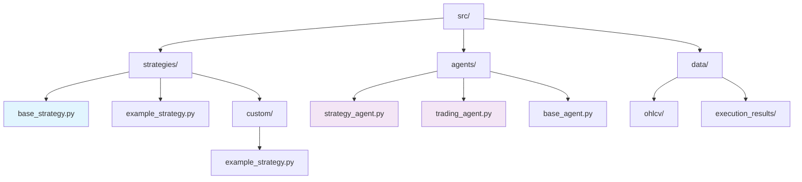

**图表来源**
- [base_strategy.py](file://src/strategies/base_strategy.py#L1-L21)
- [strategy_agent.py](file://src/agents/strategy_agent.py#L1-L50)

**章节来源**
- [base_strategy.py](file://src/strategies/base_strategy.py#L1-L21)
- [strategy_agent.py](file://src/agents/strategy_agent.py#L1-L306)

## BaseStrategy基类设计

### 核心设计理念

`BaseStrategy`基类采用了简洁而强大的设计原则，只定义了一个必需的方法：`generate_signals()`。这种设计哲学体现了以下核心思想：

1. **最小化接口**：通过限制接口数量，降低学习成本和实现复杂度
2. **最大化灵活性**：允许策略开发者自由选择任何技术指标或算法组合
3. **统一输出格式**：确保所有策略产生标准化的信号格式

### 基类结构

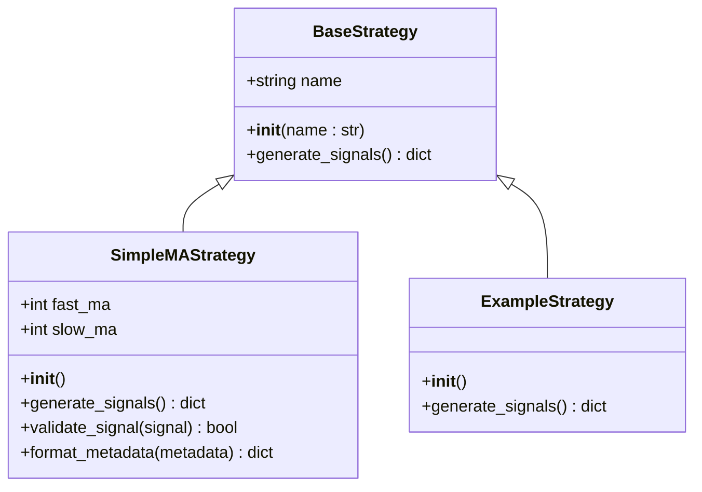

**图表来源**
- [base_strategy.py](file://src/strategies/base_strategy.py#L5-L21)
- [example_strategy.py](file://src/strategies/example_strategy.py#L9-L20)
- [custom/example_strategy.py](file://src/strategies/custom/example_strategy.py#L3-L19)

### 初始化机制

基类的初始化过程非常简单，只接受一个字符串参数作为策略名称：

- **参数验证**：虽然基类不进行复杂的参数验证，但建议子类在`__init__`方法中添加适当的参数检查
- **命名约定**：策略名称应该具有描述性，便于识别和调试
- **状态初始化**：可以在子类中添加额外的状态变量和配置参数

**章节来源**
- [base_strategy.py](file://src/strategies/base_strategy.py#L5-L10)

## 策略生命周期方法

### generate_signals()方法详解

这是策略框架的核心方法，定义了策略的主要行为：

#### 方法签名和返回值

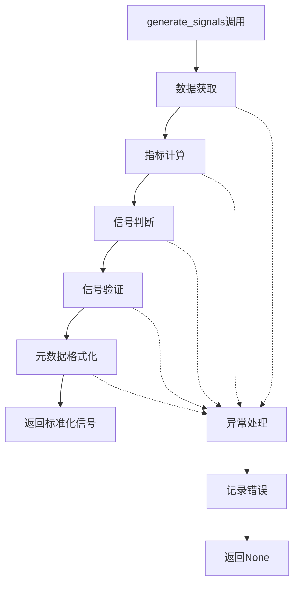

**图表来源**
- [example_strategy.py](file://src/strategies/example_strategy.py#L15-L73)

#### 返回值结构

策略必须返回一个包含以下字段的字典：

| 字段名 | 类型 | 必需 | 描述 |
|--------|------|------|------|
| token | str | 是 | 代币地址或符号 |
| signal | float | 是 | 信号强度（0-1之间） |
| direction | str | 是 | 交易方向：'BUY'、'SELL'、'NEUTRAL' |
| metadata | dict | 否 | 可选的策略特定数据 |

#### 生命周期阶段

1. **数据准备阶段**：从配置的监控列表中获取市场数据
2. **指标计算阶段**：应用技术指标和分析逻辑
3. **信号生成阶段**：根据分析结果生成买入、卖出或中性信号
4. **验证阶段**：确保信号符合预期格式和业务规则
5. **格式化阶段**：添加元数据和上下文信息

**章节来源**
- [base_strategy.py](file://src/strategies/base_strategy.py#L12-L21)
- [example_strategy.py](src/strategies/example_strategy.py#L15-L73)

## 策略状态管理

### 状态变量设计

策略状态管理是策略开发中的关键环节。良好的状态管理应该满足以下要求：

#### 内存效率

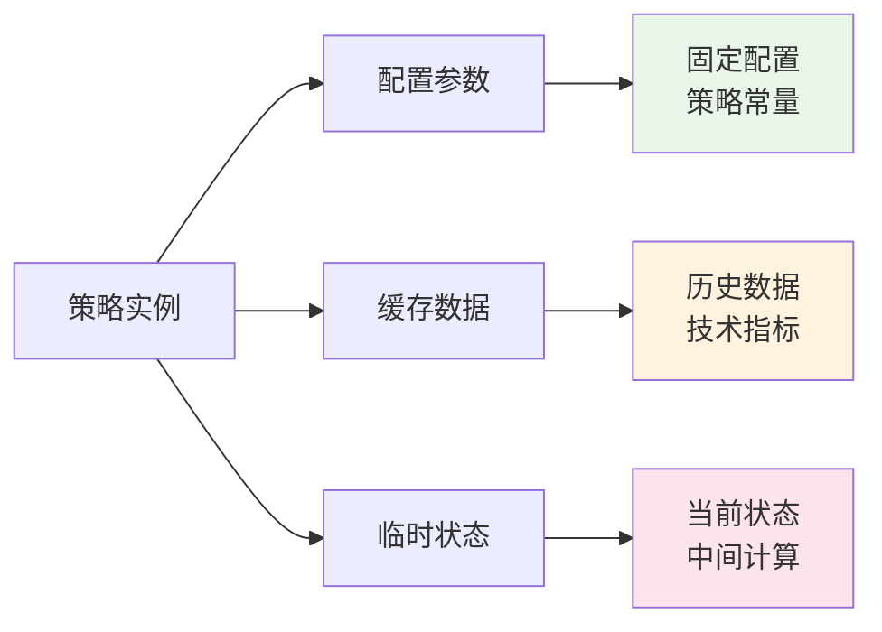

#### 状态持久化

虽然基类本身不提供持久化功能，但建议在子类中实现以下状态管理机制：

1. **参数持久化**：将重要的配置参数保存到文件或数据库
2. **状态快照**：定期保存策略运行状态用于恢复
3. **版本控制**：跟踪策略参数的变更历史

### 参数配置系统

框架通过配置文件提供灵活的参数管理系统：

#### 配置层次结构

| 配置层级 | 文件位置 | 用途 | 示例 |
|----------|----------|------|------|
| 全局配置 | config.py | 系统级设置 | 交易所类型、资金规模 |
| 策略配置 | 策略类内部 | 策略特定参数 | 移动平均周期、阈值设置 |
| 运行时配置 | 环境变量 | 动态调整 | API密钥、交易开关 |

**章节来源**
- [config.py](file://src/config.py#L1-L136)
- [example_strategy.py](file://src/strategies/example_strategy.py#L9-L15)

## 信号生成机制

### 信号生成流程

信号生成是策略的核心功能，涉及多个步骤的精密协调：

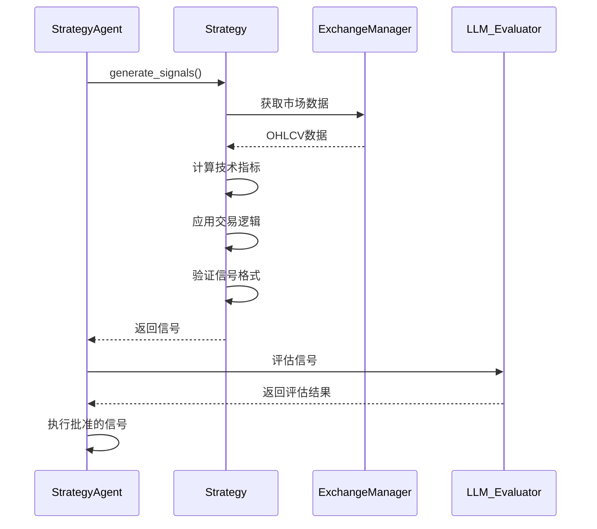

**图表来源**
- [strategy_agent.py](file://src/agents/strategy_agent.py#L100-L200)
- [example_strategy.py](file://src/strategies/example_strategy.py#L15-L73)

### 信号验证机制

框架实现了多层次的信号验证系统：

#### 结构验证

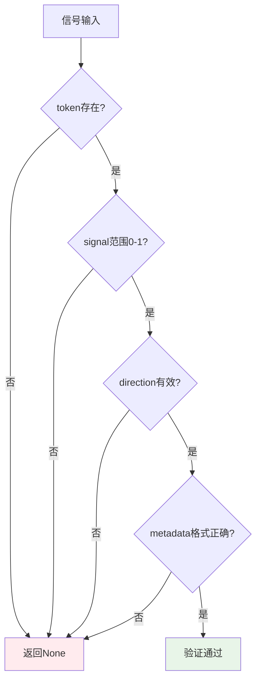

#### 业务规则验证

1. **数值范围检查**：确保信号强度在合理范围内
2. **方向有效性**：验证交易方向是否为预定义值
3. **元数据完整性**：检查必需的元数据字段是否存在
4. **一致性检查**：验证信号与其他系统状态的一致性

**章节来源**
- [strategy_agent.py](file://src/agents/strategy_agent.py#L100-L150)

## 策略继承最佳实践

### 继承层次设计

成功的策略继承应该遵循清晰的层次结构：

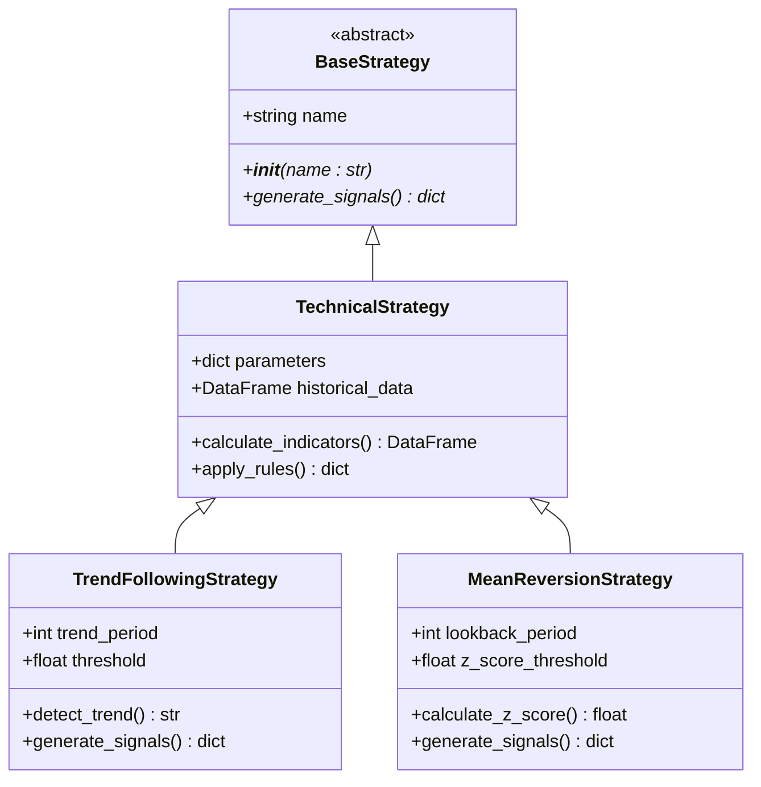

### 重写基类方法的指导原则

#### initialize()方法重写

当需要添加复杂初始化逻辑时：

1. **调用父类初始化**：始终先调用`super().__init__(name)`
2. **参数验证**：验证传入的参数是否在合理范围内
3. **资源分配**：初始化必要的计算资源和数据结构
4. **默认值设置**：为可选参数设置合理的默认值

#### generate_signals()方法重写

重写此方法时应遵循以下模式：

1. **数据获取**：使用统一的数据获取接口
2. **异常处理**：捕获并记录所有可能的异常
3. **信号验证**：确保返回值符合预期格式
4. **性能优化**：避免重复计算和不必要的数据处理

### 状态管理最佳实践

#### 内存管理

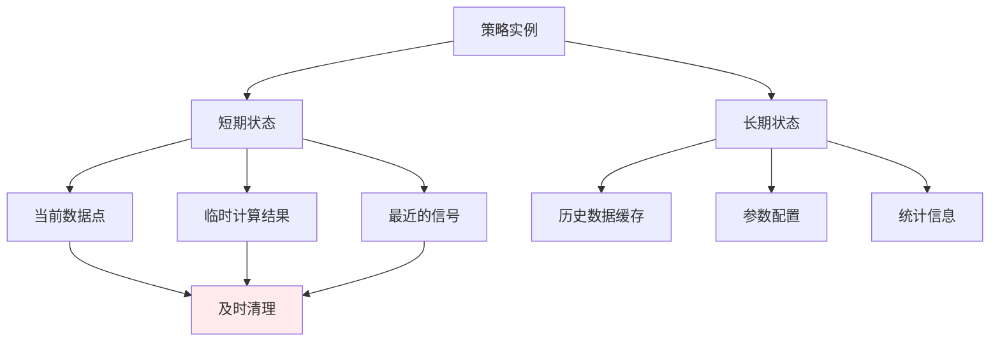

#### 数据缓存策略

1. **智能缓存**：只缓存频繁访问的数据
2. **过期机制**：实现数据过期和自动刷新
3. **内存限制**：设置最大缓存大小防止内存泄漏
4. **增量更新**：只更新变化的部分数据

**章节来源**
- [example_strategy.py](file://src/strategies/example_strategy.py#L9-L20)
- [custom/example_strategy.py](file://src/strategies/custom/example_strategy.py#L3-L19)

## 与策略引擎的集成

### 策略代理集成

策略代理（StrategyAgent）是策略框架的核心协调者，负责管理多个策略的执行：

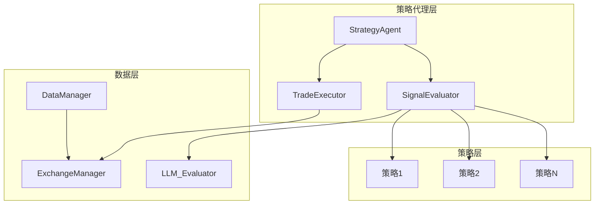

**图表来源**
- [strategy_agent.py](file://src/agents/strategy_agent.py#L40-L100)

### 数据管理器交互

策略通过统一的接口访问市场数据：

#### 数据获取模式

1. **批量获取**：一次性获取多个代币的历史数据
2. **实时订阅**：订阅实时市场数据流
3. **延迟加载**：按需加载特定时间段的数据
4. **缓存策略**：智能缓存减少网络请求

#### 数据格式标准化

| 数据类型 | 格式 | 示例 | 用途 |
|----------|------|------|------|
| OHLCV数据 | DataFrame | 时间戳、开盘价、最高价、最低价、收盘价、成交量 | 技术分析 |
| 交易信号 | Dict | token, signal, direction, metadata | 交易决策 |
| 市场深度 | Dict | bids, asks, timestamp | 流动性分析 |
| 账户信息 | Dict | balance, positions, orders | 风险管理 |

### 订单执行系统集成

策略生成的信号最终会被传递给订单执行系统：

#### 执行流程

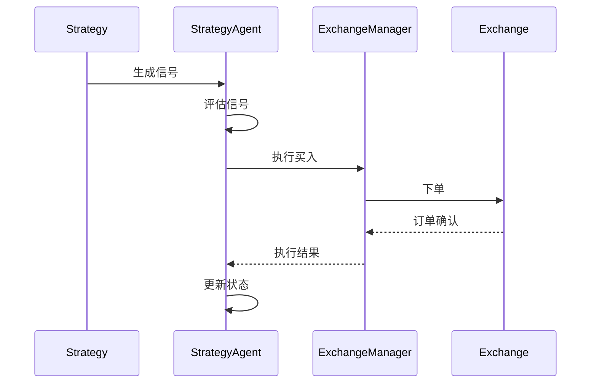

**图表来源**
- [strategy_agent.py](file://src/agents/strategy_agent.py#L250-L306)
- [exchange_manager.py](file://src/exchange_manager.py#L50-L100)

**章节来源**
- [strategy_agent.py](file://src/agents/strategy_agent.py#L40-L306)
- [exchange_manager.py](file://src/exchange_manager.py#L1-L382)

## 错误处理与验证

### 异常处理策略

框架实现了多层次的异常处理机制：

#### 分层异常处理

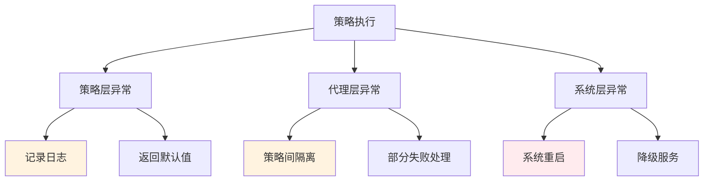

#### 常见异常类型

1. **数据获取异常**：网络连接问题、API限制
2. **计算异常**：数值溢出、除零错误
3. **信号验证异常**：格式错误、范围超限
4. **执行异常**：订单失败、权限不足

### 信号验证机制

#### 验证流水线

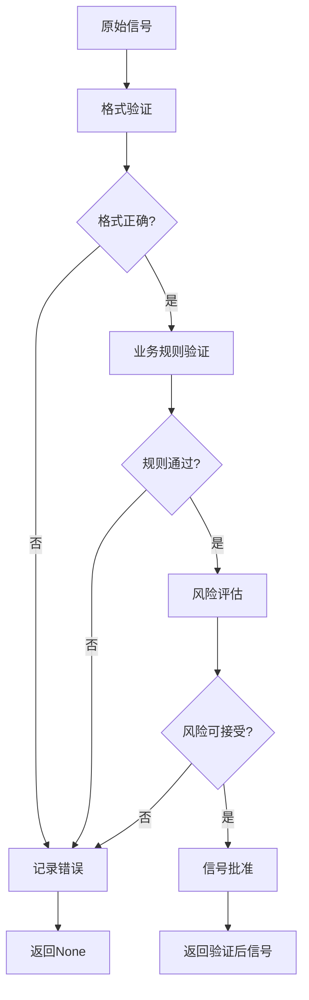

#### 验证规则集

| 验证类型 | 检查项 | 失败处理 | 示例 |
|----------|--------|----------|------|
| 数值范围 | signal ∈ [0,1] | 截断到边界值 | 1.2 → 1.0, -0.1 → 0.0 |
| 字符串格式 | direction ∈ {'BUY','SELL','NEUTRAL'} | 使用默认值 | 'buy' → 'BUY' |
| 数据完整性 | 必需字段存在 | 跳过当前信号 | 缺少token字段 |
| 业务逻辑 | 信号合理性 | 记录警告 | 价格远高于支撑位 |

**章节来源**
- [strategy_agent.py](file://src/agents/strategy_agent.py#L100-L150)
- [example_strategy.py](file://src/strategies/example_strategy.py#L60-L73)

## 性能优化建议

### 计算效率优化

#### 算法复杂度优化

```mermaid
graph LR
A[原始算法 O(n²)] --> B[优化算法 O(n log n)]
B --> C[并行计算 O(n/p)]
C --> D[缓存优化 O(1)]
style A fill:#ffebee
style B fill:#fff3e0
style C fill:#e8f5e8
style D fill:#e3f2fd
```

#### 关键优化点

1. **向量化计算**：使用Pandas的向量化操作替代循环
2. **缓存机制**：缓存计算结果避免重复计算
3. **提前终止**：在不可能产生信号时提前退出
4. **内存池**：重用对象减少垃圾回收压力

### 内存使用优化

#### 内存管理策略

| 优化技术 | 适用场景 | 效果 | 实现难度 |
|----------|----------|------|----------|
| 数据压缩 | 大量历史数据 | 减少50%内存使用 | 中等 |
| 增量更新 | 实时数据处理 | 保持恒定内存占用 | 高 |
| 对象池 | 频繁创建销毁 | 减少GC压力 | 高 |
| 延迟加载 | 非关键数据 | 按需分配内存 | 低 |

### 并发处理优化

#### 异步处理模式

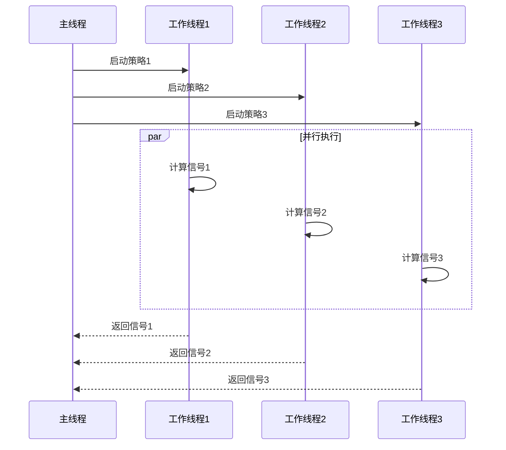

**章节来源**
- [backtest_runner.py](file://src/agents/backtest_runner.py#L1-L214)

## 故障排除指南

### 常见问题诊断

#### 信号生成失败

**症状**：策略返回空信号或None

**诊断步骤**：
1. 检查数据获取是否成功
2. 验证技术指标计算是否正常
3. 确认信号生成逻辑是否被执行
4. 查看异常日志中的具体错误信息

**解决方案**：
```python
# 示例：添加调试输出
def generate_signals(self):
    try:
        # 添加调试信息
        print(f"Processing tokens: {MONITORED_TOKENS}")
        
        for token in MONITORED_TOKENS:
            data = n.get_data(token, days_back=3, timeframe='15m')
            if data is None or data.empty:
                print(f"No data for {token}")
                continue
                
            # 添加更多调试点...
            
    except Exception as e:
        print(f"Error in generate_signals: {e}")
        import traceback
        traceback.print_exc()
        return None
```

#### 性能问题

**症状**：策略执行时间过长

**诊断工具**：
1. 使用Python的`time`模块测量执行时间
2. 分析函数调用栈找出瓶颈
3. 监控内存使用情况

**优化策略**：
- 减少不必要的数据获取
- 使用更高效的算法
- 实现智能缓存机制

### 调试技巧

#### 日志记录最佳实践

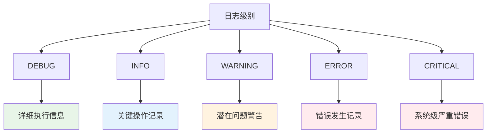

#### 调试配置

1. **分层日志**：不同组件使用不同的日志级别
2. **结构化日志**：使用JSON格式便于解析
3. **上下文信息**：记录足够的上下文信息帮助调试
4. **性能监控**：记录关键操作的执行时间

**章节来源**
- [example_strategy.py](file://src/strategies/example_strategy.py#L60-L73)
- [backtest_runner.py](file://src/agents/backtest_runner.py#L150-L214)

## 总结

Moon Dev的策略框架提供了一个强大而灵活的基础策略开发平台。通过`BaseStrategy`基类的简洁设计，开发者可以快速构建各种类型的交易策略，同时享受框架提供的完整生态系统支持。

### 核心优势

1. **统一接口**：所有策略都遵循相同的接口规范，便于集成和测试
2. **模块化设计**：策略、数据、执行系统相互独立，易于维护和扩展
3. **健壮性**：完善的错误处理和验证机制确保系统稳定运行
4. **可扩展性**：支持多种交易所和交易模式

### 发展方向

1. **机器学习集成**：支持基于AI模型的策略开发
2. **实时回测**：提供实时策略性能监控
3. **分布式计算**：支持大规模策略并行执行
4. **可视化界面**：提供策略开发和监控的图形界面

通过遵循本文档中的最佳实践和指导原则，开发者可以充分利用这个框架的强大功能，构建出高效、稳定的交易策略系统。