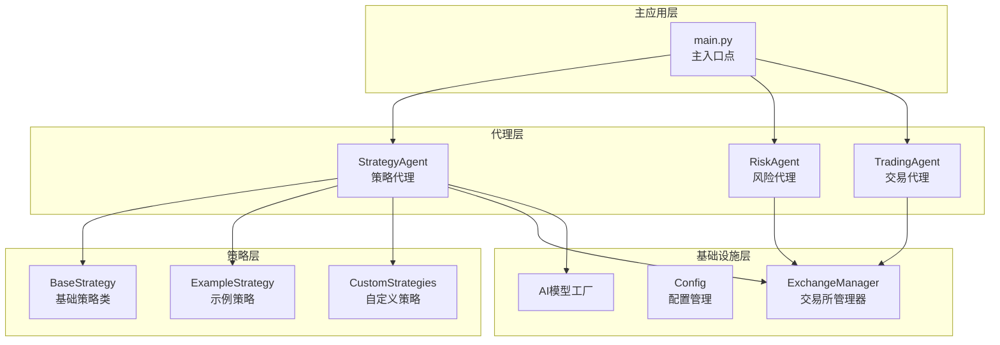
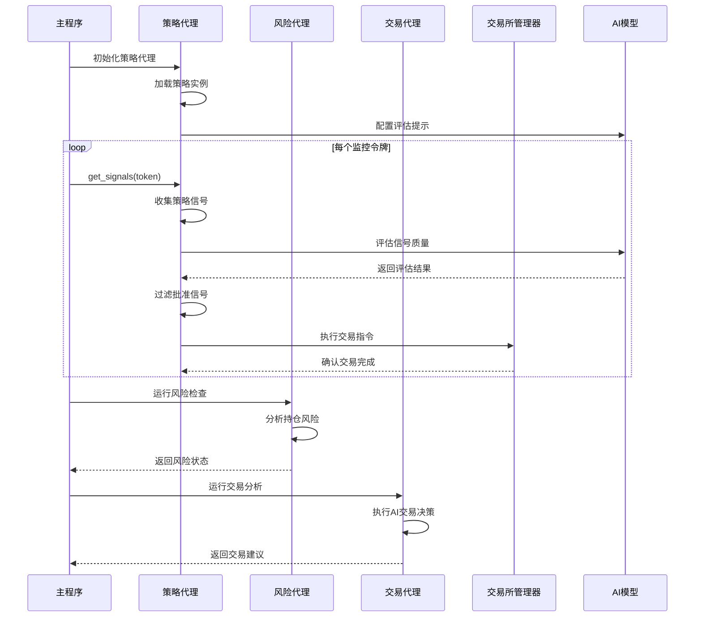
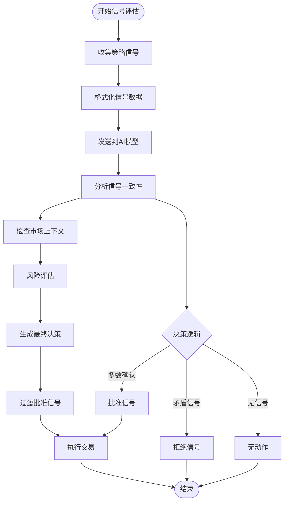
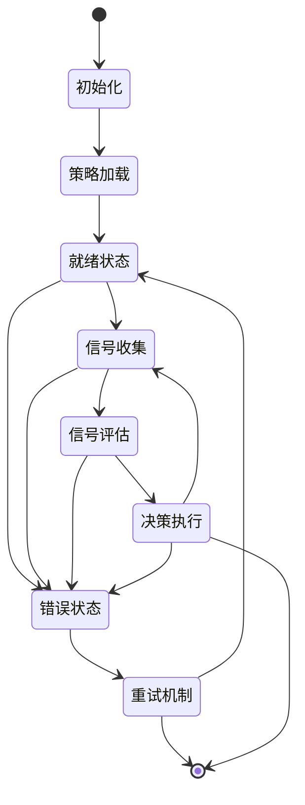
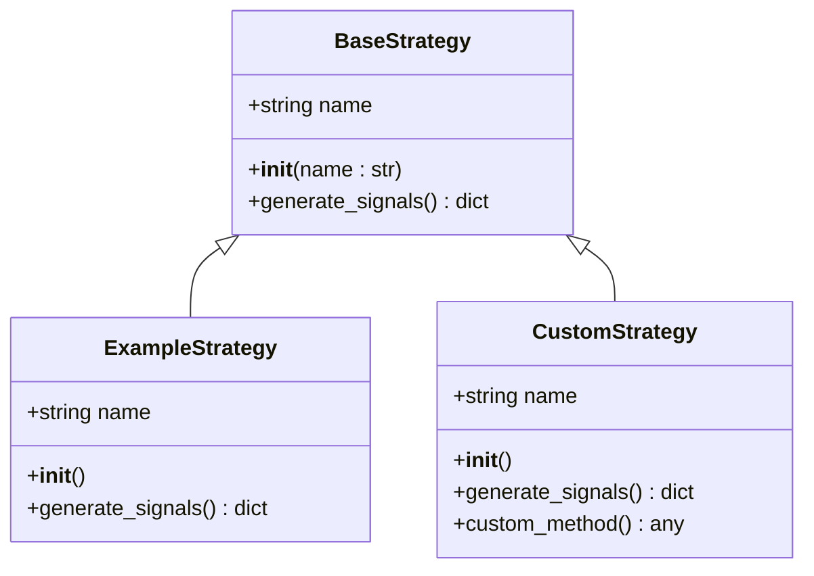
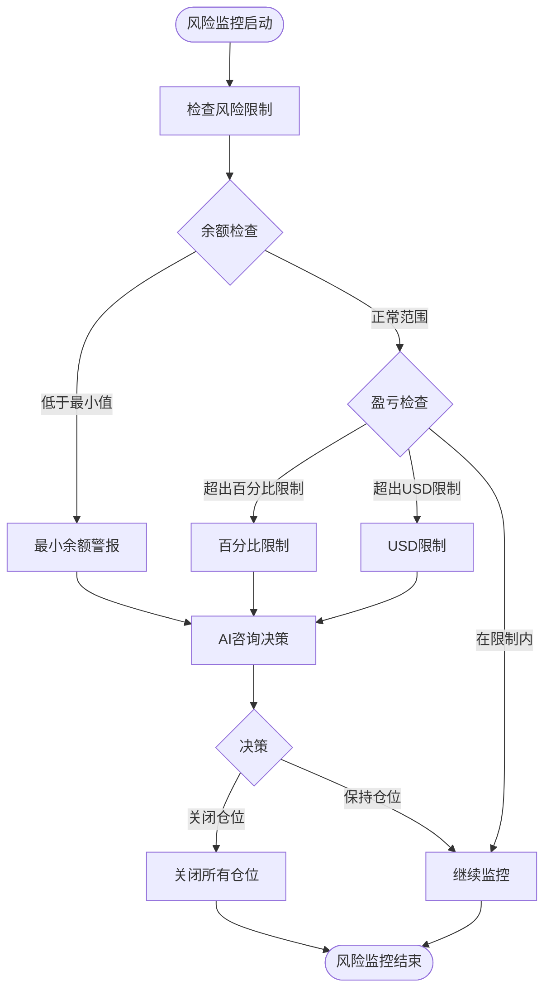
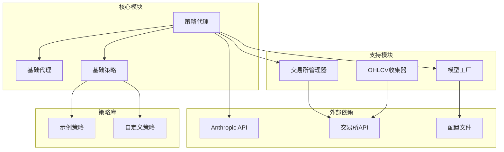

# 策略代理集成

<cite>
**本文档中引用的文件**
- [strategy_agent.py](file://src/agents/strategy_agent.py)
- [main.py](file://src/main.py)
- [base_strategy.py](file://src/strategies/base_strategy.py)
- [risk_agent.py](file://src/agents/risk_agent.py)
- [trading_agent.py](file://src/agents/trading_agent.py)
- [base_agent.py](file://src/agents/base_agent.py)
- [example_strategy.py](file://src/strategies/custom/example_strategy.py)
- [config.py](file://src/config.py)
</cite>

## 目录
1. [简介](#简介)
2. [项目结构概览](#项目结构概览)
3. [核心组件分析](#核心组件分析)
4. [架构概览](#架构概览)
5. [详细组件分析](#详细组件分析)
6. [依赖关系分析](#依赖关系分析)
7. [性能考虑](#性能考虑)
8. [故障排除指南](#故障排除指南)
9. [结论](#结论)

## 简介

Moon Dev的策略代理集成系统是一个高度模块化的交易自动化框架，专门设计用于处理基于策略的交易决策。该系统通过策略代理（StrategyAgent）与多个其他代理（风险代理、交易代理等）协同工作，实现智能的市场分析和交易执行。

策略代理的核心职责包括：
- 策略实例的初始化和管理
- 多策略信号的收集和评估
- 基于LLM的信号验证和决策
- 与交易所的直接或间接交互
- 异常监控和错误处理

## 项目结构概览

策略代理集成系统采用分层架构设计，主要包含以下核心模块：

**图表来源**
- [main.py](file://src/main.py#L39-L67)
- [strategy_agent.py](file://src/agents/strategy_agent.py#L40-L90)
- [base_agent.py](file://src/agents/base_agent.py#L10-L30)

**章节来源**
- [main.py](file://src/main.py#L1-L104)
- [strategy_agent.py](file://src/agents/strategy_agent.py#L1-L306)

## 核心组件分析

### 策略代理（StrategyAgent）

策略代理是整个系统的核心协调器，负责管理所有策略实例并执行策略驱动的交易决策。

#### 初始化流程

策略代理的初始化过程包含以下关键步骤：

1. **环境配置检查**：验证交换机管理器可用性
2. **策略加载**：动态导入和实例化策略类
3. **AI客户端初始化**：设置Anthropic API连接
4. **配置验证**：确保启用策略功能

#### 策略实例管理

系统支持多种策略类型的动态加载：

- **内置策略**：ExampleStrategy、MyStrategy等预定义策略
- **自定义策略**：用户开发的策略类
- **策略验证**：确保每个策略都继承自BaseStrategy基类

#### 信号处理机制

策略代理实现了完整的信号处理流水线：

1. **信号收集**：从所有启用的策略收集原始信号
2. **数据格式化**：将信号转换为LLM可读格式
3. **AI评估**：使用Claude模型评估信号质量
4. **决策过滤**：根据AI建议筛选有效信号
5. **执行准备**：为批准的信号准备交易指令

**章节来源**
- [strategy_agent.py](file://src/agents/strategy_agent.py#L40-L90)
- [base_strategy.py](file://src/strategies/base_strategy.py#L1-L21)

## 架构概览

策略代理集成系统采用事件驱动的架构模式，各组件通过明确定义的接口进行通信：

**图表来源**
- [main.py](file://src/main.py#L39-L67)
- [strategy_agent.py](file://src/agents/strategy_agent.py#L120-L200)
- [risk_agent.py](file://src/agents/risk_agent.py#L567-L601)

## 详细组件分析

### 策略代理核心功能

#### 信号评估系统

策略代理的核心能力是通过LLM对多策略信号进行综合评估：

**图表来源**
- [strategy_agent.py](file://src/agents/strategy_agent.py#L120-L200)

#### 策略生命周期管理

策略代理实现了完整的策略生命周期管理：

**图表来源**
- [strategy_agent.py](file://src/agents/strategy_agent.py#L40-L90)

#### 与其他代理的通信协调

策略代理通过配置化的ACTIVE_AGENTS字典控制与其他代理的协作：

| 代理类型 | 功能描述 | 协作方式 |
|---------|---------|---------|
| 风险代理(RiskAgent) | 监控持仓风险，执行止损操作 | 并行运行，独立决策 |
| 交易代理(TradingAgent) | 执行AI驱动的交易决策 | 并行运行，共享市场数据 |
| 复制机器人(CopyBotAgent) | 分析复制投资组合表现 | 并行运行，独立分析 |
| 情感代理(SentimentAgent) | 分析市场情绪影响 | 并行运行，提供辅助信息 |

**章节来源**
- [main.py](file://src/main.py#L20-L35)
- [strategy_agent.py](file://src/agents/strategy_agent.py#L120-L280)

### 基础策略类（BaseStrategy）

基础策略类定义了所有自定义策略必须遵循的标准接口：

#### 策略接口规范

**图表来源**
- [base_strategy.py](file://src/strategies/base_strategy.py#L5-L21)
- [example_strategy.py](file://src/strategies/custom/example_strategy.py#L3-L19)

#### 策略信号格式

所有策略必须返回标准化的信号格式：

| 字段名 | 类型 | 描述 | 示例值 |
|-------|------|------|--------|
| token | string | 交易代币地址 | "9BB6NFEcjBCtnNLFko2FqVQBq8HHM13kCyYcdQbgpump" |
| signal | float | 信号强度(0-1) | 0.85 |
| direction | string | 交易方向 | "BUY", "SELL", "NEUTRAL" |
| metadata | dict | 策略特定元数据 | 包含技术指标等信息 |

**章节来源**
- [base_strategy.py](file://src/strategies/base_strategy.py#L10-L21)
- [example_strategy.py](file://src/strategies/custom/example_strategy.py#L6-L18)

### 风险代理集成

策略代理与风险代理形成互补的风险管理体系：

#### 风险监控流程

**图表来源**
- [risk_agent.py](file://src/agents/risk_agent.py#L567-L601)

**章节来源**
- [risk_agent.py](file://src/agents/risk_agent.py#L567-L631)

## 依赖关系分析

策略代理集成系统的依赖关系呈现清晰的层次结构：

**图表来源**
- [strategy_agent.py](file://src/agents/strategy_agent.py#L1-L20)
- [base_agent.py](file://src/agents/base_agent.py#L1-L20)

### 关键依赖项说明

| 依赖项 | 版本要求 | 用途 | 可选性 |
|-------|---------|------|-------|
| anthropic | 最新稳定版 | AI模型调用 | 必需 |
| pandas | >=1.5.0 | 数据处理 | 必需 |
| termcolor | 最新稳定版 | 控制台输出美化 | 必需 |
| python-dotenv | 最新稳定版 | 环境变量管理 | 必需 |

**章节来源**
- [strategy_agent.py](file://src/agents/strategy_agent.py#L1-L20)
- [config.py](file://src/config.py#L1-L136)

## 性能考虑

### 策略执行性能优化

策略代理在设计时充分考虑了性能优化：

#### 并行处理机制
- **异步信号收集**：同时从多个策略收集信号
- **批量AI请求**：合并多个信号的AI评估请求
- **缓存机制**：缓存频繁访问的市场数据

#### 资源管理策略
- **内存优化**：及时释放不再需要的数据结构
- **连接池管理**：复用API连接减少建立开销
- **垃圾回收**：定期清理未使用的对象引用

### 监控指标体系

系统提供了全面的性能监控指标：

| 指标类别 | 具体指标 | 监控目的 | 告警阈值 |
|---------|---------|---------|---------|
| 执行时间 | 策略信号收集时间 | 性能监控 | >30秒 |
| 执行时间 | AI评估响应时间 | 响应速度 | >60秒 |
| 资源使用 | 内存占用率 | 资源健康 | >80% |
| 错误率 | 策略加载失败率 | 系统稳定性 | >5% |
| 交易成功率 | 信号执行成功率 | 业务效果 | <90% |

## 故障排除指南

### 常见问题诊断

#### 策略加载失败

**症状**：策略代理初始化时出现导入错误
**可能原因**：
- 策略文件路径错误
- 策略类定义不完整
- 缺少必要的依赖包

**解决方案**：
1. 检查策略文件是否位于正确目录
2. 验证策略类是否继承BaseStrategy
3. 确认所有依赖包已安装

#### AI评估超时

**症状**：策略信号评估过程中出现超时错误
**可能原因**：
- API密钥配置错误
- 网络连接不稳定
- 请求频率过高

**解决方案**：
1. 验证ANTHROPIC_KEY环境变量
2. 检查网络连接状态
3. 调整AI_MAX_TOKENS参数

#### 交易执行失败

**症状**：策略信号被批准但无法执行交易
**可能原因**：
- 交易所连接问题
- 账户资金不足
- 订单参数错误

**解决方案**：
1. 检查交易所API连接状态
2. 验证账户余额和可用资金
3. 审查订单参数配置

### 日志记录规范

系统采用分级日志记录机制：

#### 日志级别定义

| 级别 | 用途 | 示例场景 |
|------|------|---------|
| DEBUG | 详细执行信息 | 策略信号详情、AI响应内容 |
| INFO | 正常操作记录 | 策略加载成功、交易执行 |
| WARNING | 潜在问题提醒 | 策略加载失败、API限制 |
| ERROR | 错误事件记录 | 网络连接失败、API调用错误 |
| CRITICAL | 严重错误 | 系统崩溃、关键功能失效 |

#### 日志文件管理

系统自动管理日志文件的轮转和清理：

- **按天轮转**：每日生成新的日志文件
- **大小限制**：单个日志文件不超过100MB
- **保留期限**：自动清理超过30天的日志
- **压缩存储**：归档日志自动压缩节省空间

**章节来源**
- [strategy_agent.py](file://src/agents/strategy_agent.py#L120-L200)

## 结论

Moon Dev的策略代理集成系统展现了现代交易自动化系统的设计精髓。通过模块化架构、清晰的职责分离和完善的错误处理机制，该系统实现了高效、可靠的策略驱动交易。

### 系统优势

1. **高度可扩展性**：支持动态加载新策略，易于添加新的交易逻辑
2. **强健的错误处理**：完善的异常捕获和恢复机制
3. **灵活的配置管理**：通过配置文件控制系统行为
4. **强大的AI集成**：充分利用LLM的能力进行智能决策
5. **全面的风险控制**：与风险代理协同实现多层次风险管理

### 未来发展方向

1. **策略优化**：引入机器学习算法优化策略选择
2. **实时监控**：增强实时性能监控和告警功能
3. **回测集成**：提供更完善的策略回测支持
4. **多资产支持**：扩展支持更多交易资产类型
5. **云原生部署**：支持容器化和微服务架构

该策略代理集成系统为构建下一代智能交易系统提供了坚实的基础，其设计理念和实现方式值得在类似项目中借鉴和应用。