# 策略实现

<cite>
**本文档中引用的文件**
- [base_strategy.py](file://src/strategies/base_strategy.py)
- [strategy_agent.py](file://src/agents/strategy_agent.py)
- [example_strategy.py](file://src/strategies/example_strategy.py)
- [custom/example_strategy.py](file://src/strategies/custom/example_strategy.py)
- [backtest_runner.py](file://src/agents/backtest_runner.py)
- [config.py](file://src/config.py)
- [exchange_manager.py](file://src/exchange_manager.py)
- [SimpleMomentumCross_BT.py](file://src/data/rbi/FINAL_WINNING_STRATEGIES/SimpleMomentumCross_BT.py)
- [TrendFollowingMA_BT.py](file://src/data/rbi/FINAL_WINNING_STRATEGIES/TrendFollowingMA_BT.py)
</cite>

## 目录
1. [简介](#简介)
2. [项目结构](#项目结构)
3. [核心组件](#核心组件)
4. [架构概览](#架构概览)
5. [详细组件分析](#详细组件分析)
6. [策略开发工作流程](#策略开发工作流程)
7. [性能评估与回测](#性能评估与回测)
8. [部署与监控](#部署与监控)
9. [故障排除指南](#故障排除指南)
10. [结论](#结论)

## 简介

Moon Dev AI交易系统是一个基于人工智能的自动化交易平台，专门设计用于开发、测试和部署量化交易策略。该系统提供了完整的策略生命周期管理，从策略构思、代码实现、本地测试到生产部署的全流程支持。

本系统的核心优势在于其模块化架构，允许开发者轻松地从基础策略类继承并实现自定义交易逻辑。通过统一的策略代理（StrategyAgent）和交换管理器（ExchangeManager），系统能够无缝处理多个交易所的交易操作，同时提供强大的回测和性能分析功能。

## 项目结构

系统采用清晰的分层架构，主要包含以下核心目录：

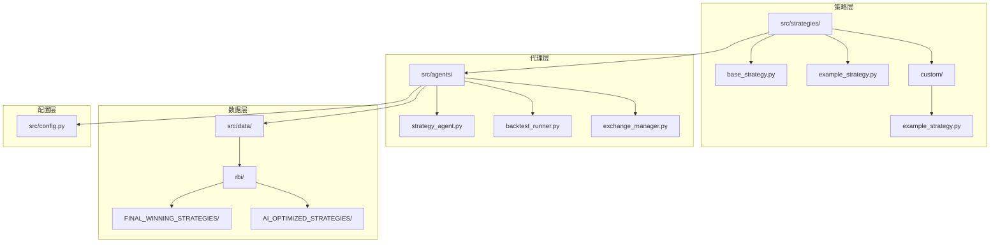

**图表来源**
- [base_strategy.py](file://src/strategies/base_strategy.py#L1-L21)
- [strategy_agent.py](file://src/agents/strategy_agent.py#L1-L50)
- [config.py](file://src/config.py#L1-L30)

**章节来源**
- [base_strategy.py](file://src/strategies/base_strategy.py#L1-L21)
- [strategy_agent.py](file://src/agents/strategy_agent.py#L1-L306)
- [config.py](file://src/config.py#L1-L136)

## 核心组件

### 基础策略类（BaseStrategy）

所有自定义策略必须继承自 `BaseStrategy` 基类，该类提供了策略的基本框架和接口规范。

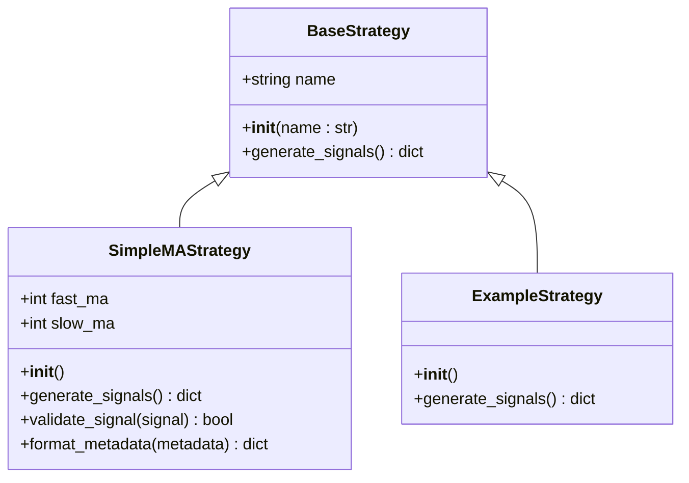

**图表来源**
- [base_strategy.py](file://src/strategies/base_strategy.py#L5-L21)
- [example_strategy.py](file://src/strategies/example_strategy.py#L10-L30)
- [custom/example_strategy.py](file://src/strategies/custom/example_strategy.py#L3-L19)

### 策略代理（StrategyAgent）

策略代理是系统的核心控制器，负责加载、管理和执行所有已启用的策略实例。

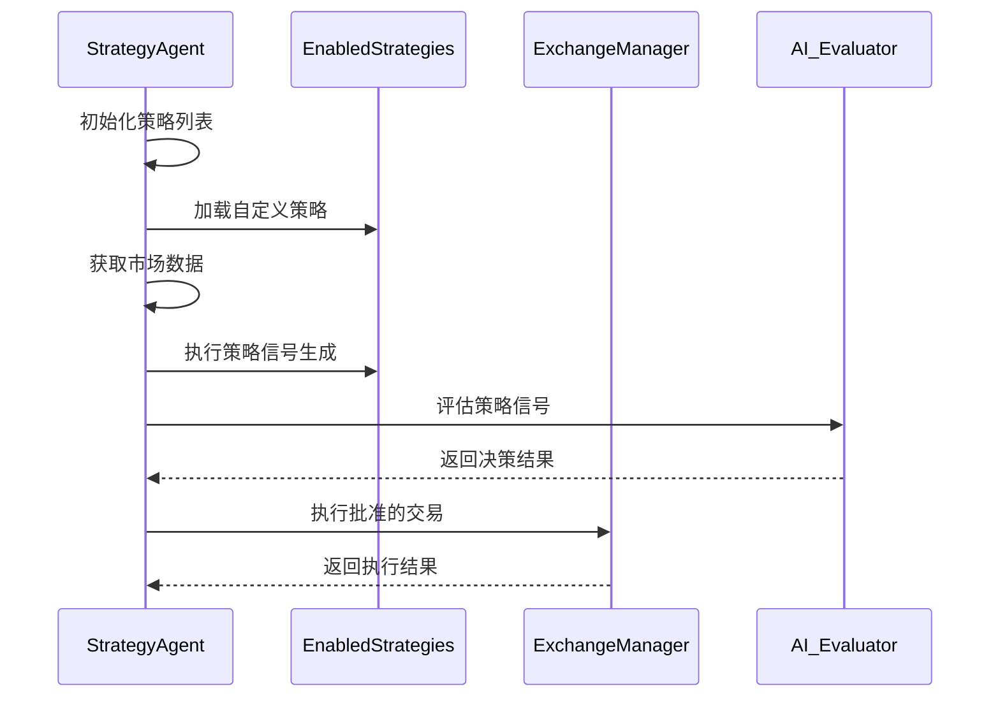

**图表来源**
- [strategy_agent.py](file://src/agents/strategy_agent.py#L60-L120)
- [exchange_manager.py](file://src/exchange_manager.py#L200-L250)

**章节来源**
- [base_strategy.py](file://src/strategies/base_strategy.py#L1-L21)
- [strategy_agent.py](file://src/agents/strategy_agent.py#L1-L306)
- [exchange_manager.py](file://src/exchange_manager.py#L1-L382)

## 架构概览

系统采用事件驱动的架构模式，通过策略代理协调各个组件之间的交互：

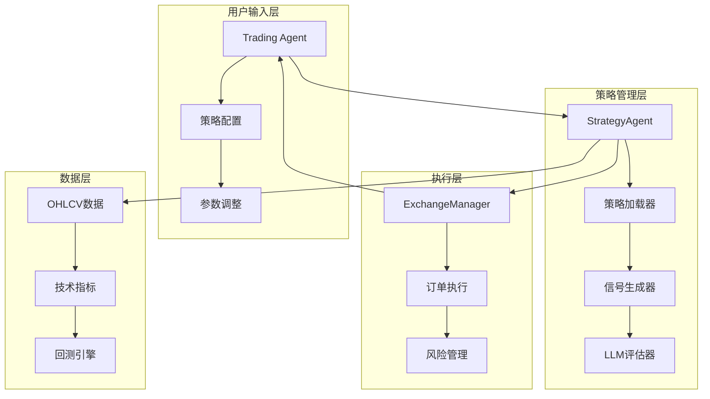

**图表来源**
- [strategy_agent.py](file://src/agents/strategy_agent.py#L60-L100)
- [exchange_manager.py](file://src/exchange_manager.py#L30-L80)
- [backtest_runner.py](file://src/agents/backtest_runner.py#L20-L60)

## 详细组件分析

### 策略参数定义与配置

每个策略都具有可配置的参数集合，这些参数直接影响策略的行为和性能：

#### 参数类型分类

| 参数类型 | 描述 | 示例 | 配置范围 |
|---------|------|------|----------|
| 时间周期参数 | 影响技术指标计算的时间窗口 | 快速均线期数、慢速均线期数 | 5-100 |
| 阈值参数 | 决定交易信号触发的条件 | 价格突破阈值、波动率阈值 | 0.1-5.0 |
| 风险参数 | 控制仓位大小和风险承受度 | 最大回撤限制、止损百分比 | 1%-10% |
| 过滤参数 | 提高信号质量的过滤条件 | 成交量倍数、相关性阈值 | 1.0-3.0 |

#### 参数优化策略

系统支持多种参数优化方法：

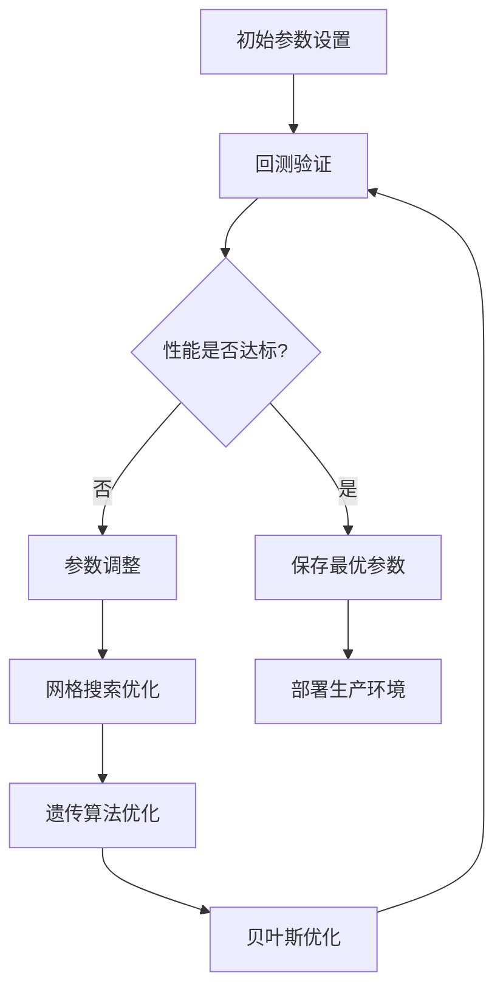

**图表来源**
- [SimpleMomentumCross_BT.py](file://src/data/rbi/FINAL_WINNING_STRATEGIES/SimpleMomentumCross_BT.py#L180-L220)
- [TrendFollowingMA_BT.py](file://src/data/rbi/FINAL_WINNING_STRATEGIES/TrendFollowingMA_BT.py#L200-L250)

### 策略代理的加载与管理机制

策略代理通过动态导入机制加载策略实例：

#### 策略注册流程

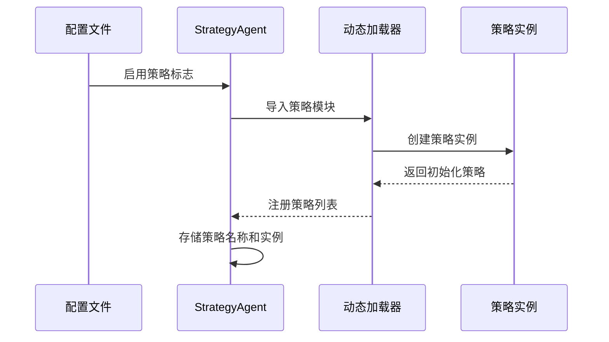

**图表来源**
- [strategy_agent.py](file://src/agents/strategy_agent.py#L60-L90)

#### 策略调度机制

策略代理采用轮询机制定期检查和执行策略：

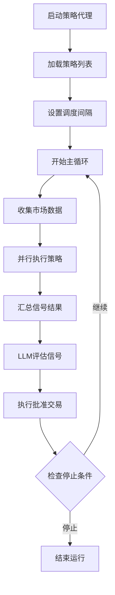

**图表来源**
- [strategy_agent.py](file://src/agents/strategy_agent.py#L120-L200)

### 信号生成与验证

策略的核心输出是交易信号，系统对信号进行严格的验证和格式化：

#### 信号结构定义

| 字段名 | 类型 | 描述 | 示例值 |
|--------|------|------|--------|
| token | string | 交易标的地址 | "9BB6NFEcjBCtnNLFko2FqVQBq8HHM13kCyYcdQbgpump" |
| signal | float | 信号强度（0-1） | 0.85 |
| direction | string | 交易方向 | "BUY", "SELL", "NEUTRAL" |
| metadata | dict | 策略特定元数据 | 包含技术指标等信息 |

#### 信号验证流程

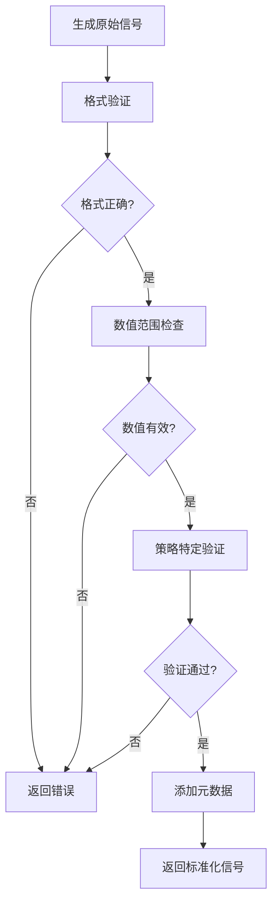

**图表来源**
- [example_strategy.py](file://src/strategies/example_strategy.py#L40-L70)
- [custom/example_strategy.py](file://src/strategies/custom/example_strategy.py#L8-L18)

**章节来源**
- [strategy_agent.py](file://src/agents/strategy_agent.py#L60-L150)
- [example_strategy.py](file://src/strategies/example_strategy.py#L1-L74)
- [custom/example_strategy.py](file://src/strategies/custom/example_strategy.py#L1-L19)

## 策略开发工作流程

### 第一阶段：策略构思与设计

#### 策略类型选择

根据交易目标和市场特征选择合适的策略类型：

| 策略类型 | 适用市场 | 主要特点 | 典型参数 |
|----------|----------|----------|----------|
| 趋势跟踪 | 趋势明显的市场 | 顺势而为，持仓时间长 | 短期均线: 5-20, 中期均线: 20-50 |
| 均值回归 | 区间震荡市场 | 反向操作，快进快出 | 回归阈值: 1.0-2.0, 止盈止损: 1%-2% |
| 均值回归 | 区间震荡市场 | 反向操作，快进快出 | 回归阈值: 1.0-2.0, 止盈止损: 1%-2% |
| 成交量驱动 | 高成交量市场 | 基于成交量确认信号 | 成交量倍数: 1.5-3.0, 时间窗口: 20-50 |

#### 技术指标选择

策略开发过程中需要合理选择技术指标：

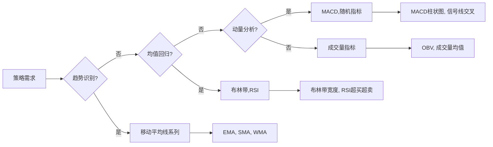

### 第二阶段：代码实现与调试

#### 基础策略模板

以下是标准的策略实现模板：

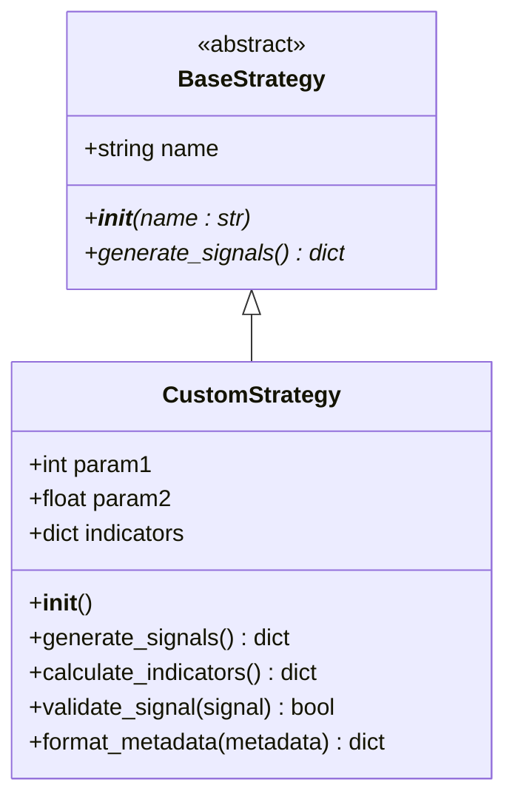

**图表来源**
- [base_strategy.py](file://src/strategies/base_strategy.py#L5-L21)
- [example_strategy.py](file://src/strategies/example_strategy.py#L10-L30)

#### 实现要点

1. **继承基础类**：确保正确继承 `BaseStrategy` 并实现 `generate_signals()` 方法
2. **参数封装**：将所有可调参数作为类属性或配置项
3. **异常处理**：添加适当的错误处理和日志记录
4. **数据验证**：在信号生成前验证输入数据的有效性

### 第三阶段：本地测试与验证

#### 测试环境搭建

系统提供完整的本地测试环境：

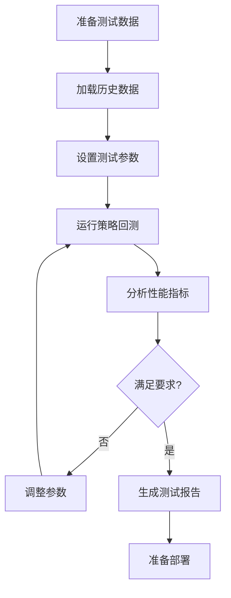

**图表来源**
- [backtest_runner.py](file://src/agents/backtest_runner.py#L20-L80)

#### 测试用例设计

| 测试类型 | 目的 | 检查项目 | 验收标准 |
|----------|------|----------|----------|
| 单元测试 | 验证单个函数 | 输入输出正确性 | 100%通过率 |
| 回测测试 | 验证策略性能 | 收益率、风险指标 | 符合预期表现 |
| 边界测试 | 验证极端情况 | 缺失数据、异常值 | 系统稳定运行 |
| 性能测试 | 验证执行效率 | 处理速度、内存使用 | 在可接受范围内 |

### 第四阶段：部署上线

#### 生产环境配置

部署前需要完成以下配置：

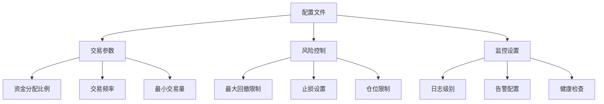

**图表来源**
- [config.py](file://src/config.py#L50-L100)

#### 上线检查清单

- [ ] 策略参数验证
- [ ] 数据连接测试
- [ ] 交易权限确认
- [ ] 风险控制生效
- [ ] 监控系统就绪
- [ ] 应急预案准备

**章节来源**
- [example_strategy.py](file://src/strategies/example_strategy.py#L1-L74)
- [backtest_runner.py](file://src/agents/backtest_runner.py#L1-L214)
- [config.py](file://src/config.py#L50-L136)

## 性能评估与回测

### 关键性能指标（KPI）

系统使用多维度指标评估策略表现：

#### 收益性指标

| 指标名称 | 计算公式 | 解释 | 优秀标准 |
|----------|----------|------|----------|
| 总收益率 | (最终资产/初始资产 - 1) × 100% | 策略总收益水平 | >20%/年 |
| 年化收益率 | [(1+总收益)<sup>365/天数</sup> - 1] × 100% | 年化收益表现 | >15%/年 |
| 夏普比率 | (平均收益 - 无风险利率) / 收益标准差 | 风险调整后收益 | >1.5 |
| 最大回撤 | (峰值 - 谷值) / 峰值 × 100% | 最大亏损幅度 | <20% |

#### 风险指标

| 指标名称 | 计算方法 | 风险含义 | 接受范围 |
|----------|----------|----------|----------|
| 波动率 | 收益率标准差 | 收益稳定性 | <25%/年 |
| VaR | 在特定置信水平下的最大损失 | 极端损失风险 | <5%/日 |
| 贝塔系数 | 与基准的相关性 | 市场敏感度 | <1.0 |
| 下行风险 | 负收益的标准差 | 负面波动风险 | <15%/年 |

### 回测执行流程

#### 自动化回测系统

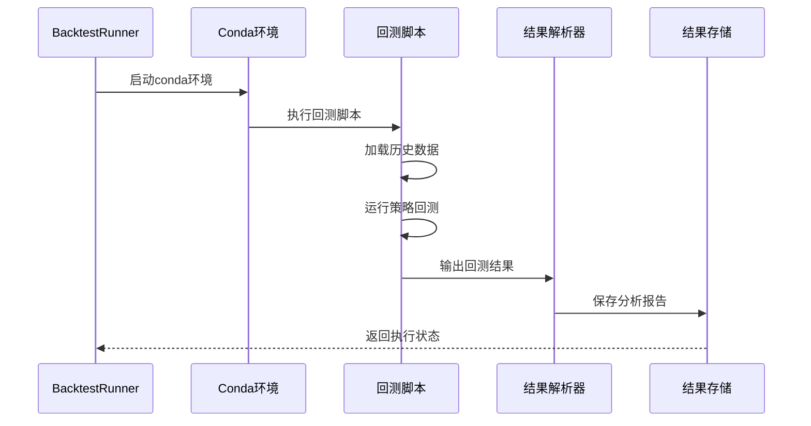

**图表来源**
- [backtest_runner.py](file://src/agents/backtest_runner.py#L20-L80)

#### 回测参数配置

系统支持灵活的回测参数配置：

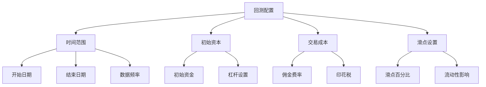

**图表来源**
- [SimpleMomentumCross_BT.py](file://src/data/rbi/FINAL_WINNING_STRATEGIES/SimpleMomentumCross_BT.py#L180-L220)

### 回测结果分析指南

#### 性能评估框架

系统提供全面的策略评估框架：

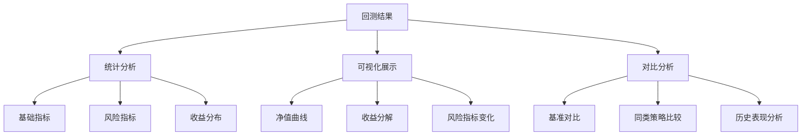

#### 策略筛选标准

系统定义了严格的战略筛选标准：

| 要求类型 | 标准值 | 说明 | 不达标处理 |
|----------|--------|------|------------|
| 交易数量 | ≥50笔 | 确保统计显著性 | 参数优化或策略调整 |
| 夏普比率 | >1.0 | 风险调整后收益 | 继续优化参数 |
| 最大回撤 | ≤30% | 控制下行风险 | 调整风险参数 |
| 年化收益 | >5% | 收益目标达成 | 保持当前参数 |

**图表来源**
- [SimpleMomentumCross_BT.py](file://src/data/rbi/FINAL_WINNING_STRATEGIES/SimpleMomentumCross_BT.py#L220-L240)
- [TrendFollowingMA_BT.py](file://src/data/rbi/FINAL_WINNING_STRATEGIES/TrendFollowingMA_BT.py#L250-L290)

**章节来源**
- [SimpleMomentumCross_BT.py](file://src/data/rbi/FINAL_WINNING_STRATEGIES/SimpleMomentumCross_BT.py#L1-L238)
- [TrendFollowingMA_BT.py](file://src/data/rbi/FINAL_WINNING_STRATEGIES/TrendFollowingMA_BT.py#L1-L289)
- [backtest_runner.py](file://src/agents/backtest_runner.py#L1-L214)

## 部署与监控

### 生产环境部署

#### 部署架构

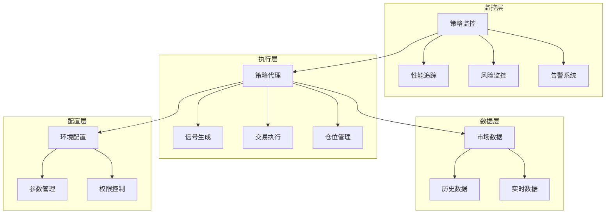

**图表来源**
- [strategy_agent.py](file://src/agents/strategy_agent.py#L60-L120)
- [exchange_manager.py](file://src/exchange_manager.py#L30-L80)

#### 部署步骤

1. **环境准备**
   - 安装依赖包和Python环境
   - 配置交易所API密钥
   - 设置数据库连接（如需要）

2. **配置验证**
   - 检查策略参数有效性
   - 验证交易权限和额度
   - 测试数据连接稳定性

3. **服务启动**
   - 启动策略代理进程
   - 监控系统初始化
   - 健康检查确认

4. **运行监控**
   - 实时观察策略表现
   - 监控系统资源使用
   - 确保告警机制正常

### 实时监控机制

#### 监控指标体系

系统提供多层次的监控指标：

| 监控层级 | 关键指标 | 监控频率 | 告警阈值 |
|----------|----------|----------|----------|
| 策略级 | 收益率、胜率、最大回撤 | 实时 | 收益率<0% |
| 交易级 | 成交量、成交价、滑点 | 实时 | 成交延迟>5秒 |
| 系统级 | CPU使用率、内存占用 | 1分钟 | 使用率>80% |
| 网络级 | API响应时间、连接状态 | 30秒 | 响应时间>2秒 |

#### 异常处理机制

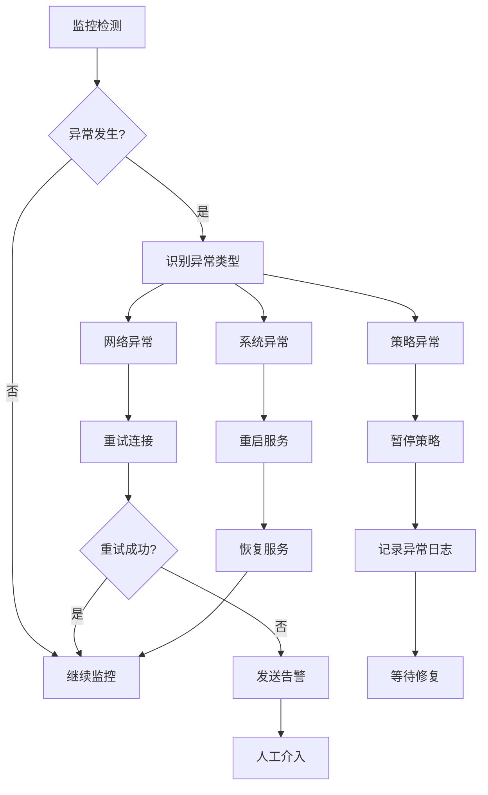

### 策略更新与维护

#### 策略版本管理

系统支持策略的版本控制和灰度发布：

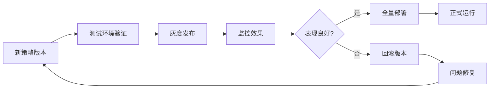

#### 维护计划

- **日常维护**：每日检查、参数微调
- **周度维护**：性能回顾、策略优化
- **月度维护**：架构升级、功能扩展
- **年度维护**：系统重构、安全加固

**章节来源**
- [strategy_agent.py](file://src/agents/strategy_agent.py#L120-L306)
- [exchange_manager.py](file://src/exchange_manager.py#L300-L382)

## 故障排除指南

### 常见问题诊断

#### 策略加载失败

**症状**：策略代理无法加载自定义策略

**可能原因**：
1. 策略文件路径错误
2. Python语法错误
3. 依赖包缺失
4. 权限不足

**解决方案**：
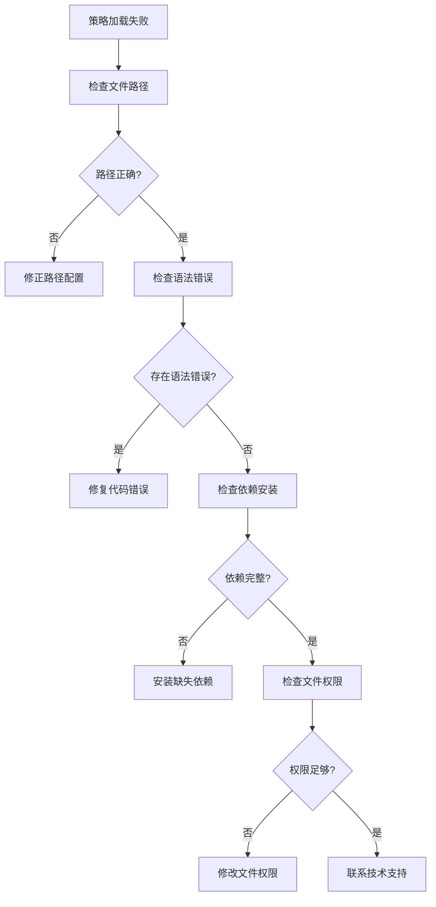

#### 交易执行异常

**症状**：策略信号生成但无法执行交易

**诊断流程**：

| 检查项目 | 检查方法 | 正常范围 | 异常处理 |
|----------|----------|----------|----------|
| API连接 | 尝试API调用 | 响应时间<1秒 | 检查网络和密钥 |
| 资金充足 | 查询账户余额 | ≥最小交易额 | 充值或调整参数 |
| 权限验证 | 检查API权限 | 完整权限集 | 重新授权 |
| 市场状态 | 查询交易状态 | 开盘状态 | 等待开盘 |

#### 性能问题排查

**症状**：策略运行缓慢或内存占用过高

**优化策略**：

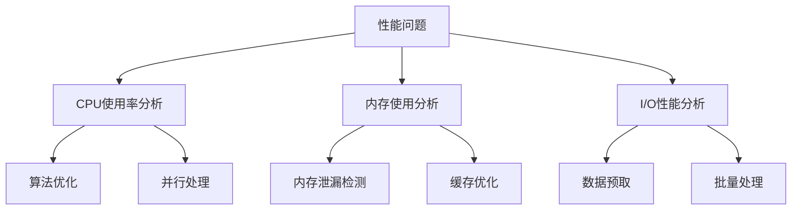

### 日志分析与调试

#### 日志级别设置

系统提供多级别的日志记录：

| 日志级别 | 用途 | 示例场景 | 输出内容 |
|----------|------|----------|----------|
| DEBUG | 详细调试信息 | 策略内部计算过程 | 变量值、中间结果 |
| INFO | 一般信息记录 | 策略执行状态 | 信号生成、交易执行 |
| WARNING | 警告信息 | 异常情况但可继续 | 参数越界、数据缺失 |
| ERROR | 错误信息 | 致命错误 | 系统崩溃、API失败 |
| CRITICAL | 严重错误 | 系统不可用 | 服务宕机、数据丢失 |

#### 调试工具使用

系统提供多种调试工具：

```mermaid
flowchart LR
A[调试工具] --> B[日志查看器]
A --> C[性能分析器]
A --> D[策略模拟器]
A --> E[参数优化器]
B --> F[实时日志流]
B --> G[历史日志查询]
C --> H[CPU性能分析]
C --> I[内存使用分析]
D --> J[离线策略测试]
D --> K[参数敏感性分析]
E --> L[网格搜索]
E --> M[遗传算法优化]
```

**章节来源**
- [strategy_agent.py](file://src/agents/strategy_agent.py#L150-L200)
- [backtest_runner.py](file://src/agents/backtest_runner.py#L100-L150)

## 结论

Moon Dev AI交易系统提供了一个完整、可靠的策略开发和交易平台。通过模块化的架构设计、完善的监控机制和强大的回测功能，系统能够支持从策略构思到生产部署的全流程管理。

### 系统优势

1. **易于使用**：简洁的API设计和丰富的示例代码
2. **高度可配置**：灵活的参数设置和策略定制能力
3. **性能优异**：高效的执行引擎和优化的数据处理
4. **安全可靠**：完善的风险控制和异常处理机制
5. **扩展性强**：模块化架构支持功能扩展和定制

### 发展方向

未来系统将在以下方面持续改进：

- **智能优化**：引入机器学习算法自动优化策略参数
- **多资产支持**：扩展支持更多金融资产类别
- **实时分析**：增强实时数据分析和决策能力
- **社区生态**：建立策略分享和协作平台

通过持续的技术创新和功能完善，Moon Dev AI交易系统将继续为量化交易者提供卓越的服务体验。