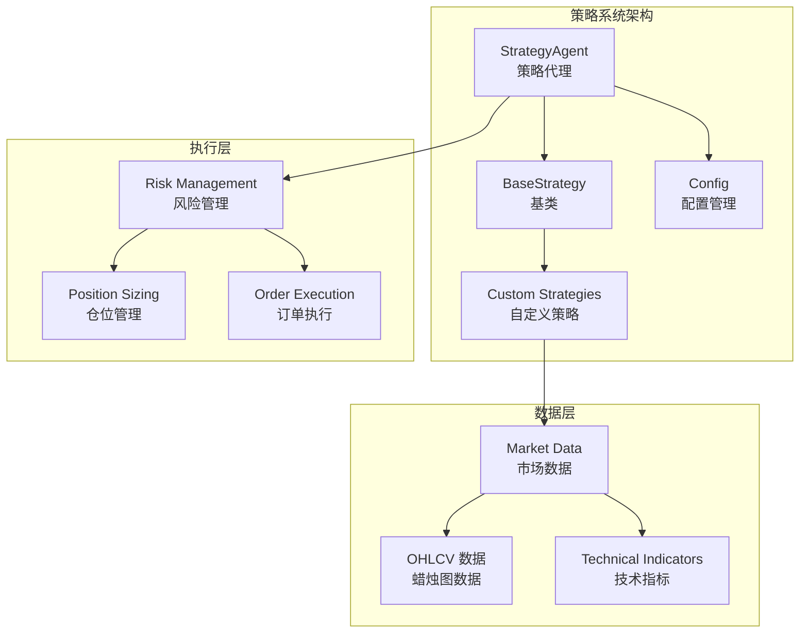
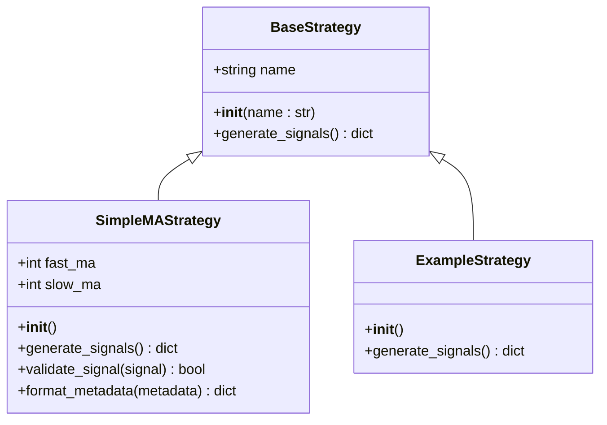
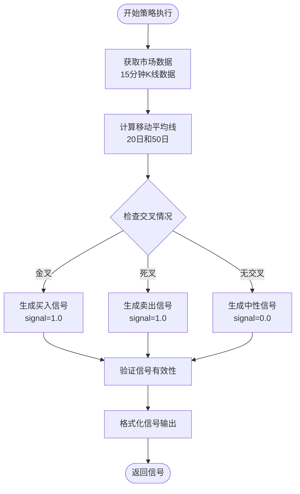
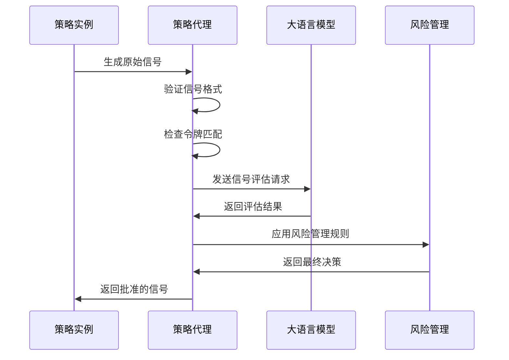
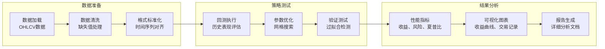
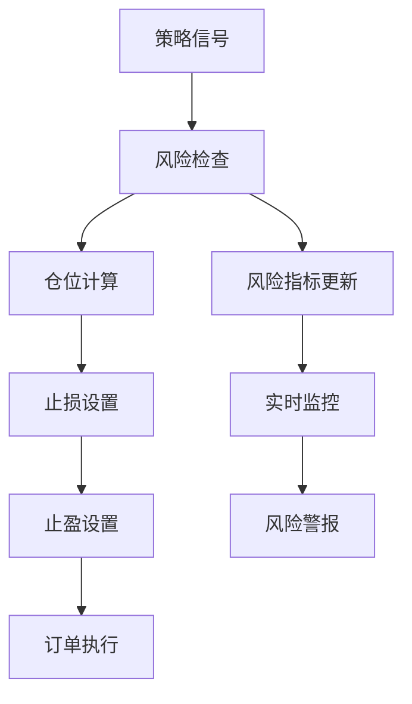

# 策略开发

<cite>
**本文档中引用的文件**
- [base_strategy.py](file://src/strategies/base_strategy.py)
- [example_strategy.py](file://src/strategies/example_strategy.py)
- [custom/example_strategy.py](file://src/strategies/custom/example_strategy.py)
- [strategy_agent.py](file://src/agents/strategy_agent.py)
- [config.py](file://src/config.py)
- [nice_funcs.py](file://src/nice_funcs.py)
- [test_final_strategies.py](file://src/data/rbi/FINAL_WINNING_STRATEGIES/test_final_strategies.py)
- [README.md](file://src/strategies/README.md)
- [custom/README.md](file://src/strategies/custom/README.md)
</cite>

## 目录
1. [简介](#简介)
2. [项目结构](#项目结构)
3. [基类架构](#基类架构)
4. [策略开发基础](#策略开发基础)
5. [具体策略实现](#具体策略实现)
6. [信号生成机制](#信号生成机制)
7. [参数优化与回测](#参数优化与回测)
8. [风险控制集成](#风险控制集成)
9. [开发最佳实践](#开发最佳实践)
10. [常见错误与解决方案](#常见错误与解决方案)
11. [性能优化建议](#性能优化建议)
12. [总结](#总结)

## 简介

Moon Dev的AI交易策略开发系统是一个基于Python的专业量化交易平台，提供了完整的策略开发框架。该系统的核心是基于`BaseStrategy`基类的策略继承机制，支持多种交易策略的快速开发、测试和部署。

本指南将详细介绍如何基于`base_strategy.py`中的基类创建自定义交易策略，涵盖从策略构思到代码实现的完整开发流程，包括关键方法的重写方式、参数配置、回测验证以及与市场数据的交互最佳实践。

## 项目结构

策略开发系统采用模块化架构设计，主要包含以下核心组件：



**图表来源**
- [base_strategy.py](file://src/strategies/base_strategy.py#L1-L21)
- [strategy_agent.py](file://src/agents/strategy_agent.py#L1-L50)

**章节来源**
- [base_strategy.py](file://src/strategies/base_strategy.py#L1-L21)
- [strategy_agent.py](file://src/agents/strategy_agent.py#L1-L306)

## 基类架构

### BaseStrategy基类设计

`BaseStrategy`是所有自定义策略的基础类，提供了标准化的策略接口和基本功能框架：



**图表来源**
- [base_strategy.py](file://src/strategies/base_strategy.py#L5-L21)
- [example_strategy.py](file://src/strategies/example_strategy.py#L9-L74)
- [custom/example_strategy.py](file://src/strategies/custom/example_strategy.py#L3-L19)

### 核心方法说明

#### init方法
每个策略必须实现的初始化方法，负责设置策略名称和基本参数：

- **参数**: `name` - 策略名称（字符串类型）
- **用途**: 设置策略标识和基本信息
- **调用时机**: 策略实例化时自动调用

#### generate_signals方法
策略的核心方法，负责生成交易信号：

- **返回值**: 字典格式的信号对象
- **必需字段**:
  - `token`: 代币地址（字符串）
  - `signal`: 信号强度（0-1浮点数）
  - `direction`: 交易方向（'BUY'、'SELL'或'NEUTRAL'）
  - `metadata`: 可选的策略特定数据

**章节来源**
- [base_strategy.py](file://src/strategies/base_strategy.py#L5-L21)

## 策略开发基础

### 开发环境准备

在开始策略开发之前，需要熟悉以下开发环境和工具：

1. **Python环境**: 确保安装了Python 3.8+版本
2. **依赖包**: 安装必要的量化分析库
3. **开发工具**: 推荐使用VS Code或PyCharm进行开发
4. **Git配置**: 配置私有策略的Git忽略规则

### 策略文件命名规范

为了保持代码组织和隐私保护，策略文件应遵循特定的命名约定：

- **公共策略**: 标准文件名（如`my_strategy.py`）
- **私有策略**: 使用前缀`private_`（如`private_my_strategy.py`）
- **测试策略**: 使用前缀`dev_`（如`dev_test_strategy.py`）

### 基础开发模板

以下是创建新策略的标准模板：

```python
from src.strategies.base_strategy import BaseStrategy
from src.config import MONITORED_TOKENS
import pandas as pd
from termcolor import cprint

class MyCustomStrategy(BaseStrategy):
    def __init__(self):
        """初始化策略"""
        super().__init__("我的自定义策略 🚀")
        # 初始化策略参数
        self.param1 = 20
        self.param2 = 50
        
    def generate_signals(self) -> dict:
        """生成交易信号"""
        try:
            # 实现策略逻辑
            for token in MONITORED_TOKENS:
                # 获取市场数据
                data = self.get_market_data(token)
                if data is None:
                    continue
                
                # 执行策略计算
                signal = self.calculate_signal(data)
                
                if signal and self.validate_signal(signal):
                    return signal
                    
            return None
            
        except Exception as e:
            cprint(f"❌ 策略执行错误: {str(e)}", "red")
            return None
```

**章节来源**
- [custom/README.md](file://src/strategies/custom/README.md#L1-L76)

## 具体策略实现

### 示例策略分析

系统提供了两个具体的策略实现案例，展示了不同类型的交易策略开发方法。

#### 简单移动平均线交叉策略

`SimpleMAStrategy`实现了经典的移动平均线交叉策略：



**图表来源**
- [example_strategy.py](file://src/strategies/example_strategy.py#L15-L74)

#### 固定信号策略

`ExampleStrategy`展示了固定信号生成模式：

- **信号强度**: 固定为0.85（85%置信度）
- **交易方向**: 固定为BUY（买入）
- **元数据**: 包含详细的策略理由和技术指标信息

**章节来源**
- [example_strategy.py](file://src/strategies/example_strategy.py#L1-L74)
- [custom/example_strategy.py](file://src/strategies/custom/example_strategy.py#L1-L19)

## 信号生成机制

### 信号格式规范

策略生成的信号必须遵循严格的数据格式规范：

| 字段 | 类型 | 必需 | 描述 |
|------|------|------|------|
| `token` | string | 是 | 代币地址标识符 |
| `signal` | float | 是 | 信号强度（0.0-1.0） |
| `direction` | string | 是 | 交易方向：BUY/SELL/NEUTRAL |
| `metadata` | dict | 否 | 策略特定的附加信息 |

### 信号验证流程

策略代理会对接收到的信号进行多层验证：



**图表来源**
- [strategy_agent.py](file://src/agents/strategy_agent.py#L136-L200)

### 元数据最佳实践

元数据字段应包含有助于理解和分析策略行为的信息：

- **策略类型**: 如'mean_reversion'、'momentum'、'trend_following'
- **技术指标**: RSI、MACD、布林带等关键指标状态
- **确认因素**: 支持信号的各种确认条件
- **分析结果**: 关键支撑阻力位、趋势判断等

**章节来源**
- [strategy_agent.py](file://src/agents/strategy_agent.py#L15-L35)

## 参数优化与回测

### 回测框架

系统提供了完整的策略回测和优化框架：



**图表来源**
- [test_final_strategies.py](file://src/data/rbi/FINAL_WINNING_STRATEGIES/test_final_strategies.py#L1-L100)

### 参数网格搜索

系统支持针对不同类型策略的参数优化：

#### 发散策略优化参数
- `swing_period`: 波动周期范围（10-16）
- `min_separation`: 最小分离距离（6-12）
- `atr_multiplier`: ATR乘数（1.8-2.5）
- `volume_spike_threshold`: 量能阈值（1.5-2.0）

#### 动量策略优化参数
- `ema_fast`: 快速EMA周期（10-16）
- `ema_slow`: 慢速EMA周期（24-30）
- `pullback_threshold`: 回调阈值（1.5-2.5）
- `volume_multiplier`: 量能倍数（1.3-1.8）

#### 趋势策略优化参数
- `trend_ema_fast`: 趋势EMA快速周期（12-16）
- `trend_ema_slow`: 趋势EMA慢速周期（32-38）
- `adx_threshold`: ADX阈值（20-30）
- `initial_stop_atr`: 初始止损ATR倍数（1.8-2.2）

### 回测验证标准

成功的策略必须满足以下验证标准：

| 指标 | 要求 | 说明 |
|------|------|------|
| 交易数量 | >100笔 | 确保统计显著性 |
| 夏普比率 | >2.0 | 优秀的风险调整收益 |
| 最大回撤 | <10% | 合理的风险水平 |
| 胜率 | >45% | 正确预测的概率 |
| 年化收益 | >15% | 目标收益水平 |

**章节来源**
- [test_final_strategies.py](file://src/data/rbi/FINAL_WINNING_STRATEGIES/test_final_strategies.py#L80-L160)

## 风险控制集成

### 风险管理原则

策略开发必须严格遵循风险管理原则：

#### 仓位管理
- **单笔风险**: 每笔交易风险不超过账户总资金的1-2%
- **最大敞口**: 单个标的持仓不超过账户的30%
- **分散投资**: 避免过度集中在单一资产上

#### 止损机制
- **固定止损**: 设置明确的价格止损点
- **动态止损**: 基于ATR或其他波动性指标调整
- **时间止损**: 设定最长持有期限

#### 风险监控
- **实时监控**: 持续跟踪风险指标
- **预警机制**: 达到阈值时发出警告
- **自动平仓**: 在极端情况下自动执行

### 与策略系统的集成

风险控制系统通过以下方式与策略系统集成：



**图表来源**
- [strategy_agent.py](file://src/agents/strategy_agent.py#L200-L306)

**章节来源**
- [config.py](file://src/config.py#L50-L80)
- [strategy_agent.py](file://src/agents/strategy_agent.py#L200-L306)

## 开发最佳实践

### 代码结构规范

#### 文件组织
- **策略文件**: 放置在`src/strategies/custom/`目录下
- **命名规范**: 使用描述性的文件名和类名
- **导入顺序**: 标准库、第三方库、本地模块的有序导入

#### 函数设计原则
- **单一职责**: 每个函数只负责一个特定功能
- **可读性优先**: 使用清晰的变量名和注释
- **错误处理**: 实现完善的异常处理机制

### 性能优化技巧

#### 数据访问优化
- **缓存机制**: 缓存频繁访问的市场数据
- **批量操作**: 减少重复的数据获取请求
- **内存管理**: 及时释放不需要的数据

#### 计算效率提升
- **向量化运算**: 使用pandas和numpy的向量化操作
- **算法优化**: 选择高效的算法实现
- **并行处理**: 利用多核CPU进行并行计算

### 测试与验证

#### 单元测试
- **测试覆盖率**: 确保关键功能的测试覆盖
- **边界测试**: 验证边缘情况的处理
- **回归测试**: 防止功能退化

#### 集成测试
- **端到端测试**: 验证完整的策略流程
- **性能测试**: 评估策略的执行效率
- **压力测试**: 在高负载下的稳定性测试

**章节来源**
- [custom/README.md](file://src/strategies/custom/README.md#L50-L76)

## 常见错误与解决方案

### 编程错误

#### 信号格式错误
**问题**: 返回的信号不符合规范格式
**解决方案**: 严格按照要求的字段和类型返回信号

#### 内存泄漏
**问题**: 长时间运行后内存占用持续增长
**解决方案**: 及时清理不再使用的数据，使用with语句管理资源

#### 异常处理不当
**问题**: 未捕获的异常导致策略中断
**解决方案**: 实现全面的异常处理，提供降级方案

### 策略逻辑错误

#### 过拟合问题
**问题**: 策略在历史数据上表现良好但在实盘中失效
**解决方案**: 使用交叉验证，避免过度优化参数

#### 信号冲突
**问题**: 多个策略产生相互矛盾的信号
**解决方案**: 实现信号聚合和权重分配机制

#### 时间延迟
**问题**: 策略响应速度跟不上市场变化
**解决方案**: 优化数据获取和计算流程，减少不必要的等待

### 数据相关错误

#### 数据质量问题
**问题**: 使用不完整或错误的市场数据
**解决方案**: 实现数据验证和清洗机制

#### 时间同步问题
**问题**: 不同时区或时间戳不一致导致的问题
**解决方案**: 统一使用UTC时间，确保时间戳准确性

**章节来源**
- [example_strategy.py](file://src/strategies/example_strategy.py#L60-L74)

## 性能优化建议

### 算法优化

#### 数据处理优化
- **向量化操作**: 使用pandas的向量化函数替代循环
- **索引优化**: 合理使用DataFrame索引提高查询效率
- **内存映射**: 对大型数据集使用内存映射技术

#### 计算复杂度降低
- **缓存策略**: 缓存计算结果避免重复计算
- **增量计算**: 只计算变化的部分而不是重新计算全部
- **算法选择**: 选择时间复杂度更低的算法

### 系统级优化

#### 并行处理
- **多进程**: 利用多核CPU并行处理独立任务
- **异步编程**: 使用asyncio处理I/O密集型操作
- **GPU加速**: 对于大规模矩阵运算考虑GPU加速

#### 资源管理
- **连接池**: 复用数据库和API连接
- **垃圾回收**: 合理配置Python垃圾回收机制
- **监控告警**: 实时监控系统资源使用情况

### 网络优化

#### 数据获取优化
- **批量请求**: 减少网络请求次数
- **压缩传输**: 使用gzip等压缩算法
- **CDN加速**: 利用内容分发网络加速数据获取

#### API调用优化
- **请求合并**: 将多个API调用合并为一个
- **超时设置**: 合理设置网络超时时间
- **重试机制**: 实现指数退避的重试策略

## 总结

Moon Dev的策略开发系统提供了一个完整、专业的量化交易策略开发框架。通过基于`BaseStrategy`基类的继承机制，开发者可以快速构建各种类型的交易策略。

### 关键要点回顾

1. **标准化接口**: 所有策略必须继承`BaseStrategy`并实现`generate_signals`方法
2. **信号规范**: 信号必须包含token、signal、direction和metadata字段
3. **参数优化**: 系统提供完整的回测和参数优化框架
4. **风险控制**: 严格的风控机制确保交易安全
5. **最佳实践**: 遵循代码规范和性能优化建议

### 开发建议

- **从小处着手**: 从简单的策略开始，逐步增加复杂性
- **充分测试**: 在实盘前进行充分的回测和模拟交易
- **持续优化**: 根据市场变化不断调整和优化策略
- **风险管理**: 始终将风险管理放在首位

通过遵循本指南的建议和最佳实践，开发者可以创建出高效、稳定、可维护的交易策略，为量化交易系统提供强大的策略支持。