# 策略引擎

<cite>
**本文档引用的文件**
- [base_strategy.py](file://src/strategies/base_strategy.py)
- [strategy_agent.py](file://src/agents/strategy_agent.py)
- [example_strategy.py](file://src/strategies/example_strategy.py)
- [custom/example_strategy.py](file://src/strategies/custom/example_strategy.py)
- [backtest_runner.py](file://src/agents/backtest_runner.py)
- [config.py](file://src/config.py)
- [exchange_manager.py](file://src/exchange_manager.py)
- [risk_agent.py](file://src/agents/risk_agent.py)
- [base_agent.py](file://src/agents/base_agent.py)
</cite>

## 目录
1. [简介](#简介)
2. [项目架构概览](#项目架构概览)
3. [策略基类设计](#策略基类设计)
4. [策略代理系统](#策略代理系统)
5. [具体策略实现](#具体策略实现)
6. [回测框架](#回测框架)
7. [性能监控与风险管理](#性能监控与风险管理)
8. [策略开发最佳实践](#策略开发最佳实践)
9. [集成与部署](#集成与部署)
10. [总结](#总结)

## 简介

Moon Dev的策略引擎是一个高度模块化和可扩展的量化交易系统，专为加密货币市场设计。该系统采用基于Python的架构，支持多种交易策略的开发、测试和执行，具备完整的回测框架、风险管理和性能监控功能。

核心特性包括：
- **统一策略接口**：基于BaseStrategy的标准化策略开发框架
- **智能策略代理**：集成LLM进行策略信号评估和决策制定
- **多交易所支持**：无缝切换Solana和HyperLiquid交易平台
- **完整回测环境**：独立的conda环境执行回测，确保结果可靠性
- **风险管理体系**：多层次的风险控制和监控机制
- **参数优化**：自动化策略参数调优和过拟合防范

## 项目架构概览

策略引擎采用分层架构设计，从底层的数据获取到顶层的交易执行，形成了完整的交易生态系统。

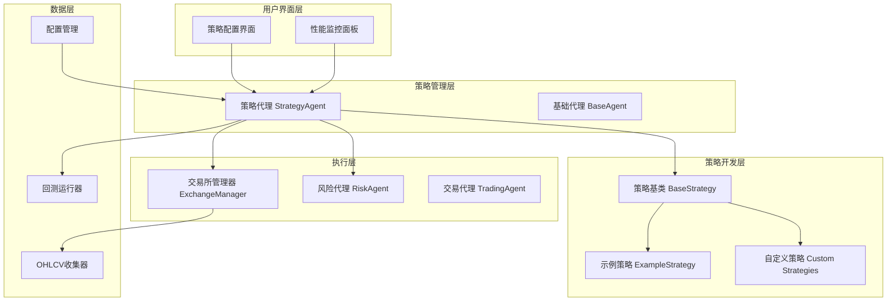

**架构图来源**
- [strategy_agent.py](file://src/agents/strategy_agent.py#L1-L50)
- [base_agent.py](file://src/agents/base_agent.py#L1-L30)
- [base_strategy.py](file://src/strategies/base_strategy.py#L1-L21)

**章节来源**
- [strategy_agent.py](file://src/agents/strategy_agent.py#L1-L306)
- [base_agent.py](file://src/agents/base_agent.py#L1-L58)

## 策略基类设计

### BaseStrategy核心架构

策略基类是整个策略系统的核心抽象，定义了所有交易策略必须遵循的标准接口和行为规范。

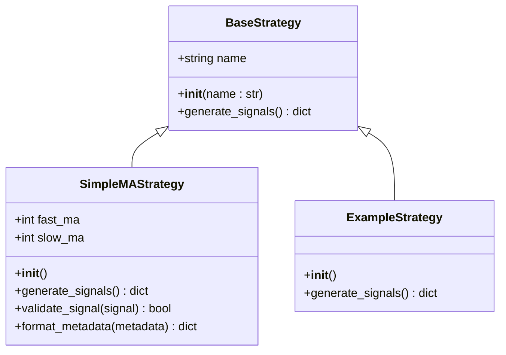

**类图来源**
- [base_strategy.py](file://src/strategies/base_strategy.py#L5-L21)
- [example_strategy.py](file://src/strategies/example_strategy.py#L9-L74)
- [custom/example_strategy.py](file://src/strategies/custom/example_strategy.py#L3-L19)

### 核心方法详解

#### generate_signals() 方法

这是策略的核心方法，负责生成交易信号。返回值包含以下关键信息：

| 字段 | 类型 | 描述 | 示例值 |
|------|------|------|--------|
| token | string | 交易标的地址 | "9BB6NFEcjBCtnNLFko2FqVQBq8HHM13kCyYcdQbgpump" |
| signal | float | 信号强度 (0-1) | 0.85 |
| direction | string | 交易方向 | "BUY", "SELL", "NEUTRAL" |
| metadata | dict | 策略特定元数据 | 包含技术指标和参数 |

#### 事件处理机制

策略基类采用事件驱动架构，支持多种事件类型：

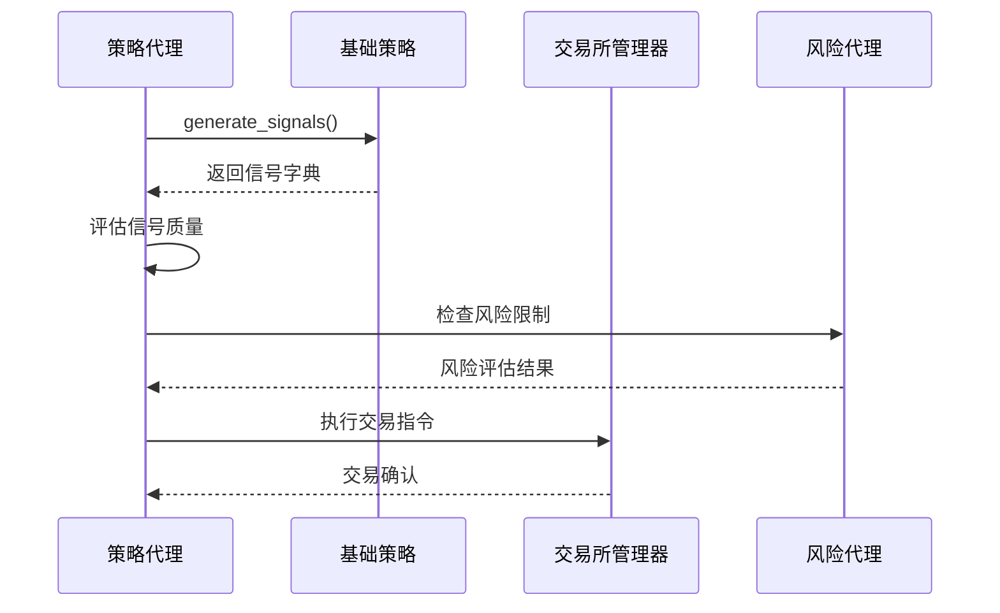

**序列图来源**
- [strategy_agent.py](file://src/agents/strategy_agent.py#L150-L200)
- [base_strategy.py](file://src/strategies/base_strategy.py#L10-L21)

**章节来源**
- [base_strategy.py](file://src/strategies/base_strategy.py#L1-L21)
- [strategy_agent.py](file://src/agents/strategy_agent.py#L150-L250)

## 策略代理系统

### StrategyAgent核心功能

策略代理是策略引擎的大脑，负责策略的加载、执行调度和性能监控。它集成了LLM能力，能够对多个策略的信号进行综合评估。

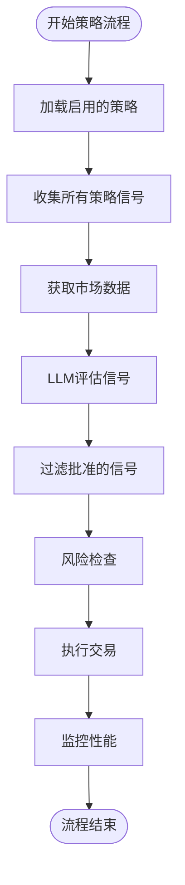

**流程图来源**
- [strategy_agent.py](file://src/agents/strategy_agent.py#L150-L250)

### 策略加载与初始化

策略代理支持动态加载策略，具有灵活的配置机制：

| 配置项 | 默认值 | 描述 |
|--------|--------|------|
| ENABLE_STRATEGIES | True | 是否启用策略系统 |
| STRATEGY_MIN_CONFIDENCE | 0.7 | 最小信号置信度 |
| AI_MODEL | "claude-3-haiku-20240307" | LLM模型选择 |
| AI_MAX_TOKENS | 1024 | AI响应最大令牌数 |

### 信号评估机制

策略代理使用专门的提示模板对策略信号进行评估：

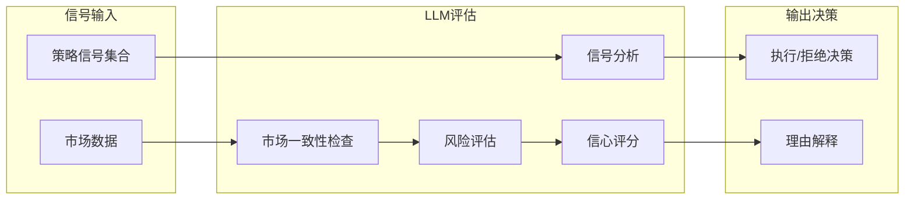

**图表来源**
- [strategy_agent.py](file://src/agents/strategy_agent.py#L25-L50)

**章节来源**
- [strategy_agent.py](file://src/agents/strategy_agent.py#L1-L306)

## 具体策略实现

### 示例策略分析

#### SimpleMAStrategy移动平均线交叉策略

这是一个典型的技术分析策略，展示了如何在策略基类基础上实现具体逻辑。

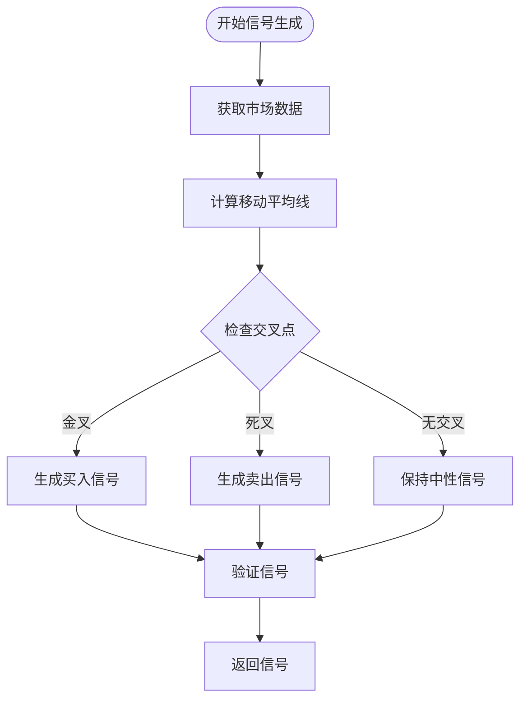

**流程图来源**
- [example_strategy.py](file://src/strategies/example_strategy.py#L15-L70)

#### 自定义策略模板

系统提供了标准的自定义策略模板，便于开发者快速上手：

| 组件 | 功能 | 实现要求 |
|------|------|----------|
| 初始化 | 设置策略名称和参数 | 必须调用父类构造函数 |
| generate_signals | 核心信号生成逻辑 | 必须返回标准化格式 |
| 参数配置 | 可选的策略参数 | 支持动态调整 |

### 策略多样性

系统支持多种类型的交易策略：

1. **趋势跟踪策略**：基于移动平均线和趋势指标
2. **均值回归策略**：利用价格偏离均值的回归特性
3. **动量策略**：捕捉价格加速运动
4. **套利策略**：利用市场定价差异
5. **波动率策略**：基于市场波动性的交易机会

**章节来源**
- [example_strategy.py](file://src/strategies/example_strategy.py#L1-L74)
- [custom/example_strategy.py](file://src/strategies/custom/example_strategy.py#L1-L19)

## 回测框架

### BacktestRunner设计

回测框架提供了独立的策略测试环境，确保回测结果的可靠性和可重复性。

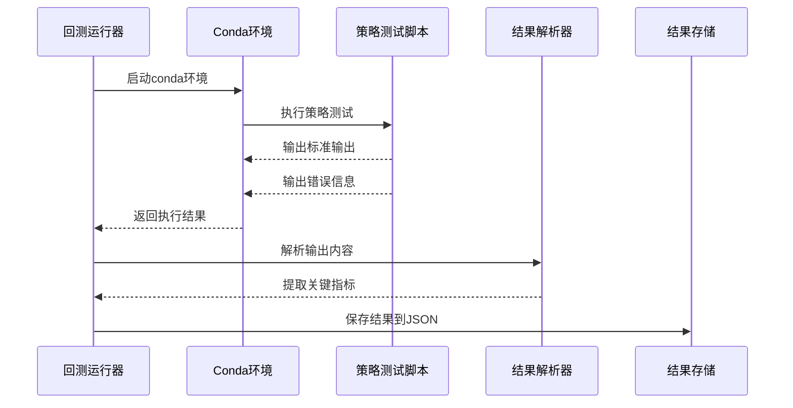

**序列图来源**
- [backtest_runner.py](file://src/agents/backtest_runner.py#L20-L80)

### 性能指标体系

回测框架支持全面的性能指标评估：

| 指标类别 | 关键指标 | 计算方法 | 目标值 |
|----------|----------|----------|--------|
| 收益性 | 总回报率 | (最终价值 - 初始资本) / 初始资本 | >0% |
| 风险调整收益 | 夏普比率 | (年化收益 - 无风险利率) / 年化波动率 | >2.0 |
| 风险指标 | 最大回撤 | (峰值 - 谷值) / 峰值 | <5% |
| 交易效率 | 交易频率 | 总交易次数 / 测试期天数 | 25+次/天 |
| 盈利能力 | 胜率 | 盈利交易数 / 总交易数 | >45% |

### 回测最佳实践

1. **数据完整性检查**：确保历史数据的质量和完整性
2. **参数稳定性验证**：避免过度拟合历史数据
3. **实时性测试**：模拟真实交易环境
4. **并发测试**：验证系统在高负载下的表现

**章节来源**
- [backtest_runner.py](file://src/agents/backtest_runner.py#L1-L214)

## 性能监控与风险管理

### ExchangeManager统一接口

交易所管理器提供了跨平台的交易接口，支持Solana和HyperLiquid两种主要交易平台。

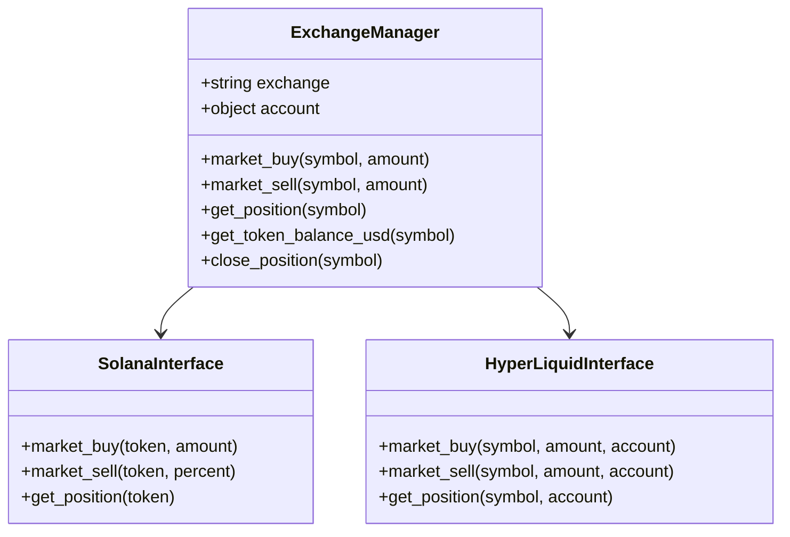

**类图来源**
- [exchange_manager.py](file://src/exchange_manager.py#L20-L100)

### 风险管理系统

风险代理实现了多层次的风险控制机制：

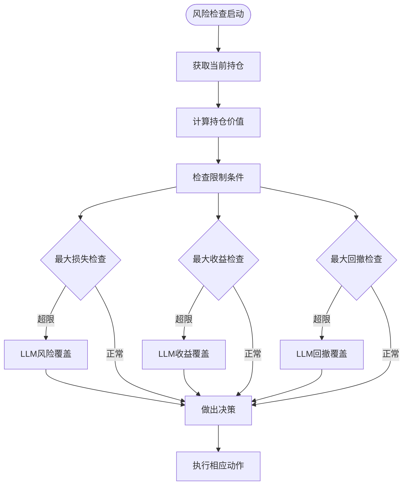

**流程图来源**
- [risk_agent.py](file://src/agents/risk_agent.py#L150-L200)

### 风险控制参数

| 控制维度 | 参数名称 | 默认值 | 说明 |
|----------|----------|--------|------|
| 资产配置 | MAX_POSITION_PERCENTAGE | 30% | 单个头寸最大占总资产比例 |
| 风险控制 | CASH_PERCENTAGE | 20% | 安全缓冲现金比例 |
| 交易频率 | SLEEP_BETWEEN_RUNS_MINUTES | 15分钟 | 两次运行间隔时间 |
| 止损设置 | MAX_LOSS_USD | 25美元 | 单笔最大亏损限制 |
| 止盈设置 | MAX_GAIN_USD | 25美元 | 单笔最大盈利限制 |

**章节来源**
- [exchange_manager.py](file://src/exchange_manager.py#L1-L200)
- [risk_agent.py](file://src/agents/risk_agent.py#L1-L200)
- [config.py](file://src/config.py#L50-L100)

## 策略开发最佳实践

### 参数优化策略

策略开发过程中需要重点关注参数优化和过拟合防范：

#### 过拟合防范措施

1. **时间分割验证**：将数据分为训练集和测试集
2. **滚动窗口测试**：使用滑动窗口验证策略稳定性
3. **随机性检验**：引入随机参数组合进行对比
4. **统计显著性检验**：确保结果的统计可靠性

#### 参数调优流程

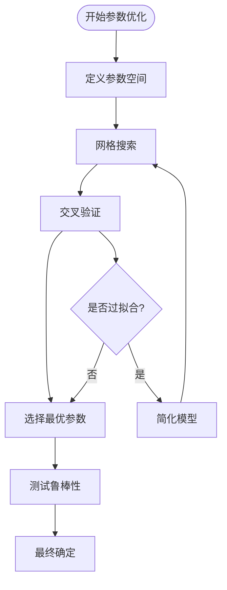

### 风险控制原则

#### 1. 位置大小管理

- **固定百分比风险**：每笔交易风险不超过账户总资金的1%
- **动态调整**：根据市场波动性调整风险水平
- **多样化分散**：避免单一资产或策略的过度集中

#### 2. 多重退出机制

- **止盈止损**：设置明确的盈利和亏损目标
- **时间限制**：防止仓位持有时间过长
- **技术指标**：利用技术指标作为退出信号

#### 3. 风险预算分配

| 风险类别 | 分配比例 | 控制措施 |
|----------|----------|----------|
| 单笔交易 | 1% | 固定风险金额 |
| 单一资产 | 5% | 位置大小限制 |
| 总敞口 | 15% | 整体风险控制 |
| 日内波动 | 2% | 日内风险限额 |

### 性能评估标准

#### 策略验收标准

1. **交易频率要求**：至少25次交易（可根据需求调整）
2. **风险调整收益**：夏普比率大于2.0
3. **回撤控制**：最大回撤小于5%
4. **胜率要求**：盈利交易占比超过45%
5. **稳定性检验**：不同时间段表现一致

#### 持续监控指标

- **日胜率变化**：监控胜率的短期波动
- **收益分布**：分析收益的正态性
- **相关性分析**：检查策略间的相关性
- **因子暴露**：识别策略的主要驱动因素

**章节来源**
- [config.py](file://src/config.py#L70-L135)

## 集成与部署

### 系统集成架构

策略引擎采用微服务架构，各组件之间通过标准化接口通信：

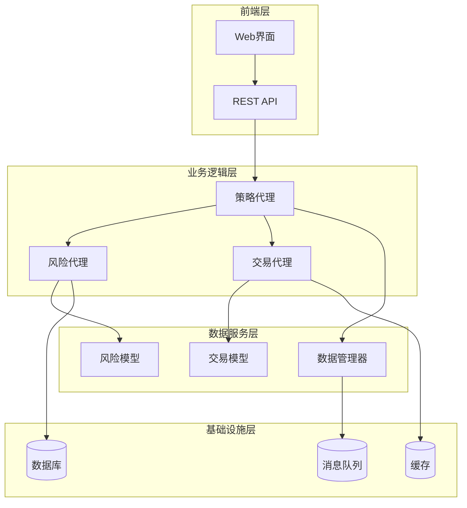

### 部署配置

#### 环境配置

| 环境变量 | 用途 | 示例值 |
|----------|------|--------|
| ANTROPIC_KEY | LLM API密钥 | sk-ant-xxx |
| OPENAI_KEY | OpenAI API密钥 | sk-xxx |
| HYPER_LIQUID_KEY | HyperLiquid私钥 | 0x123... |
| CONDA_ENV | 回测环境名 | tflow |

#### 监控配置

- **健康检查端点**：定期检查系统状态
- **性能指标收集**：CPU、内存、网络使用情况
- **错误日志记录**：异常情况的详细记录
- **告警通知**：关键指标超出阈值时的通知

### 扩展性设计

#### 策略扩展接口

系统设计支持多种类型的策略扩展：

1. **内置策略**：预定义的策略模板
2. **插件策略**：第三方开发的策略包
3. **自定义策略**：用户自行开发的策略
4. **AI生成策略**：基于机器学习的策略

#### 平台扩展支持

- **新交易所接入**：通过ExchangeManager接口添加
- **新数据源**：通过数据适配器模式支持
- **新算法**：通过插件系统集成
- **新指标**：通过指标工厂模式添加

**章节来源**
- [base_agent.py](file://src/agents/base_agent.py#L1-L58)
- [strategy_agent.py](file://src/agents/strategy_agent.py#L50-L100)

## 总结

Moon Dev的策略引擎代表了现代量化交易系统的发展方向，它成功地将传统技术分析与人工智能相结合，构建了一个既强大又灵活的交易生态系统。

### 核心优势

1. **模块化设计**：清晰的分层架构便于维护和扩展
2. **标准化接口**：统一的策略开发框架降低学习成本
3. **智能决策**：LLM集成提供更理性的交易决策
4. **全面风控**：多层次的风险管理体系保障资金安全
5. **自动化程度高**：从策略开发到执行的全流程自动化

### 技术创新

- **混合智能决策**：结合技术分析和人工智能判断
- **多平台支持**：统一接口支持多个主流交易平台
- **独立回测环境**：确保策略测试的准确性和可靠性
- **动态参数优化**：自动化的参数调优和过拟合防范

### 应用前景

该策略引擎不仅适用于加密货币交易，还可以扩展到其他金融市场，为机构和个人投资者提供专业级的量化交易解决方案。随着人工智能技术的不断发展，这套系统有望在复杂市场环境中发挥更大的作用，为投资者创造持续稳定的收益。

通过持续的优化和改进，Moon Dev策略引擎将成为量化交易领域的重要工具，推动整个行业向更加智能化、自动化的方向发展。