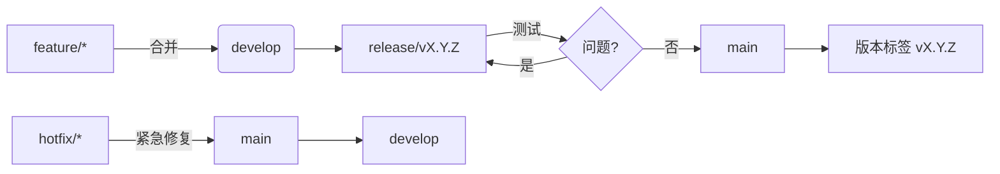

# 贡献指南

<cite>
**本文档中引用的文件**  
- [README.md](file://README.md)
- [src/config.py](file://src/config.py)
- [requirements.txt](file://requirements.txt)
- [src/models/model_factory.py](file://src/models/model_factory.py)
- [src/data/rbi/.claude/agents/github/release-manager.md](file://src/data/rbi/.claude/agents/github/release-manager.md)
- [src/data/rbi/.claude/agents/core/tester.md](file://src/data/rbi/.claude/agents/core/tester.md)
- [src/data/rbi/.claude/agents/github/workflow-automation.md](file://src/data/rbi/.claude/agents/github/workflow-automation.md)
- [src/data/rbi/.claude/agents/templates/github-pr-manager.md](file://src/data/rbi/.claude/agents/templates/github-pr-manager.md)
</cite>

## 目录
1. [简介](#简介)
2. [贡献类型](#贡献类型)
3. [开发环境设置](#开发环境设置)
4. [代码风格与测试要求](#代码风格与测试要求)
5. [提交拉取请求](#提交拉取请求)
6. [版本发布周期与分支策略](#版本发布周期与分支策略)
7. [入门任务建议](#入门任务建议)
8. [寻求帮助](#寻求帮助)

## 简介
欢迎为 Moon Dev AI 交易代理项目做出贡献！本项目是一个完全开源的AI驱动交易系统，旨在通过自动化代理实现算法交易的民主化。我们鼓励社区成员通过报告问题、提出功能建议、提交代码补丁和改进文档来参与项目发展。本指南将详细介绍如何为项目做出贡献，包括设置开发环境、运行测试套件以及提交拉取请求的完整流程。

**Section sources**
- [README.md](file://README.md#L0-L338)

## 贡献类型
我们欢迎各种形式的贡献，包括但不限于以下类型：

### 报告问题（Bug Reports）
当您发现代码中的错误或意外行为时，请提交问题报告。请确保提供详细的描述，包括：
- 问题的具体表现
- 复现步骤
- 预期行为与实际行为的对比
- 您的环境信息（Python版本、操作系统等）
- 相关的日志输出或错误信息

### 功能建议（Feature Requests）
如果您有改进项目的想法或希望添加新功能，请提交功能建议。请详细描述：
- 功能的目的和价值
- 使用场景
- 预期的实现方式
- 与其他功能的集成方式

### 代码补丁（Code Contributions）
我们欢迎代码贡献，包括：
- 修复现有问题
- 优化性能
- 添加新功能
- 改进现有功能

### 文档改进（Documentation Improvements）
文档是项目的重要组成部分。您可以贡献：
- 更新和改进现有文档
- 添加新的使用示例
- 修复文档中的错误
- 翻译文档为其他语言

**Section sources**
- [README.md](file://README.md#L0-L338)

## 开发环境设置
要开始为项目贡献代码，您需要设置开发环境。以下是详细的设置步骤：

### 1. 克隆仓库
首先，克隆项目仓库到您的本地机器：
```bash
git clone https://github.com/YOUR_USERNAME/moon-dev-ai-agents-for-trading.git
cd moon-dev-ai-agents-for-trading
```

### 2. 创建虚拟环境
建议使用conda创建独立的Python环境：
```bash
conda create -n tflow python=3.10.9
conda activate tflow
```

### 3. 安装依赖
安装项目所需的依赖包：
```bash
pip install -r requirements.txt
```

### 4. 配置环境变量
创建`.env`文件并添加必要的API密钥：
```bash
cp .env.example .env
```
在`.env`文件中填写您的API密钥，包括：
- ANTHROPIC_KEY（用于Claude模型）
- OPENAI_KEY（用于GPT模型）
- DEEPSEEK_KEY（用于DeepSeek模型）
- GROQ_API_KEY（用于Groq模型）
- GEMINI_KEY（用于Google Gemini）
- BIRDEYE_API_KEY（用于Solana代币数据）
- COINGECKO_API_KEY（用于加密货币市场数据）

**Section sources**
- [README.md](file://README.md#L0-L338)
- [src/models/model_factory.py](file://src/models/model_factory.py#L51-L81)

## 代码风格与测试要求
为了保持代码的一致性和质量，我们制定了以下代码风格和测试要求。

### 代码风格指南
- 遵循PEP 8代码风格规范
- 使用双引号表示字符串
- 函数和变量名使用小写字母和下划线分隔
- 类名使用驼峰命名法
- 添加适当的类型注解
- 编写清晰的函数和类文档字符串

### 测试覆盖率要求
所有代码贡献必须包含相应的测试，测试覆盖率要求如下：
- 语句覆盖率：>80%
- 分支覆盖率：>75%
- 函数覆盖率：>80%
- 行覆盖率：>80%

### 测试特性
测试代码应具备以下特性：
- **快速**：单元测试应在100毫秒内完成
- **隔离**：测试之间不应有依赖关系
- **可重复**：每次运行结果应一致
- **自验证**：有明确的通过/失败标准
- **及时**：与代码同时编写或在代码之前编写

### 文档更新
每次代码更改都应相应地更新文档，包括：
- 更新相关文档文件
- 添加新的使用示例
- 修正过时的信息
- 确保API文档与实际实现一致

**Section sources**
- [src/data/rbi/.claude/agents/core/tester.md](file://src/data/rbi/.claude/agents/core/tester.md#L165-L184)
- [src/data/rbi/.claude/agents/core/tester.md](file://src/data/rbi/.claude/agents/core/tester.md#L0-L49)

## 提交拉取请求
提交拉取请求是贡献代码的主要方式。请遵循以下步骤：

### 1. 创建分支
为您的更改创建一个新的分支：
```bash
git checkout -b feature/your-feature-name
```

### 2. 进行更改
在新分支上进行您的更改，确保遵循代码风格指南并添加适当的测试。

### 3. 提交更改
提交您的更改：
```bash
git add .
git commit -m "描述您的更改"
```

### 4. 推送到远程仓库
将分支推送到您的fork：
```bash
git push origin feature/your-feature-name
```

### 5. 创建拉取请求
在GitHub上创建拉取请求，确保：
- 提供清晰的标题和描述
- 链接到相关的问题（如果有）
- 描述更改的目的和实现方式
- 包含测试结果

### 6. 参与代码审查
积极参与代码审查过程，及时回应审查意见并进行必要的修改。

**Section sources**
- [src/data/rbi/.claude/agents/templates/github-pr-manager.md](file://src/data/rbi/.claude/agents/templates/github-pr-manager.md#L0-L50)
- [src/data/rbi/.claude/agents/github/pr-manager.md](file://src/data/rbi/.claude/agents/github/pr-manager.md#L0-L45)

## 版本发布周期与分支策略
了解项目的版本发布周期和分支策略有助于您更好地参与项目开发。

### 版本发布周期
项目采用语义化版本控制（Semantic Versioning），版本号格式为`MAJOR.MINOR.PATCH`：
- **MAJOR**：重大更新，可能包含不兼容的API更改
- **MINOR**：新增功能，向后兼容
- **PATCH**：bug修复，向后兼容

### 分支策略
项目使用以下分支策略：
- **main**：主分支，包含稳定版本的代码
- **develop**：开发分支，包含即将发布的功能
- **feature/\***：功能分支，用于开发新功能
- **hotfix/\***：热修复分支，用于紧急bug修复
- **release/v\***：发布分支，用于准备新版本

### 发布流程
1. 在`develop`分支上完成新功能开发
2. 创建`release/vX.Y.Z`分支准备发布
3. 在发布分支上进行测试和bug修复
4. 合并到`main`分支并创建版本标签
5. 将更改合并回`develop`分支



**Diagram sources**
- [src/data/rbi/.claude/agents/github/release-manager.md](file://src/data/rbi/.claude/agents/github/release-manager.md#L50-L77)
- [src/data/rbi/.claude/agents/github/release-swarm.md](file://src/data/rbi/.claude/agents/github/release-swarm.md#L44-L108)

**Section sources**
- [src/data/rbi/.claude/agents/github/release-manager.md](file://src/data/rbi/.claude/agents/github/release-manager.md#L0-L48)
- [src/data/rbi/.claude/agents/github/release-swarm.md](file://src/data/rbi/.claude/agents/github/release-swarm.md#L303-L371)

## 入门任务建议
如果您是新贡献者，可以从以下任务开始：

### 文档改进
- 修复文档中的拼写错误和语法错误
- 更新过时的示例代码
- 添加新的使用示例
- 翻译文档为其他语言

### 测试增强
- 为现有功能添加更多测试用例
- 提高测试覆盖率
- 编写新的集成测试
- 优化现有测试的性能

### Bug修复
- 查看"good first issue"标签的问题
- 修复已知的轻微bug
- 改进错误处理和异常处理
- 优化日志输出

### 小功能添加
- 添加新的配置选项
- 改进用户界面提示
- 增加新的数据源支持
- 优化现有算法的性能

**Section sources**
- [README.md](file://README.md#L0-L338)

## 寻求帮助
如果您在贡献过程中遇到任何问题，可以通过以下方式寻求帮助：

### Discord社区
加入我们的Discord社区获取实时帮助：
- 访问 [discord.gg/8UPuVZ53bh](https://discord.gg/8UPuVZ53bh)
- 在相应的频道中提问
- 参与社区讨论
- 查看历史问题解答

### GitHub问题
通过GitHub问题系统寻求帮助：
- 提交新的问题
- 查看已解决的问题
- 参与现有问题的讨论
- 为问题提供解决方案

### 视频教程
观看项目相关的视频教程：
- [第一个完整文档视频](https://youtu.be/RlqzkSgDKDc)
- [第二个完整演示视频](https://youtu.be/tjY24JR8Cso?si=Za-PQ2L79US6cu2T)
- [第三个完整演示视频](https://youtu.be/qZv6IFIkk6I)
- [第四个完整演示视频](https://youtu.be/D0VRQj0tuCI)

**Section sources**
- [README.md](file://README.md#L0-L338)