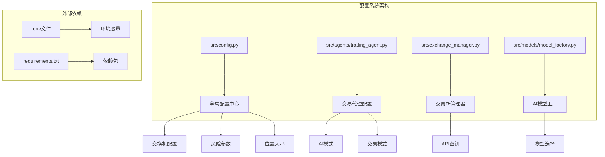
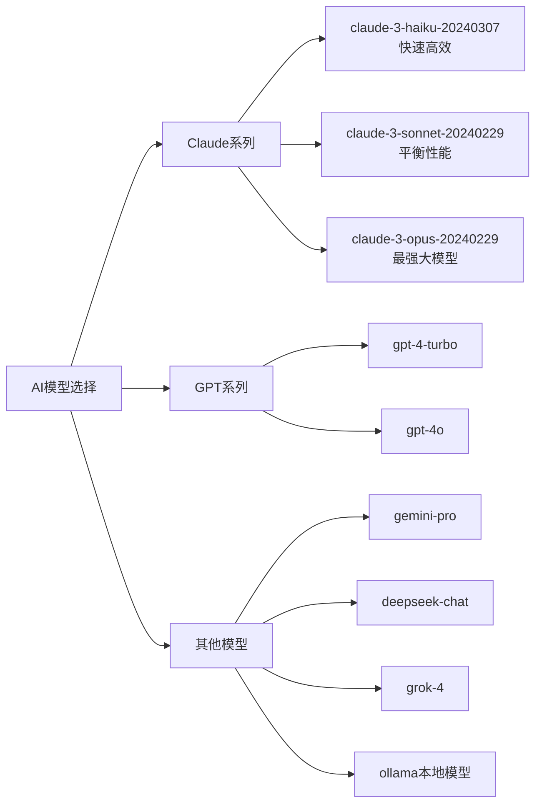
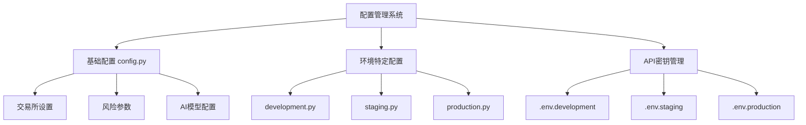

# 配置指南

<cite>
**本文档中引用的文件**
- [config.py](file://src/config.py)
- [trading_agent.py](file://src/agents/trading_agent.py)
- [exchange_manager.py](file://src/exchange_manager.py)
- [model_factory.py](file://src/models/model_factory.py)
- [requirements.txt](file://requirements.txt)
- [README.md](file://README.md)
</cite>

## 目录
1. [简介](#简介)
2. [项目结构概览](#项目结构概览)
3. [核心配置文件分析](#核心配置文件分析)
4. [详细配置参数说明](#详细配置参数说明)
5. [完整配置文件示例](#完整配置文件示例)
6. [多环境配置管理](#多环境配置管理)
7. [API密钥配置](#api密钥配置)
8. [故障排除指南](#故障排除指南)
9. [最佳实践建议](#最佳实践建议)
10. [总结](#总结)

## 简介

Moon Dev AI Trading Agents 是一个基于人工智能的量化交易平台，提供了灵活且强大的配置系统。本指南将详细介绍如何配置和管理该系统的各项参数，包括交易所设置、风险控制、AI模型选择、交易策略等关键配置选项。

该系统支持多种交易所（Solana、HyperLiquid），多种AI模型，以及灵活的风险管理策略。通过合理的配置，用户可以针对不同的交易场景和风险偏好进行定制化设置。

## 项目结构概览



**图表来源**
- [config.py](file://src/config.py#L1-L136)
- [trading_agent.py](file://src/agents/trading_agent.py#L1-L200)
- [exchange_manager.py](file://src/exchange_manager.py#L1-L100)

## 核心配置文件分析

### 主配置文件结构

主配置文件 [`src/config.py`](file://src/config.py) 包含了系统的核心配置参数，分为以下几个主要类别：

1. **交易所配置** - 支持的交易平台选择
2. **交易配置** - 基础交易参数设置
3. **风险控制** - 损益限制和仓位管理
4. **AI模型设置** - 多种AI模型的配置选项
5. **实时剪辑配置** - 内容创作功能设置

**章节来源**
- [config.py](file://src/config.py#L1-L136)

### 交易代理配置

[`src/agents/trading_agent.py`](file://src/agents/trading_agent.py) 提供了更详细的交易配置选项，包括：

- AI模式选择（单模型 vs 联盟模式）
- 交易模式设置（仅做多 vs 做多做空）
- 仓位大小和杠杆配置
- 市场数据收集设置

**章节来源**
- [trading_agent.py](file://src/agents/trading_agent.py#L66-L200)

## 详细配置参数说明

### 交易所配置

#### 基础交易所设置

| 参数名 | 默认值 | 数据类型 | 有效范围 | 描述 |
|--------|--------|----------|----------|------|
| `EXCHANGE` | `'solana'` | 字符串 | `'solana'`, `'hyperliquid'` | 主要交易交易所选择 |

#### HyperLiquid 特定配置

| 参数名 | 默认值 | 数据类型 | 有效范围 | 描述 |
|--------|--------|----------|----------|------|
| `HYPERLIQUID_SYMBOLS` | `['BTC', 'ETH', 'SOL']` | 列表 | 任意有效的交易符号 | 在HyperLiquid上交易的永续合约列表 |
| `HYPERLIQUID_LEVERAGE` | `5` | 整数 | 1-50 | HyperLiquid交易的默认杠杆倍数 |

#### Solana 特定配置

| 参数名 | 默认值 | 数据类型 | 有效范围 | 描述 |
|--------|--------|----------|----------|------|
| `USDC_ADDRESS` | `"EPjFWdd5AufqSSqeM2qN1xzybapC8G4wEGGkZwyTDt1v"` | 字符串 | 有效的Solana地址 | USDC代币地址（不可交易） |
| `SOL_ADDRESS` | `"So11111111111111111111111111111111111111111"` | 字符串 | 有效的Solana地址 | SOL代币地址（不可交易） |
| `EXCLUDED_TOKENS` | `[USDC_ADDRESS, SOL_ADDRESS]` | 列表 | 地址列表 | 排除交易的代币列表 |

**章节来源**
- [config.py](file://src/config.py#L5-L45)

### 交易配置参数

#### 基础交易设置

| 参数名 | 默认值 | 数据类型 | 有效范围 | 描述 |
|--------|--------|----------|----------|------|
| `usd_size` | `25` | 数字 | 正数 | 目标持仓金额（美元） |
| `max_usd_order_size` | `3` | 数字 | 正数 | 最大订单金额（美元） |
| `tx_sleep` | `30` | 整数 | 秒数 | 交易间隔时间 |
| `slippage` | `199` | 整数 | 0-1000 | 滑点容忍度（199 ≈ 2%） |

#### 风险管理参数

| 参数名 | 默认值 | 数据类型 | 有效范围 | 描述 |
|--------|--------|----------|----------|------|
| `CASH_PERCENTAGE` | `20` | 整数 | 0-100 | 最低现金缓冲百分比 |
| `MAX_POSITION_PERCENTAGE` | `30` | 整数 | 0-100 | 单个头寸最大分配比例 |
| `STOPLOSS_PRICE` | `1` | 数字 | 正数 | 停损价格（暂未使用） |
| `BREAKOUT_PRICE` | `0.0001` | 数字 | 正数 | 突破价格阈值（暂未使用） |
| `SLEEP_AFTER_CLOSE` | `600` | 整数 | 秒数 | 平仓后休眠时间 |

**章节来源**
- [config.py](file://src/config.py#L47-L73)

### AI模型配置

#### 模型选择和参数

| 参数名 | 默认值 | 数据类型 | 可选值 | 描述 |
|--------|--------|----------|--------|------|
| `AI_MODEL` | `"claude-3-haiku-20240307"` | 字符串 | 多种Claude模型 | 主要使用的AI模型 |
| `AI_MAX_TOKENS` | `1024` | 整数 | 1-8192 | AI响应的最大令牌数 |
| `AI_TEMPERATURE` | `0.7` | 浮点数 | 0-1 | 创意与精确度平衡参数 |

#### 支持的AI模型



**图表来源**
- [config.py](file://src/config.py#L105-L110)

### 实时剪辑配置

#### 剪辑功能设置

| 参数名 | 默认值 | 数据类型 | 描述 |
|--------|--------|----------|------|
| `REALTIME_CLIPS_ENABLED` | `True` | 布尔值 | 是否启用实时剪辑功能 |
| `REALTIME_CLIPS_OBS_FOLDER` | `'/Volumes/Moon 26/OBS'` | 字符串 | OBS录制文件夹路径 |
| `REALTIME_CLIPS_AUTO_INTERVAL` | `120` | 整数 | 自动检查间隔（秒） |
| `REALTIME_CLIPS_LENGTH` | `2` | 整数 | 分析时长（分钟） |
| `REALTIME_CLIPS_AI_MODEL` | `'groq'` | 字符串 | 使用的AI模型类型 |
| `REALTIME_CLIPS_TWITTER` | `True` | 布尔值 | 是否自动打开推特编辑 |

**章节来源**
- [config.py](file://src/config.py#L120-L136)

## 完整配置文件示例

以下是一个完整的配置文件示例，包含所有主要参数的详细注释：

```python
"""
🌙 Moon Dev AI Trading Agents 配置文件
完全注释版 - 适用于生产环境
"""

# 🔄 交易所选择
# 可选值: 'solana', 'hyperliquid'
EXCHANGE = 'hyperliquid'  # 生产环境推荐使用HyperLiquid

# 💰 交易配置
USDC_ADDRESS = "EPjFWdd5AufqSSqeM2qN1xzybapC8G4wEGGkZwyTDt1v"  # USDC地址（不可交易）
SOL_ADDRESS = "So11111111111111111111111111111111111111111"   # SOL地址（不可交易）

# 创建排除交易的代币列表
EXCLUDED_TOKENS = [USDC_ADDRESS, SOL_ADDRESS]

# 📋 交易代币列表
# 注意：交易代理有自己的代币列表 - 见 trading_agent.py 第101-104行
MONITORED_TOKENS = [
    # '9BB6NFEcjBCtnNLFko2FqVQBq8HHM13kCyYcdQbgpump',    # 🌬️ FART（已禁用）
    # 'DitHyRMQiSDhn5cnKMJV2CDDt6sVct96YrECiM49pump'     # 🏠 housecoin（已禁用）
]

# ⚡ HyperLiquid 配置
HYPERLIQUID_SYMBOLS = ['BTC', 'ETH', 'SOL', 'AVAX', 'ARB']  # 在HyperLiquid上交易的永续合约
HYPERLIQUID_LEVERAGE = 10  # 默认杠杆倍数（1-50）

# 🔄 交易所特定代币映射
TOKEN_EXCHANGE_MAP = {
    'BTC': 'hyperliquid',
    'ETH': 'hyperliquid',
    'SOL': 'hyperliquid',
    'AVAX': 'hyperliquid',
    'ARB': 'hyperliquid',
    # 所有其他代币默认使用Solana
}

# 🎯 代币和钱包设置
symbol = '9BB6NFEcjBCtnNLFko2FqVQBq8HHM13kCyYcdQbgpump'  # 当前交易的代币
address = '4wgfCBf2WwLSRKLef9iW7JXZ2AfkxUxGM4XcKpHm3Sin'  # 您的钱包地址

# 🎯 位置大小配置
usd_size = 50  # 目标持仓金额（美元）
max_usd_order_size = 10  # 最大订单金额（美元）
tx_sleep = 30  # 交易间隔时间（秒）
slippage = 199  # 滑点容忍度（199 ≈ 2%）

# 🛡️ 风险管理设置
CASH_PERCENTAGE = 10  # 最低现金缓冲百分比（0-100）
MAX_POSITION_PERCENTAGE = 20  # 单个头寸最大分配比例（0-100）
STOPLOSS_PRICE = 1  # 停损价格（暂未使用）
BREAKOUT_PRICE = 0.0001  # 突破价格阈值（暂未使用）
SLEEP_AFTER_CLOSE = 600  # 平仓后休眠时间（秒）

# 🔍 最大损失/收益设置（用于风险代理）
USE_PERCENTAGE = True  # 如果为True，使用百分比限制；如果为False，使用美元限制

# 美元基础限制（当USE_PERCENTAGE为False时使用）
MAX_LOSS_USD = 50  # 最大亏损（美元）
MAX_GAIN_USD = 100  # 最大盈利（美元）

# 美元最小余额风险控制
MINIMUM_BALANCE_USD = 100  # 如果余额低于此值，风险代理将考虑平仓
USE_AI_CONFIRMATION = True  # 如果为True，在平仓前咨询AI；如果为False， breached立即平仓

# 百分比基础限制（当USE_PERCENTAGE为True时使用）
MAX_LOSS_PERCENT = 10  # 最大亏损百分比（例如，20 = 20%亏损）
MAX_GAIN_PERCENT = 20  # 最大盈利百分比（例如，50 = 50%盈利）

# ⚡ 交易设置
slippage = 199  # 滑点设置（500 = 5%，50 = 0.5%）
PRIORITY_FEE = 100000  # 优先费用（约0.02美元在当前SOL价格下）
orders_per_open = 3  # 更好填充率的多个订单

# 📊 市场做市设置
buy_under = 0.0946
sell_over = 1

# 📈 数据收集设置
DAYSBACK_4_DATA = 7  # 回溯天数
DATA_TIMEFRAME = '1H'  # 时间框架：1m, 3m, 5m, 15m, 30m, 1H, 2H, 4H, 6H, 8H, 12H, 1D, 3D, 1W, 1M
SAVE_OHLCV_DATA = False  # 设置为True永久保存数据，False仅在运行期间使用临时数据

# 🤖 AI模型设置
AI_MODEL = "claude-3-sonnet-20240229"  # 模型选项：
                                    # - claude-3-haiku-20240307（快速高效Claude模型）
                                    # - claude-3-sonnet-20240229（平衡Claude模型）
                                    # - claude-3-opus-20240229（最强大的Claude模型）
AI_MAX_TOKENS = 2048  # 响应最大令牌数
AI_TEMPERATURE = 0.5  # 创意vs精确度（0-1）

# 📊 交易策略代理设置 - 可能尚未使用 1/5/25
ENABLE_STRATEGIES = True  # 设置为True以使用策略
STRATEGY_MIN_CONFIDENCE = 0.8  # 对策略信号采取行动的最小置信度

# 主代理运行之间的睡眠时间
SLEEP_BETWEEN_RUNS_MINUTES = 10  # 主代理运行之间的睡眠时间

# 在我们的nice_funcs中，我们查看每小时的最小交易次数
MIN_TRADES_LAST_HOUR = 5

# 🎬 实时剪辑代理设置
REALTIME_CLIPS_ENABLED = True
REALTIME_CLIPS_OBS_FOLDER = '/Volumes/Moon 26/OBS'  # 您的OBS录制文件夹
REALTIME_CLIPS_AUTO_INTERVAL = 120  # 每N秒检查一次（120 = 2分钟）
REALTIME_CLIPS_LENGTH = 3  # 每次检查分析的分钟数
REALTIME_CLIPS_AI_MODEL = 'groq'  # 模型类型：groq, openai, claude, deepseek, xai, ollama
REALTIME_CLIPS_AI_MODEL_NAME = None  # None = 使用模型类型的默认值
REALTIME_CLIPS_TWITTER = True  # 剪辑后自动打开推特撰写

# 未来变量（尚未激活） 🔮
sell_at_multiple = 3
USDC_SIZE = 1
limit = 49
timeframe = '15m'
stop_loss_perctentage = -0.24
EXIT_ALL_POSITIONS = False
DO_NOT_TRADE_LIST = ['777']
CLOSED_POSITIONS_TXT = '777'
minimum_trades_in_last_hour = 777
```

**章节来源**
- [config.py](file://src/config.py#L1-L136)

## 多环境配置管理

### 开发环境配置

```python
# 开发环境配置示例
EXCHANGE = 'solana'  # 使用Solana进行测试
HYPERLIQUID_LEVERAGE = 1  # 降低杠杆风险
MAX_POSITION_PERCENTAGE = 5  # 减少单笔交易风险
SAVE_OHLCV_DATA = True  # 保存历史数据用于回测
```

### 生产环境配置

```python
# 生产环境配置示例
EXCHANGE = 'hyperliquid'  # 使用HyperLiquid进行实盘交易
HYPERLIQUID_LEVERAGE = 10  # 使用适当杠杆
MAX_POSITION_PERCENTAGE = 20  # 控制单笔交易风险
USE_AI_CONFIRMATION = True  # 启用AI确认机制
```

### 配置文件组织建议



### 环境切换脚本

创建环境切换脚本简化配置管理：

```bash
#!/bin/bash
# 配置环境切换脚本

ENV=$1

case $ENV in
    "dev")
        cp .env.development .env
        echo "切换到开发环境"
        ;;
    "prod")
        cp .env.production .env
        echo "切换到生产环境"
        ;;
    *)
        echo "用法: ./switch_env.sh [dev|prod]"
        ;;
esac
```

## API密钥配置

### 必需的API密钥

系统需要配置多个AI模型的API密钥：

| API提供商 | 环境变量名 | 获取方式 |
|-----------|------------|----------|
| Anthropic Claude | `ANTHROPIC_KEY` | https://console.anthropic.com/ |
| OpenAI GPT | `OPENAI_KEY` | https://platform.openai.com/api-keys |
| DeepSeek | `DEEPSEEK_KEY` | https://platform.deepseek.com/ |
| Groq | `GROQ_API_KEY` | https://console.groq.com/ |
| Google Gemini | `GEMINI_KEY` | https://aistudio.google.com/app/apikey |
| xAI Grok | `XAI_API_KEY` | https://console.x.ai/ |
| OpenRouter | `OPENROUTER_API_KEY` | https://openrouter.ai/keys |

### 市场数据API密钥

| 数据提供商 | 环境变量名 | 获取方式 |
|------------|------------|----------|
| BirdEye | `BIRDEYE_API_KEY` | https://birdeye.so/ |
| CoinGecko | `COINGECKO_API_KEY` | https://www.coingecko.com/en/api |

### 环境变量文件示例

```bash
# .env.development
ANTHROPIC_KEY=your_development_anthropic_key_here
OPENAI_KEY=your_development_openai_key_here
DEEPSEEK_KEY=your_development_deepseek_key_here
GROQ_API_KEY=your_development_groq_key_here
GEMINI_KEY=your_development_gemini_key_here
XAI_API_KEY=your_development_xai_key_here
OPENROUTER_API_KEY=your_development_openrouter_key_here

BIRDEYE_API_KEY=your_development_birdeye_key_here
COINGECKO_API_KEY=your_development_coingecko_key_here

# 交易所密钥
HYPER_LIQUID_KEY=your_hyperliquid_private_key_here
SOLANA_PRIVATE_KEY=your_solana_private_key_here
```

**章节来源**
- [model_factory.py](file://src/models/model_factory.py#L51-L81)

## 故障排除指南

### 常见配置错误及解决方案

#### 1. API密钥无效错误

**症状**: 
```
❌ API key not found for claude
❌ OPENAI_KEY not found in environment!
```

**解决方案**:
1. 检查.env文件是否正确创建
2. 验证API密钥格式是否正确
3. 确保环境变量加载成功

```python
# 调试API密钥加载
import os
from dotenv import load_dotenv

load_dotenv()
keys = ['ANTHROPIC_KEY', 'OPENAI_KEY', 'DEEPSEEK_KEY']
for key in keys:
    value = os.getenv(key)
    print(f"{key}: {'✓' if value else '✗'}")
```

#### 2. 交易所连接失败

**症状**:
```
❌ Failed to initialize HyperLiquid: HYPER_LIQUID_KEY not found in environment
❌ Could not initialize ExchangeManager
```

**解决方案**:
1. 检查交易所私钥格式
2. 验证网络连接
3. 确认交易所API可用性

#### 3. 配置参数超出范围

**症状**:
```
ValueError: HYPERLIQUID_LEVERAGE must be between 1 and 50
```

**解决方案**:
```python
# 验证配置参数
def validate_config(config):
    if not (1 <= config.get('HYPERLIQUID_LEVERAGE', 1) <= 50):
        raise ValueError("HYPERLIQUID_LEVERAGE必须在1-50之间")
    
    if not (0 <= config.get('MAX_POSITION_PERCENTAGE', 0) <= 100):
        raise ValueError("MAX_POSITION_PERCENTAGE必须在0-100之间")
```

#### 4. 权益计算错误

**症状**:
```
❌ Failed to calculate position size: Invalid equity
```

**解决方案**:
1. 检查账户余额获取
2. 验证资金分配逻辑
3. 确认风险参数设置

### 配置验证工具

创建配置验证脚本：

```python
#!/usr/bin/env python3
"""
配置验证工具
"""

import os
import sys
from src.config import *
from src.models.model_factory import ModelFactory

def validate_exchange_config():
    """验证交易所配置"""
    valid_exchanges = ['solana', 'hyperliquid']
    if EXCHANGE not in valid_exchanges:
        print(f"❌ 错误的交易所配置: {EXCHANGE}")
        return False
    return True

def validate_risk_params():
    """验证风险参数"""
    if not (0 <= CASH_PERCENTAGE <= 100):
        print(f"❌ CASH_PERCENTAGE必须在0-100之间: {CASH_PERCENTAGE}")
        return False
    
    if not (0 <= MAX_POSITION_PERCENTAGE <= 100):
        print(f"❌ MAX_POSITION_PERCENTAGE必须在0-100之间: {MAX_POSITION_PERCENTAGE}")
        return False
    
    return True

def validate_api_keys():
    """验证API密钥"""
    factory = ModelFactory()
    missing_keys = []
    
    for model_type in factory._get_api_key_mapping().keys():
        key_name = factory._get_api_key_mapping()[model_type]
        if not os.getenv(key_name):
            missing_keys.append(key_name)
    
    if missing_keys:
        print(f"❌ 缺少以下API密钥: {missing_keys}")
        return False
    
    return True

def main():
    """主验证函数"""
    print("🔍 开始配置验证...")
    
    checks = [
        ("交易所配置", validate_exchange_config),
        ("风险参数", validate_risk_params),
        ("API密钥", validate_api_keys)
    ]
    
    all_valid = True
    for name, check_func in checks:
        print(f"\n📝 验证 {name}...")
        if not check_func():
            all_valid = False
    
    if all_valid:
        print("\n✅ 所有配置验证通过！")
    else:
        print("\n❌ 配置验证失败，请修复上述问题。")
        sys.exit(1)

if __name__ == "__main__":
    main()
```

### 性能优化建议

#### 1. 网络优化

```python
# 优化网络请求配置
import requests
from requests.adapters import HTTPAdapter
from urllib3.util.retry import Retry

session = requests.Session()
retry_strategy = Retry(
    total=3,
    backoff_factor=1,
    status_forcelist=[429, 500, 502, 503, 504],
)
adapter = HTTPAdapter(max_retries=retry_strategy)
session.mount("http://", adapter)
session.mount("https://", adapter)
```

#### 2. 内存优化

```python
# 优化大数据处理
import psutil

def check_memory_usage():
    """检查内存使用情况"""
    memory = psutil.virtual_memory()
    print(f"内存使用率: {memory.percent}%")
    print(f"可用内存: {memory.available / 1024**2:.2f} MB")
    
    if memory.percent > 80:
        print("⚠️ 内存使用率过高，可能影响性能")
```

## 最佳实践建议

### 1. 配置版本控制

```bash
# Git忽略敏感配置文件
echo ".env" >> .gitignore
echo "*.pyc" >> .gitignore
echo "__pycache__/" >> .gitignore

# 创建配置模板
cp config.py config.py.template
```

### 2. 安全配置管理

```python
# 安全配置验证
import hashlib
import os

def hash_config(config_dict):
    """为配置生成哈希值"""
    config_str = str(sorted(config_dict.items()))
    return hashlib.sha256(config_str.encode()).hexdigest()

def backup_config(config_dict):
    """备份配置文件"""
    import json
    timestamp = datetime.now().strftime("%Y%m%d_%H%M%S")
    backup_filename = f"config_backup_{timestamp}.json"
    
    with open(backup_filename, 'w') as f:
        json.dump(config_dict, f, indent=2)
    
    print(f"配置已备份到: {backup_filename}")
```

### 3. 监控和日志

```python
# 配置监控
import logging
from datetime import datetime

# 配置日志记录
logging.basicConfig(
    level=logging.INFO,
    format='%(asctime)s - %(levelname)s - %(message)s',
    handlers=[
        logging.FileHandler('config_monitor.log'),
        logging.StreamHandler()
    ]
)

def log_config_change(old_config, new_config):
    """记录配置变更"""
    logging.info(f"配置变更检测于 {datetime.now()}")
    logging.info(f"旧配置哈希: {hash_config(old_config)}")
    logging.info(f"新配置哈希: {hash_config(new_config)}")
```

### 4. 自动化部署

```yaml
# docker-compose.yml 示例
version: '3.8'
services:
  trading-agent:
    image: moon-dev-ai-trading:latest
    environment:
      - EXCHANGE=hyperliquid
      - HYPERLIQUID_LEVERAGE=10
      - MAX_POSITION_PERCENTAGE=20
    volumes:
      - ./config:/app/config
      - ./data:/app/data
    secrets:
      - anthropic_key
      - openai_key
      - hyperliquid_key

secrets:
  anthropic_key:
    file: ./secrets/anthropic_key.txt
  openai_key:
    file: ./secrets/openai_key.txt
  hyperliquid_key:
    file: ./secrets/hyperliquid_key.txt
```

### 5. 配置模板系统

```python
# 配置模板系统
class ConfigTemplate:
    def __init__(self, template_type):
        self.template_type = template_type
        self.config = {}
    
    def load_template(self):
        """加载配置模板"""
        templates = {
            'conservative': {
                'HYPERLIQUID_LEVERAGE': 3,
                'MAX_POSITION_PERCENTAGE': 10,
                'CASH_PERCENTAGE': 20,
                'AI_MODEL': 'claude-3-haiku-20240307'
            },
            'aggressive': {
                'HYPERLIQUID_LEVERAGE': 20,
                'MAX_POSITION_PERCENTAGE': 30,
                'CASH_PERCENTAGE': 5,
                'AI_MODEL': 'claude-3-opus-20240229'
            },
            'balanced': {
                'HYPERLIQUID_LEVERAGE': 10,
                'MAX_POSITION_PERCENTAGE': 20,
                'CASH_PERCENTAGE': 15,
                'AI_MODEL': 'claude-3-sonnet-20240229'
            }
        }
        
        self.config = templates.get(self.template_type, {})
        return self.config
    
    def apply_to_config(self, target_config):
        """应用模板到目标配置"""
        for key, value in self.config.items():
            if key in target_config:
                target_config[key] = value
        return target_config
```

## 总结

Moon Dev AI Trading Agents 的配置系统提供了高度的灵活性和可定制性。通过合理配置各项参数，用户可以根据自己的交易策略、风险偏好和市场条件进行个性化设置。

### 关键要点回顾

1. **交易所选择**：根据交易需求选择合适的交易所（Solana vs HyperLiquid）
2. **风险管理**：设置适当的风险参数，包括杠杆、仓位大小和止损设置
3. **AI模型配置**：选择适合的AI模型以平衡性能和成本
4. **API密钥管理**：确保所有必要的API密钥正确配置
5. **环境隔离**：使用不同的配置文件管理开发、测试和生产环境
6. **安全实践**：保护敏感配置信息，定期备份配置

### 下一步建议

1. 根据您的交易策略选择合适的配置模板
2. 进行充分的测试和回测验证配置的有效性
3. 建立配置变更的监控和审计机制
4. 定期审查和更新配置以适应市场变化

通过遵循本指南的最佳实践，您可以充分利用Moon Dev AI Trading Agents的强大功能，实现高效的自动化交易。