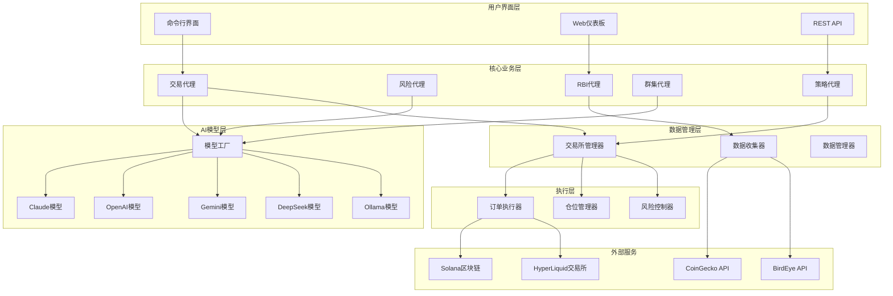
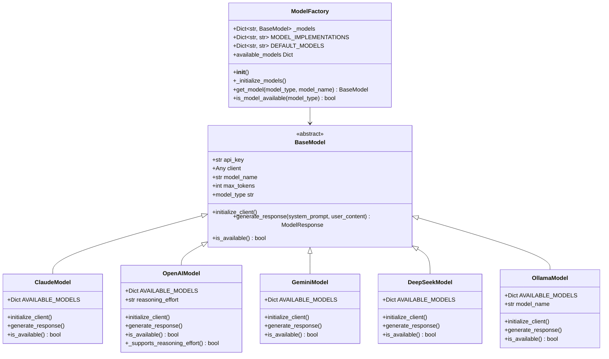
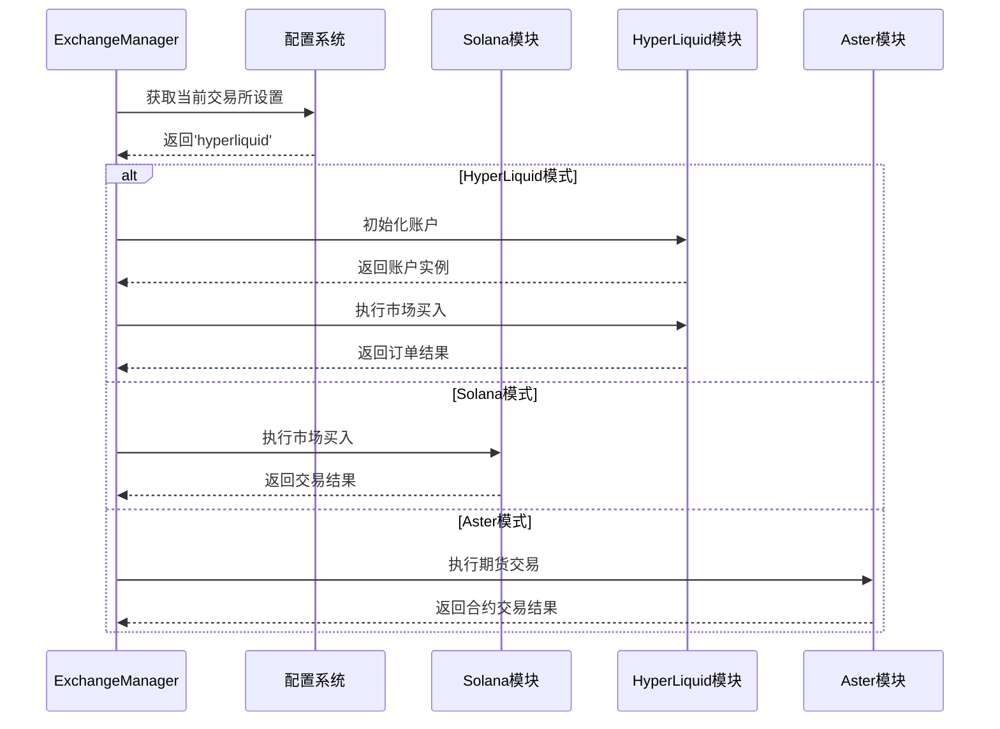
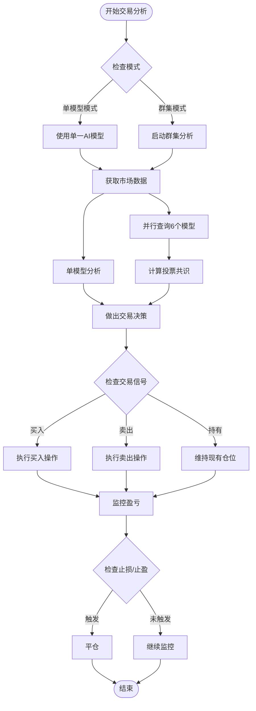
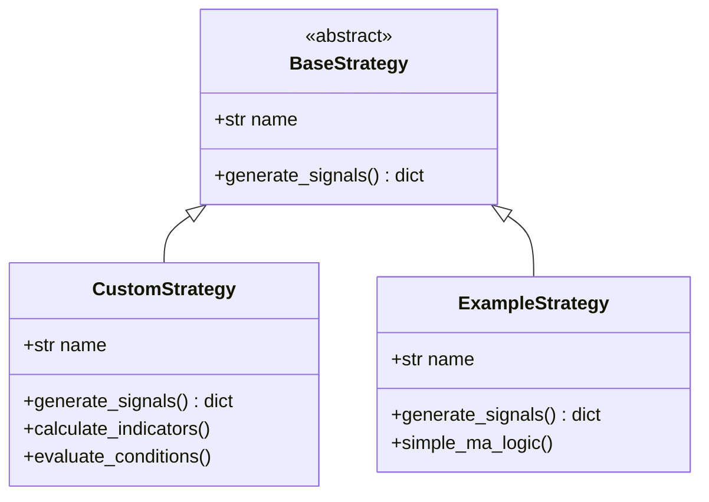
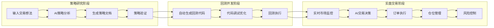
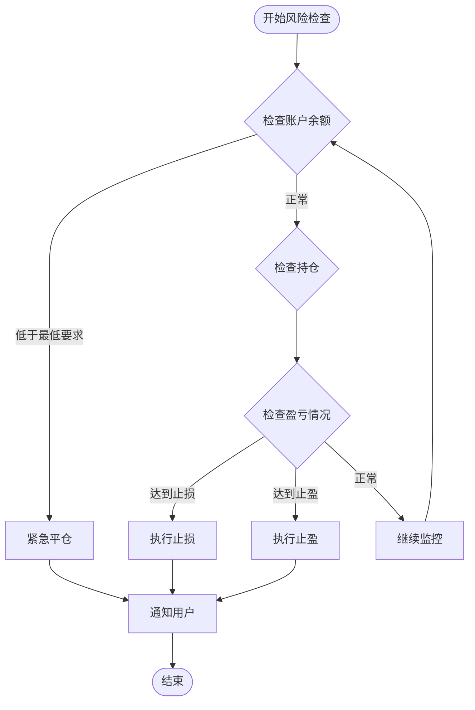

# moon-dev-ai-agents项目概述

<cite>
**本文档中引用的文件**
- [README.md](file://README.md)
- [main.py](file://src/main.py)
- [config.py](file://src/config.py)
- [model_factory.py](file://src/models/model_factory.py)
- [exchange_manager.py](file://src/exchange_manager.py)
- [base_agent.py](file://src/agents/base_agent.py)
- [trading_agent.py](file://src/agents/trading_agent.py)
- [swarm_agent.py](file://src/agents/swarm_agent.py)
- [base_strategy.py](file://src/strategies/base_strategy.py)
- [base_model.py](file://src/models/base_model.py)
- [claude_model.py](file://src/models/claude_model.py)
- [openai_model.py](file://src/models/openai_model.py)
- [rbi_agent.py](file://src/agents/rbi_agent.py)
</cite>

## 目录
1. [项目简介](#项目简介)
2. [核心愿景与目标](#核心愿景与目标)
3. [系统架构概览](#系统架构概览)
4. [AI模型集成](#ai模型集成)
5. [交易所支持](#交易所支持)
6. [核心功能模块](#核心功能模块)
7. [自动化交易流程](#自动化交易流程)
8. [风险管理机制](#风险管理机制)
9. [回测与策略开发](#回测与策略开发)
10. [技术特性](#技术特性)
11. [使用指南](#使用指南)
12. [总结](#总结)

## 项目简介

moon-dev-ai-agents是一个先进的AI驱动的加密货币交易系统，旨在通过人工智能技术实现智能化的市场分析、策略开发和交易执行。该项目代表了AI代理交易领域的前沿创新，为量化交易者提供了完整的自动化解决方案。

### 核心特点

- **多AI模型集成**：支持Claude、OpenAI、Groq、DeepSeek、Ollama、Google Gemini等多种AI模型
- **跨平台交易**：支持Solana和HyperLiquid等主流加密货币交易所
- **智能策略开发**：自动化的策略研究、回测和优化流程
- **风险管理体系**：完善的仓位管理和风险控制机制
- **实时监控**：市场分析、资金流监控和交易信号生成

## 核心愿景与目标

### 项目愿景

"AI代理显然是未来的方向，整个劳动力都将被AI代理取代或至少使用AI代理。作为一名量化交易者，我正在构建用于算法交易的代理，并将所有这些代理免费放置在这里，100%开源，因为我相信代码是伟大的平等者。我们从未见过像这样的制度转变，所以我需要将这些代码带给人们。"

### 主要目标

1. **推动AI在金融领域的应用**：通过开源项目降低AI交易系统的使用门槛
2. **提供高质量的交易工具**：为量化交易者提供经过验证的AI驱动交易解决方案
3. **促进技术创新**：持续改进AI模型集成和交易策略开发方法
4. **建立社区生态**：通过开源协作推动整个行业的发展

## 系统架构概览

moon-dev-ai-agents采用模块化架构设计，主要包含以下核心组件：



**图表来源**
- [main.py](file://src/main.py#L1-L104)
- [model_factory.py](file://src/models/model_factory.py#L1-L261)
- [exchange_manager.py](file://src/exchange_manager.py#L1-L382)

**章节来源**
- [README.md](file://README.md#L1-L50)
- [main.py](file://src/main.py#L1-L104)

## AI模型集成

### 支持的AI模型类型

moon-dev-ai-agents实现了统一的模型工厂模式，支持多种AI模型的无缝集成：



**图表来源**
- [model_factory.py](file://src/models/model_factory.py#L20-L261)
- [base_model.py](file://src/models/base_model.py#L1-L73)
- [claude_model.py](file://src/models/claude_model.py#L1-L76)
- [openai_model.py](file://src/models/openai_model.py#L1-L199)

### 模型配置与选择

系统支持灵活的模型配置，允许用户根据需求选择最适合的AI模型：

| 模型类型 | 默认模型 | 特点 | 适用场景 |
|---------|---------|------|----------|
| Claude | claude-3-5-haiku-latest | 快速响应，高效推理 | 实时交易决策 |
| OpenAI | gpt-4o | 平衡性能与成本 | 复杂策略分析 |
| Gemini | gemini-2.5-flash | 轻量级，快速处理 | 市场趋势分析 |
| DeepSeek | deepseek-reasoner | 强大推理能力 | 高级策略开发 |
| Ollama | llama3.2 | 本地部署，隐私保护 | 敏感数据处理 |

**章节来源**
- [model_factory.py](file://src/models/model_factory.py#L30-L50)
- [config.py](file://src/config.py#L90-L100)

## 交易所支持

### 多交易所架构

moon-dev-ai-agents采用统一的交易所管理器模式，支持多个加密货币交易平台：



**图表来源**
- [exchange_manager.py](file://src/exchange_manager.py#L20-L100)

### 交易所特性对比

| 交易所 | 类型 | 杠杆 | 方向性 | 特殊功能 |
|--------|------|------|--------|----------|
| Solana | 现货DEX | 不适用 | 长期 | 高吞吐量，低费用 |
| HyperLiquid | 永续合约 | 1-50x | 长短双向 | 流动性高，手续费低 |
| Aster | 期货合约 | 1-125x | 长短双向 | 专业机构级功能 |

**章节来源**
- [exchange_manager.py](file://src/exchange_manager.py#L15-L50)
- [config.py](file://src/config.py#L10-L30)

## 核心功能模块

### 交易代理 (TradingAgent)

交易代理是系统的核心组件，提供双重模式的AI交易决策：

#### 单模型模式
- **响应时间**：约10秒/代币
- **特点**：快速执行，适合高频策略
- **适用场景**：短期交易，快速市场反应

#### 群集模式
- **响应时间**：约45-60秒/代币
- **特点**：6个AI模型共识投票
- **优势**：更高的决策质量，减少错误率



**图表来源**
- [trading_agent.py](file://src/agents/trading_agent.py#L200-L400)

### 群集代理 (SwarmAgent)

群集代理实现了多AI模型的协同工作，提供更可靠的决策支持：

#### 核心功能
- **并行查询**：同时调用多个AI模型
- **共识生成**：基于多数投票的最终决策
- **质量评估**：分析各模型的输出质量
- **结果汇总**：生成简洁的共识摘要

#### 模型配置选项

| 模型提供商 | 模型名称 | 价格 | 适用场景 |
|-----------|---------|------|----------|
| DeepSeek | deepseek-chat | 免费 | 研究和分析 |
| xAI | grok-4-fast-reasoning | $0.20-0.50/1M tokens | 快速推理 |
| OpenRouter | qwen/qwen3-max | $1.00/$1.00/1M tokens | 强大推理 |
| OpenRouter | google/gemini-2.5-flash | $0.10/$0.40/1M tokens | 快速处理 |

**章节来源**
- [swarm_agent.py](file://src/agents/swarm_agent.py#L1-L100)
- [trading_agent.py](file://src/agents/trading_agent.py#L600-L800)

### 风险代理 (RiskAgent)

风险代理负责监控和管理投资组合风险，确保交易安全：

#### 风险控制机制
- **仓位限制**：最大持仓比例控制
- **盈亏监控**：实时跟踪盈亏情况
- **止损止盈**：自动执行止损和止盈
- **现金缓冲**：保持最低现金余额

**章节来源**
- [config.py](file://src/config.py#L50-L90)

### 策略代理 (StrategyAgent)

策略代理管理预定义的交易策略，支持自定义策略开发：

#### 策略接口设计



**图表来源**
- [base_strategy.py](file://src/strategies/base_strategy.py#L1-L21)

**章节来源**
- [base_strategy.py](file://src/strategies/base_strategy.py#L1-L21)

## 自动化交易流程

### 完整交易生命周期

moon-dev-ai-agents实现了从策略研究到执行的完整自动化流程：



**图表来源**
- [rbi_agent.py](file://src/agents/rbi_agent.py#L1-L100)

### RBI (Research-Backtest-Implement) 流程

RBI代理是系统的核心创新，实现了完全自动化的策略开发流程：

#### 1. 研究阶段
- 分析YouTube视频、PDF文档或文本描述
- 提取关键交易策略要素
- 生成独特的策略命名

#### 2. 回测阶段
- 自动生成backtesting.py兼容的回测代码
- 集成技术指标和交易逻辑
- 处理数据清洗和格式标准化

#### 3. 调试阶段
- 自动修复代码错误
- 优化回测性能
- 验证策略逻辑正确性

**章节来源**
- [rbi_agent.py](file://src/agents/rbi_agent.py#L1-L200)

## 风险管理体系

### 多层次风险控制

moon-dev-ai-agents实现了完善的风险管理体系，包含以下层级：

#### 1. 仓位管理
- **最大持仓比例**：30%（可配置）
- **最小现金缓冲**：20%（可配置）
- **单笔订单大小**：$3（可配置）

#### 2. 盈亏监控
- **止损阈值**：5%（可配置）
- **止盈阈值**：5%（可配置）
- **监控频率**：每5秒（可配置）

#### 3. 账户层面控制
- **最低余额要求**：$50（可配置）
- **AI确认机制**：可选的AI辅助决策
- **紧急关闭**：自动平仓机制



**图表来源**
- [config.py](file://src/config.py#L60-L90)

**章节来源**
- [config.py](file://src/config.py#L50-L100)

## 回测与策略开发

### 自动化回测系统

系统提供了强大的自动化回测功能，支持多种数据源和策略验证：

#### 回测配置选项

| 参数 | 默认值 | 描述 | 可配置范围 |
|------|--------|------|------------|
| 数据天数 | 3天 | 历史数据长度 | 1-30天 |
| 时间框架 | 1H | K线周期 | 1m, 5m, 15m, 1H, 4H, 1D |
| 最小回报 | 1% | 保存标准 | 0.1%-10% |
| 目标回报 | 50% | 优化目标 | 10%-100% |

#### 回测结果分析

系统自动生成详细的回测报告，包含以下指标：
- **总回报率**：策略的总体收益表现
- **基准对比**：与买入持有策略的比较
- **最大回撤**：最严重的资产价值下跌
- **夏普比率**：风险调整后的收益指标
- **索提诺比率**：下行风险调整后的收益
- **交易次数**：策略执行的总交易笔数

**章节来源**
- [README.md](file://README.md#L200-L300)

## 技术特性

### 高性能设计

#### 并行处理能力
- **群集代理**：支持最多6个AI模型并行查询
- **多线程执行**：充分利用多核CPU资源
- **异步I/O**：非阻塞的数据获取和处理

#### 缓存与优化
- **智能缓存**：避免重复的AI请求
- **数据本地化**：减少网络延迟
- **内存管理**：高效的内存使用策略

### 可扩展架构

#### 模块化设计
- **插件式模型**：轻松添加新的AI模型
- **策略接口**：标准化的策略开发框架
- **交易所抽象**：支持新交易所的快速集成

#### 配置灵活性
- **环境变量**：灵活的配置管理
- **运行时切换**：动态调整系统参数
- **热更新**：无需重启的服务更新

**章节来源**
- [swarm_agent.py](file://src/agents/swarm_agent.py#L200-L300)
- [model_factory.py](file://src/models/model_factory.py#L100-L200)

## 使用指南

### 快速开始

#### 1. 环境准备
```bash
# 克隆项目
git clone https://github.com/YOUR_USERNAME/moon-dev-ai-agents-for-trading.git
cd moon-dev-ai-agents-for-trading

# 创建虚拟环境
conda create -n tflow python=3.10.9
conda activate tflow

# 安装依赖
pip install -r requirements.txt
```

#### 2. API密钥配置
创建`.env`文件并添加必要的API密钥：

```bash
# AI模型API
ANTHROPIC_KEY=your_anthropic_api_key_here
OPENAI_KEY=your_openai_api_key_here
DEEPSEEK_KEY=your_deepseek_api_key_here
GROQ_API_KEY=your_groq_api_key_here
GEMINI_KEY=your_gemini_api_key_here
XAI_API_KEY=your_xai_api_key_here

# 市场数据API
BIRDEYE_API_KEY=your_birdeye_api_key_here
COINGECKO_API_KEY=your_coingecko_api_key_here
```

#### 3. 运行示例

##### 单独运行交易代理
```bash
python src/agents/trading_agent.py
```

##### 启动RBI回测代理
```bash
# 创建策略想法文件
echo "RSI小于30时买入，RSI大于70时卖出" > src/data/rbi_pp_multi/ideas.txt

# 运行回测
python src/agents/rbi_agent_pp_multi.py
```

##### 使用Web仪表板
```bash
cd src/data/rbi_pp_multi
python app.py
```

### 高级配置

#### 交易参数调整
编辑`src/config.py`中的配置参数：

```python
# 交易所选择
EXCHANGE = 'solana'  # 或 'hyperliquid'

# 仓位管理
MAX_POSITION_PERCENTAGE = 30  # 最大持仓比例
CASH_PERCENTAGE = 20  # 最小现金缓冲

# 风险控制
MAX_LOSS_USD = 25  # 最大亏损金额
MAX_GAIN_USD = 25  # 最大盈利金额
```

#### AI模型配置
编辑`src/agents/swarm_agent.py`中的群集模型配置：

```python
SWARM_MODELS = {
    "deepseek": (True, "deepseek", "deepseek-chat"),
    "xai": (True, "xai", "grok-4-fast-reasoning"),
    "openrouter_qwen": (True, "openrouter", "qwen/qwen3-max"),
    # 添加更多模型...
}
```

**章节来源**
- [README.md](file://README.md#L150-L250)
- [config.py](file://src/config.py#L1-L136)

## 总结

moon-dev-ai-agents代表了AI驱动交易系统的最新发展成果，通过创新的架构设计和强大的功能集合，为量化交易者提供了完整的自动化解决方案。

### 主要优势

1. **技术先进性**：整合了最新的AI模型和技术
2. **功能完整性**：覆盖从策略研究到实盘交易的全流程
3. **用户体验**：简洁的配置和直观的操作界面
4. **可扩展性**：模块化设计支持功能扩展
5. **开源生态**：促进整个行业的技术进步

### 应用前景

随着AI技术的不断发展和加密货币市场的日益成熟，moon-dev-ai-agents有望成为量化交易领域的重要工具，为投资者提供更加智能、可靠和高效的交易解决方案。

### 注意事项

- **风险提示**：本系统为实验性项目，不保证盈利
- **自主责任**：用户需自行承担交易风险
- **持续学习**：建议深入理解AI模型和交易原理
- **合规要求**：遵守当地法律法规

通过moon-dev-ai-agents，我们不仅看到了AI在金融领域的巨大潜力，也见证了开源协作在推动技术创新方面的重要作用。这个项目将继续演进，为更多的交易者带来价值。