# RBI工作流程

<cite>
**本文档引用的文件**
- [rbi.md](file://src/agents/rbi.md)
- [rbi_agent.py](file://src/agents/rbi_agent.py)
- [rbi_agent_v2.py](file://src/agents/rbi_agent_v2.py)
- [rbi_agent_v3.py](file://src/agents/rbi_agent_v3.py)
- [rbi_agent_pp.py](file://src/agents/rbi_agent_pp.py)
- [rbi_batch_backtester.py](file://src/agents/rbi_batch_backtester.py)
- [research_agent.py](file://src/agents/research_agent.py)
- [strategy_agent.py](file://src/agents/strategy_agent.py)
- [backtest_runner.py](file://src/agents/backtest_runner.py)
- [config.py](file://src/config.py)
- [requirements.txt](file://requirements.txt)
</cite>

## 目录
1. [简介](#简介)
2. [RBI工作流程概述](#rbi工作流程概述)
3. [核心组件架构](#核心组件架构)
4. [详细流程分析](#详细流程分析)
5. [数据流与状态管理](#数据流与状态管理)
6. [错误处理机制](#错误处理机制)
7. [性能优化策略](#性能优化策略)
8. [高级用例](#高级用例)
9. [故障排除指南](#故障排除指南)
10. [总结](#总结)

## 简介

RBI（研究-回测-实施）工作流程是Moon Dev AI交易代理系统的核心自动化框架，旨在完全自动化地从交易想法生成到策略实施的整个过程。该系统通过四个主要阶段：研究、回测、调试和优化，实现了策略开发的闭环管理。

系统支持多种版本的RBI Agent，从基础的单线程处理到高级的并行处理和自动优化功能，为不同规模的策略开发需求提供了灵活的解决方案。

## RBI工作流程概述

RBI工作流程采用模块化设计，每个阶段都有专门的AI代理负责特定任务：

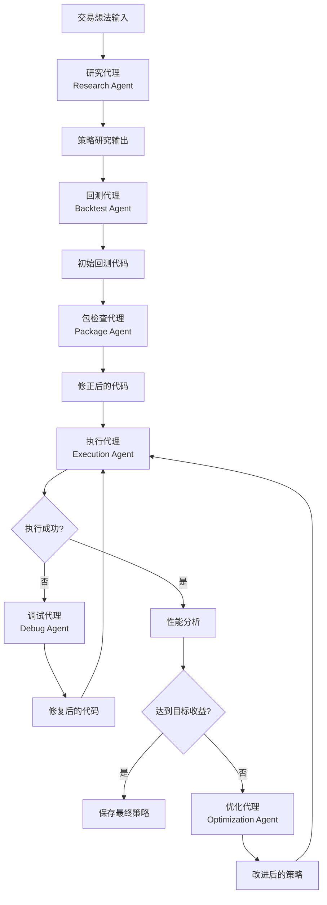

**图表来源**
- [rbi.md](file://src/agents/rbi.md#L92-L116)
- [rbi_agent.py](file://src/agents/rbi_agent.py#L884-L963)

**章节来源**
- [rbi.md](file://src/agents/rbi.md#L1-L50)
- [rbi_agent.py](file://src/agents/rbi_agent.py#L1-L50)

## 核心组件架构

### 研究代理（Research Agent）

研究代理负责从各种来源提取和分析交易想法，生成结构化的策略描述。

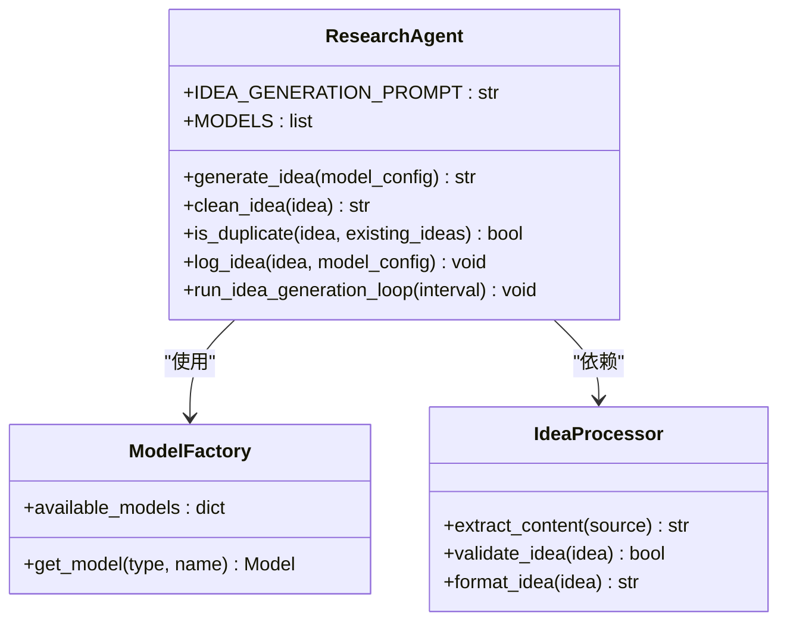

**图表来源**
- [research_agent.py](file://src/agents/research_agent.py#L1-L100)
- [rbi_agent.py](file://src/agents/rbi_agent.py#L1-L100)

### 回测代理（Backtest Agent）

回测代理将策略研究转换为可执行的回测代码，确保代码符合backtesting.py框架的要求。

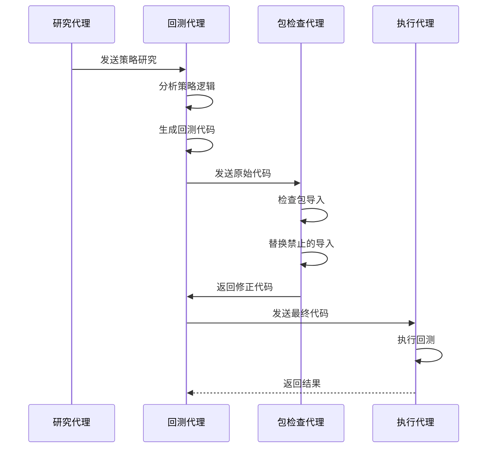

**图表来源**
- [rbi_agent.py](file://src/agents/rbi_agent.py#L700-L800)
- [backtest_runner.py](file://src/agents/backtest_runner.py#L1-L50)

### 调试代理（Debug Agent）

调试代理负责识别和修复回测代码中的技术问题，确保代码能够正确执行。

### 优化代理（Optimization Agent）

优化代理在策略达到预设收益目标之前，持续改进策略参数和逻辑。

**章节来源**
- [research_agent.py](file://src/agents/research_agent.py#L1-L200)
- [rbi_agent.py](file://src/agents/rbi_agent.py#L700-L900)

## 详细流程分析

### 研究阶段：信息收集与分析

研究阶段是整个RBI流程的起点，负责从各种来源获取交易想法并生成结构化的策略描述。

#### 输入来源处理

系统支持多种输入格式：
- YouTube视频链接和转录文本
- PDF文档内容提取
- 直接的文本描述
- 图表和技术分析

#### 策略命名规范

系统采用严格的策略命名规则，确保每个策略都有唯一的两词名称：
- 第一个词描述主要方法（如Adaptive、Neural、Quantum等）
- 第二个词描述具体技术（如Reversal、Breakout、Oscillator等）
- 避免使用通用名称如"TrendFollower"或"MomentumStrategy"

#### 研究输出结构

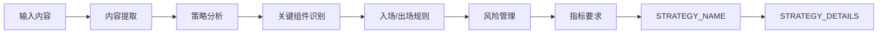

**图表来源**
- [rbi_agent.py](file://src/agents/rbi_agent.py#L150-L200)

### 回测阶段：参数优化与性能评估

回测阶段将策略概念转换为可执行的代码，并进行全面的性能测试。

#### 代码生成流程

回测代理使用专门的提示模板生成符合backtesting.py标准的代码：

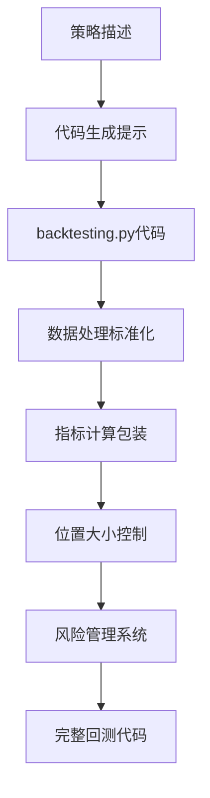

**图表来源**
- [rbi_agent.py](file://src/agents/rbi_agent.py#L200-L300)

#### 数据处理标准化

系统确保所有回测都使用标准化的数据处理流程：
- 清理列名：移除空格并转换为小写
- 移除未命名列
- 正确映射必需的列（Open、High、Low、Close、Volume）
- 设置时间戳索引

#### 指标计算规则

系统强制使用特定的指标计算方法：
- 使用`self.I()`包装器进行所有指标计算
- 优先使用TA Lib函数而非pandas操作
- 使用数组索引替代.shift()方法

### 实施阶段：实时监控与动态调整

实施阶段涉及策略的实际部署和持续监控。

#### 策略信号评估

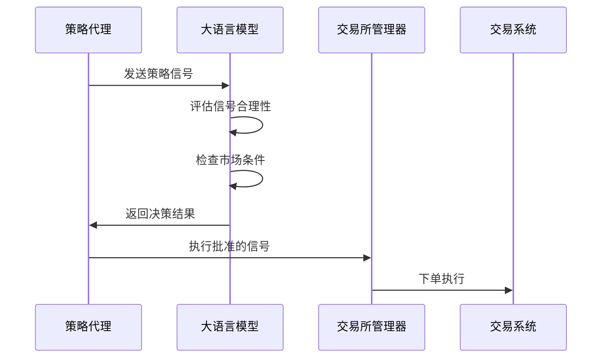

**图表来源**
- [strategy_agent.py](file://src/agents/strategy_agent.py#L1-L100)

#### 风险管理集成

系统集成了多层次的风险管理机制：
- 最大仓位百分比限制
- 单笔订单大小限制
- 最大损失/收益跟踪
- 自动止损和止盈

**章节来源**
- [rbi_agent.py](file://src/agents/rbi_agent.py#L200-L400)
- [strategy_agent.py](file://src/agents/strategy_agent.py#L1-L200)

## 数据流与状态管理

### 文件组织结构

RBI系统采用日期导向的文件组织结构，确保数据的有序管理和追溯性：

```
data/rbi/
├── MM_DD_YYYY/                    # 日期文件夹
│   ├── research/                  # 策略研究输出
│   ├── backtests/                 # 初始回测代码
│   ├── backtests_package/         # 包检查后的代码
│   ├── backtests_final/           # 调试完成的代码
│   ├── charts/                    # 图表输出目录
│   └── execution_results/         # 执行结果
```

### 状态跟踪机制

系统维护详细的处理状态跟踪：

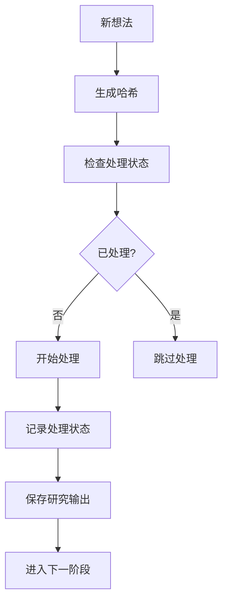

**图表来源**
- [rbi_agent.py](file://src/agents/rbi_agent.py#L400-L500)

### 并行处理状态管理

在并行版本中，系统使用线程安全的状态管理：

- 全局锁保护文件操作
- 线程本地存储避免冲突
- 唯一的线程ID前缀
- 实时进度跟踪

**章节来源**
- [rbi_agent.py](file://src/agents/rbi_agent.py#L400-L600)
- [rbi_agent_pp.py](file://src/agents/rbi_agent_pp.py#L1-L200)

## 错误处理机制

### 多层错误检测

系统实现了多层次的错误检测和处理机制：

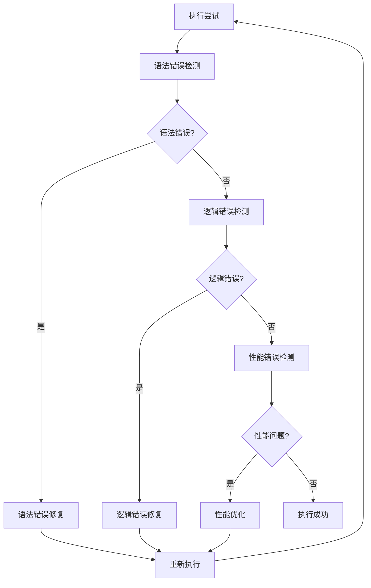

**图表来源**
- [rbi_agent_v2.py](file://src/agents/rbi_agent_v2.py#L600-L700)

### 常见错误类型及处理

#### 数据加载错误
- 列名不匹配：自动清理和标准化列名
- 时间戳格式错误：统一时间戳处理
- 缺失值处理：智能填充和插值

#### 指标计算错误
- shift()方法使用：替换为数组索引
- backtesting.lib导入：自动替换为TA Lib
- 位置对象属性错误：修正属性访问方式

#### 执行超时处理
- 5分钟超时限制
- 自动重试机制（最多3次）
- 错误历史记录防止无限循环

### 容错机制

系统包含多种容错机制：
- 最大调试迭代次数限制
- 重复错误检测和预防
- 渐进式错误修复策略
- 失败时的优雅降级

**章节来源**
- [rbi_agent_v2.py](file://src/agents/rbi_agent_v2.py#L600-L800)
- [backtest_runner.py](file://src/agents/backtest_runner.py#L100-L200)

## 性能优化策略

### 并行处理优化

并行版本实现了高效的多线程处理：

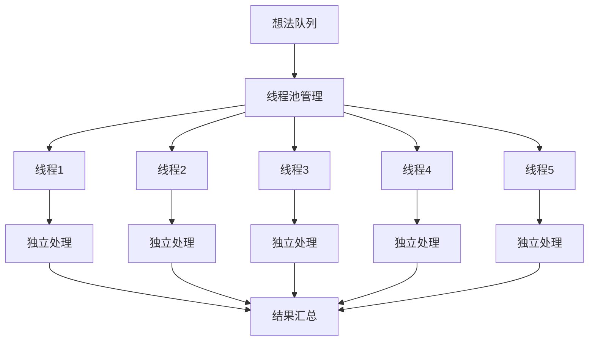

**图表来源**
- [rbi_agent_pp.py](file://src/agents/rbi_agent_pp.py#L1-L100)

### 资源管理优化

#### 内存管理
- 2GB内存限制
- 及时释放临时变量
- 批量处理减少内存占用

#### CPU优化
- 单核CPU限制
- 合理的任务调度
- 避免CPU密集型操作

#### 执行时间控制
- 5分钟超时保护
- 渐进式等待策略
- 资源使用监控

### 统计分析优化

系统实现了全面的统计分析功能：

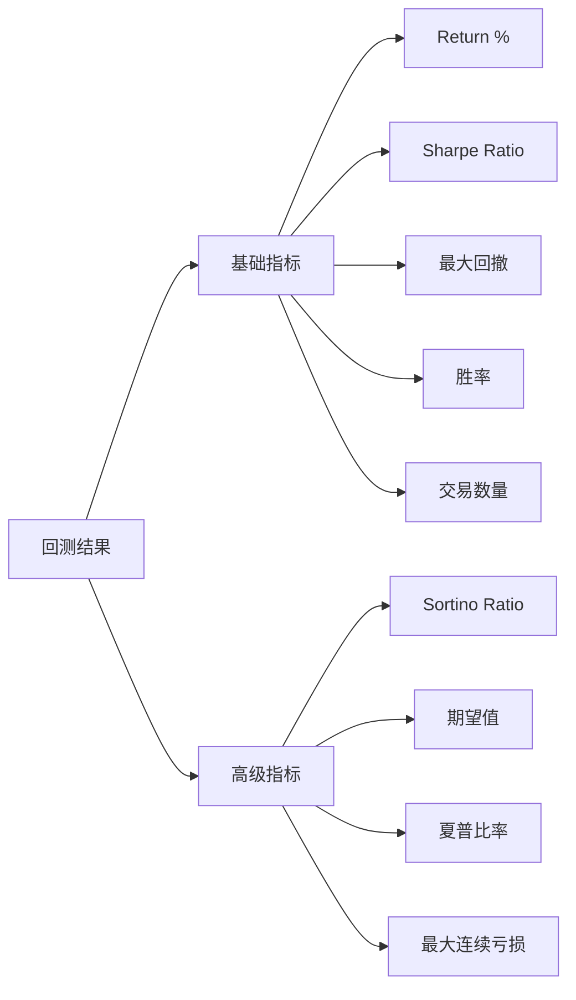

**图表来源**
- [rbi_agent_pp.py](file://src/agents/rbi_agent_pp.py#L300-L400)

**章节来源**
- [rbi_agent_pp.py](file://src/agents/rbi_agent_pp.py#L1-L300)

## 高级用例

### 多阶段研究

系统支持复杂的多阶段研究流程：

#### 增量回测

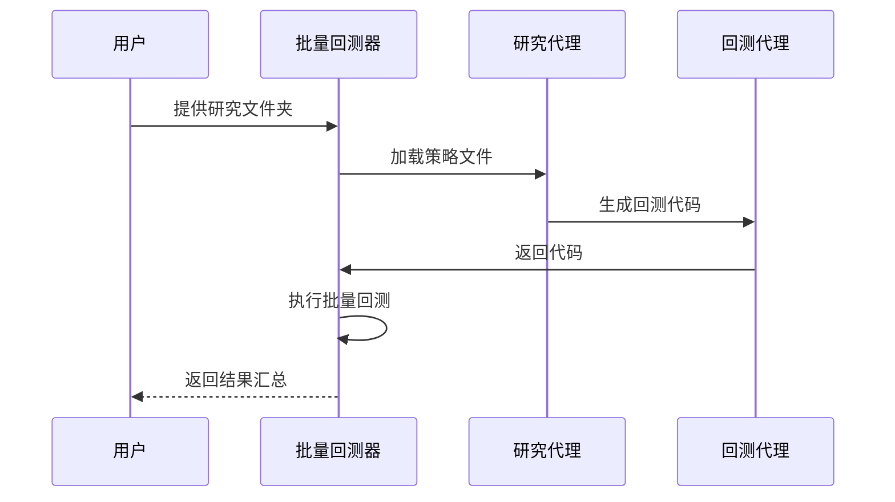

**图表来源**
- [rbi_batch_backtester.py](file://src/agents/rbi_batch_backtester.py#L1-L100)

#### 自动化策略生成

系统可以自动处理大量策略文件：
- 批量读取研究文档
- 自动生成回测代码
- 执行并行回测
- 收集和分析结果

### 增量优化

在V3版本中，系统实现了自动化的增量优化：

#### 目标驱动优化

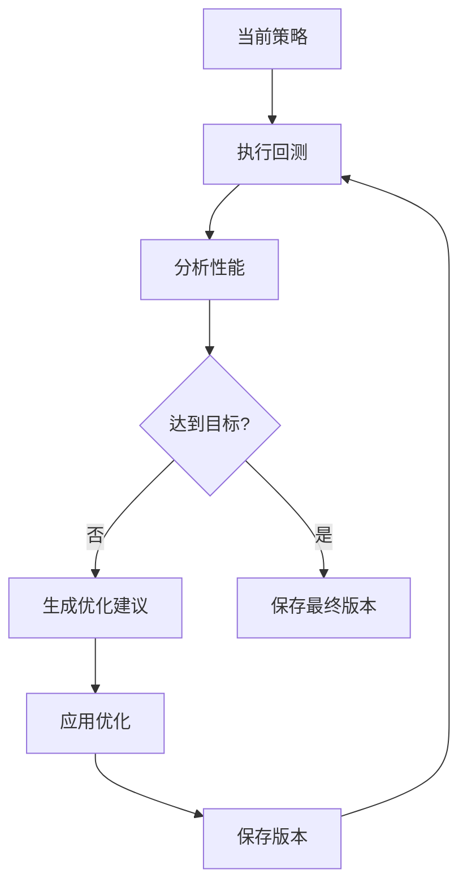

**图表来源**
- [rbi_agent_v3.py](file://src/agents/rbi_agent_v3.py#L1-L100)

#### 优化算法选择

系统支持多种优化算法：
- 网格搜索（Grid Search）
- 随机搜索（Random Search）
- 贝叶斯优化（Bayesian Optimization）

### 并行处理扩展

并行版本支持大规模策略测试：

#### 线程安全设计
- 独立的文件命名空间
- 线程本地状态管理
- 全局资源锁保护
- 实时进度同步

#### 性能监控
- 实时线程状态显示
- 统计数据聚合
- 错误率跟踪
- 执行时间分析

**章节来源**
- [rbi_batch_backtester.py](file://src/agents/rbi_batch_backtester.py#L1-L200)
- [rbi_agent_v3.py](file://src/agents/rbi_agent_v3.py#L1-L200)
- [rbi_agent_pp.py](file://src/agents/rbi_agent_pp.py#L1-L400)

## 故障排除指南

### 常见问题诊断

#### 回测执行失败

**症状**：回测代码无法执行
**可能原因**：
1. 语法错误
2. 导入问题
3. 数据加载失败
4. 位置大小计算错误

**解决步骤**：
1. 检查错误日志中的具体错误信息
2. 验证数据文件完整性
3. 确认依赖包安装
4. 检查位置大小参数

#### 策略无交易产生

**症状**：策略打印信号但没有实际交易
**可能原因**：
1. 位置大小参数无效
2. 现金不足
3. 买入条件逻辑错误
4. 缺少实际的buy()调用

**诊断方法**：
1. 检查位置大小计算
2. 验证现金余额
3. 追踪买入条件
4. 确认buy()调用存在

#### 性能优化失败

**症状**：优化后性能反而下降
**可能原因**：
1. 过度拟合
2. 参数范围不当
3. 市场条件变化
4. 风险控制过于严格

**解决策略**：
1. 降低优化复杂度
2. 扩展参数搜索范围
3. 增加样本外测试
4. 调整风险参数

### 系统配置问题

#### 环境配置

确保以下环境配置正确：
- Conda环境`tflow`已正确安装
- 所需Python包已安装
- API密钥配置正确
- 数据路径设置正确

#### 权限问题

检查文件系统权限：
- 确保有写入数据目录的权限
- 验证临时文件夹可访问
- 检查日志文件写入权限

### 性能调优

#### 内存优化
- 减少同时处理的想法数量
- 优化数据加载策略
- 及时释放不需要的对象

#### CPU优化
- 调整并行线程数量
- 优化算法复杂度
- 使用更高效的数据结构

**章节来源**
- [backtest_runner.py](file://src/agents/backtest_runner.py#L150-L214)
- [rbi_agent_v2.py](file://src/agents/rbi_agent_v2.py#L700-L800)

## 总结

RBI工作流程代表了AI驱动的交易策略开发的先进范式，通过自动化、模块化和智能化的设计，实现了从想法生成到策略实施的完整闭环。系统的主要优势包括：

### 技术优势
- **完全自动化**：从研究到实施的全流程自动化
- **模块化设计**：各阶段职责明确，易于维护和扩展
- **容错机制**：多层错误检测和自动修复
- **性能优化**：支持并行处理和增量优化

### 应用价值
- **提高效率**：大幅缩短策略开发周期
- **保证质量**：标准化的代码生成和测试流程
- **降低成本**：减少人工干预和错误
- **持续改进**：自动化的优化和反馈循环

### 发展方向
随着AI技术的进步，RBI工作流程将继续演进：
- 更智能的策略生成算法
- 更强大的自动化优化能力
- 更广泛的市场适应性
- 更深入的实时监控和调整

该系统为量化交易策略的开发提供了坚实的技术基础，是AI驱动的金融技术创新的重要实践案例。