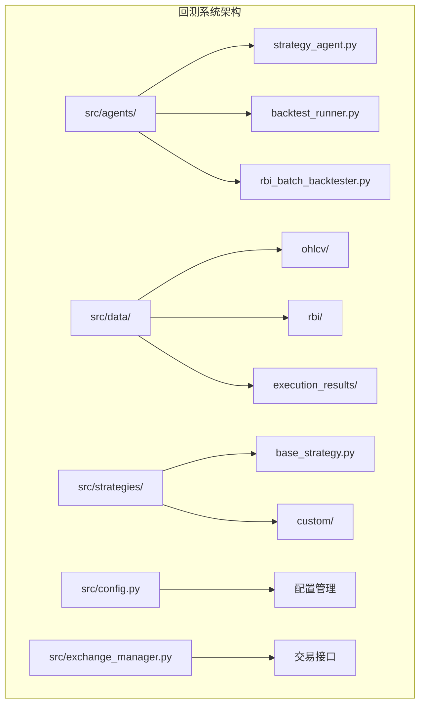
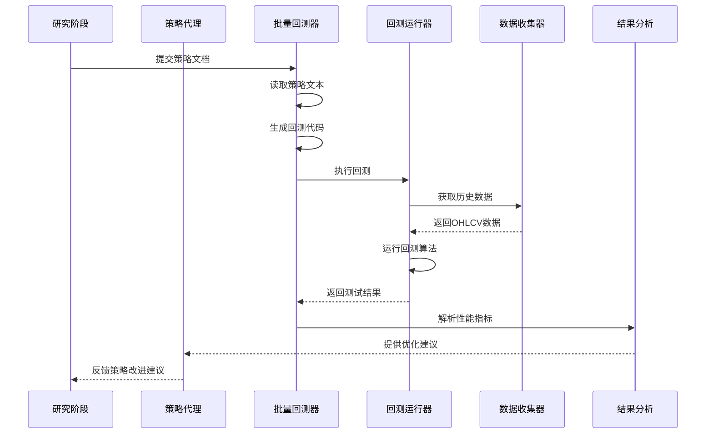
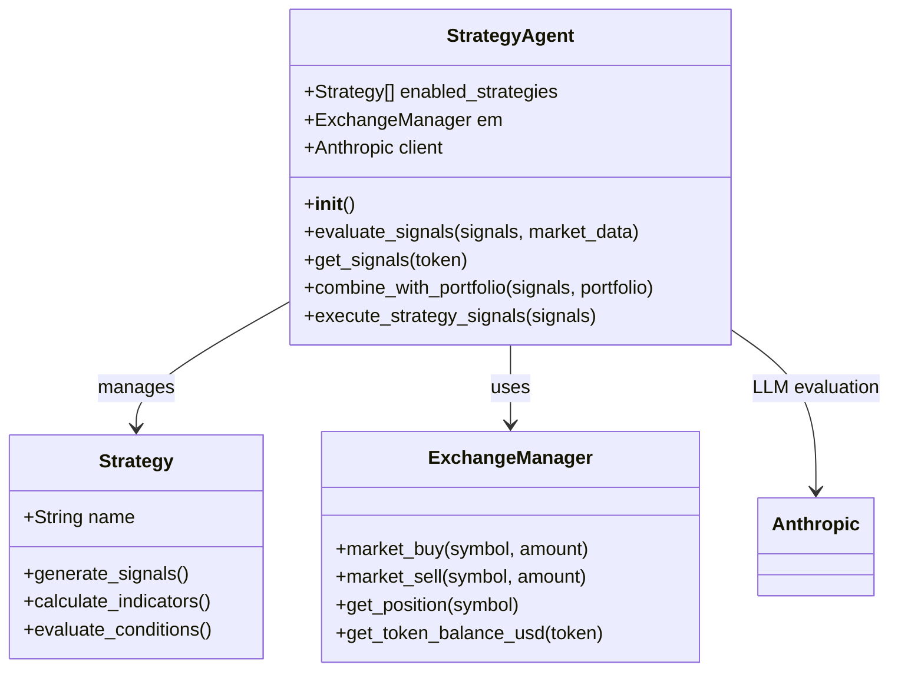
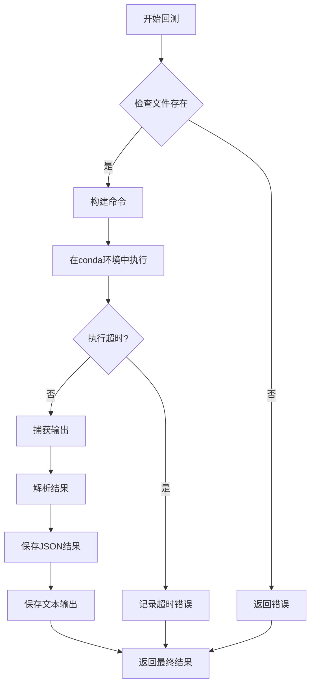
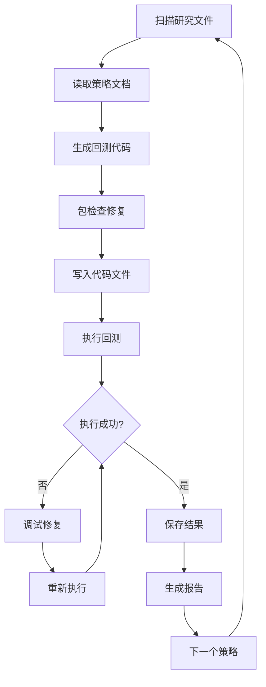
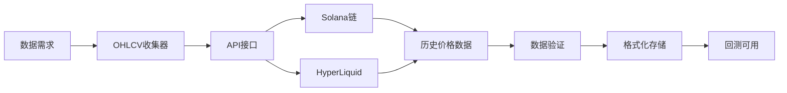
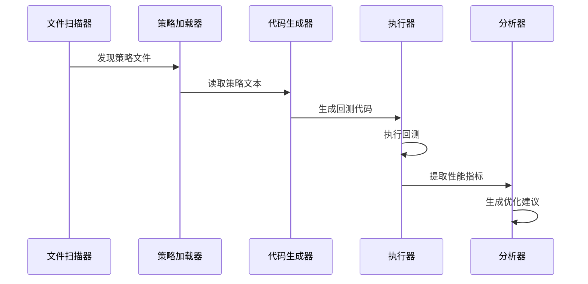
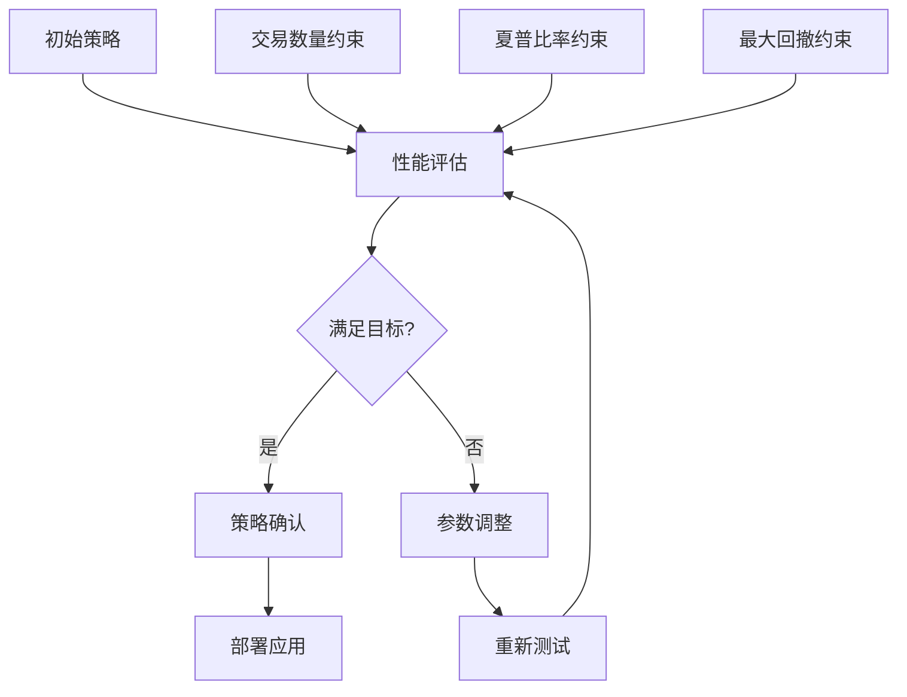

# 回测阶段

<cite>
**本文档中引用的文件**
- [strategy_agent.py](file://src/agents/strategy_agent.py)
- [backtest_runner.py](file://src/agents/backtest_runner.py)
- [rbi_batch_backtester.py](file://src/agents/rbi_batch_backtester.py)
- [config.py](file://src/config.py)
- [exchange_manager.py](file://src/exchange_manager.py)
- [ohlcv_collector.py](file://src/data/ohlcv_collector.py)
- [FibCloudTrend_BT.py](file://src/data/rbi/03_13_2025/backtests/FibCloudTrend_BT.py)
- [OPTIMIZATION_REPORT.md](file://src/data/rbi/AI_OPTIMIZED_STRATEGIES/OPTIMIZATION_REPORT.md)
- [test_all_strategies.py](file://src/data/rbi/AI_OPTIMIZED_STRATEGIES/test_all_strategies.py)
</cite>

## 目录
1. [简介](#简介)
2. [项目结构概览](#项目结构概览)
3. [核心组件分析](#核心组件分析)
4. [架构概览](#架构概览)
5. [详细组件分析](#详细组件分析)
6. [数据源与评估指标](#数据源与评估指标)
7. [批量回测功能](#批量回测功能)
8. [策略优化与迭代](#策略优化与迭代)
9. [性能考虑](#性能考虑)
10. [故障排除指南](#故障排除指南)
11. [结论](#结论)

## 简介

RBI（Research-Based Investment）工作流程中的回测阶段是验证交易策略可行性的重要环节。该阶段通过历史数据测试策略表现，评估其盈利能力、风险特征和市场适应性。本文档详细介绍了strategy_agent.py和backtest_runner.py如何协作验证交易策略，以及rbi_batch_backtester.py如何实现批量策略测试和优化。

回测阶段的核心目标包括：
- 验证策略在历史数据上的表现
- 识别潜在的风险和改进点
- 为策略参数优化提供数据支持
- 建立策略的可信度和可靠性

## 项目结构概览

RBI回测系统采用模块化设计，主要包含以下核心目录和文件：

**图表来源**
- [strategy_agent.py](file://src/agents/strategy_agent.py#L1-L50)
- [backtest_runner.py](file://src/agents/backtest_runner.py#L1-L50)
- [rbi_batch_backtester.py](file://src/agents/rbi_batch_backtester.py#L1-L50)

**章节来源**
- [strategy_agent.py](file://src/agents/strategy_agent.py#L1-L306)
- [backtest_runner.py](file://src/agents/backtest_runner.py#L1-L214)
- [rbi_batch_backtester.py](file://src/agents/rbi_batch_backtester.py#L1-L317)

## 核心组件分析

### 策略代理（Strategy Agent）

策略代理负责将研究阶段产生的想法转化为可执行的Python策略代码，并协调回测过程。其核心功能包括：

1. **策略信号生成**：从多个技术指标和分析方法生成交易信号
2. **LLM评估**：使用大语言模型评估策略信号的质量和一致性
3. **风险管理**：结合当前投资组合状态进行仓位管理和风险控制
4. **执行协调**：将批准的信号转换为实际的交易指令

### 回测运行器（Backtest Runner）

回测运行器提供了标准化的策略测试环境，确保所有策略都在相同的条件下进行评估：

1. **环境隔离**：在独立的conda环境中执行回测代码
2. **输出捕获**：完整记录标准输出和错误信息
3. **结果解析**：提取关键性能指标和统计信息
4. **结果保存**：将测试结果保存为结构化的JSON格式

### 批量回测器（RBI Batch Backtester）

批量回测器实现了自动化策略开发和测试流水线：

1. **策略扫描**：自动发现和读取研究文件夹中的策略文档
2. **代码生成**：使用AI模型为每个策略生成回测代码
3. **自动修复**：检测并修复代码中的常见错误
4. **批量执行**：并行处理多个策略的回测任务

**章节来源**
- [strategy_agent.py](file://src/agents/strategy_agent.py#L40-L120)
- [backtest_runner.py](file://src/agents/backtest_runner.py#L15-L80)
- [rbi_batch_backtester.py](file://src/agents/rbi_batch_backtester.py#L20-L100)

## 架构概览

回测系统的整体架构体现了从策略生成到性能评估的完整流程：

**图表来源**
- [rbi_batch_backtester.py](file://src/agents/rbi_batch_backtester.py#L150-L200)
- [backtest_runner.py](file://src/agents/backtest_runner.py#L20-L80)
- [strategy_agent.py](file://src/agents/strategy_agent.py#L120-L200)

## 详细组件分析

### 策略代理详细分析

策略代理采用了多层评估机制来确保策略质量：

**图表来源**
- [strategy_agent.py](file://src/agents/strategy_agent.py#L40-L80)
- [exchange_manager.py](file://src/exchange_manager.py#L20-L60)

#### 信号评估流程

策略代理通过以下步骤评估交易信号：

1. **信号收集**：从所有启用的策略中收集原始信号
2. **上下文分析**：获取当前市场价格和技术指标数据
3. **LLM评估**：使用Claude模型评估信号质量和一致性
4. **决策制定**：根据评估结果决定是否执行信号
5. **仓位调整**：结合当前投资组合状态调整仓位

#### 风险管理机制

策略代理实现了多层次的风险管理：

- **最小置信度阈值**：只有高于0.7置信度的信号才会被执行
- **仓位限制**：单个头寸最大占总投资组合的30%
- **资金分配**：每次交易最多使用25美元的资金
- **止损机制**：动态计算止损价格和止盈目标

**章节来源**
- [strategy_agent.py](file://src/agents/strategy_agent.py#L80-L150)
- [strategy_agent.py](file://src/agents/strategy_agent.py#L200-L306)

### 回测运行器详细分析

回测运行器提供了可靠的策略测试基础设施：

**图表来源**
- [backtest_runner.py](file://src/agents/backtest_runner.py#L20-L100)

#### 执行环境管理

回测运行器通过以下方式确保测试的一致性和可靠性：

1. **环境隔离**：使用指定的conda环境避免依赖冲突
2. **超时控制**：设置5分钟超时防止无限循环
3. **输出捕获**：完整记录标准输出和错误信息
4. **结果解析**：自动提取关键性能指标

#### 错误处理机制

回测运行器实现了完善的错误处理：

- **超时检测**：自动终止超过时间限制的进程
- **异常捕获**：处理各种运行时异常和系统错误
- **错误分类**：区分语法错误、运行时错误和系统错误
- **调试信息**：提供详细的错误位置和上下文信息

**章节来源**
- [backtest_runner.py](file://src/agents/backtest_runner.py#L20-L150)

### 批量回测器详细分析

批量回测器实现了完整的策略开发流水线：

**图表来源**
- [rbi_batch_backtester.py](file://src/agents/rbi_batch_backtester.py#L150-L250)

#### 自动化修复流程

批量回测器具备智能的错误修复能力：

1. **包兼容性检查**：移除不兼容的backtesting库调用
2. **语法错误修复**：自动修正常见的Python语法错误
3. **逻辑错误检测**：识别可能导致运行失败的逻辑问题
4. **多次尝试机制**：最多重试3次自动修复

#### 输出管理

批量回测器提供了全面的结果管理：

- **JSON格式**：保存结构化的执行结果
- **文本格式**：保存原始输出便于人工分析
- **元数据记录**：包含执行时间、环境信息等
- **错误追踪**：详细记录每次尝试的错误信息

**章节来源**
- [rbi_batch_backtester.py](file://src/agents/rbi_batch_backtester.py#L100-L317)

## 数据源与评估指标

### 历史数据源

RBI系统使用多种数据源进行策略回测：

#### OHLCV数据收集

系统通过专门的数据收集器获取高质量的历史价格数据：

**图表来源**
- [ohlcv_collector.py](file://src/data/ohlcv_collector.py#L100-L130)

#### 数据质量保证

数据收集过程包含严格的质量控制：

- **完整性检查**：确保数据没有缺失值或异常值
- **时间序列对齐**：保证OHLCV数据的时间戳连续性
- **重复数据处理**：移除重复的交易周期数据
- **异常值过滤**：识别并处理可能的市场异常事件

### 性能评估指标

回测系统使用一系列关键指标评估策略表现：

#### 核心性能指标

| 指标名称 | 计算公式 | 目标范围 | 重要性 |
|---------|---------|---------|--------|
| 总回报率 | (最终资产价值 - 初始资本) / 初始资本 × 100% | >0% | 高 |
| 夏普比率 | (年化收益 - 无风险利率) / 年化波动率 | >2.0 | 高 |
| 最大回撤 | (峰值 - 谷底) / 峰值 × 100% | <5% | 中 |
| 胜率 | 盈利交易数 / 总交易数 × 100% | >45% | 中 |
| 交易频率 | 年化交易次数 | >100次 | 低 |
| 收益风险比 | 年化收益 / 年化波动率 | >1.5 | 高 |

#### 风险调整指标

系统特别关注风险调整后的收益表现：

- **夏普比率**：衡量每单位风险获得的超额收益
- **索提诺比率**：专注于下行风险的风险调整指标
- **信息比率**：相对于基准的超额收益表现
- **VAR（风险价值）**：在给定置信水平下的最大潜在损失

**章节来源**
- [test_all_strategies.py](file://src/data/rbi/AI_OPTIMIZED_STRATEGIES/test_all_strategies.py#L208-L252)
- [OPTIMIZATION_REPORT.md](file://src/data/rbi/AI_OPTIMIZED_STRATEGIES/OPTIMIZATION_REPORT.md#L100-L200)

## 批量回测功能

### 实现机制

批量回测器通过以下机制实现高效的策略测试：

#### 策略发现与加载

系统自动扫描指定的研究目录，发现新的策略文档：

**图表来源**
- [rbi_batch_backtester.py](file://src/agents/rbi_batch_backtester.py#L250-L317)

#### 自动化流水线

批量回测器实现了完整的自动化流水线：

1. **策略识别**：从文件名和内容中提取策略名称
2. **代码生成**：使用AI模型生成回测框架代码
3. **兼容性检查**：确保代码符合backtesting库要求
4. **执行监控**：实时监控回测执行状态
5. **结果分析**：自动解析和评估测试结果

#### 并发处理能力

系统支持并发处理多个策略，提高测试效率：

- **并行执行**：同时处理多个策略的回测任务
- **资源管理**：合理分配系统资源避免过载
- **进度跟踪**：实时显示每个策略的处理进度
- **错误隔离**：单个策略的错误不影响其他策略

**章节来源**
- [rbi_batch_backtester.py](file://src/agents/rbi_batch_backtester.py#L150-L317)

## 策略优化与迭代

### 参数优化策略

系统采用多层次的参数优化方法：

#### 多目标优化

策略优化同时考虑多个目标：

**图表来源**
- [OPTIMIZATION_REPORT.md](file://src/data/rbi/AI_OPTIMIZED_STRATEGIES/OPTIMIZATION_REPORT.md#L50-L100)

#### 优化算法应用

系统使用多种优化技术提升策略性能：

- **网格搜索**：系统性地探索参数空间
- **遗传算法**：模拟自然选择过程寻找最优解
- **贝叶斯优化**：基于历史结果指导参数选择
- **随机搜索**：在大规模参数空间中快速找到优质解

### 迭代优化流程

策略优化是一个持续迭代的过程：

#### 优化阶段划分

1. **基础优化**：调整基本参数达到最低性能要求
2. **精细优化**：微调参数提升相对性能
3. **稳定性优化**：确保策略在不同市场条件下的稳定性
4. **风险优化**：平衡收益与风险特征

#### 性能验证

每次优化后都需要严格的验证：

- **样本外测试**：使用未参与优化的数据验证效果
- **压力测试**：在极端市场条件下测试策略表现
- **滚动测试**：在不同时间段内验证策略稳定性
- **交叉验证**：使用不同的数据分割方法验证结果

**章节来源**
- [OPTIMIZATION_REPORT.md](file://src/data/rbi/AI_OPTIMIZED_STRATEGIES/OPTIMIZATION_REPORT.md#L150-L296)

## 性能考虑

### 计算资源管理

回测系统需要合理管理计算资源以确保高效运行：

#### 内存优化

- **数据分块加载**：大型历史数据集分批加载
- **缓存策略**：重复使用的数据保持在内存中
- **垃圾回收**：及时释放不再需要的对象
- **内存监控**：实时监控内存使用情况

#### 并发控制

- **CPU利用率**：合理分配CPU资源避免过载
- **I/O优化**：减少磁盘和网络I/O操作
- **资源池管理**：复用数据库连接和网络资源
- **负载均衡**：在多个处理器核心间分配任务

### 执行效率优化

#### 算法优化

- **向量化计算**：使用NumPy和Pandas进行批量计算
- **缓存机制**：缓存重复计算的结果
- **并行计算**：利用多核处理器加速计算
- **算法选择**：选择最适合特定任务的算法

#### 数据访问优化

- **索引优化**：为频繁查询的数据建立索引
- **数据压缩**：压缩大型数据集减少存储空间
- **预计算**：提前计算常用指标和衍生变量
- **数据本地化**：将频繁访问的数据放在本地存储

## 故障排除指南

### 常见问题诊断

#### 回测执行失败

当回测执行失败时，可以按照以下步骤排查：

1. **检查文件路径**：确认回测脚本文件存在且可访问
2. **验证环境配置**：检查conda环境是否正确安装依赖
3. **查看错误日志**：分析标准错误输出中的具体错误信息
4. **测试环境隔离**：单独运行回测脚本验证环境配置

#### 性能指标异常

如果回测结果显示异常的性能指标：

1. **数据质量检查**：验证历史数据的完整性和准确性
2. **参数合理性验证**：检查策略参数是否在合理范围内
3. **交易成本分析**：确认交易费用对策略表现的影响
4. **市场适应性评估**：分析策略是否适应当前市场环境

### 调试技巧

#### 逐步调试

- **简化策略**：从简单的策略开始逐步增加复杂性
- **单元测试**：单独测试策略的各个组件
- **可视化分析**：绘制关键指标的变化趋势图
- **对比分析**：与类似策略的表现进行对比

#### 日志分析

- **详细日志**：启用详细的日志记录功能
- **关键指标跟踪**：记录重要的中间计算结果
- **性能监控**：监控回测过程中的性能指标
- **错误分类**：将错误按类型进行分类整理

**章节来源**
- [backtest_runner.py](file://src/agents/backtest_runner.py#L100-L214)
- [rbi_batch_backtester.py](file://src/agents/rbi_batch_backtester.py#L200-L317)

## 结论

RBI工作流程中的回测阶段通过strategy_agent.py、backtest_runner.py和rbi_batch_backtester.py的协同工作，构建了一个完整、可靠且高效的策略验证体系。该系统不仅能够验证单个策略的有效性，还提供了批量策略测试和自动优化的能力。

### 主要优势

1. **自动化程度高**：从策略生成到结果分析的全流程自动化
2. **质量控制严格**：多层验证机制确保测试结果的可靠性
3. **扩展性强**：模块化设计支持新策略和新数据源的接入
4. **性能优异**：优化的算法和资源管理确保高效执行

### 应用价值

该回测系统为量化交易策略开发提供了强有力的支持：

- **策略验证**：在真实市场数据上验证策略的有效性
- **参数优化**：系统性地优化策略参数提升性能
- **风险管理**：识别潜在风险并提供改进建议
- **决策支持**：为策略选择和部署提供数据支撑

### 未来发展方向

随着量化交易技术的发展，回测系统可以在以下方面进一步改进：

- **机器学习集成**：引入更先进的机器学习算法提升预测能力
- **实时回测**：支持实时数据的在线回测功能
- **多资产测试**：扩展到更多资产类别的策略测试
- **云原生架构**：利用云计算资源提升处理能力

通过持续的技术创新和优化，RBI回测系统将继续为量化交易策略的发展提供坚实的技术基础。