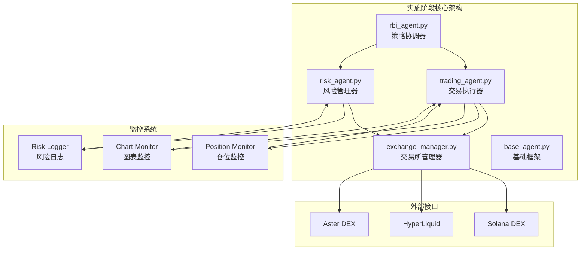
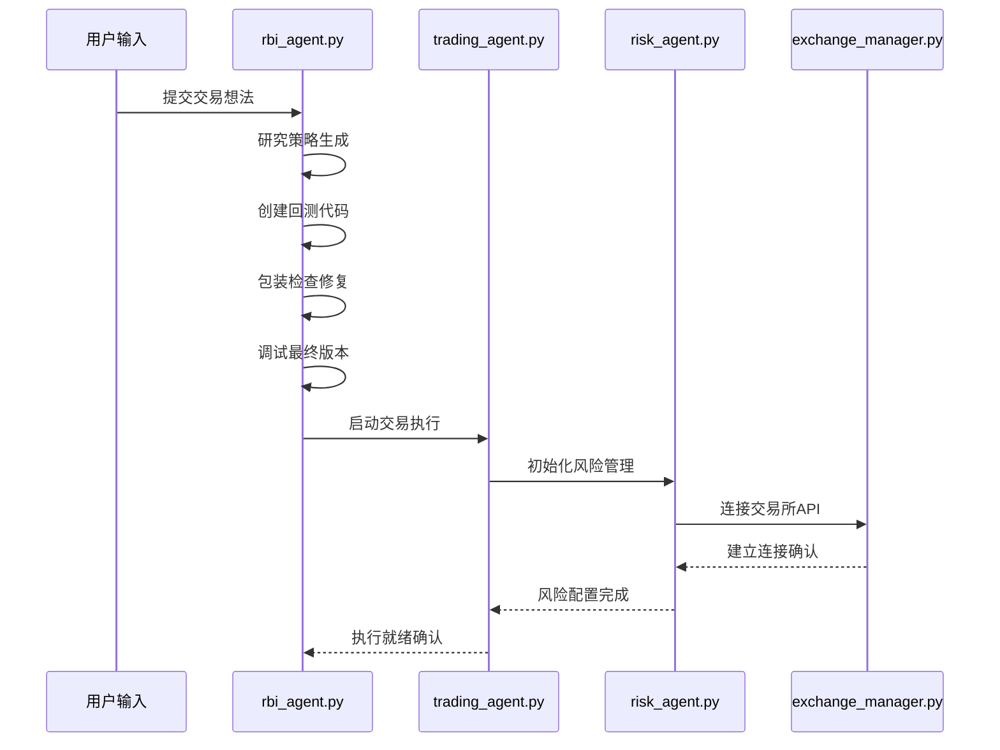
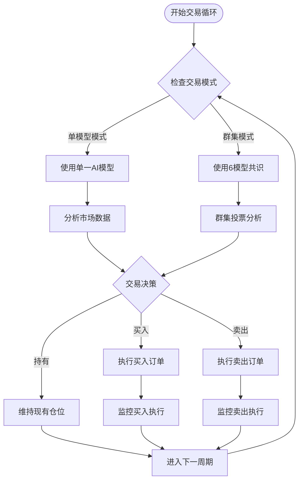
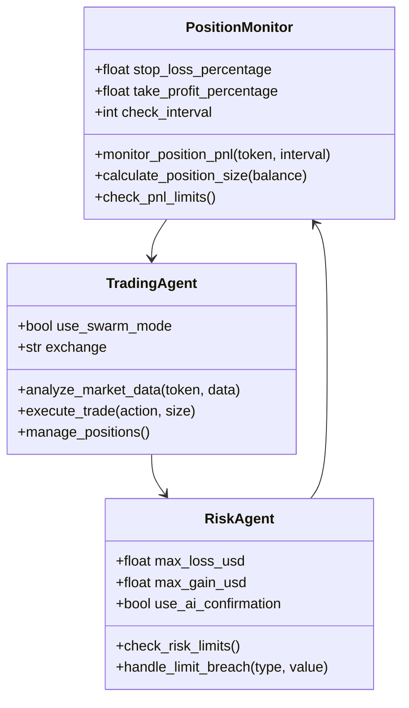
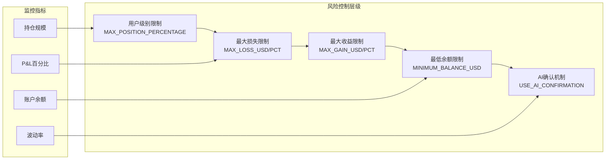
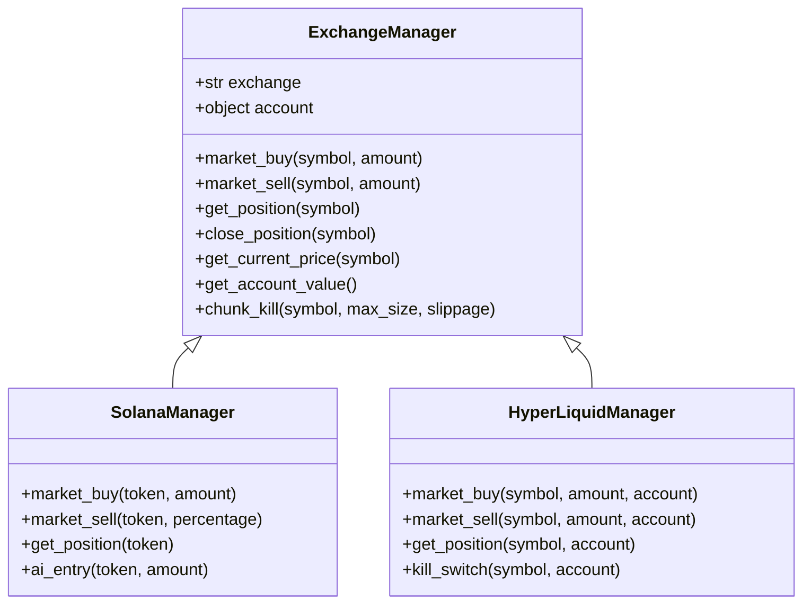
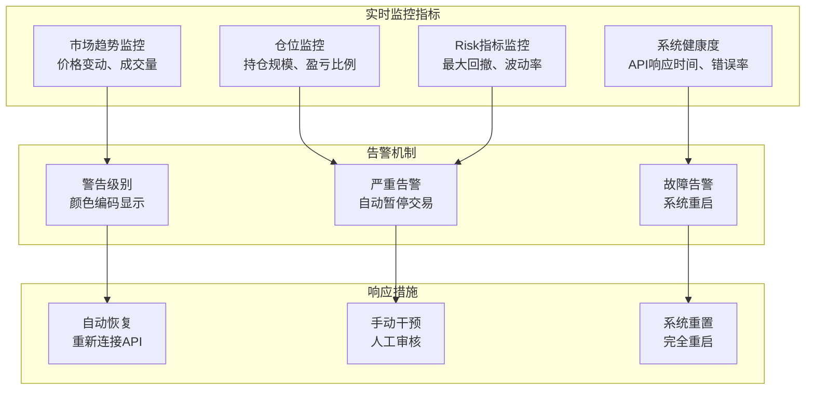
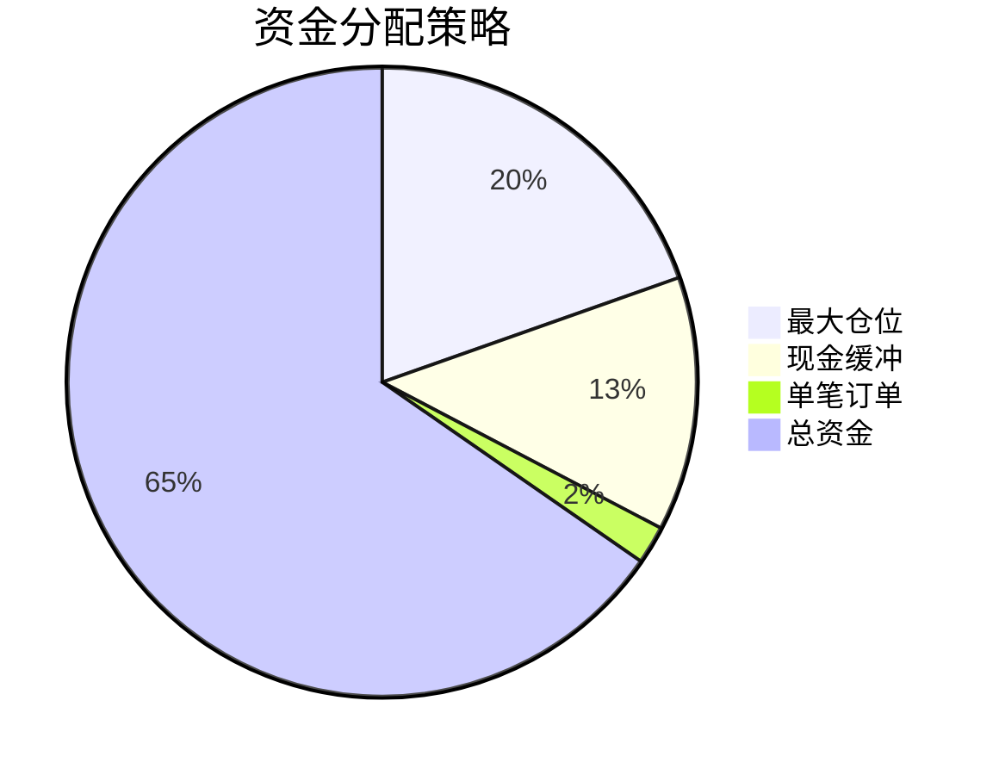
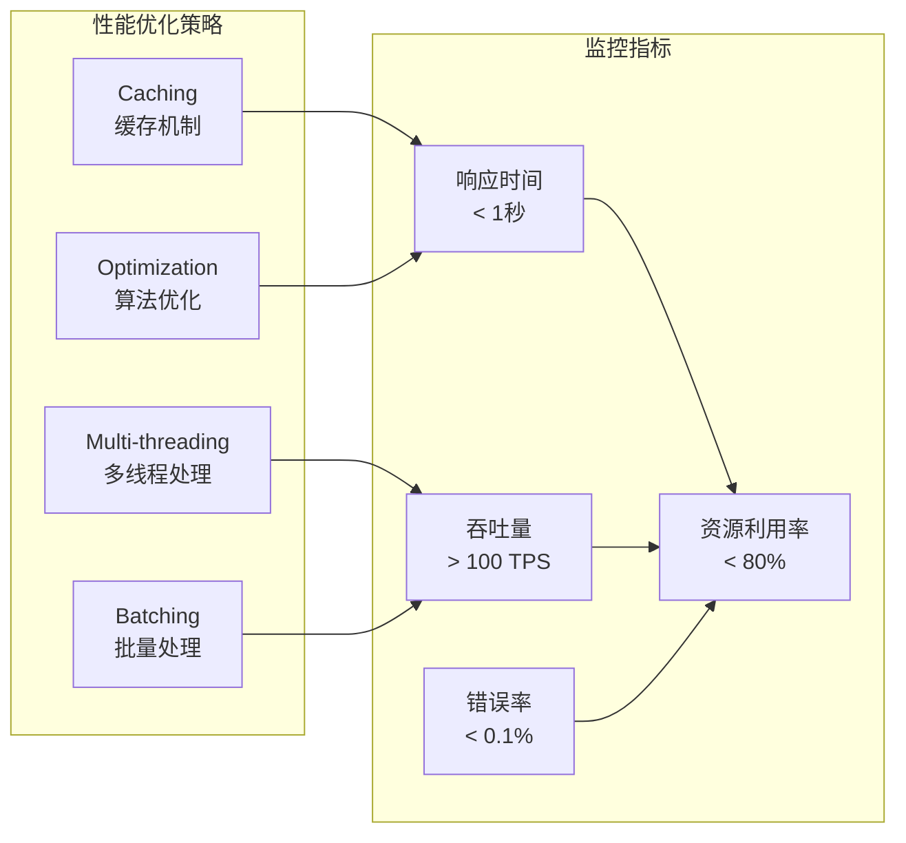

# 实施阶段

<cite>
**本文档引用的文件**
- [rbi_agent.py](file://src/agents/rbi_agent.py)
- [trading_agent.py](file://src/agents/trading_agent.py)
- [risk_agent.py](file://src/agents/risk_agent.py)
- [exchange_manager.py](file://src/exchange_manager.py)
- [base_agent.py](file://src/agents/base_agent.py)
- [main.py](file://src/main.py)
- [config.py](file://src/config.py)
</cite>

## 目录
1. [概述](#概述)
2. [实施阶段架构](#实施阶段架构)
3. [rbi_agent.py 协调机制](#rbi_agentpy-协调机制)
4. [trading_agent.py 执行引擎](#trading_agentpy-执行引擎)
5. [risk_agent.py 风险管理](#risk_agentpy-风险管理)
6. [exchange_manager.py 交易所交互](#exchange_managerpy-交易所交互)
7. [实时监控与异常处理](#实时监控与异常处理)
8. [安全性和资金管理](#安全性与资金管理)
9. [性能优化与持续改进](#性能优化与持续改进)
10. [总结](#总结)

## 概述

RBI（Research-Backtest-Implement）工作流程的实施阶段是将通过回测验证的交易策略转化为真实交易执行的关键环节。该阶段的核心目标是确保策略能够安全、高效地在真实市场环境中运行，同时保持严格的风险控制和实时监控。

实施阶段包含以下核心组件：
- **rbi_agent.py**：负责协调整个实施流程，从策略验证到实际执行
- **trading_agent.py**：执行具体的交易决策和订单管理
- **risk_agent.py**：实时监控风险指标，执行止损和止盈操作
- **exchange_manager.py**：统一管理与不同交易所的API交互
- **实时监控系统**：跟踪市场变化和策略表现

## 实施阶段架构

**架构图来源**
- [rbi_agent.py](file://src/agents/rbi_agent.py#L1-L50)
- [trading_agent.py](file://src/agents/trading_agent.py#L1-L50)
- [risk_agent.py](file://src/agents/risk_agent.py#L1-L50)
- [exchange_manager.py](file://src/exchange_manager.py#L1-L50)

## rbi_agent.py 协调机制

rbi_agent.py作为实施阶段的中央协调器，负责将通过回测验证的策略转化为可执行的交易指令。其核心功能包括：

### 策略验证与准备

**序列图来源**
- [rbi_agent.py](file://src/agents/rbi_agent.py#L884-L919)
- [trading_agent.py](file://src/agents/trading_agent.py#L400-L450)

### 核心协调功能

rbi_agent.py通过以下机制确保策略的正确执行：

1. **策略隔离执行**：每个交易想法都在完全隔离的环境中处理
2. **多阶段验证**：研究→回测→包装→调试的四阶段验证流程
3. **自动错误恢复**：遇到问题时自动重试和修正
4. **结果追踪**：记录每个策略的执行状态和性能

**章节来源**
- [rbi_agent.py](file://src/agents/rbi_agent.py#L884-L919)

## trading_agent.py 执行引擎

trading_agent.py是实施阶段的核心执行引擎，负责：

### 双模式交易系统

**流程图来源**
- [trading_agent.py](file://src/agents/trading_agent.py#L500-L600)

### 订单执行机制

trading_agent.py实现了多层次的订单执行策略：

1. **智能仓位计算**：基于账户余额和风险参数计算最优仓位大小
2. **分批执行**：将大额订单拆分为多个小订单以减少滑点
3. **动态调整**：根据市场流动性调整订单大小和频率
4. **多重验证**：执行前后的多次价格和可用性验证

### 仓位监控系统

**类图来源**
- [trading_agent.py](file://src/agents/trading_agent.py#L300-L400)
- [risk_agent.py](file://src/agents/risk_agent.py#L400-L500)

**章节来源**
- [trading_agent.py](file://src/agents/trading_agent.py#L300-L500)

## risk_agent.py 风险管理

risk_agent.py提供了全面的风险管理系统，确保交易活动在可控范围内进行：

### 多层次风险控制

**架构图来源**
- [risk_agent.py](file://src/agents/risk_agent.py#L500-L600)

### 动态风险调整

risk_agent.py实现了智能的风险调整机制：

1. **实时P&L监控**：持续跟踪投资组合的表现
2. **自适应止损**：根据市场波动调整止损位置
3. **仓位限制**：防止过度集中或过大仓位
4. **AI辅助决策**：在极限情况下寻求AI建议

### 异常情况处理

当检测到风险阈值被突破时，risk_agent.py会：

- **立即停止交易**：暂停所有新交易活动
- **评估市场状况**：分析当前市场条件
- **AI咨询决策**：在启用时征求AI意见
- **执行平仓操作**：必要时强制平仓保护资金

**章节来源**
- [risk_agent.py](file://src/agents/risk_agent.py#L500-L631)

## exchange_manager.py 交易所交互

exchange_manager.py提供了统一的交易所接口，支持多种加密货币交易平台：

### 统一接口设计

**类图来源**
- [exchange_manager.py](file://src/exchange_manager.py#L20-L100)

### API调用与错误处理

exchange_manager.py实现了robust的API交互机制：

1. **连接管理**：自动处理连接建立和维护
2. **请求重试**：网络错误时自动重试
3. **超时控制**：防止长时间无响应
4. **错误分类**：区分临时错误和永久错误
5. **降级处理**：在部分功能不可用时提供替代方案

### 多交易所支持

系统支持以下交易所：

- **Solana DEX**：用于memecoin交易
- **HyperLiquid**：用于永续合约交易
- **Aster DEX**：用于期货合约交易

每种交易所都有专门的适配器，确保统一的接口体验。

**章节来源**
- [exchange_manager.py](file://src/exchange_manager.py#L1-L381)

## 实时监控与异常处理

实施阶段包含了全面的实时监控系统，确保交易活动的安全性和稳定性：

### 监控指标体系

### 熔断机制

当市场出现剧烈波动时，系统会触发熔断机制：

1. **波动率检测**：实时监控市场波动性
2. **阈值比较**：与预设阈值进行对比
3. **自动暂停**：暂时停止交易活动
4. **恢复判断**：等待市场稳定后恢复

### 异常情况应对策略

系统针对不同类型的异常情况有相应的应对策略：

- **网络中断**：自动重连和备用服务器切换
- **API限流**：降低请求频率和使用备用端点
- **数据异常**：使用历史数据和人工验证
- **系统故障**：快速重启和状态恢复

## 安全性和资金管理

实施阶段的安全部署了多层次的安全措施和资金管理原则：

### 资金管理原则

### 安全控制措施

1. **最小权限原则**：只授予必要的API访问权限
2. **交易限额**：设置每日/每笔交易金额上限
3. **双重验证**：关键操作需要二次确认
4. **审计日志**：记录所有交易和系统操作
5. **备份机制**：定期备份重要数据和配置

### 风险隔离

- **环境隔离**：测试和生产环境完全分离
- **账户隔离**：使用独立的交易账户
- **资金隔离**：专用资金池管理
- **功能隔离**：不同功能模块相互独立

**章节来源**
- [config.py](file://src/config.py#L50-L100)

## 性能优化与持续改进

实施阶段采用了多种优化策略来提高系统性能和可靠性：

### 执行效率优化

### 持续改进机制

1. **性能监控**：实时跟踪系统性能指标
2. **错误分析**：深入分析失败原因
3. **策略优化**：基于实盘表现调整策略
4. **系统升级**：定期更新和优化代码
5. **知识积累**：记录最佳实践和经验教训

### 自动化运维

- **健康检查**：定期检查系统各组件状态
- **自动重启**：发现故障时自动恢复
- **容量规划**：根据使用情况调整资源配置
- **安全更新**：及时应用安全补丁

## 总结

RBI工作流程的实施阶段代表了从理论策略到实际交易的桥梁，通过rbi_agent.py的协调、trading_agent.py的执行、risk_agent.py的风险管理和exchange_manager.py的接口统一，构建了一个完整、安全、高效的自动化交易系统。

该实施阶段的主要优势包括：

1. **完整的生命周期管理**：从策略验证到实际执行的全流程覆盖
2. **强大的风险管理**：多层次的风险控制和自动保护机制
3. **灵活的执行模式**：支持单模型和群集两种交易模式
4. **统一的接口设计**：无缝支持多种交易所和交易类型
5. **实时监控能力**：全方位的市场和系统监控
6. **高度的安全性**：多重安全措施和资金保护机制

通过这一实施阶段，RBI系统能够可靠地将经过验证的交易策略转化为实际的盈利交易，为用户提供了一个既强大又安全的自动化交易解决方案。