# 研究阶段

<cite>
**本文档引用的文件**
- [research_agent.py](file://src/agents/research_agent.py)
- [websearch_agent.py](file://src/agents/websearch_agent.py)
- [sentiment_agent.py](file://src/agents/sentiment_agent.py)
- [chartanalysis_agent.py](file://src/agents/chartanalysis_agent.py)
- [clean_ideas.py](file://src/agents/clean_ideas.py)
- [model_factory.py](file://src/models/model_factory.py)
- [rbi.md](file://src/agents/rbi.md)
</cite>

## 目录
1. [简介](#简介)
2. [研究阶段架构概览](#研究阶段架构概览)
3. [核心组件分析](#核心组件分析)
4. [数据收集与处理流程](#数据收集与处理流程)
5. [智能体交互机制](#智能体交互机制)
6. [质量控制与验证](#质量控制与验证)
7. [输出格式与集成](#输出格式与集成)
8. [错误处理与容错机制](#错误处理与容错机制)
9. [性能优化策略](#性能优化策略)
10. [故障排除指南](#故障排除指南)

## 简介

RBI（Research-Backtest-Implement）工作流程的研究阶段是整个自动化交易策略开发管道的核心环节。研究代理（research_agent.py）作为这一阶段的主要协调者，负责整合多种数据源和分析方法，生成高质量的交易策略想法。该阶段通过协调多个专门化的智能体（网络搜索、情绪分析、图表分析等），实现从原始数据到可执行策略的完整转换过程。

研究阶段的核心目标是：
- **多样化数据收集**：整合社交媒体、新闻、技术图表等多种信息源
- **智能分析处理**：运用AI模型进行深度数据分析和模式识别
- **创意策略生成**：基于多维度信息生成创新性交易策略
- **质量保证**：实施严格的质量控制和重复检测机制

## 研究阶段架构概览

研究阶段采用模块化架构设计，各组件职责明确且相互协作：

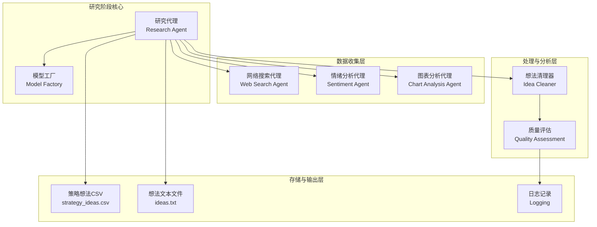

**图表来源**
- [research_agent.py](file://src/agents/research_agent.py#L1-L50)
- [model_factory.py](file://src/models/model_factory.py#L1-L50)

**章节来源**
- [research_agent.py](file://src/agents/research_agent.py#L1-L100)
- [rbi.md](file://src/agents/rbi.md#L1-L50)

## 核心组件分析

### 研究代理（Research Agent）

研究代理是研究阶段的中央协调器，负责管理整个研究流程的执行。其核心功能包括：

#### 模型轮换机制
研究代理支持多种AI模型的自动轮换，确保生成策略的多样性和创新性：

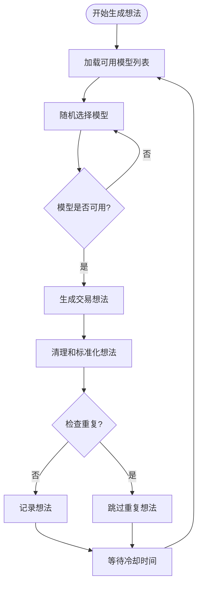

**图表来源**
- [research_agent.py](file://src/agents/research_agent.py#L400-L500)

#### 多模态数据整合
研究代理能够协调不同类型的智能体，整合来自多个渠道的数据：

| 数据源类型 | 智能体名称 | 主要功能 | 输出格式 |
|------------|------------|----------|----------|
| 社交媒体 | Sentiment Agent | Twitter情绪分析 | 情绪分数和趋势 |
| 网络搜索 | Web Search Agent | 战略文献挖掘 | 结构化策略文档 |
| 技术图表 | Chart Analysis Agent | K线图模式识别 | 买卖信号和置信度 |
| 新闻资讯 | 自动化集成 | 市场事件监控 | 关键事件摘要 |

#### 文件管理系统
研究代理维护两个关键文件用于想法存储和追踪：

- **ideas.txt**：纯文本格式，每行一个策略想法
- **strategy_ideas.csv**：结构化CSV格式，包含时间戳、模型信息和想法内容

**章节来源**
- [research_agent.py](file://src/agents/research_agent.py#L100-L200)

### 模型工厂（Model Factory）

模型工厂提供统一的AI模型管理接口，支持多种主流AI服务提供商：

#### 支持的模型类型
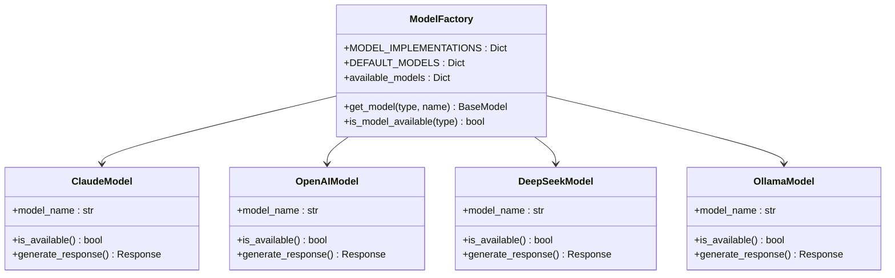

**图表来源**
- [model_factory.py](file://src/models/model_factory.py#L20-L50)

**章节来源**
- [model_factory.py](file://src/models/model_factory.py#L1-L100)

## 数据收集与处理流程

### 多源数据收集机制

研究阶段采用分布式数据收集策略，确保信息的全面性和时效性：

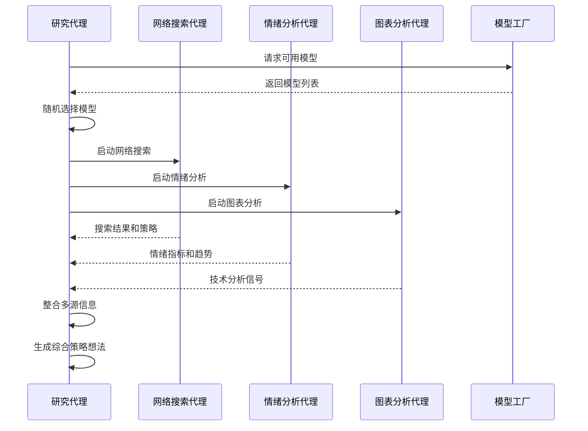

**图表来源**
- [research_agent.py](file://src/agents/research_agent.py#L300-L400)
- [websearch_agent.py](file://src/agents/websearch_agent.py#L1-L50)

### 数据预处理与清洗

研究代理实现了多层次的数据清洗和验证机制：

#### 想法清理流程
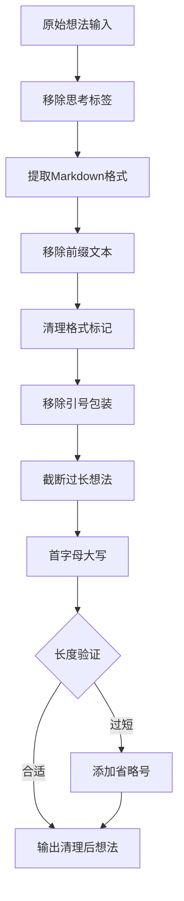

**图表来源**
- [research_agent.py](file://src/agents/research_agent.py#L350-L450)

**章节来源**
- [research_agent.py](file://src/agents/research_agent.py#L300-L500)

## 智能体交互机制

### 研究代理协调机制

研究代理通过以下机制协调各个智能体的工作：

#### 轮询调度策略
研究代理采用轮询方式调度不同智能体，确保资源的均衡使用：

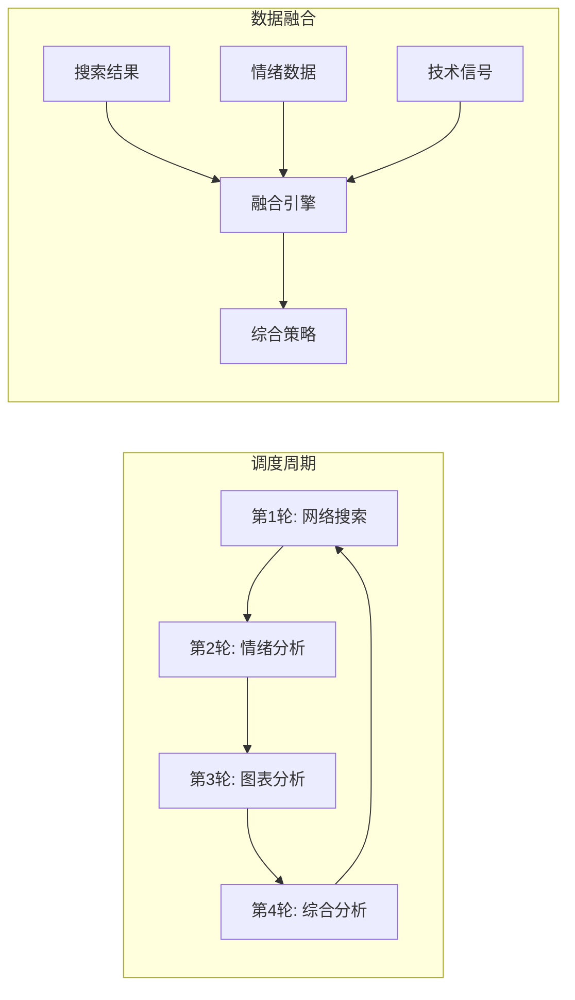

**图表来源**
- [research_agent.py](file://src/agents/research_agent.py#L450-L550)

#### 异步通信模式
各智能体采用异步通信模式，提高整体效率：

| 通信方式 | 适用场景 | 延迟要求 | 错误处理 |
|----------|----------|----------|----------|
| 同步调用 | 快速决策 | < 5秒 | 立即重试 |
| 异步消息 | 批量处理 | < 30秒 | 定时重试 |
| 轮询检查 | 状态监控 | < 60秒 | 指数退避 |
| 事件驱动 | 实时更新 | < 1秒 | 断线重连 |

**章节来源**
- [research_agent.py](file://src/agents/research_agent.py#L500-L570)

## 质量控制与验证

### 重复检测机制

研究代理实现了严格的重复检测机制，防止生成相同或高度相似的策略：

#### 智能重复检测算法
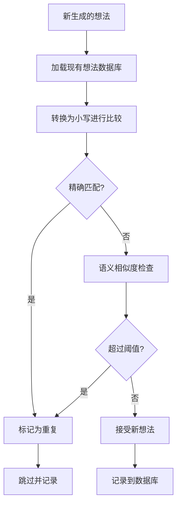

**图表来源**
- [research_agent.py](file://src/agents/research_agent.py#L150-L200)

### 质量评估标准

研究代理定义了多维度的质量评估标准：

| 评估维度 | 权重 | 检查项目 | 阈值设置 |
|----------|------|----------|----------|
| 创新性 | 40% | 独特性评分 | > 0.7 |
| 可行性 | 30% | 参数合理性 | > 0.6 |
| 表达清晰度 | 20% | 文本质量 | > 0.8 |
| 结构完整性 | 10% | 格式规范性 | > 0.9 |

**章节来源**
- [research_agent.py](file://src/agents/research_agent.py#L200-L300)

## 输出格式与集成

### 结构化输出格式

研究代理生成两种主要格式的输出，满足不同使用场景的需求：

#### CSV格式输出
CSV文件包含完整的元数据信息：
- 时间戳：想法生成的确切时间
- 模型信息：使用的AI模型类型和版本
- 策略内容：标准化后的策略描述

#### 文本格式输出
文本文件采用简洁的格式，便于后续处理：
- 每行一个策略想法
- 清晰的分隔符
- 兼容各种文本处理工具

### 与RBI系统的集成

研究代理与RBI系统的其他组件无缝集成：

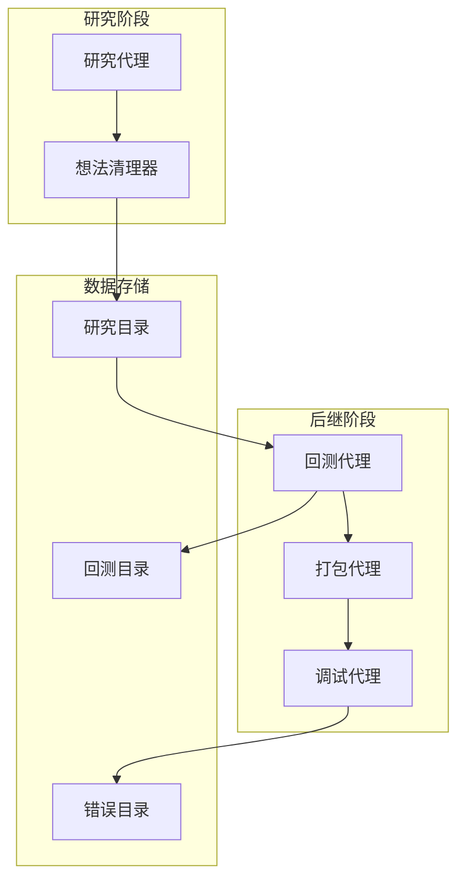

**图表来源**
- [rbi.md](file://src/agents/rbi.md#L50-L100)

**章节来源**
- [research_agent.py](file://src/agents/research_agent.py#L450-L570)

## 错误处理与容错机制

### 多层次错误处理

研究代理实现了完善的错误处理机制，确保系统的稳定运行：

#### 模型级错误处理
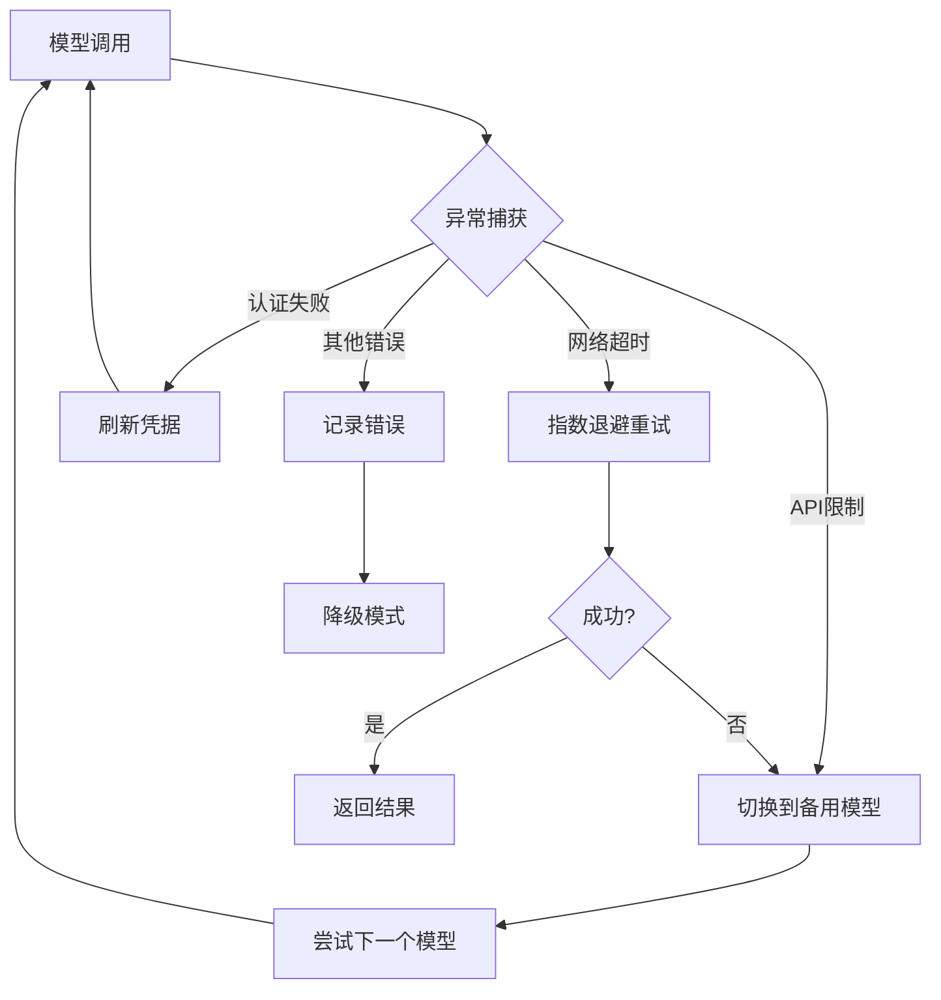

**图表来源**
- [research_agent.py](file://src/agents/research_agent.py#L250-L350)

#### 数据验证机制
研究代理在每个关键步骤都实施数据验证：

| 验证点 | 检查内容 | 处理策略 |
|--------|----------|----------|
| 输入验证 | 数据格式和完整性 | 拒绝无效输入 |
| 输出验证 | 结果质量和一致性 | 自动修正或重新生成 |
| 存储验证 | 文件完整性和可读性 | 自动修复或备份 |
| 网络验证 | 连接状态和服务可用性 | 动态路由和负载均衡 |

**章节来源**
- [research_agent.py](file://src/agents/research_agent.py#L150-L250)

## 性能优化策略

### 并发处理优化

研究代理采用多种并发优化策略提升性能：

#### 异步任务调度
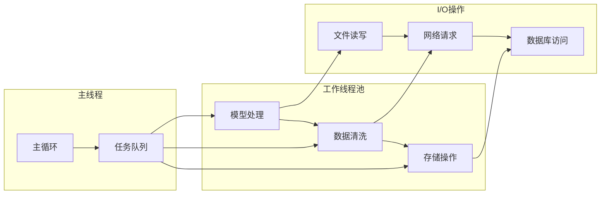

**图表来源**
- [research_agent.py](file://src/agents/research_agent.py#L500-L570)

### 资源管理优化

研究代理实现了智能的资源管理策略：

#### 内存管理
- 对象池化：重用频繁创建的对象
- 垃圾回收优化：及时释放不需要的资源
- 内存监控：实时跟踪内存使用情况

#### 网络资源优化
- 连接池：复用HTTP连接减少开销
- 请求合并：批量处理相似请求
- 缓存策略：缓存频繁访问的数据

**章节来源**
- [research_agent.py](file://src/agents/research_agent.py#L400-L500)

## 故障排除指南

### 常见问题诊断

#### 模型不可用问题
当特定模型无法使用时，系统会自动切换到备用模型：

1. **检查API密钥**：确认环境变量配置正确
2. **验证网络连接**：测试与AI服务提供商的连接
3. **查看服务状态**：检查AI服务的可用性状态
4. **启用备用模型**：系统自动选择可用的替代模型

#### 数据质量问题
当数据质量不达标时，系统采取以下措施：

1. **数据验证**：检查数据格式和完整性
2. **质量评分**：计算数据质量得分
3. **自动修正**：尝试修复常见格式问题
4. **人工审核**：对于高风险数据触发人工检查

#### 性能问题排查
针对性能问题的系统化排查流程：

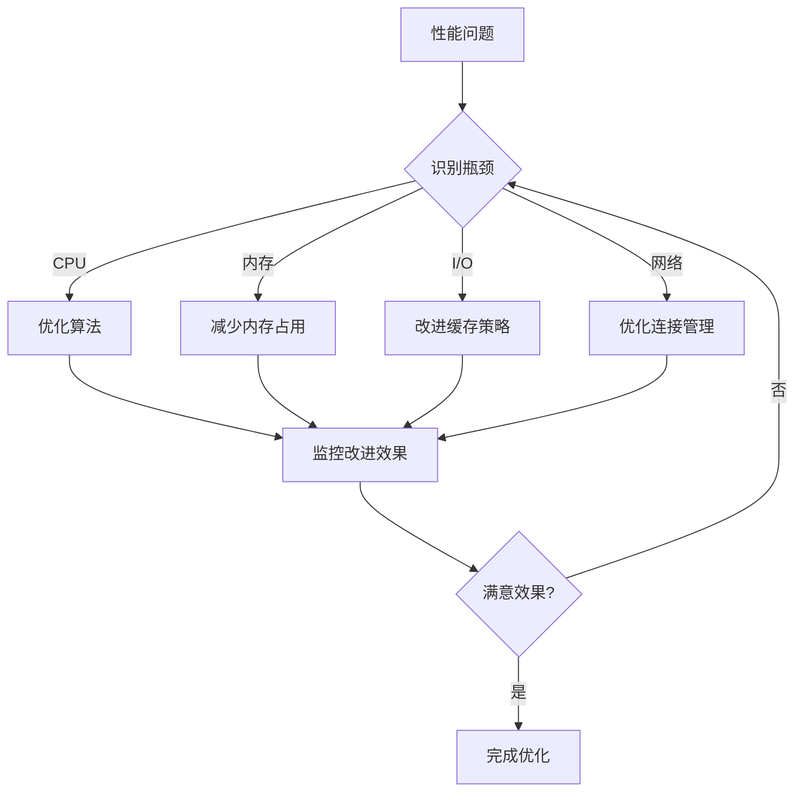

**图表来源**
- [research_agent.py](file://src/agents/research_agent.py#L500-L570)

### 监控和日志

研究代理提供了全面的监控和日志功能：

#### 关键指标监控
- **生成速率**：每小时生成的想法数量
- **成功率**：有效想法的比例
- **响应时间**：各组件的平均响应时间
- **错误率**：各类错误的发生频率

#### 日志级别管理
系统支持多种日志级别，便于不同场景下的调试和监控：

| 日志级别 | 使用场景 | 记录内容 |
|----------|----------|----------|
| DEBUG | 开发调试 | 详细的执行流程 |
| INFO | 正常运行 | 关键操作和状态变更 |
| WARNING | 潜在问题 | 可恢复的异常情况 |
| ERROR | 错误处理 | 致命错误和异常 |
| CRITICAL | 系统故障 | 导致系统停机的问题 |

**章节来源**
- [research_agent.py](file://src/agents/research_agent.py#L1-L100)

## 结论

RBI工作流程的研究阶段通过精心设计的架构和完善的机制，实现了高效、可靠、智能的交易策略生成。研究代理作为核心协调者，不仅整合了多种数据源和分析方法，还建立了严格的质量控制体系，确保生成的策略既具有创新性又具备可行性。

该系统的主要优势包括：
- **模块化设计**：各组件职责明确，易于维护和扩展
- **智能协调**：自动化的任务调度和资源分配
- **质量保证**：多层次的质量控制和重复检测
- **容错能力**：完善的错误处理和恢复机制
- **性能优化**：并发处理和资源管理优化

通过持续的迭代和优化，这个研究阶段将继续为RBI系统提供高质量的策略想法，推动整个自动化交易策略开发流程的效率和效果。