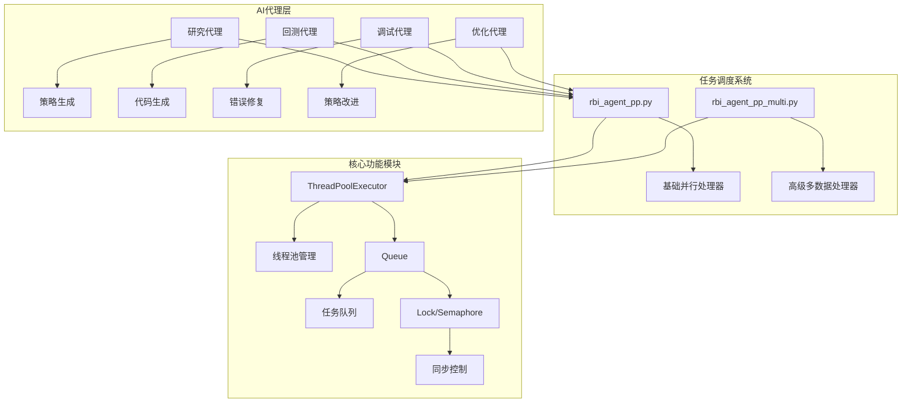
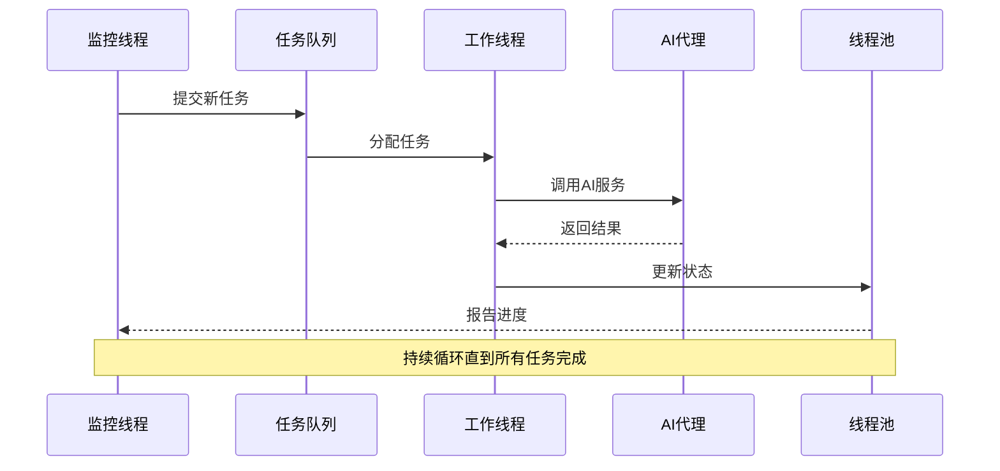
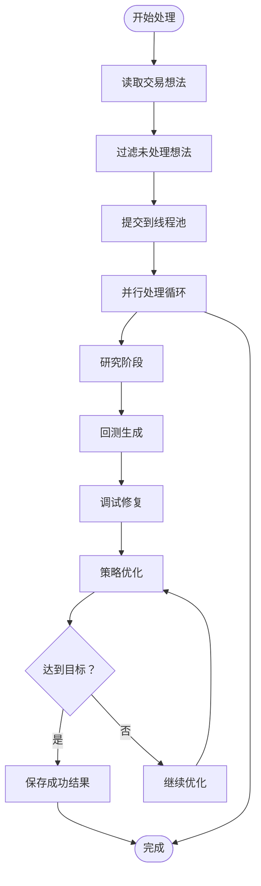
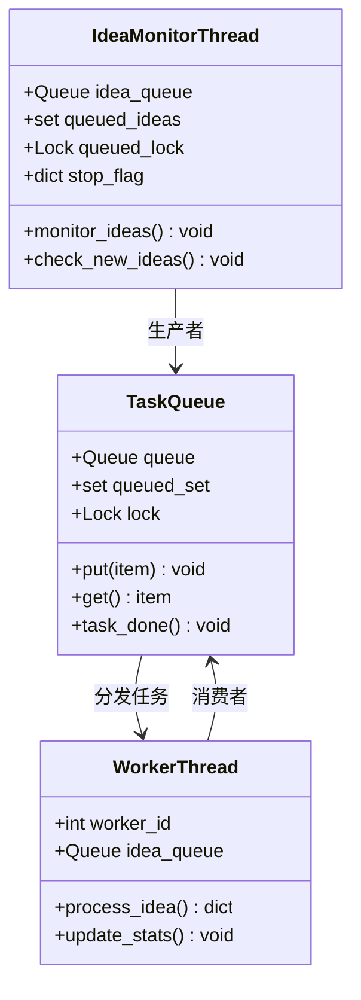
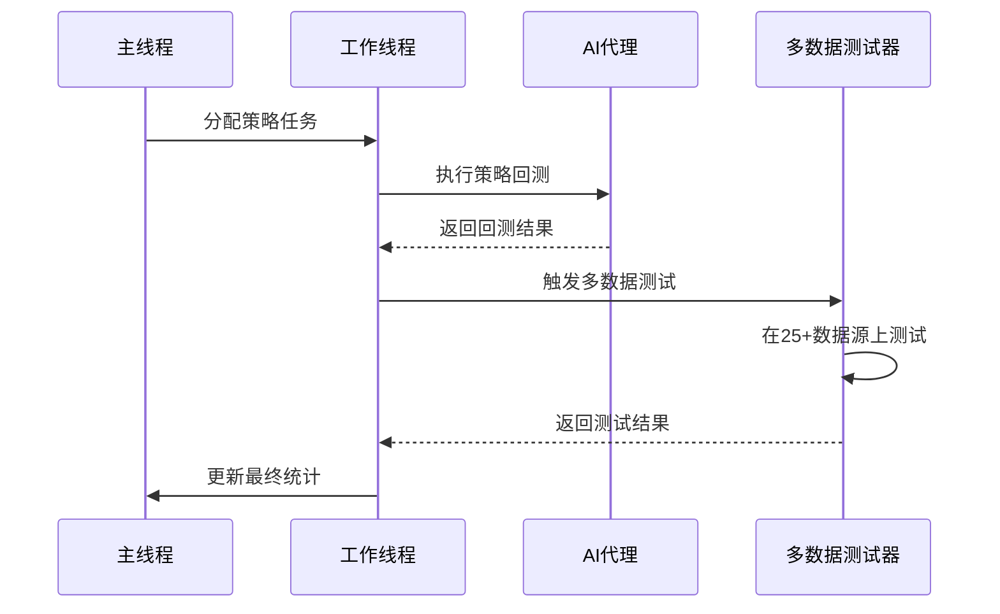
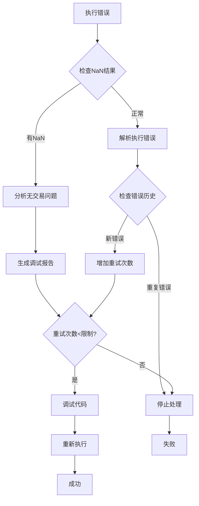
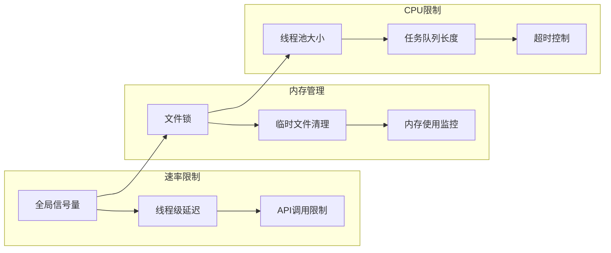
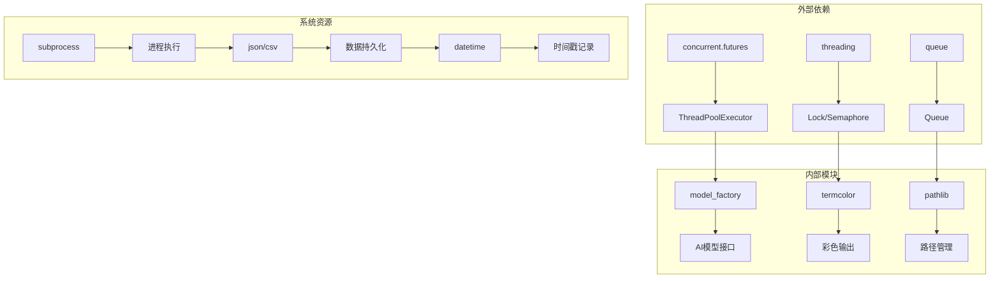

# 任务调度机制

<cite>
**本文档中引用的文件**
- [rbi_agent_pp.py](file://src/agents/rbi_agent_pp.py)
- [rbi_agent_pp_multi.py](file://src/agents/rbi_agent_pp_multi.py)
- [config.py](file://src/config.py)
- [load-balancer.md](file://src/data/rbi/.claude/agents/optimization/load-balancer.md)
</cite>

## 目录
1. [简介](#简介)
2. [项目结构概览](#项目结构概览)
3. [核心组件分析](#核心组件分析)
4. [架构概览](#架构概览)
5. [详细组件分析](#详细组件分析)
6. [依赖关系分析](#依赖关系分析)
7. [性能考虑](#性能考虑)
8. [故障排除指南](#故障排除指南)
9. [结论](#结论)

## 简介

Moon Dev的RBI AI系统实现了先进的任务调度机制，通过线程池管理和多AI代理并行执行来加速交易策略的开发和测试过程。该系统的核心特色包括：

- **并行处理能力**：支持最多18个并发线程同时处理不同的交易想法
- **智能任务队列**：采用生产者-消费者模式的动态任务分发
- **负载均衡机制**：基于工作窃取算法的动态资源分配
- **实时监控系统**：全面的任务状态跟踪和性能指标收集
- **容错处理**：完善的错误恢复和重试机制

## 项目结构概览

**图表来源**
- [rbi_agent_pp.py](file://src/agents/rbi_agent_pp.py#L1-L50)
- [rbi_agent_pp_multi.py](file://src/agents/rbi_agent_pp_multi.py#L1-L50)

**章节来源**
- [rbi_agent_pp.py](file://src/agents/rbi_agent_pp.py#L1-L100)
- [rbi_agent_pp_multi.py](file://src/agents/rbi_agent_pp_multi.py#L1-L100)

## 核心组件分析

### 线程池管理器

系统使用Python的`ThreadPoolExecutor`来管理并行任务执行，提供了以下关键特性：

- **动态线程数量**：最大支持18个并发线程（可配置）
- **任务提交机制**：通过`submit()`方法异步提交任务
- **完成检测**：使用`as_completed()`监控任务完成状态

### 任务队列系统

采用生产者-消费者模式实现动态任务分发：

- **队列类型**：使用Python标准库的`Queue`类
- **去重机制**：通过哈希值确保相同任务不重复处理
- **线程安全**：配合锁机制保证并发访问安全

### 同步控制机制

系统实现了多层次的同步控制：

- **全局锁**：保护共享资源访问
- **信号量**：控制API调用频率
- **互斥锁**：确保文件操作原子性

**章节来源**
- [rbi_agent_pp.py](file://src/agents/rbi_agent_pp.py#L47-L60)
- [rbi_agent_pp_multi.py](file://src/agents/rbi_agent_pp_multi.py#L57-L70)

## 架构概览

**图表来源**
- [rbi_agent_pp_multi.py](file://src/agents/rbi_agent_pp_multi.py#L1201-L1300)
- [rbi_agent_pp_multi.py](file://src/agents/rbi_agent_pp_multi.py#L1301-L1400)

## 详细组件分析

### 基础并行处理器 (rbi_agent_pp.py)

#### 主要特点
- **固定线程数**：最多5个并发线程
- **顺序处理**：按批次提交任务
- **简单监控**：通过控制台输出跟踪进度

#### 任务流程

**图表来源**
- [rbi_agent_pp.py](file://src/agents/rbi_agent_pp.py#L1200-L1314)

#### 关键配置参数
| 参数 | 默认值 | 描述 |
|------|--------|------|
| MAX_PARALLEL_THREADS | 5 | 最大并发线程数 |
| RATE_LIMIT_DELAY | 2秒 | 单线程API调用间隔 |
| RATE_LIMIT_GLOBAL_DELAY | 0.5秒 | 全局API调用间隔 |
| TARGET_RETURN | 50% | 目标收益率阈值 |

**章节来源**
- [rbi_agent_pp.py](file://src/agents/rbi_agent_pp.py#L61-L80)

### 高级多数据处理器 (rbi_agent_pp_multi.py)

#### 核心增强功能
- **连续队列模式**：持续监控输入源并动态添加任务
- **多数据源测试**：自动在25+数据源上验证策略
- **日期自适应**：自动更新每日目录结构
- **策略文件读取**：支持从文件夹批量读取策略

#### 连续队列架构

**图表来源**
- [rbi_agent_pp_multi.py](file://src/agents/rbi_agent_pp_multi.py#L1301-L1400)
- [rbi_agent_pp_multi.py](file://src/agents/rbi_agent_pp_multi.py#L1401-L1500)

#### 多数据测试流程

**图表来源**
- [rbi_agent_pp_multi.py](file://src/agents/rbi_agent_pp_multi.py#L800-L900)

**章节来源**
- [rbi_agent_pp_multi.py](file://src/agents/rbi_agent_pp_multi.py#L1600-L1708)

### AI代理系统

#### 代理职责分工
| 代理类型 | 功能描述 | 输出格式 |
|----------|----------|----------|
| 研究代理 | 分析交易想法并生成策略描述 | 文本文件 |
| 回测代理 | 创建Python回测代码 | .py文件 |
| 包装检查代理 | 确保正确使用指标包 | .py文件 |
| 调试代理 | 修复技术错误 | .py文件 |
| 优化代理 | 改进策略以达到目标收益 | .py文件 |

#### 错误处理机制

**图表来源**
- [rbi_agent_pp.py](file://src/agents/rbi_agent_pp.py#L1000-L1100)

**章节来源**
- [rbi_agent_pp.py](file://src/agents/rbi_agent_pp.py#L800-L1000)
- [rbi_agent_pp_multi.py](file://src/agents/rbi_agent_pp_multi.py#L1000-L1200)

### 负载均衡与资源管理

#### 工作窃取算法实现
系统采用类似操作系统CFS（完全公平调度器）的思想：

- **虚拟运行时间**：每个任务维护虚拟执行时间
- **权重分配**：根据任务重要性分配不同权重
- **动态调整**：根据系统负载动态调整调度策略

#### 资源限制机制

**图表来源**
- [load-balancer.md](file://src/data/rbi/.claude/agents/optimization/load-balancer.md#L250-L294)

**章节来源**
- [load-balancer.md](file://src/data/rbi/.claude/agents/optimization/load-balancer.md#L88-L145)

## 依赖关系分析

### 核心依赖图

**图表来源**
- [rbi_agent_pp.py](file://src/agents/rbi_agent_pp.py#L1-L50)
- [rbi_agent_pp_multi.py](file://src/agents/rbi_agent_pp_multi.py#L1-L50)

### 模块间交互
| 模块 | 依赖项 | 交互方式 |
|------|--------|----------|
| rbi_agent_pp | ThreadPoolExecutor | 异步任务提交 |
| rbi_agent_pp_multi | Queue + Thread | 生产者-消费者模式 |
| AI代理 | rate_limited_api_call | 受限API调用 |
| 文件系统 | Lock | 线程安全写入 |

**章节来源**
- [rbi_agent_pp.py](file://src/agents/rbi_agent_pp.py#L1-L100)
- [rbi_agent_pp_multi.py](file://src/agents/rbi_agent_pp_multi.py#L1-L100)

## 性能考虑

### 并发性能优化
- **线程池大小调优**：根据CPU核心数和I/O等待时间确定最佳线程数
- **任务粒度平衡**：避免过小的任务导致调度开销过大
- **内存使用优化**：及时释放不需要的中间结果

### 网络性能优化
- **API调用合并**：减少网络往返次数
- **连接复用**：保持HTTP连接活跃
- **请求去重**：避免重复的相似请求

### 存储性能优化
- **批量写入**：减少磁盘I/O次数
- **异步IO**：非阻塞文件操作
- **缓存策略**：缓存频繁访问的数据

## 故障排除指南

### 常见问题及解决方案

#### 线程死锁问题
**症状**：程序卡住不动，所有线程都处于等待状态
**原因**：锁获取顺序不一致或锁持有时间过长
**解决方案**：
- 统一锁获取顺序
- 缩短锁持有时间
- 使用超时机制

#### 内存泄漏问题
**症状**：长时间运行后内存使用持续增长
**原因**：未正确释放资源或对象引用循环
**解决方案**：
- 使用上下文管理器
- 及时清理临时文件
- 监控对象引用计数

#### API限流问题
**症状**：出现大量429错误响应
**原因**：超出API调用频率限制
**解决方案**：
- 调整速率限制参数
- 实现指数退避算法
- 使用多个API密钥轮换

**章节来源**
- [rbi_agent_pp.py](file://src/agents/rbi_agent_pp.py#L1100-L1200)
- [rbi_agent_pp_multi.py](file://src/agents/rbi_agent_pp_multi.py#L1100-L1200)

## 结论

Moon Dev的RBI AI任务调度系统展现了现代并发编程的最佳实践，通过以下关键设计实现了高效的并行处理：

### 核心优势
1. **灵活的架构设计**：支持多种部署模式和配置选项
2. **强大的容错能力**：完善的错误处理和恢复机制
3. **优秀的资源管理**：智能的负载均衡和资源限制
4. **实时监控能力**：全面的状态跟踪和性能指标

### 应用场景
- **高频交易策略开发**：快速迭代和测试多个策略想法
- **量化研究平台**：大规模回测和数据分析
- **算法优化系统**：自动化策略改进和参数优化

### 发展方向
- **分布式扩展**：支持跨节点的任务分发
- **智能调度**：基于机器学习的动态负载预测
- **云原生支持**：容器化部署和弹性扩缩容

该系统为AI驱动的量化交易提供了坚实的技术基础，其设计理念和实现方案对其他类似的并发系统具有重要的参考价值。