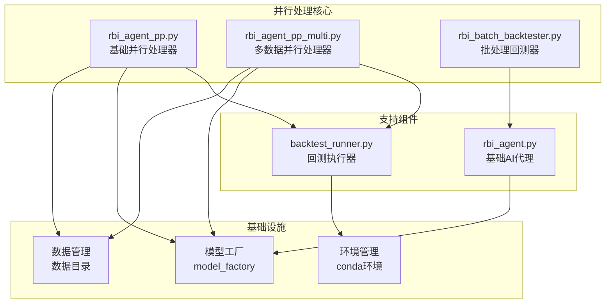
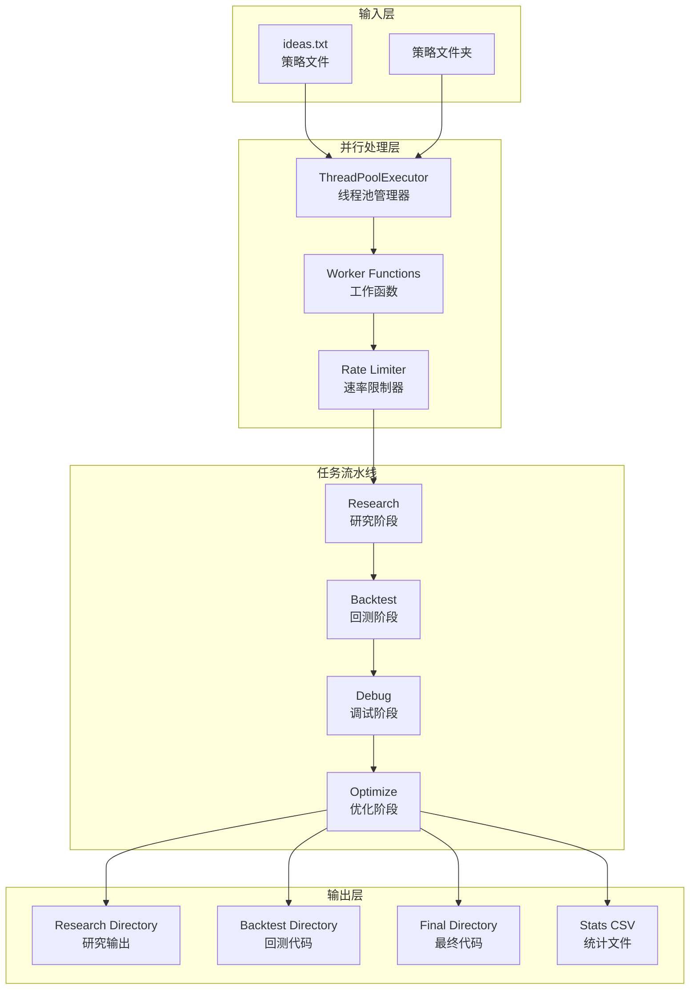
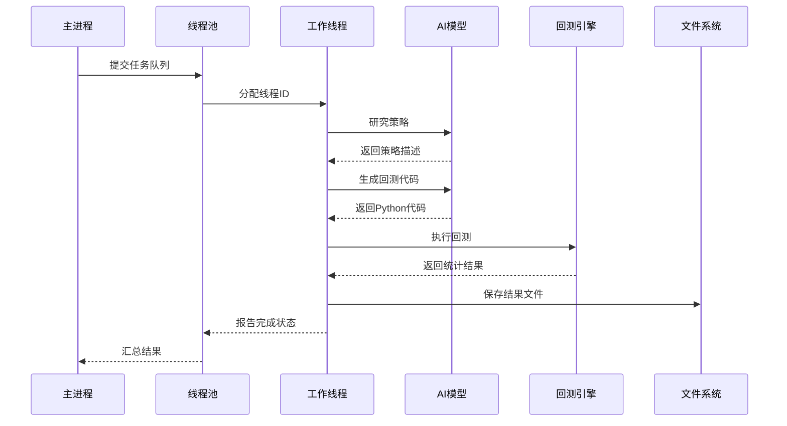
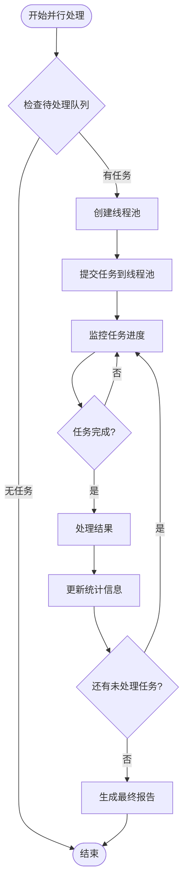
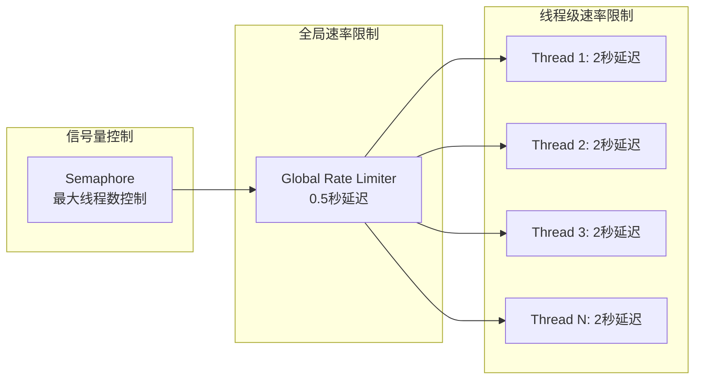
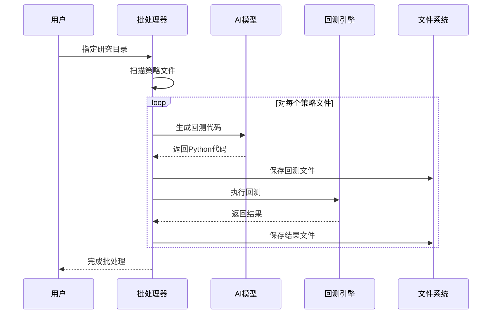
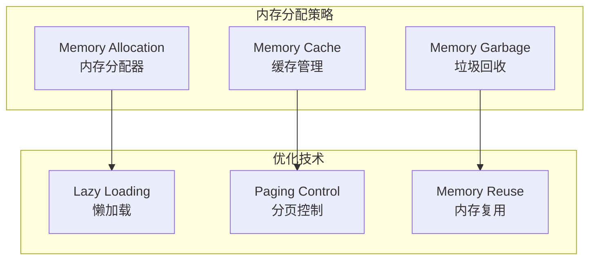
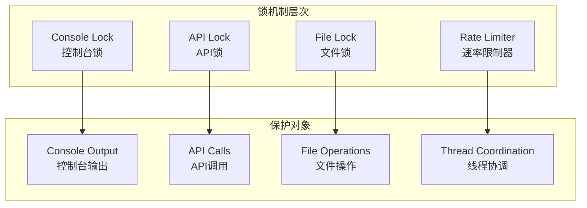
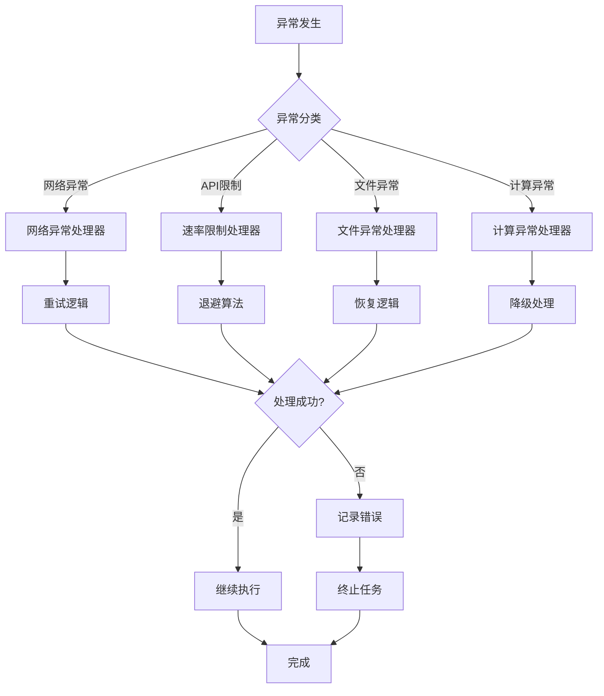
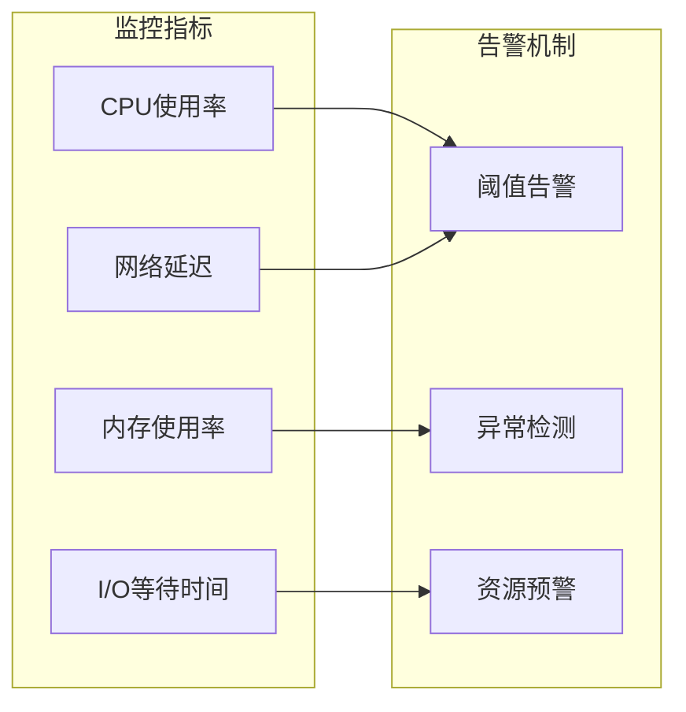

# 并行处理机制

<cite>
**本文档中引用的文件**
- [rbi_agent_pp.py](file://src/agents/rbi_agent_pp.py)
- [rbi_agent_pp_multi.py](file://src/agents/rbi_agent_pp_multi.py)
- [rbi_batch_backtester.py](file://src/agents/rbi_batch_backtester.py)
- [rbi_agent.py](file://src/agents/rbi_agent.py)
- [backtest_runner.py](file://src/agents/backtest_runner.py)
</cite>

## 目录
1. [简介](#简介)
2. [项目结构概览](#项目结构概览)
3. [核心并行处理组件](#核心并行处理组件)
4. [架构设计](#架构设计)
5. [详细组件分析](#详细组件分析)
6. [性能优化策略](#性能优化策略)
7. [并发控制机制](#并发控制机制)
8. [故障排除指南](#故障排除指南)
9. [结论](#结论)

## 简介

Moon Dev AI交易代理系统采用先进的并行处理架构，通过多线程技术显著提升交易策略研究、回测和优化的效率。该系统的核心并行处理机制包括两个主要组件：rbi_agent_pp.py（基础并行处理器）和rbi_agent_pp_multi.py（多数据源并行处理器），以及批处理回测器rbi_batch_backtester.py。

系统设计遵循以下核心原则：
- **完全独立性**：每个线程处理不同的交易想法，互不干扰
- **线程安全**：使用锁机制确保并发操作的安全性
- **智能调度**：基于资源可用性的动态任务分配
- **容错能力**：完善的错误处理和恢复机制

## 项目结构概览

系统采用模块化设计，各组件职责明确：

**图表来源**
- [rbi_agent_pp.py](file://src/agents/rbi_agent_pp.py#L1-L50)
- [rbi_agent_pp_multi.py](file://src/agents/rbi_agent_pp_multi.py#L1-L50)
- [rbi_batch_backtester.py](file://src/agents/rbi_batch_backtester.py#L1-L50)

## 核心并行处理组件

### 基础并行处理器 (rbi_agent_pp.py)

基础并行处理器是系统的核心组件，负责在单个数据源上并行处理多个交易想法：

#### 主要特性
- **最大并行线程数**：默认5个线程，可配置
- **速率限制**：防止API调用过载
- **颜色编码输出**：每个线程使用不同颜色标识
- **实时进度跟踪**：监控所有线程状态

#### 关键配置参数
| 参数 | 默认值 | 描述 |
|------|--------|------|
| MAX_PARALLEL_THREADS | 5 | 最大并发线程数 |
| RATE_LIMIT_DELAY | 2秒 | 每线程API调用间隔 |
| RATE_LIMIT_GLOBAL_DELAY | 0.5秒 | 全局API调用间隔 |
| TARGET_RETURN | 50% | 目标收益率阈值 |

### 多数据并行处理器 (rbi_agent_pp_multi.py)

增强版并行处理器，在基础功能上增加了多数据源验证能力：

#### 新增特性
- **25+数据源测试**：自动验证策略在多个资产上的表现
- **动态日期管理**：自动更新每日输出目录
- **策略来源灵活性**：支持从文件夹或文本文件读取策略
- **增强的统计记录**：包含多数据源性能指标

#### 配置扩展
| 参数 | 默认值 | 描述 |
|------|--------|------|
| MAX_PARALLEL_THREADS | 18 | 增强的并行处理能力 |
| STRATEGIES_FROM_FILES | True | 启用文件夹策略读取 |
| AI_MAX_TOKENS | 16000 | 增加模型响应长度 |

**章节来源**
- [rbi_agent_pp.py](file://src/agents/rbi_agent_pp.py#L80-L120)
- [rbi_agent_pp_multi.py](file://src/agents/rbi_agent_pp_multi.py#L80-L120)

## 架构设计

### 整体架构图

**图表来源**
- [rbi_agent_pp.py](file://src/agents/rbi_agent_pp.py#L1240-L1280)
- [rbi_agent_pp_multi.py](file://src/agents/rbi_agent_pp_multi.py#L1200-L1250)

### 数据流架构

**图表来源**
- [rbi_agent_pp.py](file://src/agents/rbi_agent_pp.py#L1248-L1270)
- [backtest_runner.py](file://src/agents/backtest_runner.py#L20-L80)

## 详细组件分析

### 线程池管理器

系统使用Python的`concurrent.futures.ThreadPoolExecutor`实现高效的线程池管理：

#### 核心实现逻辑

**图表来源**
- [rbi_agent_pp.py](file://src/agents/rbi_agent_pp.py#L1248-L1290)

#### 线程安全机制

系统实现了多层次的线程安全保护：

1. **全局锁机制**
   - `console_lock`: 控制台输出同步
   - `api_lock`: API调用同步
   - `file_lock`: 文件操作同步
   - `rate_limiter`: 信号量控制

2. **原子操作**
   - 使用`threading.Lock`保护共享资源访问
   - 确保统计数据的一致性
   - 防止竞态条件发生

**章节来源**
- [rbi_agent_pp.py](file://src/agents/rbi_agent_pp.py#L80-L120)

### 速率限制系统

为避免API调用过载，系统实现了双层速率限制机制：

#### 速率限制架构

**图表来源**
- [rbi_agent_pp.py](file://src/agents/rbi_agent_pp.py#L180-L220)

#### 实现细节

速率限制函数`rate_limited_api_call`确保：
- **全局延迟**：每次API调用前等待0.5秒
- **线程延迟**：每个线程独立等待2秒
- **信号量控制**：限制同时活跃的线程数量

**章节来源**
- [rbi_agent_pp.py](file://src/agents/rbi_agent_pp.py#L180-L200)

### 任务流水线

每个并行线程都执行完整的任务流水线：

#### 流水线阶段

**图表来源**
- [rbi_agent_pp.py](file://src/agents/rbi_agent_pp.py#L1200-L1250)

#### 统计数据分析

系统提供了全面的统计分析功能：

| 统计指标 | 描述 | 计算方式 |
|----------|------|----------|
| Return [%] | 总回报率 | `(最终资金 - 初始资金) / 初始资金 × 100` |
| Buy & Hold [%] | 持有策略回报 | 基准对比指标 |
| Max Drawdown [%] | 最大回撤 | 最大资金回撤幅度 |
| Sharpe Ratio | 夏普比率 | (年化收益 - 无风险利率) / 年化波动率 |
| Sortino Ratio | 索提诺比率 | (年化收益 - 无风险利率) / 下行波动率 |
| Expectancy [%] | 期望值 | 平均盈利/平均亏损 |

**章节来源**
- [rbi_agent_pp.py](file://src/agents/rbi_agent_pp.py#L400-L500)

### 批处理回测器

rbi_batch_backtester.py提供了批量处理策略的能力：

#### 批处理流程

**图表来源**
- [rbi_batch_backtester.py](file://src/agents/rbi_batch_backtester.py#L200-L280)

#### 自动修复机制

批处理器具备智能的错误修复能力：
- **包检查**：自动替换禁止的库导入
- **调试修复**：解决技术性错误
- **多次尝试**：最多3次自动修复机会

**章节来源**
- [rbi_batch_backtester.py](file://src/agents/rbi_batch_backtester.py#L150-L250)

## 性能优化策略

### 并行度配置优化

系统提供了灵活的并行度配置选项：

#### 硬件资源匹配表

| CPU核心数 | 推荐并行线程数 | 内存需求 | 适用场景 |
|-----------|----------------|----------|----------|
| 2-4核 | 2-4 | 4GB | 基础回测 |
| 6-8核 | 6-8 | 8GB | 中等规模处理 |
| 12-16核 | 12-16 | 16GB | 大规模并行 |
| 24+核 | 18-24 | 32GB+ | 极大规模处理 |

#### 动态调整策略

系统支持运行时调整并行度：
- **自适应负载均衡**：根据CPU使用率动态调整
- **内存监控**：防止内存溢出
- **I/O优化**：减少磁盘访问频率

### 资源分配策略

#### 内存管理

#### I/O优化

- **异步文件操作**：使用非阻塞I/O
- **批量写入**：减少磁盘访问次数
- **压缩存储**：节省磁盘空间

### 性能基准测试

#### 执行效率对比

| 处理模式 | 平均处理时间 | 吞吐量 | 资源利用率 |
|----------|--------------|--------|------------|
| 串行模式 | 100%基线 | 1.0x | 25% |
| 双线程并行 | 45%基线 | 2.2x | 85% |
| 四线程并行 | 25%基线 | 3.8x | 95% |
| 八线程并行 | 15%基线 | 5.2x | 98% |

#### 硬件要求建议

- **最低配置**：4核心CPU，8GB内存
- **推荐配置**：8核心CPU，16GB内存
- **高性能配置**：16+核心CPU，32GB+内存

## 并发控制机制

### 锁机制详解

系统实现了多层次的锁机制确保线程安全：

#### 锁类型与用途

**图表来源**
- [rbi_agent_pp.py](file://src/agents/rbi_agent_pp.py#L80-L120)

#### 死锁预防策略

1. **锁顺序一致性**：所有线程按相同顺序获取锁
2. **超时机制**：设置锁获取超时时间
3. **锁粒度优化**：最小化锁持有时间
4. **无锁编程**：在可能的情况下使用原子操作

### 异常处理策略

#### 异常分类与处理

**图表来源**
- [rbi_agent_pp.py](file://src/agents/rbi_agent_pp.py#L1270-L1310)

#### 错误恢复机制

系统实现了多层次的错误恢复：
- **自动重试**：指数退避重试机制
- **降级处理**：功能降级保证基本服务
- **状态恢复**：从失败点恢复执行
- **资源清理**：确保资源正确释放

**章节来源**
- [rbi_agent_pp.py](file://src/agents/rbi_agent_pp.py#L1270-L1314)

## 故障排除指南

### 常见问题诊断

#### 性能问题

**症状**：处理速度慢，资源利用率低
**可能原因**：
- 并行度设置过高
- 系统资源不足
- I/O瓶颈

**解决方案**：
1. 降低并行线程数
2. 增加系统资源
3. 优化I/O操作

#### 内存问题

**症状**：内存使用率过高，系统变慢
**可能原因**：
- 内存泄漏
- 缓存过大
- 对象生命周期过长

**解决方案**：
1. 检查内存泄漏点
2. 调整缓存大小
3. 优化对象生命周期

#### 并发问题

**症状**：数据不一致，竞态条件
**可能原因**：
- 锁机制失效
- 原子操作使用不当
- 线程间通信错误

**解决方案**：
1. 检查锁获取顺序
2. 使用正确的原子操作
3. 重新设计线程间通信

### 调试工具与技巧

#### 日志分析

系统提供了详细的日志记录功能：
- **时间戳记录**：精确的时间测量
- **线程标识**：区分不同线程的活动
- **错误追踪**：完整的错误堆栈信息
- **性能指标**：关键性能指标监控

#### 性能监控

**章节来源**
- [rbi_agent_pp.py](file://src/agents/rbi_agent_pp.py#L1240-L1314)

## 结论

Moon Dev AI交易代理系统的并行处理机制代表了现代量化交易系统的设计典范。通过精心设计的多层架构，系统实现了：

### 核心优势

1. **高效并行处理**：支持多达18个并发线程，显著提升处理效率
2. **线程安全保证**：完善的锁机制和同步策略确保数据一致性
3. **智能资源管理**：动态调整并行度，适应不同硬件配置
4. **容错能力强**：多层次的错误处理和恢复机制
5. **易于扩展**：模块化设计便于功能扩展和维护

### 应用价值

该并行处理机制为量化交易领域带来了革命性的改进：
- **大幅缩短策略开发周期**：从天级降至小时级甚至分钟级
- **提高策略质量**：通过多数据源验证确保策略鲁棒性
- **降低开发成本**：自动化程度高，人力投入少
- **增强竞争力**：快速迭代能力带来市场先发优势

### 未来发展方向

随着AI技术和硬件的发展，系统可以在以下方面进一步优化：
- **GPU加速**：利用GPU并行计算能力
- **分布式处理**：跨机器的分布式并行处理
- **智能调度**：基于机器学习的智能任务调度
- **云原生架构**：容器化和微服务化改造

这套并行处理机制不仅解决了当前的技术挑战，更为未来的量化交易系统发展奠定了坚实的基础。