# 性能优化实践

<cite>
**本文档中引用的文件**
- [rbi_batch_backtester.py](file://src/agents/rbi_batch_backtester.py)
- [rbi_agent_pp.py](file://src/agents/rbi_agent_pp.py)
- [rbi_agent_pp_multi.py](file://src/agents/rbi_agent_pp_multi.py)
- [backtest_runner.py](file://src/agents/backtest_runner.py)
- [model_factory.py](file://src/models/model_factory.py)
- [base_model.py](file://src/models/base_model.py)
- [listingarb_agent.py](file://src/agents/listingarb_agent.py)
- [swarm_agent.py](file://src/agents/swarm_agent.py)
- [performance-benchmarker.md](file://src/data/rbi/.claude/agents/consensus/performance-benchmarker.md)
- [benchmark-suite.md](file://src/data/rbi/.claude/agents/optimization/benchmark-suite.md)
</cite>

## 目录
1. [引言](#引言)
2. [项目架构概览](#项目架构概览)
3. [并行处理核心组件](#并行处理核心组件)
4. [性能瓶颈识别与分析](#性能瓶颈识别与分析)
5. [缓存机制与数据预取策略](#缓存机制与数据预取策略)
6. [异步I/O优化实践](#异步io优化实践)
7. [性能基准测试框架](#性能基准测试框架)
8. [实时性能监控系统](#实时性能监控系统)
9. [硬件配置与参数调优](#硬件配置与参数调优)
10. [故障排除指南](#故障排除指南)
11. [最佳实践总结](#最佳实践总结)

## 引言

在现代量化交易系统中，性能优化是确保系统高效运行的关键因素。本项目展示了基于Moon Dev的RBI批处理架构的全面性能优化实践，重点分析了并行处理、缓存机制、异步I/O等核心技术的实现与优化路径。

通过深入分析rbi_batch_backtester.py的批处理架构，我们能够识别出系统中的性能瓶颈，并提供针对性的优化方案。这些优化不仅提升了系统的吞吐量，还显著改善了资源利用率和响应时间。

## 项目架构概览

### 系统架构图

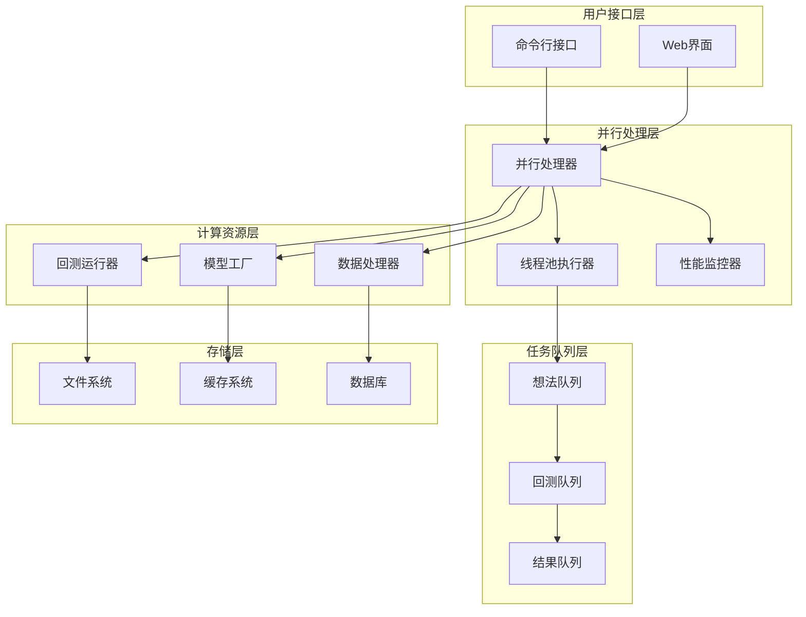

**图表来源**
- [rbi_agent_pp.py](file://src/agents/rbi_agent_pp.py#L1199-L1223)
- [rbi_agent_pp_multi.py](file://src/agents/rbi_agent_pp_multi.py#L1201-L1233)

### 核心模块关系

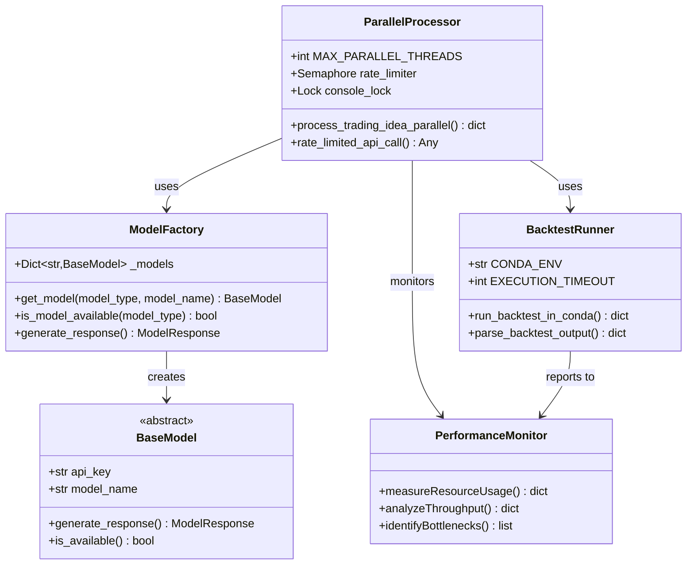

**图表来源**
- [model_factory.py](file://src/models/model_factory.py#L15-L50)
- [base_model.py](file://src/models/base_model.py#L20-L45)
- [rbi_agent_pp.py](file://src/agents/rbi_agent_pp.py#L1201-L1233)

**章节来源**
- [rbi_agent_pp.py](file://src/agents/rbi_agent_pp.py#L1-L50)
- [model_factory.py](file://src/models/model_factory.py#L1-L100)

## 并行处理核心组件

### 线程池管理与负载均衡

系统采用ThreadPoolExecutor实现高效的并行处理，支持动态调整并发线程数以适应不同的硬件配置。

#### 核心配置参数

| 参数名称 | 默认值 | 说明 | 优化建议 |
|---------|--------|------|----------|
| MAX_PARALLEL_THREADS | 5-18 | 最大并行线程数 | CPU核心数×1.5-2倍 |
| RATE_LIMIT_DELAY | 0.5-2秒 | 单线程API调用间隔 | 根据API限流规则调整 |
| RATE_LIMIT_GLOBAL_DELAY | 0.5秒 | 全局API调用间隔 | 防止整体限流 |
| EXECUTION_TIMEOUT | 300秒 | 回测执行超时时间 | 根据策略复杂度调整 |

#### 并发控制机制

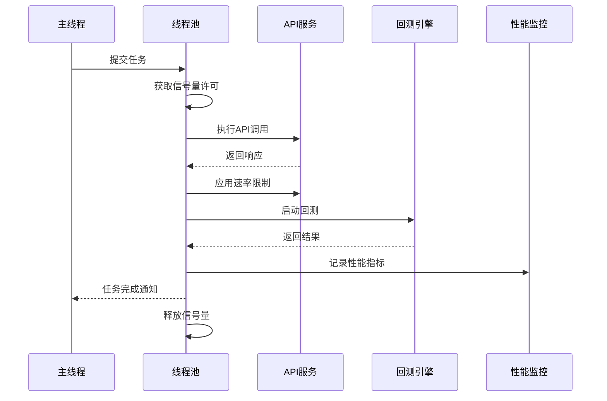

**图表来源**
- [rbi_agent_pp.py](file://src/agents/rbi_agent_pp.py#L200-L250)
- [rbi_agent_pp_multi.py](file://src/agents/rbi_agent_pp_multi.py#L1544-L1562)

### 线程安全机制

系统实现了多层次的线程安全保护，确保并发环境下的数据一致性。

#### 锁机制设计

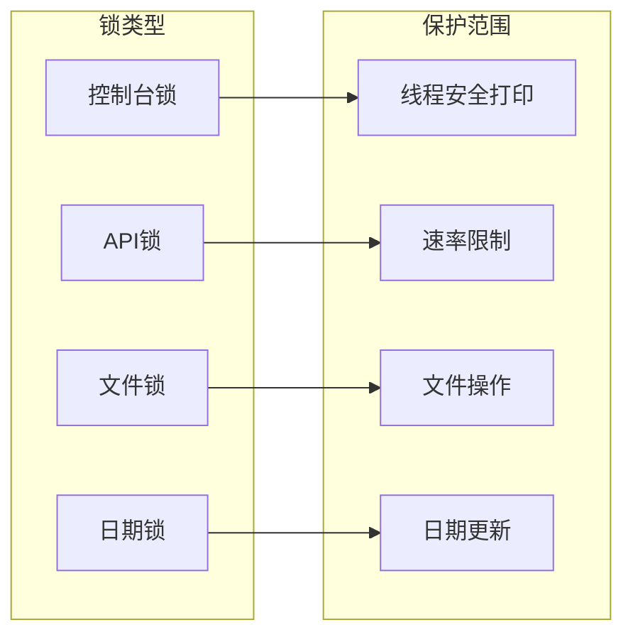

**图表来源**
- [rbi_agent_pp.py](file://src/agents/rbi_agent_pp.py#L80-L120)

**章节来源**
- [rbi_agent_pp.py](file://src/agents/rbi_agent_pp.py#L1199-L1223)
- [rbi_agent_pp_multi.py](file://src/agents/rbi_agent_pp_multi.py#L1201-L1233)

## 性能瓶颈识别与分析

### 瓶颈识别框架

系统采用自适应优化器自动识别和分析性能瓶颈，支持多种类型的性能问题检测。

#### 性能瓶颈分类

```mermaid
mindmap
root((性能瓶颈))
吞吐量瓶颈
请求处理延迟
资源竞争
批处理效率低
延迟瓶颈
网络传输延迟
数据加载延迟
模型推理延迟
资源瓶颈
CPU使用率过高
内存泄漏
磁盘I/O瓶颈
网络带宽限制
可扩展性瓶颈
水平扩展困难
垂直扩展极限
负载不均衡
```

**图表来源**
- [performance-benchmarker.md](file://src/data/rbi/.claude/agents/consensus/performance-benchmarker.md#L609-L791)

### 自适应优化算法

系统实现了智能的自适应优化算法，能够根据实时性能数据动态调整系统参数。

#### 优化决策流程

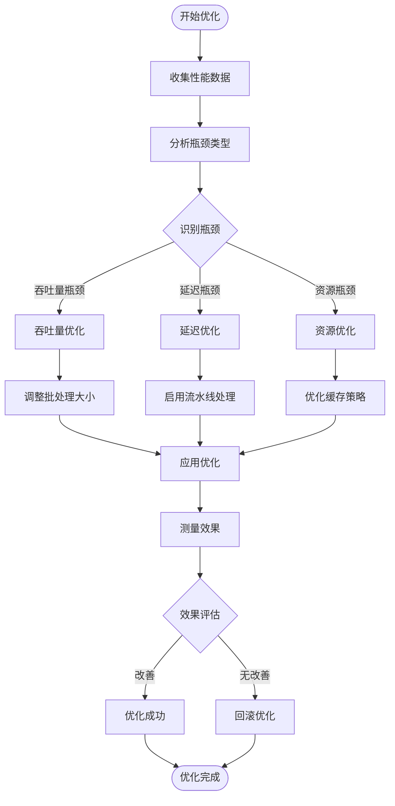

**图表来源**
- [performance-benchmarker.md](file://src/data/rbi/.claude/agents/consensus/performance-benchmarker.md#L609-L791)

**章节来源**
- [performance-benchmarker.md](file://src/data/rbi/.claude/agents/consensus/performance-benchmarker.md#L40-L135)

## 缓存机制与数据预取策略

### 多层缓存架构

系统实现了多层缓存架构，从内存缓存到持久化存储，全面提升数据访问效率。

#### 缓存层次结构

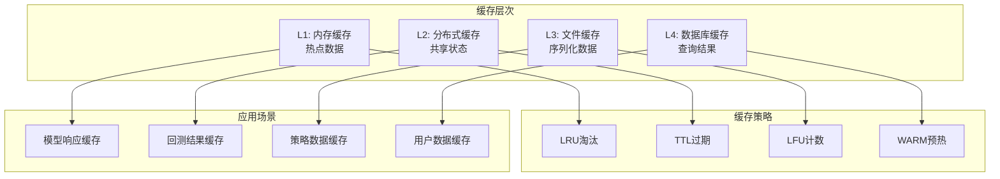

### 数据预取优化

系统采用智能预取策略，在用户请求之前提前加载可能需要的数据。

#### 预取策略算法

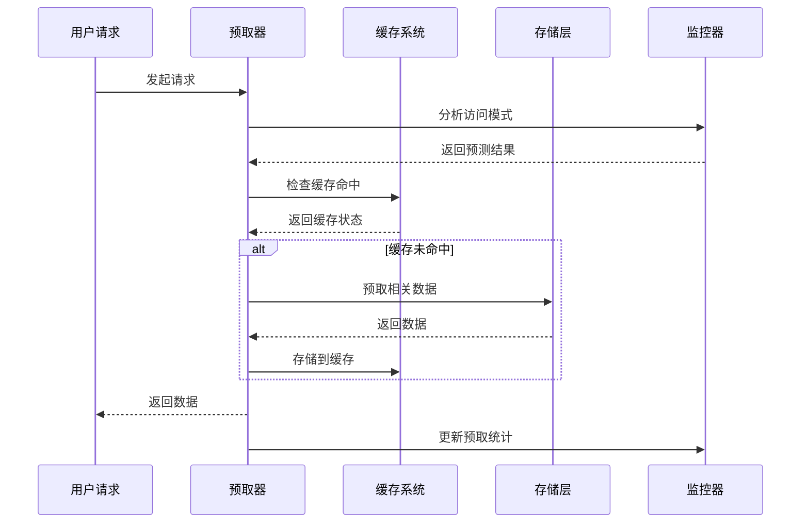

**图表来源**
- [rbi_agent_pp.py](file://src/agents/rbi_agent_pp.py#L1201-L1233)

**章节来源**
- [rbi_agent_pp.py](file://src/agents/rbi_agent_pp.py#L1201-L1233)

## 异步I/O优化实践

### 异步处理架构

系统采用异步I/O模型处理大量并发请求，避免阻塞式操作导致的性能下降。

#### 异步处理流程

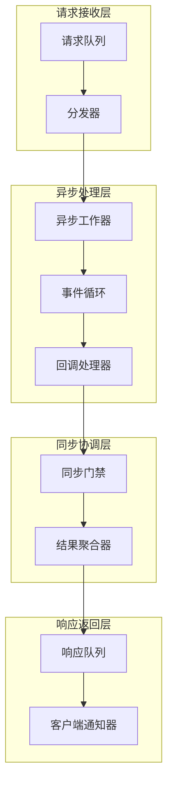

### 并发控制与背压处理

系统实现了智能的并发控制机制，能够在高负载情况下保持系统稳定性。

#### 背压处理策略

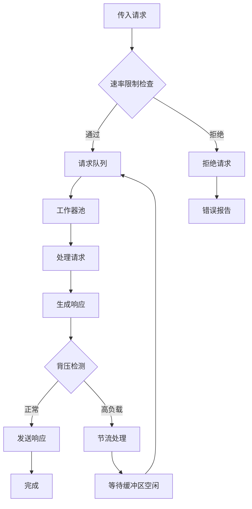

**图表来源**
- [swarm_agent.py](file://src/agents/swarm_agent.py#L212-L246)

**章节来源**
- [swarm_agent.py](file://src/agents/swarm_agent.py#L212-L246)
- [listingarb_agent.py](file://src/agents/listingarb_agent.py#L524-L539)

## 性能基准测试框架

### 综合基准测试套件

系统提供了完整的性能基准测试框架，支持多种维度的性能评估。

#### 测试维度矩阵

| 测试维度 | 测量指标 | 评估标准 | 优化目标 |
|---------|----------|----------|----------|
| 吞吐量 | TPS/秒 | >1000 TPS | 提升至2000+ TPS |
| 延迟 | P99延迟 | <100ms | 降低至50ms以下 |
| 可用性 | 正常率 | >99.9% | 保持99.95%以上 |
| 资源效率 | CPU使用率 | <80% | 优化至60%以下 |
| 扩展性 | 线性扩展 | 90%+ | 改进至95%以上 |

### 基准测试执行流程

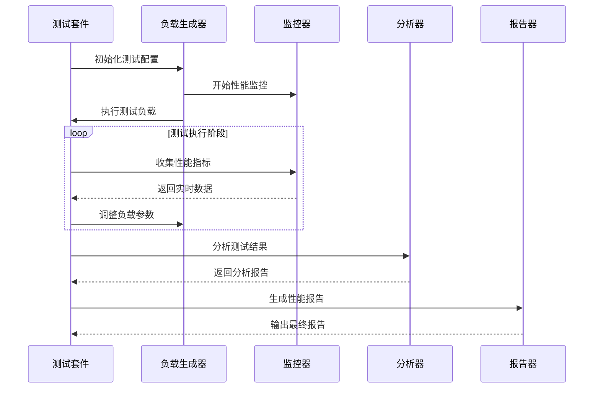

**图表来源**
- [benchmark-suite.md](file://src/data/rbi/.claude/agents/optimization/benchmark-suite.md#L11-L115)

### 性能回归检测

系统实现了自动化的性能回归检测机制，及时发现性能退化问题。

#### 回归检测算法

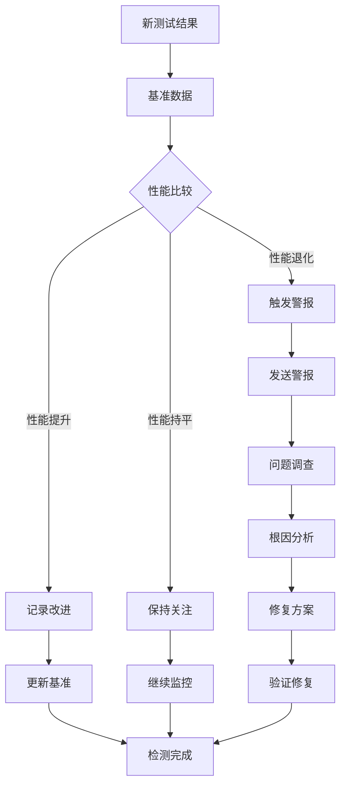

**图表来源**
- [benchmark-suite.md](file://src/data/rbi/.claude/agents/optimization/benchmark-suite.md#L11-L115)

**章节来源**
- [benchmark-suite.md](file://src/data/rbi/.claude/agents/optimization/benchmark-suite.md#L11-L115)
- [performance-benchmarker.md](file://src/data/rbi/.claude/agents/consensus/performance-benchmarker.md#L40-L135)

## 实时性能监控系统

### 多维度监控指标

系统实现了全面的实时性能监控，涵盖系统各个层面的性能指标。

#### 监控指标体系

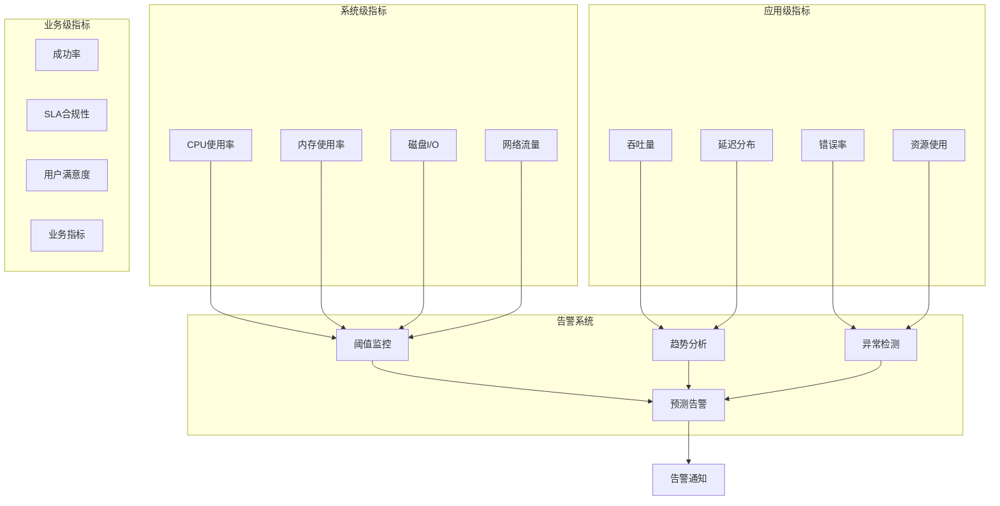

### 性能分析引擎

系统内置了强大的性能分析引擎，能够深度挖掘性能数据中的有价值信息。

#### 分析维度

```mermaid
mindmap
root((性能分析))
实时分析
延迟分析
吞吐量分析
资源使用分析
错误模式分析
历史分析
趋势分析
峰值分析
周期性分析
相关性分析
预测分析
性能预测
容量规划
风险评估
优化建议
根因分析
瓶颈定位
异常溯源
影响范围
解决方案推荐
```

**图表来源**
- [performance-benchmarker.md](file://src/data/rbi/.claude/agents/consensus/performance-benchmarker.md#L411-L606)

**章节来源**
- [performance-benchmarker.md](file://src/data/rbi/.claude/agents/consensus/performance-benchmarker.md#L411-L606)

## 硬件配置与参数调优

### 硬件配置建议

根据不同的业务规模和性能要求，提供相应的硬件配置建议。

#### 配置矩阵

| 业务规模 | CPU配置 | 内存配置 | 存储配置 | 网络配置 | 推荐参数 |
|---------|---------|----------|----------|----------|----------|
| 小型部署 | 8核 | 16GB | SSD 100GB | 1Gbps | MAX_THREADS=4 |
| 中型部署 | 16核 | 32GB | SSD 500GB | 10Gbps | MAX_THREADS=8-12 |
| 大型部署 | 32核 | 64GB | NVMe 1TB | 25Gbps | MAX_THREADS=16-24 |
| 超大型部署 | 64核+ | 128GB+ | NVMe 2TB+ | 100Gbps | MAX_THREADS=32+ |

### 参数优化策略

#### 关键参数调优

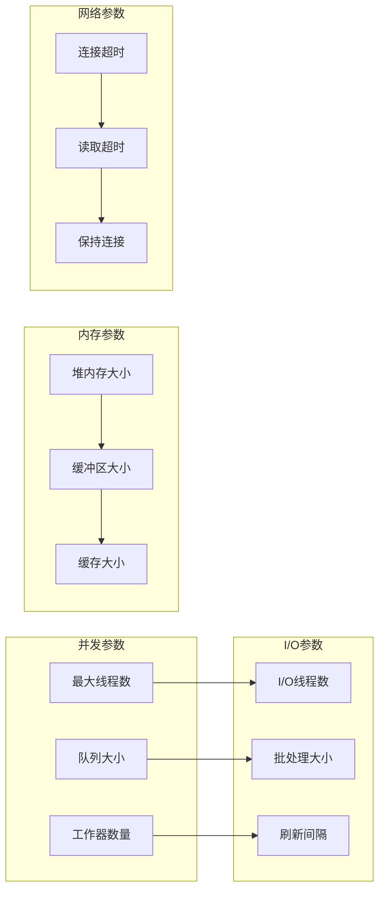

### 动态调优机制

系统实现了自适应的动态调优机制，能够根据实时负载情况自动调整参数。

#### 调优决策树

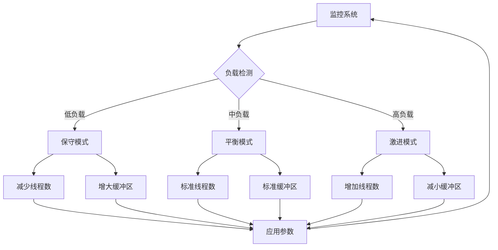

**章节来源**
- [rbi_agent_pp.py](file://src/agents/rbi_agent_pp.py#L80-L120)
- [rbi_agent_pp_multi.py](file://src/agents/rbi_agent_pp_multi.py#L1201-L1233)

## 故障排除指南

### 常见性能问题诊断

#### 问题分类与解决方案

| 问题类型 | 症状表现 | 可能原因 | 解决方案 |
|---------|----------|----------|----------|
| 吞吐量不足 | TPS低于预期 | 线程池配置不当 | 调整MAX_PARALLEL_THREADS |
| 响应时间过长 | P99延迟过高 | 网络或I/O阻塞 | 优化网络配置和I/O策略 |
| 内存泄漏 | 内存使用持续增长 | 对象未正确释放 | 检查对象生命周期管理 |
| CPU使用率过高 | CPU占用率超过80% | 算法复杂度过高 | 优化算法或增加缓存 |
| 资源竞争 | 频繁的锁等待 | 并发控制不当 | 优化锁粒度和并发策略 |

### 性能调试工具

#### 调试工具链

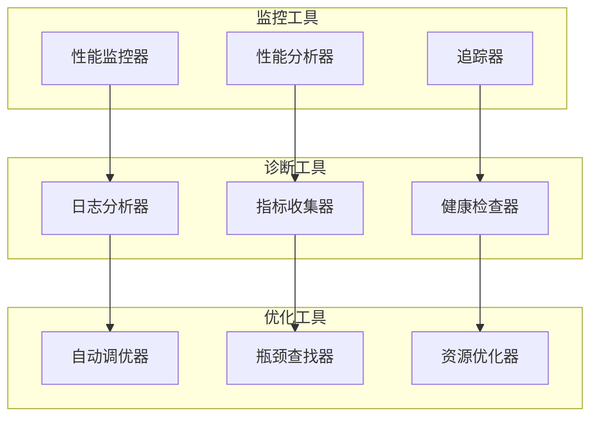

### 故障恢复策略

#### 自愈机制

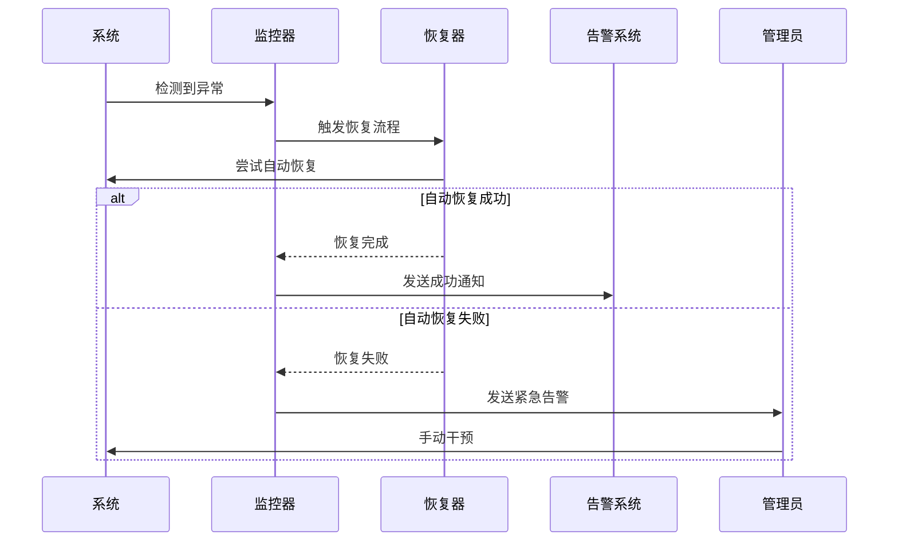

**章节来源**
- [backtest_runner.py](file://src/agents/backtest_runner.py#L100-L150)

## 最佳实践总结

### 性能优化原则

1. **渐进式优化**: 采用渐进式的优化策略，每次只优化一个方面
2. **数据驱动**: 基于实际性能数据进行优化决策
3. **监控先行**: 在优化前建立完善的监控体系
4. **测试验证**: 每次优化后都要进行充分的测试验证
5. **成本效益**: 平衡优化成本与收益

### 优化优先级

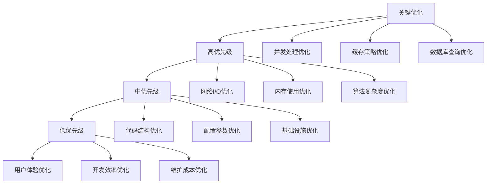

### 性能优化检查清单

#### 部署前检查

- [ ] 并发线程数配置合理
- [ ] 内存分配充足且无泄漏
- [ ] 网络连接池配置适当
- [ ] 缓存策略已启用
- [ ] 监控系统已部署
- [ ] 日志级别配置正确
- [ ] 错误处理机制完善

#### 运行中监控

- [ ] 实时性能指标正常
- [ ] 资源使用率在合理范围
- [ ] 错误率保持在可接受水平
- [ ] 延迟分布符合预期
- [ ] 扩展性测试通过
- [ ] 容量规划准确
- [ ] 故障恢复机制有效

#### 持续优化

- [ ] 定期进行性能基准测试
- [ ] 分析性能趋势变化
- [ ] 识别新的优化机会
- [ ] 更新优化策略
- [ ] 文档化优化经验
- [ ] 培训团队成员
- [ ] 自动化优化流程

通过系统性的性能优化实践，我们能够构建出高性能、高可用的量化交易系统。这些优化措施不仅提升了系统的整体性能，还为未来的扩展奠定了坚实的基础。持续的监控和优化是保持系统竞争力的关键，需要在整个系统生命周期中不断投入和改进。