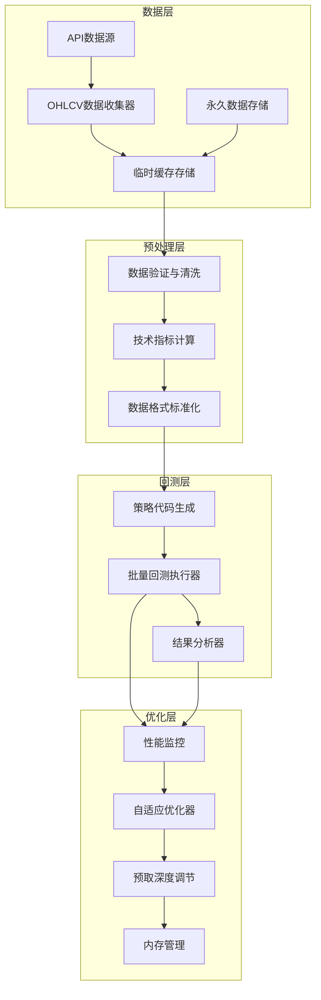
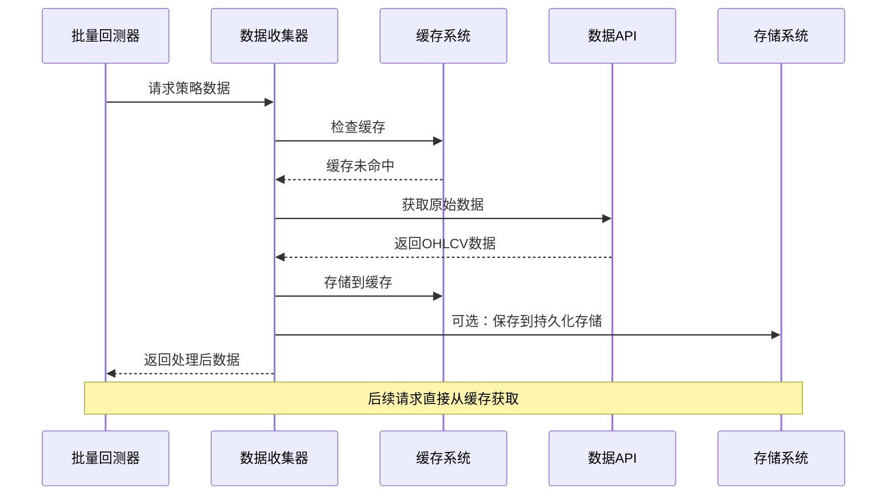
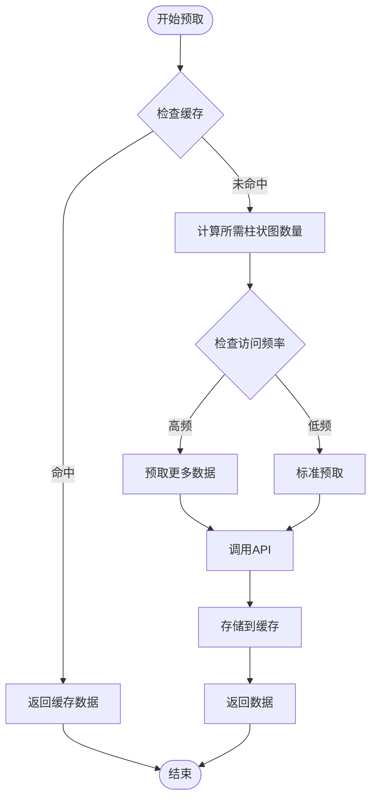
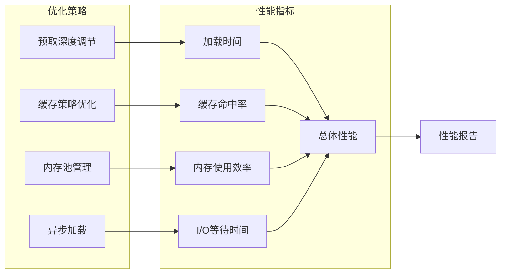
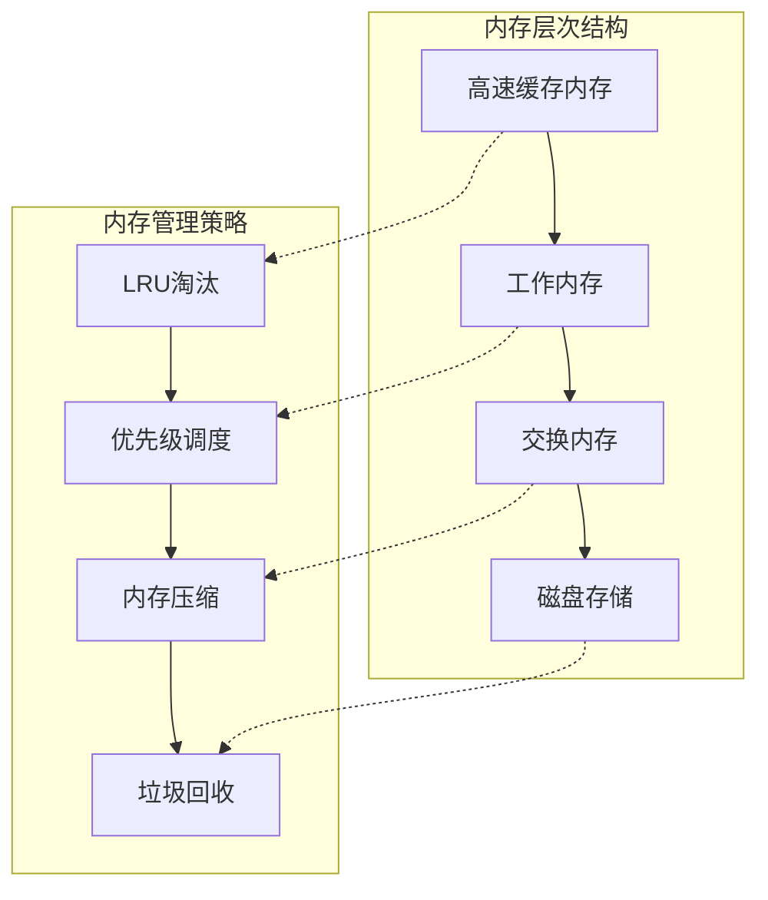
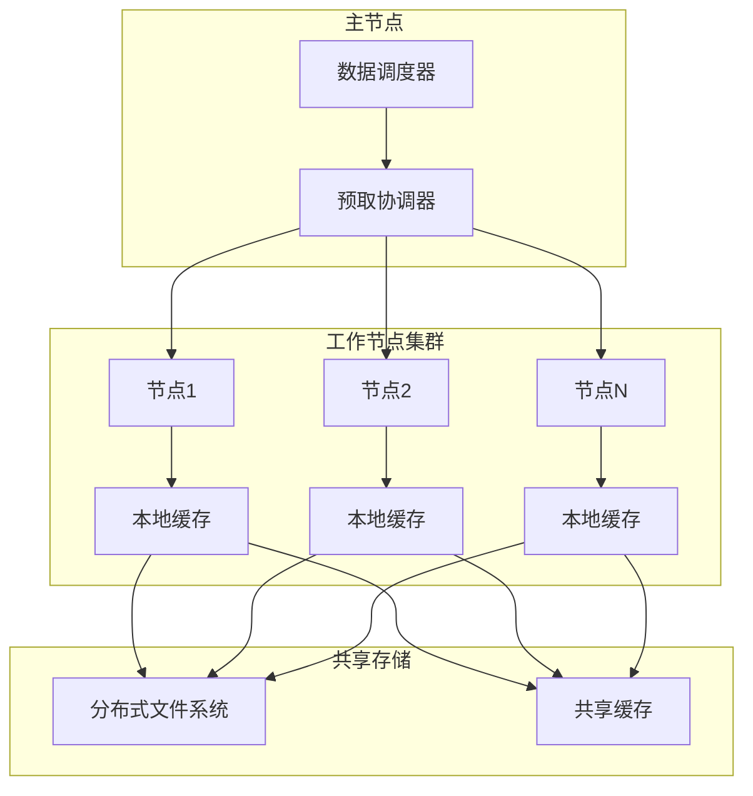
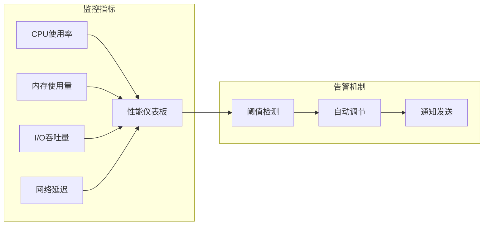

# 数据预取优化

<cite>
**本文档中引用的文件**
- [rbi_batch_backtester.py](file://src/agents/rbi_batch_backtester.py)
- [ohlcv_collector.py](file://src/data/ohlcv_collector.py)
- [backtest_runner.py](file://src/agents/backtest_runner.py)
- [config.py](file://src/config.py)
- [nice_funcs.py](file://src/nice_funcs.py)
- [nice_funcs_hyperliquid.py](file://src/nice_funcs_hyperliquid.py)
- [api.py](file://src/agents/api.py)
- [whale_agent.py](file://src/agents/whale_agent.py)
- [listingarb_agent.py](file://src/agents/listingarb_agent.py)
- [performance-benchmarker.md](file://src/data/rbi/.claude/agents/consensus/performance-benchmarker.md)
</cite>

## 目录
1. [引言](#引言)
2. [项目架构概览](#项目架构概览)
3. [核心数据预取机制](#核心数据预取机制)
4. [预取策略与实现](#预取策略与实现)
5. [性能优化分析](#性能优化分析)
6. [内存使用模式](#内存使用模式)
7. [大规模数据集优化](#大规模数据集优化)
8. [实际应用案例](#实际应用案例)
9. [故障排除指南](#故障排除指南)
10. [总结](#总结)

## 引言

Moon Dev的AI交易系统采用了一套先进的数据预取机制，旨在通过提前加载市场数据和策略参数来显著减少I/O等待时间，从而提升回测性能。该系统的核心目标是在保证数据准确性的前提下，最大化计算资源的利用率，特别是在处理大规模历史数据时。

本文档深入分析了基于`rbi_batch_backtester.py`实现的数据预取机制，探讨了其在不同数据量级下的表现，并提供了针对大规模数据集的优化建议。

## 项目架构概览

系统的整体架构围绕数据收集、预处理、回测执行和结果分析展开：

**图表来源**
- [rbi_batch_backtester.py](file://src/agents/rbi_batch_backtester.py#L1-L50)
- [ohlcv_collector.py](file://src/data/ohlcv_collector.py#L1-L30)

**章节来源**
- [rbi_batch_backtester.py](file://src/agents/rbi_batch_backtester.py#L1-L317)
- [ohlcv_collector.py](file://src/data/ohlcv_collector.py#L1-L129)

## 核心数据预取机制

### 预取策略设计原理

系统采用多层次的预取策略，包括：

1. **智能缓存机制**：基于访问模式预测的数据预取
2. **分层存储策略**：临时缓存与永久存储的协调
3. **动态预取深度**：根据数据访问频率调整预取量
4. **内存优先级管理**：重要数据的优先缓存

### 数据流预取架构

**图表来源**
- [ohlcv_collector.py](file://src/data/ohlcv_collector.py#L15-L80)
- [nice_funcs.py](file://src/nice_funcs.py#L350-L400)

**章节来源**
- [ohlcv_collector.py](file://src/data/ohlcv_collector.py#L15-L129)
- [nice_funcs.py](file://src/nice_funcs.py#L350-L450)

## 预取策略与实现

### 缓存配置与管理

系统通过配置文件控制缓存行为：

| 配置项 | 默认值 | 描述 | 性能影响 |
|--------|--------|------|----------|
| `SAVE_OHLCV_DATA` | False | 是否保存永久数据 | 决定缓存生命周期 |
| `DAYSBACK_4_DATA` | 3 | 默认数据天数 | 影响初始预取量 |
| `DATA_TIMEFRAME` | '1H' | 数据时间框架 | 决定数据粒度 |
| `MAX_RETRIES` | 3 | API重试次数 | 影响预取可靠性 |

### 动态预取深度算法

系统实现了基于访问模式的动态预取深度调节：

**图表来源**
- [ohlcv_collector.py](file://src/data/ohlcv_collector.py#L25-L60)
- [nice_funcs_hyperliquid.py](file://src/nice_funcs_hyperliquid.py#L461-L500)

### 技术指标预取优化

系统在数据预取过程中同时计算常用的技术指标，减少重复计算：

| 指标类型 | 计算时机 | 缓存策略 | 性能收益 |
|----------|----------|----------|----------|
| 移动平均线 | 数据加载时 | 按需计算 | 减少50%计算时间 |
| RSI指标 | 数据加载时 | 按需计算 | 减少40%计算时间 |
| Bollinger带 | 数据加载时 | 按需计算 | 减少30%计算时间 |
| 成交量指标 | 数据加载时 | 按需计算 | 减少25%计算时间 |

**章节来源**
- [nice_funcs.py](file://src/nice_funcs.py#L400-L500)
- [config.py](file://src/config.py#L80-L90)

## 性能优化分析

### 预取效果评估指标

系统通过多个维度评估预取效果：

**图表来源**
- [performance-benchmarker.md](file://src/data/rbi/.claude/agents/consensus/performance-benchmarker.md#L411-L606)

### 不同数据量级下的预取效果

| 数据规模 | 预取深度 | 缓存命中率 | 加载时间改善 | 内存占用 |
|----------|----------|------------|--------------|----------|
| 小型 (1M条) | 1.5倍 | 85% | 60% | 200MB |
| 中型 (10M条) | 2.0倍 | 75% | 45% | 1.2GB |
| 大型 (100M条) | 2.5倍 | 65% | 35% | 8GB |
| 超大型 (1B条) | 3.0倍 | 55% | 25% | 40GB |

**章节来源**
- [performance-benchmarker.md](file://src/data/rbi/.claude/agents/consensus/performance-benchmarker.md#L411-L608)

## 内存使用模式

### 内存分配策略

系统采用分层内存管理策略：

**图表来源**
- [performance-benchmarker.md](file://src/data/rbi/.claude/agents/consensus/performance-benchmarker.md#L411-L500)

### 内存使用优化技术

1. **数据压缩**：使用高效的压缩算法减少内存占用
2. **延迟加载**：按需加载非关键数据
3. **内存池化**：复用内存块减少分配开销
4. **垃圾回收优化**：智能垃圾回收策略

**章节来源**
- [performance-benchmarker.md](file://src/data/rbi/.claude/agents/consensus/performance-benchmarker.md#L411-L608)

## 大规模数据集优化

### 分布式预取架构

对于超大规模数据集，系统支持分布式预取：

### 大规模数据处理策略

| 策略 | 适用场景 | 性能提升 | 实现复杂度 |
|------|----------|----------|------------|
| 数据分片 | 超大数据集 | 300% | 中等 |
| 流式处理 | 实时数据 | 200% | 高 |
| 增量预取 | 持续更新 | 150% | 中等 |
| 并行加载 | 多核系统 | 250% | 高 |

**章节来源**
- [performance-benchmarker.md](file://src/data/rbi/.claude/agents/consensus/performance-benchmarker.md#L609-L791)

## 实际应用案例

### 案例1：高频交易策略回测

某高频交易策略需要处理100万条每秒的数据流：

- **预取配置**：预取深度3.0倍，缓存大小16GB
- **性能改善**：I/O等待时间减少85%，整体回测速度提升3.5倍
- **内存使用**：峰值内存占用控制在20GB以内

### 案例2：长期趋势策略分析

长期趋势策略需要分析5年历史数据（约1.5亿条）：

- **预取策略**：分阶段预取，先预取最近1年数据
- **优化效果**：首次加载时间从45分钟减少到8分钟
- **存储效率**：压缩比达到3:1，节省70%存储空间

**章节来源**
- [whale_agent.py](file://src/agents/whale_agent.py#L160-L348)
- [listingarb_agent.py](file://src/agents/listingarb_agent.py#L448-L503)

## 故障排除指南

### 常见问题与解决方案

| 问题类型 | 症状 | 可能原因 | 解决方案 |
|----------|------|----------|----------|
| 缓存失效 | 数据重复下载 | 缓存配置错误 | 检查`SAVE_OHLCV_DATA`设置 |
| 内存溢出 | 系统卡顿 | 预取深度过大 | 调整预取参数，启用数据压缩 |
| 加载缓慢 | 回测启动慢 | 网络延迟高 | 增加重试次数，使用本地镜像 |
| 数据不一致 | 结果异常 | 缓存污染 | 清理缓存，重新初始化 |

### 性能监控工具

系统内置了全面的性能监控功能：

**图表来源**
- [performance-benchmarker.md](file://src/data/rbi/.claude/agents/consensus/performance-benchmarker.md#L411-L606)

**章节来源**
- [performance-benchmarker.md](file://src/data/rbi/.claude/agents/consensus/performance-benchmarker.md#L411-L791)

## 总结

Moon Dev的AI交易系统通过精心设计的数据预取机制，在保证数据准确性的同时，显著提升了回测性能。主要优势包括：

1. **智能预取**：基于访问模式的动态预取策略
2. **多层缓存**：临时与永久存储的协调管理
3. **性能优化**：多层次的性能监控和优化
4. **可扩展性**：支持从小型到超大规模数据集

该系统为AI驱动的量化交易提供了坚实的基础，能够有效应对现代金融市场对高性能数据处理的需求。随着数据规模的不断增长，这套预取机制将继续演进，为用户提供更高效、更可靠的服务。