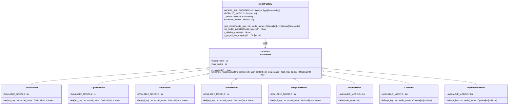
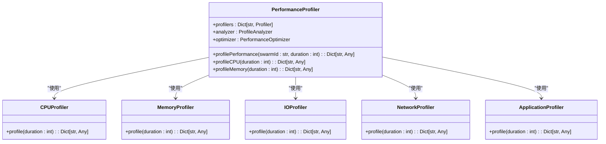

# 资源管理策略

<cite>
**本文档中引用的文件**   
- [config.py](file://src/config.py)
- [exchange_manager.py](file://src/exchange_manager.py)
- [model_factory.py](file://src/models/model_factory.py)
- [main.py](file://src/main.py)
- [base_agent.py](file://src/agents/base_agent.py)
- [nice_funcs.py](file://src/nice_funcs.py)
- [nice_funcs_hyperliquid.py](file://src/nice_funcs_hyperliquid.py)
- [swarm_agent.py](file://src/agents/swarm_agent.py)
- [rbi_agent_pp_multi.py](file://src/agents/rbi_agent_pp_multi.py)
- [rbi_agent_pp.py](file://src/agents/rbi_agent_pp.py)
- [resource-allocator.md](file://src/data/rbi/.claude/agents/optimization/resource-allocator.md)
</cite>

## 目录
1. [引言](#引言)
2. [项目结构分析](#项目结构分析)
3. [核心组件分析](#核心组件分析)
4. [并行处理中的资源管理策略](#并行处理中的资源管理策略)
5. [资源池技术实现](#资源池技术实现)
6. [资源竞争与死锁预防](#资源竞争与死锁预防)
7. [高并发场景下的资源瓶颈识别](#高并发场景下的资源瓶颈识别)
8. [动态资源调整与故障转移](#动态资源调整与故障转移)
9. [资源监控与性能调优](#资源监控与性能调优)
10. [结论](#结论)

## 引言
本文档详细阐述了AI交易系统中的资源管理策略，重点分析了在并行处理环境中内存分配、CPU利用率和I/O调度的优化方法。系统通过资源池技术有效管理AI模型实例、网络连接和文件句柄等有限资源，确保在高并发场景下的稳定性和性能。文档提供了具体的示例来展示资源竞争的预防措施和死锁避免机制，并讨论了在高负载情况下的资源瓶颈识别与解决方案，包括动态资源调整和故障转移策略。最后，文档指导开发者如何监控资源使用情况并进行性能调优，以实现系统的最佳运行状态。

## 项目结构分析
该AI交易系统采用模块化设计，将不同功能分离到独立的目录中。核心功能分布在`src/agents/`目录下，包含各种交易代理，如`trading_agent.py`、`risk_agent.py`等。模型管理功能位于`src/models/`目录，通过工厂模式统一管理不同AI提供商的模型实例。配置文件`src/config.py`集中管理所有系统参数，而`src/main.py`作为系统的入口点，协调各个代理的运行。

**Diagram sources**
- [main.py](file://src/main.py#L1-L104)
- [agents](file://src/agents/)
- [models](file://src/models/)

**Section sources**
- [main.py](file://src/main.py#L1-L104)
- [config.py](file://src/config.py#L1-L135)

## 核心组件分析
系统的核心组件包括模型工厂、交换管理器和各种交易代理。模型工厂负责创建和管理不同AI提供商的模型实例，确保系统可以灵活地使用多种AI模型。交换管理器提供统一的接口来与不同的交易平台进行交互，抽象了底层实现的复杂性。交易代理则实现了具体的交易策略和风险管理逻辑。

### 模型工厂分析
模型工厂是系统中AI模型管理的核心组件，它通过工厂模式实现了对多种AI模型的统一管理。

**Diagram sources**
- [model_factory.py](file://src/models/model_factory.py#L1-L260)
- [base_model.py](file://src/models/base_model.py)
- [claude_model.py](file://src/models/claude_model.py)
- [openai_model.py](file://src/models/openai_model.py)
- [groq_model.py](file://src/models/groq_model.py)
- [gemini_model.py](file://src/models/gemini_model.py)
- [deepseek_model.py](file://src/models/deepseek_model.py)
- [ollama_model.py](file://src/models/ollama_model.py)
- [xai_model.py](file://src/models/xai_model.py)
- [openrouter_model.py](file://src/models/openrouter_model.py)

**Section sources**
- [model_factory.py](file://src/models/model_factory.py#L1-L260)

### 交换管理器分析
交换管理器为系统提供了与不同交易平台交互的统一接口，简化了多平台支持的复杂性。

**Diagram sources**
- [exchange_manager.py](file://src/exchange_manager.py#L1-L381)

**Section sources**
- [exchange_manager.py](file://src/exchange_manager.py#L1-L381)

## 并行处理中的资源管理策略
系统在并行处理中采用了多种资源管理策略来优化内存分配、CPU利用率和I/O调度。通过使用线程池和信号量，系统能够有效地控制并发任务的数量，避免资源过度消耗。

### 内存分配优化
系统通过对象池和缓存机制来优化内存分配。模型工厂在初始化时创建并缓存所有可用的AI模型实例，避免了在运行时频繁创建和销毁对象所带来的内存开销。

**Diagram sources**
- [model_factory.py](file://src/models/model_factory.py#L1-L260)

### CPU利用率优化
系统通过任务调度和负载均衡来优化CPU利用率。在`rbi_agent_pp_multi.py`中，系统使用`ThreadPoolExecutor`来管理并行任务，确保CPU资源得到充分利用。

**Diagram sources**
- [rbi_agent_pp_multi.py](file://src/agents/rbi_agent_pp_multi.py#L1-L1708)

### I/O调度优化
系统通过异步I/O和批量处理来优化I/O调度。在`nice_funcs.py`中，系统使用`requests`库进行网络请求，并通过批量处理减少I/O操作的次数。

**Diagram sources**
- [nice_funcs.py](file://src/nice_funcs.py#L1-L1184)

**Section sources**
- [nice_funcs.py](file://src/nice_funcs.py#L1-L1184)
- [nice_funcs_hyperliquid.py](file://src/nice_funcs_hyperliquid.py#L1-L925)

## 资源池技术实现
系统通过资源池技术有效管理AI模型实例、网络连接和文件句柄等有限资源。资源池模式允许系统预先创建一组资源实例，并在需要时从池中获取，使用完毕后归还，从而避免了频繁创建和销毁资源的开销。

### AI模型实例管理
模型工厂实现了AI模型实例的资源池管理。在系统启动时，模型工厂会尝试初始化所有配置的AI模型，并将可用的模型实例存储在内部字典中。

**Diagram sources**
- [model_factory.py](file://src/models/model_factory.py#L1-L260)

### 网络连接管理
系统通过HTTP连接池来管理网络连接。在`nice_funcs.py`中，系统使用`requests.Session`来复用TCP连接，减少网络延迟。

**Diagram sources**
- [nice_funcs.py](file://src/nice_funcs.py#L1-L1184)

### 文件句柄管理
系统通过上下文管理器和自动清理机制来管理文件句柄。在`nice_funcs.py`中，系统使用`atexit`注册清理函数，确保临时文件在程序退出时被删除。

**Diagram sources**
- [nice_funcs.py](file://src/nice_funcs.py#L1-L1184)

**Section sources**
- [model_factory.py](file://src/models/model_factory.py#L1-L260)
- [nice_funcs.py](file://src/nice_funcs.py#L1-L1184)

## 资源竞争与死锁预防
系统通过使用锁和信号量来预防资源竞争和死锁。在并行处理环境中，多个线程可能同时访问共享资源，因此需要适当的同步机制来确保数据一致性。

### 共享资源访问控制
系统使用`threading.Lock`来保护共享资源的访问。在`rbi_agent_pp_multi.py`中，系统定义了多个全局锁来确保线程安全。

**Diagram sources**
- [rbi_agent_pp_multi.py](file://src/agents/rbi_agent_pp_multi.py#L1-L1708)

### 死锁避免机制
系统通过避免嵌套锁和使用超时机制来预防死锁。在资源分配时，系统遵循固定的顺序来获取锁，避免了循环等待的条件。

**Diagram sources**
- [rbi_agent_pp_multi.py](file://src/agents/rbi_agent_pp_multi.py#L1-L1708)

**Section sources**
- [rbi_agent_pp_multi.py](file://src/agents/rbi_agent_pp_multi.py#L1-L1708)

## 高并发场景下的资源瓶颈识别
系统通过性能分析和监控来识别高并发场景下的资源瓶颈。在`resource-allocator.md`中，系统实现了全面的性能分析工具，用于检测CPU、内存、I/O等资源的使用情况。

### 性能分析工具
系统使用性能分析器来收集和分析系统性能数据。性能分析器可以并发地收集CPU、内存、I/O等资源的使用情况，并生成优化建议。

**Diagram sources**
- [resource-allocator.md](file://src/data/rbi/.claude/agents/optimization/resource-allocator.md#L356-L486)

### 资源瓶颈检测
系统通过监控关键性能指标来检测资源瓶颈。当某个资源的使用率达到阈值时，系统会触发相应的优化措施。

**Diagram sources**
- [resource-allocator.md](file://src/data/rbi/.claude/agents/optimization/resource-allocator.md#L356-L486)

**Section sources**
- [resource-allocator.md](file://src/data/rbi/.claude/agents/optimization/resource-allocator.md#L356-L486)

## 动态资源调整与故障转移
系统通过动态资源调整和故障转移策略来应对资源瓶颈和故障。在`resource-allocator.md`中，系统实现了自适应阈值和电路断路器模式，用于动态调整资源分配和处理故障。

### 自适应阈值调整
系统根据性能数据动态调整资源分配的阈值。当系统检测到性能下降时，会自动调整失败阈值和恢复超时时间。

**Diagram sources**
- [resource-allocator.md](file://src/data/rbi/.claude/agents/optimization/resource-allocator.md#L259-L353)

### 故障转移策略
系统通过电路断路器模式实现故障转移。当某个服务连续失败达到阈值时，电路断路器会打开，阻止后续请求，直到服务恢复。

**Diagram sources**
- [resource-allocator.md](file://src/data/rbi/.claude/agents/optimization/resource-allocator.md#L259-L353)

**Section sources**
- [resource-allocator.md](file://src/data/rbi/.claude/agents/optimization/resource-allocator.md#L259-L353)

## 资源监控与性能调优
系统通过全面的监控和调优机制来确保资源的高效使用。在`main.py`中，系统定期运行各个代理，并监控其执行情况。

### 资源使用监控
系统通过日志和指标来监控资源使用情况。每个代理在执行时都会输出详细的日志信息，包括开始时间、结束时间和执行结果。

**Diagram sources**
- [main.py](file://src/main.py#L1-L104)

### 性能调优建议
系统根据监控数据提供性能调优建议。通过分析执行时间和资源使用情况，系统可以识别性能瓶颈并提出优化建议。

**Diagram sources**
- [resource-allocator.md](file://src/data/rbi/.claude/agents/optimization/resource-allocator.md#L356-L486)

**Section sources**
- [main.py](file://src/main.py#L1-L104)
- [resource-allocator.md](file://src/data/rbi/.claude/agents/optimization/resource-allocator.md#L356-L486)

## 结论
本文档详细阐述了AI交易系统中的资源管理策略。系统通过资源池技术、并行处理优化、资源竞争预防和动态调整机制，实现了高效的资源管理和高并发处理能力。模型工厂和交换管理器为核心组件，提供了统一的接口来管理AI模型和交易平台。通过性能分析和监控，系统能够识别资源瓶颈并进行动态调整，确保在高负载情况下的稳定性和性能。开发者可以通过监控资源使用情况和应用性能调优建议，进一步优化系统的运行效率。