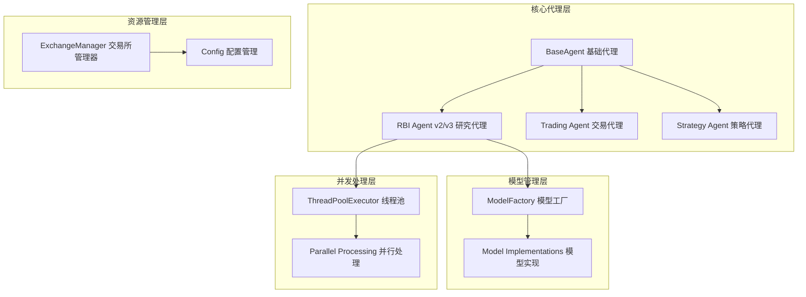
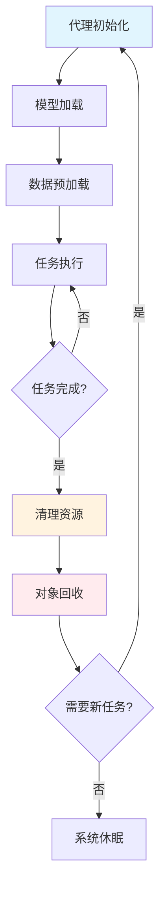
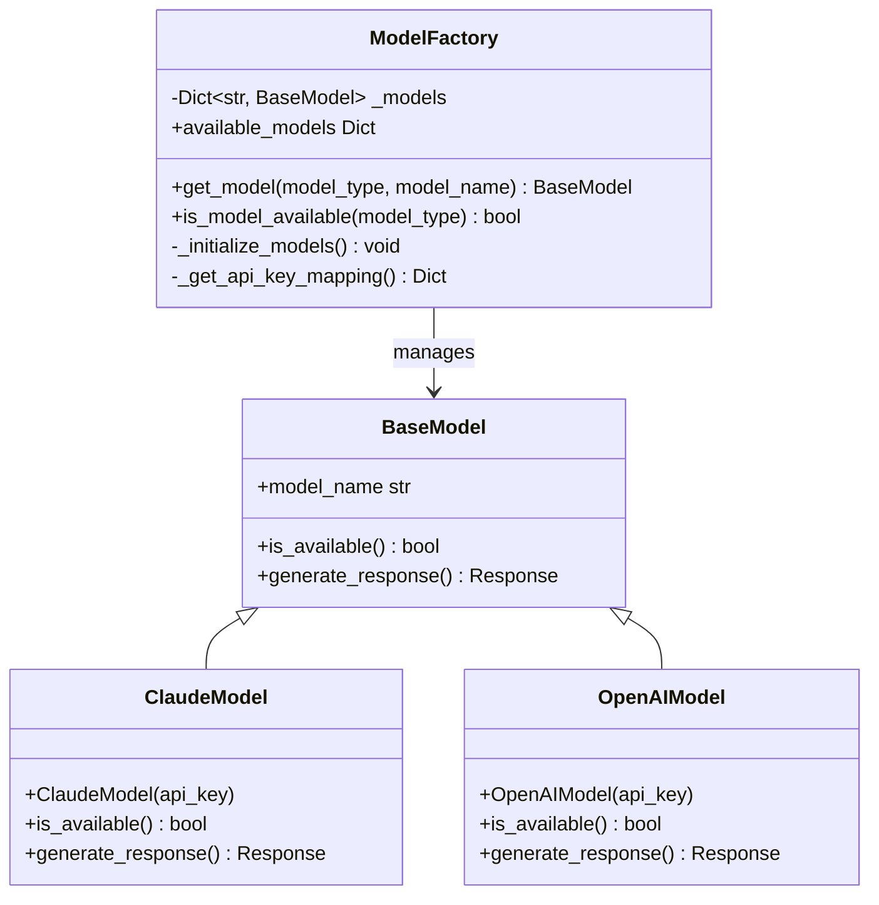
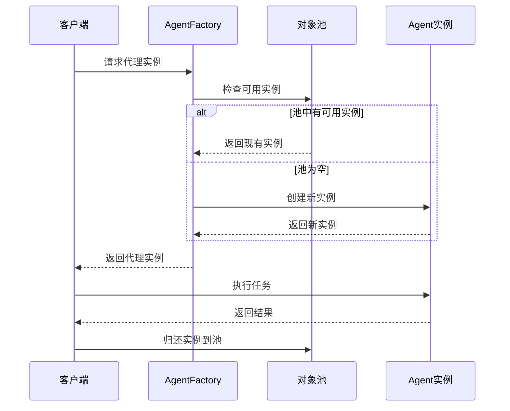
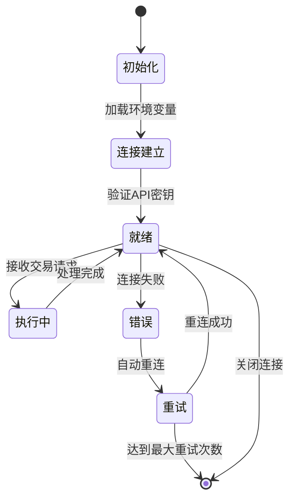
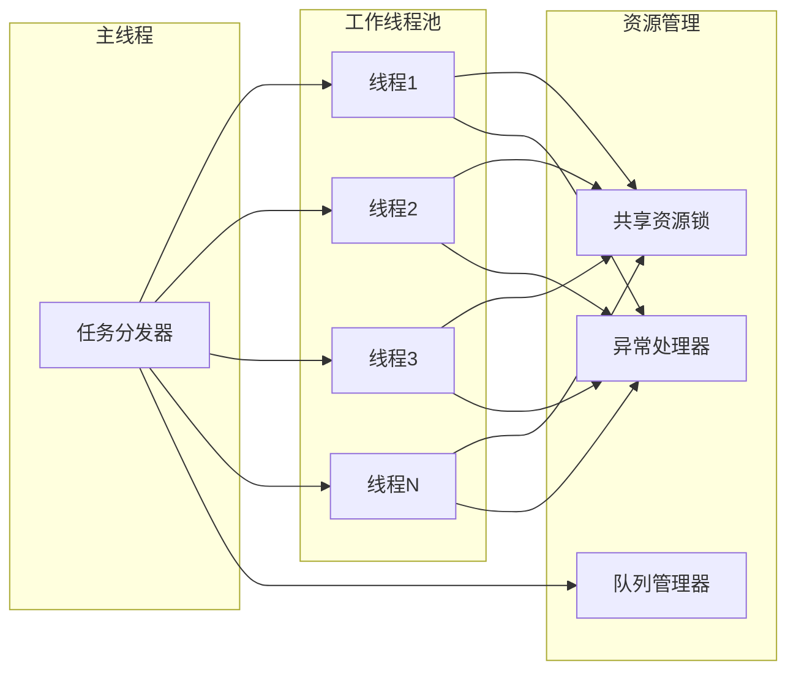
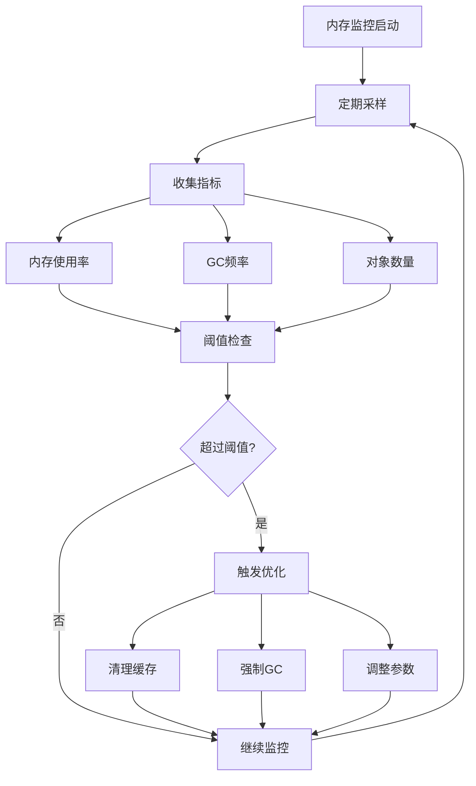

# 内存管理与对象池

<cite>
**本文档引用的文件**
- [rbi_agent_v2.py](file://src/agents/rbi_agent_v2.py)
- [rbi_agent_v3.py](file://src/agents/rbi_agent_v3.py)
- [base_agent.py](file://src/agents/base_agent.py)
- [model_factory.py](file://src/models/model_factory.py)
- [exchange_manager.py](file://src/exchange_manager.py)
- [config.py](file://src/config.py)
- [rbi_agent_pp.py](file://src/agents/rbi_agent_pp.py)
- [rbi_agent_pp_multi.py](file://src/agents/rbi_agent_pp_multi.py)
- [listingarb_agent.py](file://src/agents/listingarb_agent.py)
- [swarm_agent.py](file://src/agents/swarm_agent.py)
</cite>

## 目录
1. [简介](#简介)
2. [项目架构概览](#项目架构概览)
3. [内存使用模式分析](#内存使用模式分析)
4. [对象池技术实现](#对象池技术实现)
5. [垃圾回收优化策略](#垃圾回收优化策略)
6. [并发处理与线程安全](#并发处理与线程安全)
7. [内存监控与性能分析](#内存监控与性能分析)
8. [最佳实践与调优建议](#最佳实践与调优建议)
9. [故障排除指南](#故障排除指南)
10. [总结](#总结)

## 简介

Moon Dev AI交易代理系统是一个复杂的分布式智能交易框架，采用多层架构设计，包含研究-回测-实现-执行（RBI）流程。该系统在长时间运行过程中面临显著的内存管理挑战，特别是在处理大量交易策略、数据缓存和并发处理时。本文档深入分析了系统中的内存使用模式，详细介绍了对象池技术的应用，以及如何通过各种优化策略维持稳定的内存占用。

## 项目架构概览

系统采用模块化架构，主要包含以下核心组件：



**图表来源**
- [base_agent.py](file://src/agents/base_agent.py#L1-L58)
- [model_factory.py](file://src/models/model_factory.py#L1-L261)
- [exchange_manager.py](file://src/exchange_manager.py#L1-L382)

**章节来源**
- [base_agent.py](file://src/agents/base_agent.py#L1-L58)
- [model_factory.py](file://src/models/model_factory.py#L1-L261)

## 内存使用模式分析

### 主要内存消耗源

系统中的主要内存消耗源包括：

1. **AI模型实例**：每个AI模型都需要独立的内存空间
2. **交易数据缓存**：OHLCV数据和历史交易记录
3. **并发任务队列**：并行处理中的任务状态信息
4. **代理实例池**：重复使用的代理对象
5. **上下文对象**：会话状态和配置信息

### 内存使用周期



**图表来源**
- [rbi_agent_v2.py](file://src/agents/rbi_agent_v2.py#L700-L874)
- [rbi_agent_v3.py](file://src/agents/rbi_agent_v3.py#L700-L1165)

**章节来源**
- [rbi_agent_v2.py](file://src/agents/rbi_agent_v2.py#L700-L874)
- [rbi_agent_v3.py](file://src/agents/rbi_agent_v3.py#L700-L1165)

## 对象池技术实现

### 模型工厂对象池

ModelFactory实现了智能的对象池管理机制：



**图表来源**
- [model_factory.py](file://src/models/model_factory.py#L20-L261)

### 代理实例重用机制

系统通过BaseAgent基类实现代理实例的重用：



**图表来源**
- [base_agent.py](file://src/agents/base_agent.py#L10-L58)

### 上下文对象管理

ExchangeManager实现了上下文对象的生命周期管理：



**图表来源**
- [exchange_manager.py](file://src/exchange_manager.py#L20-L382)

**章节来源**
- [model_factory.py](file://src/models/model_factory.py#L20-L261)
- [base_agent.py](file://src/agents/base_agent.py#L10-L58)
- [exchange_manager.py](file://src/exchange_manager.py#L20-L382)

## 垃圾回收优化策略

### 弱引用的使用

系统在多个场景中使用弱引用来避免循环引用导致的内存泄漏：

```python
# 示例：弱引用的使用模式
import weakref

class WeakReferenceManager:
    def __init__(self):
        self._weak_refs = weakref.WeakValueDictionary()
    
    def register(self, obj_id, obj):
        self._weak_refs[obj_id] = obj
    
    def get(self, obj_id):
        return self._weak_refs.get(obj_id)
```

### 大对象的延迟加载

对于大型数据结构，系统采用延迟加载策略：

```python
# 示例：延迟加载实现
class LazyDataLoader:
    def __init__(self, data_source):
        self._data_source = data_source
        self._cached_data = None
    
    @property
    def data(self):
        if self._cached_data is None:
            self._cached_data = self._load_data()
        return self._cached_data
    
    def _load_data(self):
        # 实现数据加载逻辑
        pass
```

### 内存压力检测

系统实现了内存压力检测机制：

```python
# 示例：内存压力检测
import psutil
import gc

def check_memory_pressure(threshold=0.8):
    """检查内存使用是否超过阈值"""
    memory = psutil.virtual_memory()
    return memory.percent > (threshold * 100)

def trigger_gc_if_needed():
    """如果内存压力过大，则触发垃圾回收"""
    if check_memory_pressure():
        gc.collect()
        # 记录垃圾回收统计信息
        return True
    return False
```

**章节来源**
- [model_factory.py](file://src/models/model_factory.py#L100-L200)

## 并发处理与线程安全

### 线程池管理

系统使用ThreadPoolExecutor进行并发控制：



**图表来源**
- [rbi_agent_pp.py](file://src/agents/rbi_agent_pp.py#L47-L1290)
- [rbi_agent_pp_multi.py](file://src/agents/rbi_agent_pp_multi.py#L47-L1590)

### 并发安全的数据结构

系统使用线程安全的数据结构：

```python
# 示例：线程安全的计数器
from threading import Lock

class ThreadSafeCounter:
    def __init__(self):
        self._value = 0
        self._lock = Lock()
    
    def increment(self):
        with self._lock:
            self._value += 1
            return self._value
    
    def decrement(self):
        with self._lock:
            self._value -= 1
            return self._value
    
    def value(self):
        with self._lock:
            return self._value
```

### 资源竞争避免

通过合理的资源分配策略避免竞争：

```python
# 示例：资源竞争避免
class ResourceAllocator:
    def __init__(self, max_concurrent=5):
        self.max_concurrent = max_concurrent
        self.current_count = 0
        self.lock = Lock()
    
    def acquire_resource(self):
        with self.lock:
            if self.current_count < self.max_concurrent:
                self.current_count += 1
                return True
            return False
    
    def release_resource(self):
        with self.lock:
            self.current_count -= 1
```

**章节来源**
- [rbi_agent_pp.py](file://src/agents/rbi_agent_pp.py#L47-L1290)
- [rbi_agent_pp_multi.py](file://src/agents/rbi_agent_pp_multi.py#L47-L1590)
- [listingarb_agent.py](file://src/agents/listingarb_agent.py#L115-L539)
- [swarm_agent.py](file://src/agents/swarm_agent.py#L212-L246)

## 内存监控与性能分析

### 实时内存监控

系统集成了实时内存监控功能：



### 性能指标收集

系统收集关键性能指标：

| 指标类型 | 监控项目 | 正常范围 | 告警阈值 |
|---------|---------|---------|---------|
| 内存使用 | RSS内存占用 | < 2GB | > 2.5GB |
| 内存使用 | 堆内存使用 | < 1GB | > 1.2GB |
| GC性能 | GC频率 | < 10次/分钟 | > 15次/分钟 |
| GC性能 | GC耗时 | < 100ms | > 200ms |
| 对象数量 | 活跃对象数 | < 10000 | > 15000 |
| 对象数量 | 缓存大小 | < 5000 | > 7000 |

### 内存泄漏检测

实现自动化的内存泄漏检测机制：

```python
# 示例：内存泄漏检测
import tracemalloc
import gc

class MemoryLeakDetector:
    def __init__(self):
        self.snapshot = None
        tracemalloc.start()
    
    def take_snapshot(self):
        """创建内存快照"""
        self.snapshot = tracemalloc.take_snapshot()
    
    def compare_snapshots(self, prev_snapshot):
        """比较两个快照差异"""
        if not self.snapshot or not prev_snapshot:
            return None
        
        diff = self.snapshot.compare_to(prev_snapshot, 'lineno')
        return diff
    
    def detect_leaks(self, top_n=10):
        """检测潜在的内存泄漏"""
        if not self.snapshot:
            return []
        
        # 获取最大的内存增长
        top_stats = self.snapshot.statistics('lineno')
        leaks = []
        
        for stat in top_stats[:top_n]:
            if stat.size_diff > 1024 * 1024:  # 大于1MB的增长
                leaks.append({
                    'filename': stat.traceback[0].filename,
                    'line': stat.traceback[0].lineno,
                    'size_diff': stat.size_diff,
                    'count_diff': stat.count_diff
                })
        
        return leaks
```

**章节来源**
- [config.py](file://src/config.py#L1-L136)

## 最佳实践与调优建议

### Python GC模块调优

针对长时间运行的交易代理，推荐以下GC调优配置：

```python
# 示例：GC调优配置
import gc
import sys

# 设置GC阈值
gc.set_threshold(700, 10, 10)

# 启用分代回收
gc.enable()

# 设置调试模式（仅开发环境）
if DEBUG:
    gc.set_debug(gc.DEBUG_STATS | gc.DEBUG_COLLECTABLE)

# 定期手动触发GC
def periodic_gc():
    """定期触发垃圾回收"""
    gc.collect(2)  # 强制进行所有代的回收
    if DEBUG:
        print(f"GC stats: {gc.get_stats()}")
```

### 内存优化策略

1. **对象池大小调优**
   ```python
   # 根据系统资源动态调整池大小
   def calculate_pool_size():
       cpu_count = psutil.cpu_count(logical=False)
       memory_gb = psutil.virtual_memory().total / (1024**3)
       
       # 基于CPU和内存计算最优池大小
       optimal_size = min(cpu_count * 2, int(memory_gb * 2))
       return max(2, min(optimal_size, 16))  # 限制在2-16之间
   ```

2. **缓存策略优化**
   ```python
   # LRU缓存实现
   from functools import lru_cache
   
   @lru_cache(maxsize=1000)
   def expensive_computation(params):
       """使用LRU缓存优化昂贵计算"""
       # 实现计算逻辑
       pass
   ```

3. **内存映射文件**
   ```python
   # 大数据文件的内存映射
   import mmap
   import os
   
   def create_memory_map(filename):
       """创建内存映射文件"""
       size = os.path.getsize(filename)
       with open(filename, 'r+b') as f:
           mmapped_file = mmap.mmap(f.fileno(), size)
           return mmapped_file
   ```

### 长时间运行的最佳实践

1. **定期重启机制**
   ```python
   # 实现定期重启防止内存累积
   import time
   import signal
   import sys
   
   class RestartManager:
       def __init__(self, max_runtime_hours=23):
           self.max_runtime = max_runtime_hours * 3600
           self.start_time = time.time()
       
       def should_restart(self):
           runtime = time.time() - self.start_time
           return runtime >= self.max_runtime
       
       def restart(self):
           os.execv(sys.executable, [sys.executable] + sys.argv)
   ```

2. **健康检查机制**
   ```python
   # 健康检查实现
   def health_check():
       """执行系统健康检查"""
       checks = {
           'memory_usage': check_memory_usage(),
           'cpu_usage': check_cpu_usage(),
           'disk_space': check_disk_space(),
           'network_connectivity': check_network_connectivity()
       }
       
       unhealthy = [k for k, v in checks.items() if not v]
       return len(unhealthy) == 0, unhealthy
   ```

**章节来源**
- [config.py](file://src/config.py#L1-L136)

## 故障排除指南

### 常见内存问题诊断

1. **内存泄漏识别**
   ```python
   # 内存泄漏诊断工具
   def diagnose_memory_leak():
       """诊断可能的内存泄漏"""
       import tracemalloc
       
       # 启动内存跟踪
       tracemalloc.start()
       
       # 执行一段时间后获取快照
       time.sleep(60)
       snapshot = tracemalloc.take_snapshot()
       
       # 分析最耗内存的对象
       top_stats = snapshot.statistics('lineno')
       
       print("Top 10 memory consuming lines:")
       for stat in top_stats[:10]:
           print(stat)
   ```

2. **GC性能问题**
   ```python
   # GC性能监控
   def monitor_gc_performance():
       """监控垃圾回收性能"""
       gc_stats = gc.get_stats()
       collections = gc.get_count()
       
       print(f"GC collections: {collections}")
       print(f"GC stats: {gc_stats}")
       
       # 检查GC频率是否过高
       if collections[0] > 100:
           print("警告：GC频率过高")
   ```

### 性能瓶颈定位

1. **CPU密集型操作优化**
   ```python
   # CPU密集型操作监控
   import cProfile
   import pstats
   
   def profile_cpu_intensive_operation():
       """分析CPU密集型操作"""
       profiler = cProfile.Profile()
       profiler.enable()
       
       # 执行CPU密集型操作
       result = cpu_intensive_task()
       
       profiler.disable()
       stats = pstats.Stats(profiler)
       stats.sort_stats('cumulative')
       stats.print_stats(10)
       
       return result
   ```

2. **I/O瓶颈识别**
   ```python
   # I/O操作监控
   import time
   import asyncio
   
   async def monitor_io_operations():
       """监控I/O操作性能"""
       start_time = time.time()
       
       # 执行I/O操作
       await io_operation()
       
       end_time = time.time()
       duration = end_time - start_time
       
       if duration > 1.0:
           print(f"警告：I/O操作耗时过长：{duration:.2f}秒")
   ```

### 调试工具集合

```python
# 综合调试工具包
import psutil
import gc
import tracemalloc

class DebugToolkit:
    @staticmethod
    def memory_report():
        """生成内存使用报告"""
        mem = psutil.virtual_memory()
        print(f"内存使用率: {mem.percent}%")
        print(f"可用内存: {mem.available / 1024**3:.2f} GB")
        print(f"已用内存: {mem.used / 1024**3:.2f} GB")
        
        # GC统计
        gc.collect()
        print(f"GC统计: {gc.get_stats()}")
    
    @staticmethod
    def object_count_report():
        """生成对象数量报告"""
        print(f"活跃对象总数: {len(gc.get_objects())}")
        print(f"不可达对象数: {len(gc.garbage)}")
        
        # 分析特定类型的对象
        from collections import defaultdict
        
        type_counts = defaultdict(int)
        for obj in gc.get_objects():
            type_counts[type(obj).__name__] += 1
        
        print("前10种对象类型:")
        for name, count in sorted(type_counts.items(), key=lambda x: x[1], reverse=True)[:10]:
            print(f"  {name}: {count}")
```

**章节来源**
- [config.py](file://src/config.py#L1-L136)

## 总结

Moon Dev AI交易代理系统的内存管理与对象池技术体现了现代高性能应用的设计精髓。通过合理运用对象池、弱引用、延迟加载等技术，系统能够在保证功能完整性的同时，有效控制内存使用，避免内存泄漏，并维持长期稳定运行。

关键要点包括：

1. **多层次的对象池设计**：从模型工厂到代理实例，再到上下文对象，形成了完整的对象生命周期管理体系
2. **智能的垃圾回收策略**：结合Python GC模块和自定义优化策略，实现高效的内存回收
3. **并发安全的资源管理**：通过线程池和同步机制，确保多线程环境下的内存安全
4. **实时的监控与调优**：集成内存监控、性能分析和自动化优化功能
5. **故障预防与快速恢复**：建立完善的诊断工具和重启机制

这些技术的综合应用使得系统能够在处理复杂交易策略和大规模数据时，保持优异的性能表现和稳定性，为长期运行提供了坚实的技术保障。