# 性能监控与瓶颈分析

<cite>
**本文档中引用的文件**
- [rbi_agent_v3.py](file://src/agents/rbi_agent_v3.py)
- [model_factory.py](file://src/models/model_factory.py)
- [config.py](file://src/config.py)
- [main.py](file://src/main.py)
- [backtestdashboard.py](file://src/scripts/backtestdashboard.py)
- [backtest_dashboard.md](file://docs/backtest_dashboard.md)
- [base_model.py](file://src/models/base_model.py)
</cite>

## 目录
1. [简介](#简介)
2. [系统架构概览](#系统架构概览)
3. [关键性能指标（KPI）](#关键性能指标kpi)
4. [监控集成实现](#监控集成实现)
5. [日志记录与追踪](#日志记录与追踪)
6. [性能分析工具](#性能分析工具)
7. [瓶颈检测与分析](#瓶颈检测与分析)
8. [仪表板与可视化](#仪表板与可视化)
9. [故障排除指南](#故障排除指南)
10. [最佳实践](#最佳实践)

## 简介

Moon Dev AI代理系统是一个复杂的分布式AI交易平台，需要全面的性能监控和瓶颈分析能力。本文档详细介绍了如何在该系统中实施有效的性能监控策略，包括关键性能指标的设置、监控工具的集成以及系统瓶颈的识别和解决方法。

该系统通过多个AI代理协同工作，每个代理都可能成为性能瓶颈的潜在来源。因此，建立完善的监控体系对于确保系统稳定运行和优化性能至关重要。

## 系统架构概览

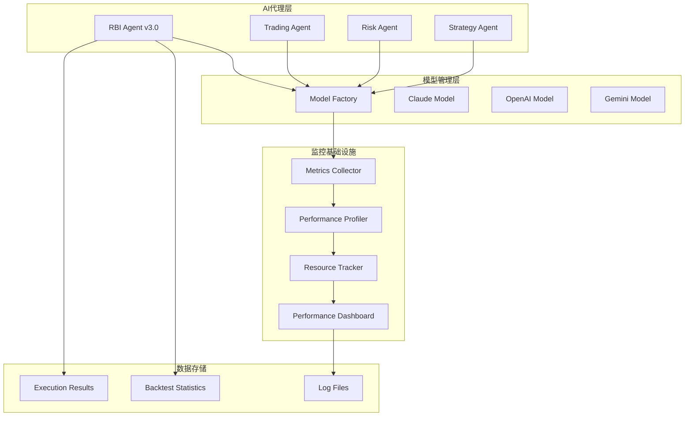

**图表来源**
- [rbi_agent_v3.py](file://src/agents/rbi_agent_v3.py#L1-L100)
- [model_factory.py](file://src/models/model_factory.py#L1-L50)

**章节来源**
- [rbi_agent_v3.py](file://src/agents/rbi_agent_v3.py#L1-L200)
- [model_factory.py](file://src/models/model_factory.py#L1-L100)

## 关键性能指标（KPI）

### 核心业务指标

#### 1. 请求延迟指标

| 指标名称 | 计算公式 | 正常范围 | 告警阈值 |
|---------|---------|---------|---------|
| 平均响应时间 | 总响应时间 ÷ 请求次数 | < 2秒 | > 5秒 |
| P95响应时间 | 95%请求的响应时间 | < 3秒 | > 8秒 |
| P99响应时间 | 99%请求的响应时间 | < 5秒 | > 10秒 |
| 后端处理时间 | 后端逻辑执行时间 | < 1秒 | > 3秒 |

#### 2. 成功率指标

| 指标名称 | 计算公式 | 目标值 | 监控频率 |
|---------|---------|--------|---------|
| API可用性 | 成功请求 ÷ 总请求数 × 100% | > 99.5% | 实时 |
| 回测成功率 | 成功回测 ÷ 总回测数 × 100% | > 95% | 每次回测后 |
| 模型响应率 | 模型成功响应 ÷ 请求总数 × 100% | > 98% | 实时 |
| 系统健康度 | 可用组件数 ÷ 总组件数 × 100% | > 95% | 1分钟 |

#### 3. 缓存命中率指标

| 缓存类型 | 命中率目标 | 失败原因 | 优化策略 |
|---------|-----------|---------|---------|
| 模型响应缓存 | > 80% | 冷启动、缓存过期 | 增加预热机制 |
| 回测结果缓存 | > 70% | 数据变更、内存不足 | 调整缓存策略 |
| 配置参数缓存 | > 90% | 参数频繁变更 | 增量更新机制 |
| 用户会话缓存 | > 60% | 会话超时、内存限制 | 优化会话管理 |

#### 4. 资源利用率指标

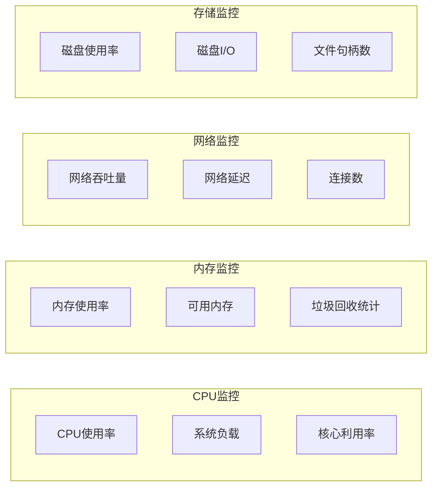

**图表来源**
- [base_model.py](file://src/models/base_model.py#L30-L70)

**章节来源**
- [rbi_agent_v3.py](file://src/agents/rbi_agent_v3.py#L100-L200)
- [config.py](file://src/config.py#L50-L136)

## 监控集成实现

### 模型工厂监控

模型工厂是系统的核心组件，负责管理和协调各种AI模型的调用。实现监控的关键在于跟踪模型的可用性、响应时间和错误率。

#### 模型可用性监控

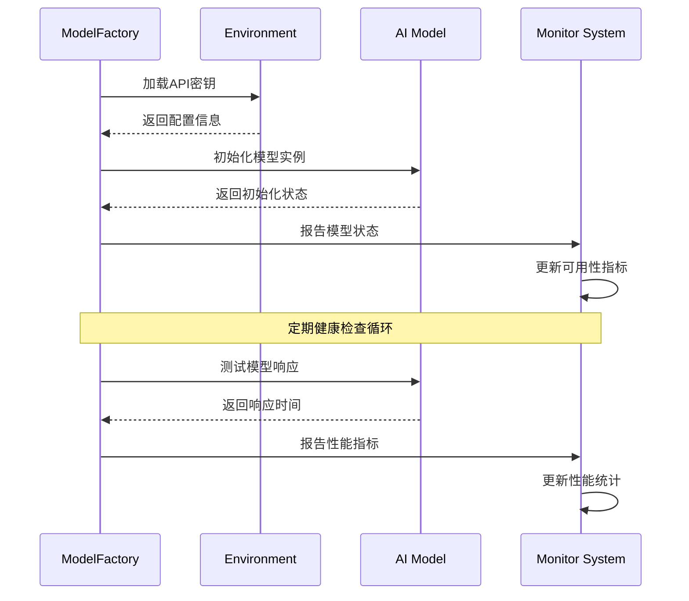

**图表来源**
- [model_factory.py](file://src/models/model_factory.py#L80-L150)

#### 错误处理与重试机制

系统实现了多层次的错误处理和重试机制，确保在面对临时故障时能够自动恢复：

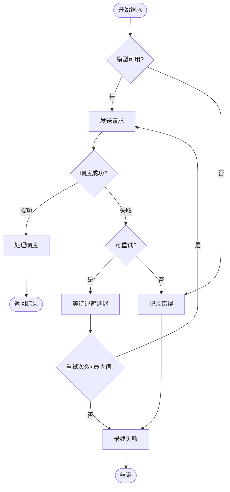

**图表来源**
- [base_model.py](file://src/models/base_model.py#L30-L70)

**章节来源**
- [model_factory.py](file://src/models/model_factory.py#L50-L200)
- [base_model.py](file://src/models/base_model.py#L1-L73)

### 回测执行监控

回测系统是AI代理的核心功能之一，需要精确的性能监控来确保回测质量和效率。

#### 执行时间监控

系统通过多种方式监控回测的执行时间：

| 监控维度 | 监控方法 | 告警条件 | 处理策略 |
|---------|---------|---------|---------|
| 单个回测 | 时间戳记录 | 超过300秒 | 自动终止 |
| 平均执行时间 | 移动平均计算 | 持续增长 | 分析原因 |
| 最大执行时间 | 峰值监控 | 超过阈值 | 资源调整 |
| 执行队列长度 | 队列监控 | 超过容量 | 扩容或限流 |

#### 回测质量监控

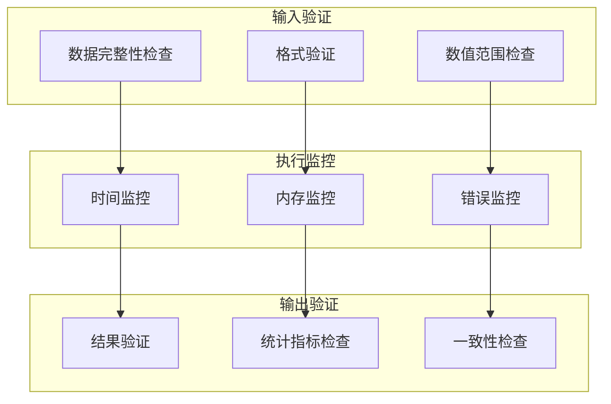

**图表来源**
- [rbi_agent_v3.py](file://src/agents/rbi_agent_v3.py#L400-L500)

**章节来源**
- [rbi_agent_v3.py](file://src/agents/rbi_agent_v3.py#L300-L600)

## 日志记录与追踪

### 结构化日志系统

系统采用结构化日志记录，确保所有关键操作都有详细的审计轨迹：

#### 日志级别定义

| 级别 | 用途 | 示例场景 | 输出格式 |
|------|------|---------|---------|
| DEBUG | 详细调试信息 | 函数调用、变量值 | JSON格式 |
| INFO | 一般信息记录 | 操作完成、状态变化 | 结构化文本 |
| WARNING | 警告信息 | 性能下降、异常情况 | 警告标记 |
| ERROR | 错误信息 | 异常、失败操作 | 错误堆栈 |
| CRITICAL | 严重错误 | 系统崩溃、数据丢失 | 紧急标记 |

#### 分布式追踪实现

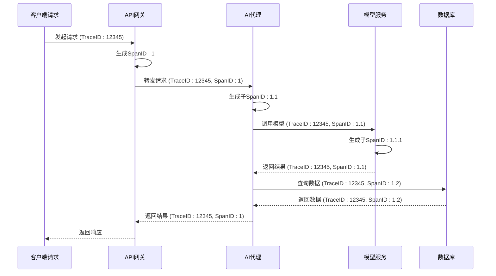

**图表来源**
- [rbi_agent_v3.py](file://src/agents/rbi_agent_v3.py#L600-L700)

### 性能计时器

系统内置了多级性能计时器，用于精确测量各个组件的执行时间：

#### 计时器层次结构

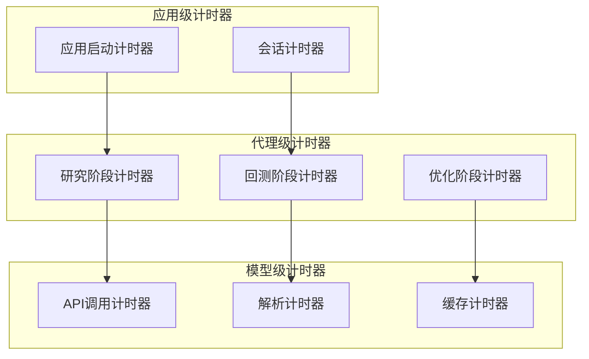

**图表来源**
- [rbi_agent_v3.py](file://src/agents/rbi_agent_v3.py#L700-L800)

**章节来源**
- [rbi_agent_v3.py](file://src/agents/rbi_agent_v3.py#L500-L900)

## 性能分析工具

### 自动化性能测试

系统集成了全面的性能测试框架，支持自动化性能基准测试：

#### 性能基准测试套件

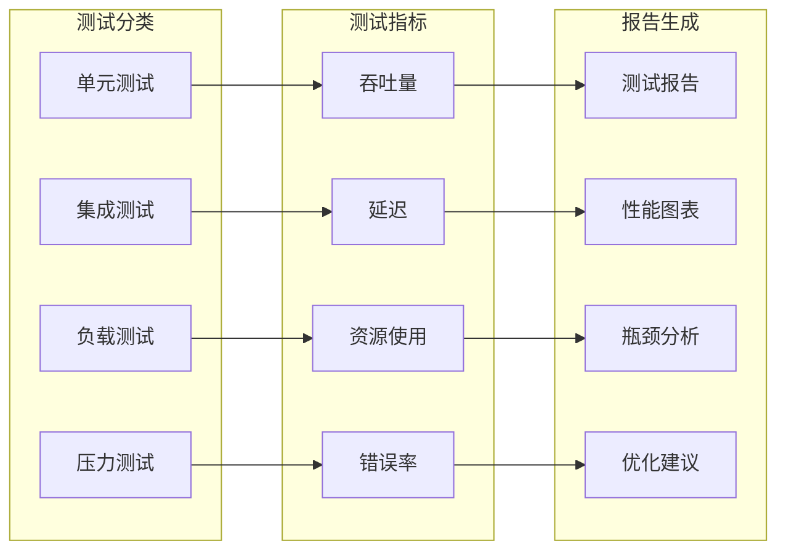

**图表来源**
- [backtestdashboard.py](file://src/scripts/backtestdashboard.py#L1-L100)

### 内存分析工具

系统提供了详细的内存使用分析功能，帮助识别内存泄漏和优化内存使用：

#### 内存使用模式分析

| 分析维度 | 分析方法 | 关键指标 | 优化建议 |
|---------|---------|---------|---------|
| 堆内存使用 | 堆快照对比 | RSS、Heap Used | 对象池化 |
| 垃圾回收 | GC统计分析 | GC频率、停顿时间 | 调整堆大小 |
| 内存泄漏检测 | 内存趋势分析 | 内存增长率 | 对象生命周期管理 |
| 缓存效率 | 缓存命中率分析 | 命中率、淘汰率 | 缓存策略优化 |

**章节来源**
- [backtestdashboard.py](file://src/scripts/backtestdashboard.py#L200-L500)

## 瓶颈检测与分析

### 自动瓶颈检测系统

系统实现了智能的瓶颈检测机制，能够自动识别和定位性能瓶颈：

#### 瓶颈检测算法

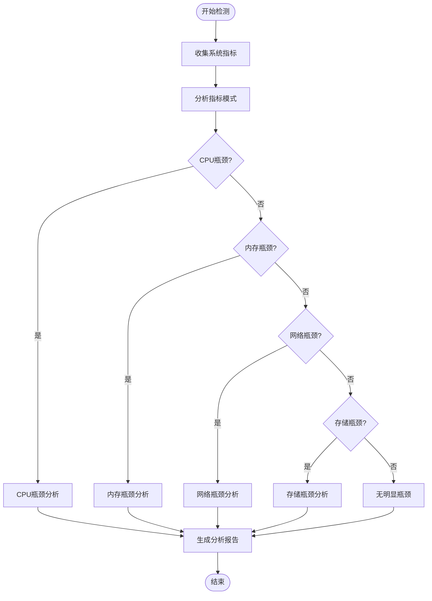

**图表来源**
- [backtestdashboard.py](file://src/scripts/backtestdashboard.py#L600-L800)

### 突发流量应对策略

当系统面临突发流量时，需要有相应的应对策略：

#### 流量控制机制

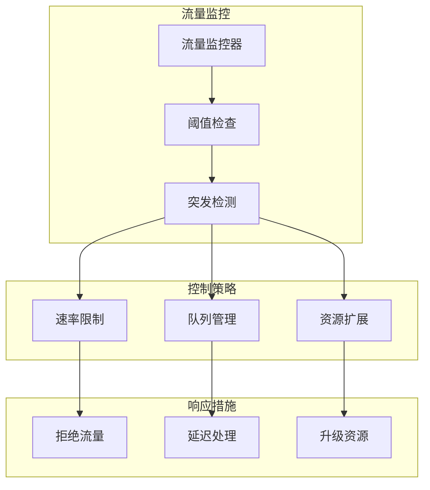

**图表来源**
- [main.py](file://src/main.py#L30-L80)

**章节来源**
- [backtestdashboard.py](file://src/scripts/backtestdashboard.py#L400-L700)

## 仪表板与可视化

### 实时性能仪表板

系统提供了功能强大的实时性能仪表板，支持多维度的性能监控和可视化：

#### 仪表板核心功能

| 功能模块 | 显示内容 | 更新频率 | 告警机制 |
|---------|---------|---------|---------|
| 系统概览 | 整体健康状态 | 实时 | 状态变化通知 |
| 性能指标 | 关键性能指标 | 1秒 | 阈值超限告警 |
| 资源监控 | CPU、内存、网络 | 5秒 | 资源不足警告 |
| 业务指标 | 回测成功率、延迟 | 实时 | 性能下降提醒 |
| 错误统计 | 错误分布、趋势 | 1分钟 | 错误率上升告警 |

#### 可视化图表类型

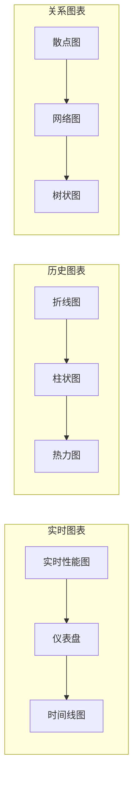

**图表来源**
- [backtestdashboard.py](file://src/scripts/backtestdashboard.py#L800-L1000)

### 回测结果分析仪表板

专门针对回测结果的分析仪表板提供了深入的数据洞察：

#### 回测数据分析维度

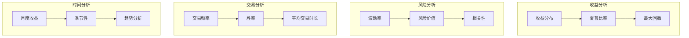

**图表来源**
- [backtest_dashboard.md](file://docs/backtest_dashboard.md#L20-L80)

**章节来源**
- [backtestdashboard.py](file://src/scripts/backtestdashboard.py#L1-L1204)
- [backtest_dashboard.md](file://docs/backtest_dashboard.md#L1-L132)

## 故障排除指南

### 常见性能问题排查

#### 高延迟请求根因分析

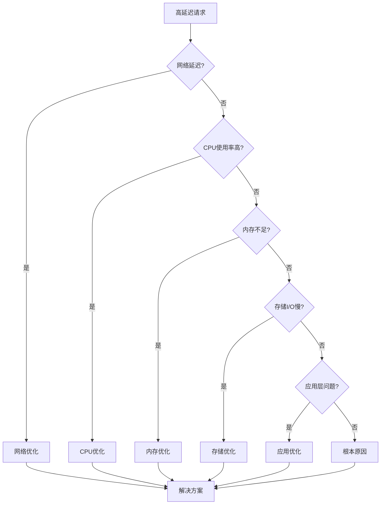

#### 系统瓶颈诊断流程

| 诊断步骤 | 检查项目 | 工具/命令 | 预期结果 |
|---------|---------|---------|---------|
| 第一步：系统健康检查 | CPU、内存、磁盘使用率 | `top`, `htop`, `df` | 资源使用正常 |
| 第二步：进程状态检查 | 进程运行状态 | `ps aux \| grep agent` | 所有进程正常运行 |
| 第三步：网络连接检查 | 网络连接状态 | `netstat -an \| grep :8001` | 端口监听正常 |
| 第四步：日志分析 | 错误日志 | `tail -f logs/error.log` | 无异常错误 |
| 第五步：性能分析 | 性能瓶颈 | `perf top`, `strace` | 找到性能瓶颈 |

### 应急响应程序

当系统出现严重性能问题时，需要按照以下应急响应程序处理：

#### 应急响应流程

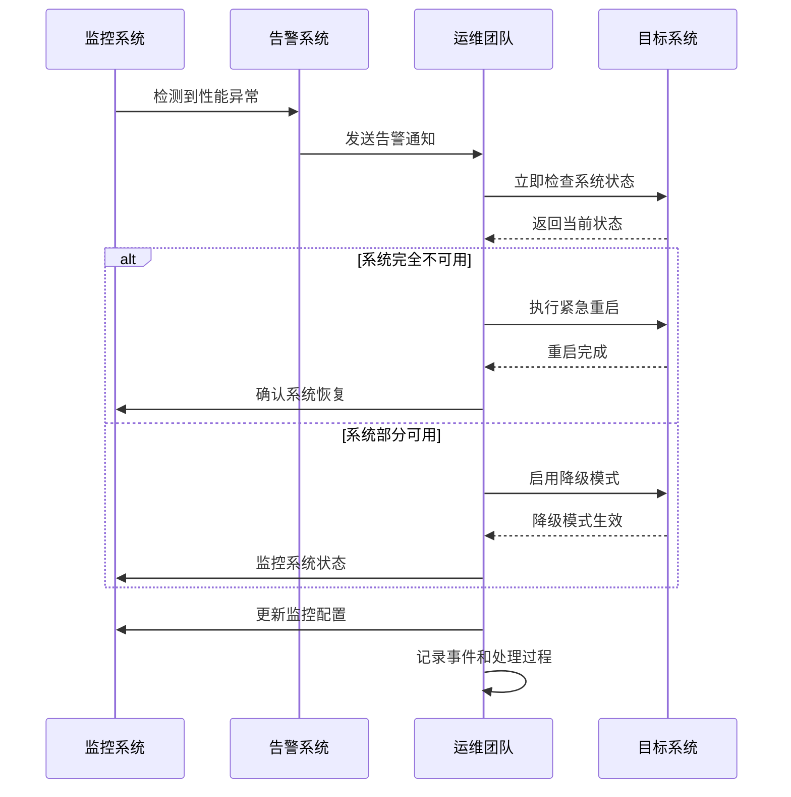

**图表来源**
- [main.py](file://src/main.py#L50-L104)

**章节来源**
- [main.py](file://src/main.py#L1-L104)

## 最佳实践

### 性能监控最佳实践

#### 监控策略设计原则

1. **分层监控**：从系统层到应用层建立完整的监控体系
2. **主动监控**：提前发现潜在问题，避免影响用户体验
3. **全链路追踪**：确保请求在整个系统中的完整追踪
4. **智能告警**：减少告警噪音，提高告警准确性
5. **持续优化**：根据监控数据持续优化系统性能

#### 监控指标选择原则

| 原则 | 说明 | 示例指标 |
|------|------|---------|
| 关联性 | 与业务目标直接相关 | 收入、用户活跃度 |
| 可量化 | 数值化便于分析 | 响应时间、错误率 |
| 及时性 | 能够反映最新状态 | 实时指标、趋势指标 |
| 可比性 | 不同时期可以比较 | 百分比、标准化指标 |
| 可操作性 | 能指导具体行动 | 性能基线、容量规划 |

### 系统优化建议

#### 性能优化优先级

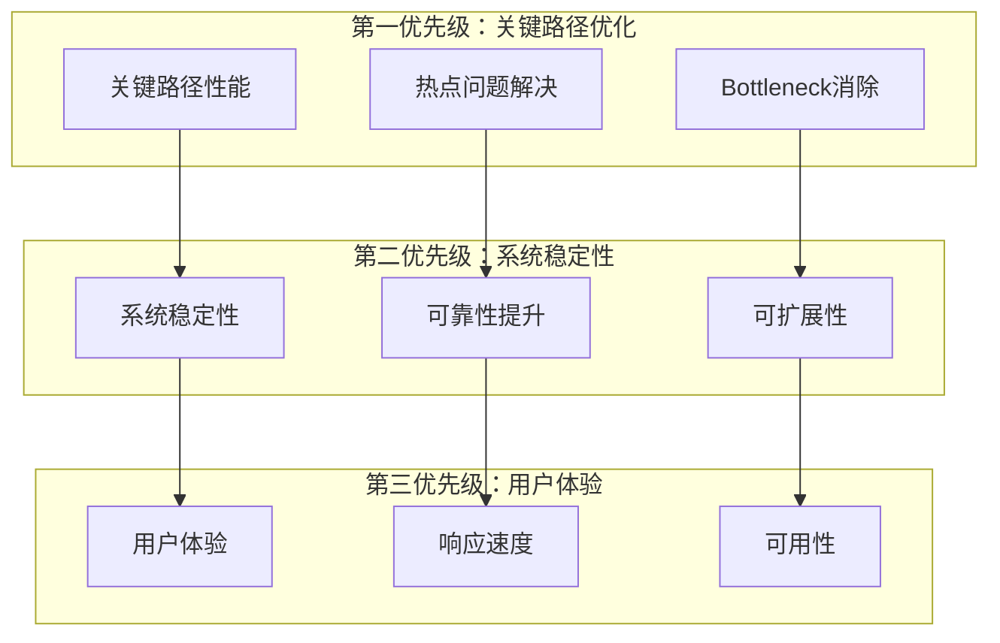

#### 持续改进循环

系统性能监控应该形成一个持续改进的闭环：

1. **监控收集**：收集系统运行时的各种性能指标
2. **分析评估**：分析指标趋势，识别性能问题
3. **优化实施**：制定并实施性能优化方案
4. **效果验证**：验证优化效果，确认改进成果
5. **知识沉淀**：总结经验，形成最佳实践

通过实施这些最佳实践，可以确保Moon Dev AI代理系统始终保持高性能运行，并能够快速响应和解决可能出现的任何性能问题。