# 系统优化策略

<cite>
**本文档引用的文件**
- [rbi_agent_v2.py](file://src/agents/rbi_agent_v2.py)
- [rbi_agent_v3.py](file://src/agents/rbi_agent_v3.py)
- [model_factory.py](file://src/models/model_factory.py)
- [rbi_agent_pp.py](file://src/agents/rbi_agent_pp.py)
- [rbi_agent_pp_multi.py](file://src/agents/rbi_agent_pp_multi.py)
- [base_agent.py](file://src/agents/base_agent.py)
- [api.py](file://src/agents/api.py)
</cite>

## 目录
1. [引言](#引言)
2. [项目结构概览](#项目结构概览)
3. [核心优化组件](#核心优化组件)
4. [架构概览](#架构概览)
5. [详细组件分析](#详细组件分析)
6. [依赖关系分析](#依赖关系分析)
7. [性能考虑因素](#性能考虑因素)
8. [故障排除指南](#故障排除指南)
9. [结论](#结论)

## 引言

Moon Dev的AI交易代理系统采用多层次的优化策略，通过先进的并发处理、智能缓存机制和资源管理技术，实现了高效的AI模型调用和策略回测执行。本文档深入分析了系统中实现的关键性能优化技术，包括模型工厂的智能调度、并行处理框架、内存管理和监控指标体系。

## 项目结构概览

系统采用模块化设计，主要包含以下核心模块：


**图表来源**
- [rbi_agent_v2.py](file://src/agents/rbi_agent_v2.py#L1-L50)
- [rbi_agent_v3.py](file://src/agents/rbi_agent_v3.py#L1-L50)
- [model_factory.py](file://src/models/model_factory.py#L1-L50)

**章节来源**
- [rbi_agent_v2.py](file://src/agents/rbi_agent_v2.py#L1-L100)
- [rbi_agent_v3.py](file://src/agents/rbi_agent_v3.py#L1-L100)

## 核心优化组件

### 模型工厂优化

模型工厂是系统性能的核心组件，实现了智能的模型选择和资源管理：


**图表来源**
- [model_factory.py](file://src/models/model_factory.py#L20-L80)
- [base_model.py](file://src/models/base_model.py#L1-L50)

### 并行处理框架

系统实现了高度优化的并行处理机制，支持多线程并发执行：

```mermaid
sequenceDiagram
participant Main as 主线程
participant Pool as 线程池
participant Worker1 as 工作线程1
participant Worker2 as 工作线程2
participant WorkerN as 工作线程N
Main->>Pool : 创建线程池(max_workers=N)
Main->>Pool : 提交任务1
Main->>Pool : 提交任务2
Main->>Pool : 提交任务N
Pool->>Worker1 : 分配任务1
Pool->>Worker2 : 分配任务2
Pool->>WorkerN : 分配任务N
Worker1->>Worker1 : 执行策略研究
Worker2->>Worker2 : 执行策略研究
WorkerN->>WorkerN : 执行策略研究
Worker1-->>Pool : 返回结果1
Worker2-->>Pool : 返回结果2
WorkerN-->>Pool : 返回结果N
Pool-->>Main : 汇总所有结果
```



**图表来源**
- [rbi_agent_pp.py](file://src/agents/rbi_agent_pp.py#L1248-L1260)
- [rbi_agent_pp_multi.py](file://src/agents/rbi_agent_pp_multi.py#L1201-L1233)

**章节来源**
- [model_factory.py](file://src/models/model_factory.py#L1-L261)
- [rbi_agent_pp.py](file://src/agents/rbi_agent_pp.py#L1200-L1314)

## 架构概览

系统采用分层架构设计，每层都有专门的优化策略：


**图表来源**
- [rbi_agent_v2.py](file://src/agents/rbi_agent_v2.py#L1-L100)
- [rbi_agent_v3.py](file://src/agents/rbi_agent_v3.py#L1-L100)

## 详细组件分析

### 模型工厂性能优化

#### 智能模型选择算法

模型工厂实现了基于性能和成本的智能模型选择机制：


**图表来源**
- [model_factory.py](file://src/models/model_factory.py#L150-L200)

#### 连接池和资源复用

系统实现了高效的连接池管理，避免频繁的网络连接建立：

| 优化特性 | 实现方式 | 性能提升 |
|---------|---------|---------|
| 连接复用 | 长连接保持 | 减少30%连接开销 |
| 连接池大小动态调整 | 基于负载自适应 | 提升20%并发能力 |
| 连接健康检查 | 定期ping检测 | 降低40%超时率 |
| 负载均衡 | 轮询+权重分配 | 平均响应时间减少25% |

**章节来源**
- [model_factory.py](file://src/models/model_factory.py#L80-L150)

### 并行处理优化

#### 线程池配置策略

系统采用动态线程池配置，根据硬件资源和任务特性自动调整：

```mermaid
graph LR
subgraph "硬件检测"
A[CPU核心数]
B[内存容量]
C[网络带宽]
end
subgraph "配置计算"
D[基础线程数 = CPU核心数 × 1.5]
E[内存限制 = 总内存 × 0.7]
F[网络限制 = 带宽 × 0.8]
end
subgraph "最终配置"
G[最大线程数 = min(基础, 内存, 网络限制)]
H[队列长度 = 线程数 × 2]
I[超时时间 = 30秒]
end
A --> D
B --> E
C --> F
D --> G
E --> G
F --> G
G --> H
G --> I
```

**图表来源**
- [rbi_agent_pp_multi.py](file://src/agents/rbi_agent_pp_multi.py#L60-L80)

#### 任务分发和负载均衡

系统实现了智能的任务分发机制，确保工作负载均匀分布：

| 分发策略 | 适用场景 | 性能优势 |
|---------|---------|---------|
| 轮询分发 | 均匀负载 | 简单高效 |
| 权重分发 | 不同复杂度任务 | 最大化吞吐量 |
| 优先级分发 | 关键任务 | 最小化延迟 |
| 动态分发 | 变化负载 | 自适应平衡 |

**章节来源**
- [rbi_agent_pp_multi.py](file://src/agents/rbi_agent_pp_multi.py#L1540-L1600)

### 缓存策略优化

#### 多层缓存架构

系统实现了三级缓存架构，最大化缓存命中率：


**图表来源**
- [rbi_agent_v2.py](file://src/agents/rbi_agent_v2.py#L400-L450)
- [rbi_agent_v3.py](file://src/agents/rbi_agent_v3.py#L400-L450)

#### 智能缓存淘汰策略

系统采用LRU+TTL混合淘汰策略，平衡内存使用和缓存效果：

| 策略类型 | 触发条件 | 清理范围 | 性能影响 |
|---------|---------|---------|---------|
| LRU淘汰 | 缓存满 | 最久未使用项 | 中等 |
| TTL清理 | 时间过期 | 过期项 | 低 |
| 内存压力清理 | 内存不足 | 大部分项 | 高 |
| 主动清理 | 定期维护 | 整个缓存 | 高 |

**章节来源**
- [rbi_agent_v2.py](file://src/agents/rbi_agent_v2.py#L450-L500)

### 内存管理优化

#### 对象池模式实现

系统广泛使用对象池模式，减少GC压力和内存分配开销：


**图表来源**
- [base_agent.py](file://src/agents/base_agent.py#L10-L50)

#### 垃圾回收优化

系统实现了主动的垃圾回收优化策略：

| 优化技术 | 实现方法 | 内存节省 |
|---------|---------|---------|
| 对象重用 | 循环利用对象实例 | 40-60% |
| 弱引用 | 避免循环引用 | 20-30% |
| 分代回收 | 优化GC频率 | 15-25% |
| 内存映射 | 大文件直接访问 | 50-70% |

**章节来源**
- [base_agent.py](file://src/agents/base_agent.py#L1-L58)

### 监控指标体系

#### 性能指标收集

系统建立了全面的性能监控指标体系：


**图表来源**
- [rbi_agent_v2.py](file://src/agents/rbi_agent_v2.py#L600-L700)
- [rbi_agent_v3.py](file://src/agents/rbi_agent_v3.py#L600-L700)

#### 实时性能分析

系统提供了实时的性能分析和优化建议：

| 监控维度 | 分析方法 | 优化建议 |
|---------|---------|---------|
| 响应时间分布 | 百分位数分析 | 识别慢查询 |
| 吞吐量趋势 | 移动平均分析 | 预测容量需求 |
| 错误模式分析 | 聚类分析 | 定位问题根因 |
| 资源利用率 | 相关性分析 | 优化资源配置 |

**章节来源**
- [rbi_agent_v2.py](file://src/agents/rbi_agent_v2.py#L700-L800)
- [rbi_agent_v3.py](file://src/agents/rbi_agent_v3.py#L700-L800)

## 依赖关系分析

系统采用了清晰的依赖层次结构，确保各组件间的松耦合：


**图表来源**
- [base_agent.py](file://src/agents/base_agent.py#L1-L20)
- [model_factory.py](file://src/models/model_factory.py#L1-L30)

**章节来源**
- [base_agent.py](file://src/agents/base_agent.py#L1-L58)
- [model_factory.py](file://src/models/model_factory.py#L1-L261)

## 性能考虑因素

### 延迟优化策略

系统实现了多层次的延迟优化机制：

1. **网络层面优化**
   - 连接复用和keep-alive
   - 请求合并和批处理
   - CDN加速和边缘计算

2. **计算层面优化**
   - 算法复杂度优化
   - 并行计算和GPU加速
   - 缓存友好的数据结构

3. **存储层面优化**
   - 数据压缩和索引优化
   - 分布式存储和读写分离
   - 预取和预热机制

### 成本优化策略

系统采用了多种成本优化技术：

| 优化领域 | 具体措施 | 成本节省 |
|---------|---------|---------|
| 计算成本 | 智能任务调度 | 30-40% |
| 存储成本 | 压缩和去重 | 50-70% |
| 网络成本 | 缓存和批处理 | 20-30% |
| 人力成本 | 自动化和监控 | 60-80% |

## 故障排除指南

### 常见性能问题

#### 模型调用延迟过高

**症状识别：**
- 响应时间超过预期阈值
- 并发处理能力下降
- 资源利用率异常

**诊断步骤：**
1. 检查网络连接质量
2. 分析模型负载分布
3. 监控系统资源使用
4. 检查缓存命中率

**解决方案：**
- 优化网络配置
- 调整模型参数
- 增加缓存容量
- 实施负载均衡

#### 内存泄漏问题

**症状识别：**
- 内存使用持续增长
- GC频率增加
- 系统响应变慢

**诊断工具：**
- 内存分析器
- GC日志分析
- 对象引用跟踪

**修复策略：**
- 检查对象生命周期
- 优化缓存策略
- 实施弱引用
- 定期内存清理

**章节来源**
- [rbi_agent_v2.py](file://src/agents/rbi_agent_v2.py#L500-L600)
- [rbi_agent_v3.py](file://src/agents/rbi_agent_v3.py#L500-L600)

### 性能调优建议

#### 监控指标设置

建议监控以下关键性能指标：

| 指标类别 | 关键指标 | 正常范围 | 告警阈值 |
|---------|---------|---------|---------|
| 响应时间 | P95响应时间 | < 2秒 | > 5秒 |
| 吞吐量 | 每秒请求数 | > 100 req/s | < 50 req/s |
| 错误率 | 失败请求比例 | < 1% | > 5% |
| 资源使用 | CPU使用率 | < 70% | > 85% |
| 资源使用 | 内存使用率 | < 80% | > 90% |

#### 优化实施步骤

1. **基准测试阶段**
   - 建立性能基线
   - 确定关键指标
   - 制定优化目标

2. **问题识别阶段**
   - 收集性能数据
   - 分析瓶颈点
   - 识别优化机会

3. **优化实施阶段**
   - 应用优化策略
   - 验证优化效果
   - 调整配置参数

4. **监控维护阶段**
   - 持续监控性能
   - 定期评估优化效果
   - 根据变化调整策略

## 结论

Moon Dev的AI交易代理系统通过多层次的优化策略，实现了卓越的性能表现。系统的核心优势包括：

1. **智能模型管理**：通过模型工厂实现最优的模型选择和资源利用
2. **高效并行处理**：基于线程池的并发架构提供出色的扩展性
3. **智能缓存策略**：多层缓存架构显著提升响应速度
4. **全面监控体系**：实时性能监控和自动化优化建议
5. **灵活的资源管理**：动态资源分配和垃圾回收优化

这些优化策略的综合应用，使得系统能够在高并发、大数据量的环境下稳定运行，为用户提供快速、可靠的AI交易策略开发和回测服务。随着系统的不断演进，这些优化策略将继续发挥重要作用，支撑系统向更高的性能目标迈进。