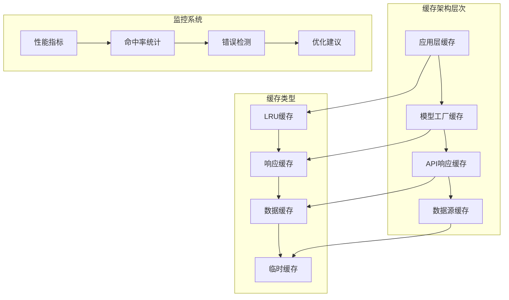
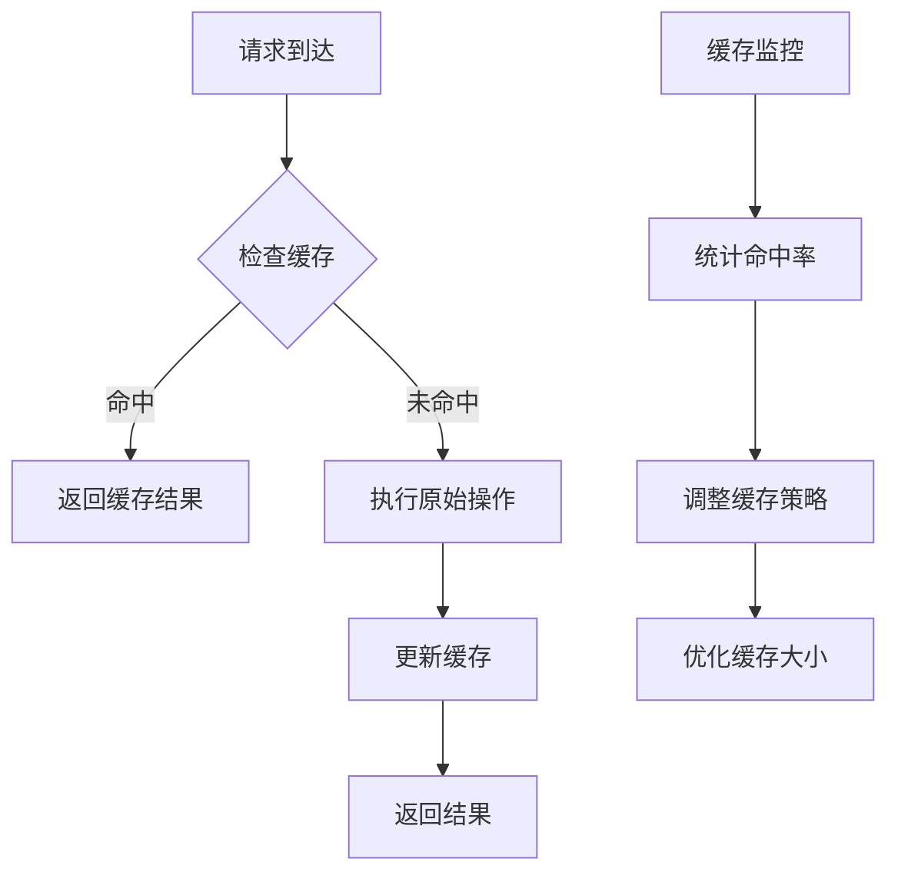
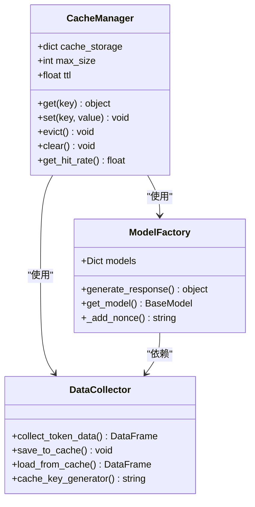
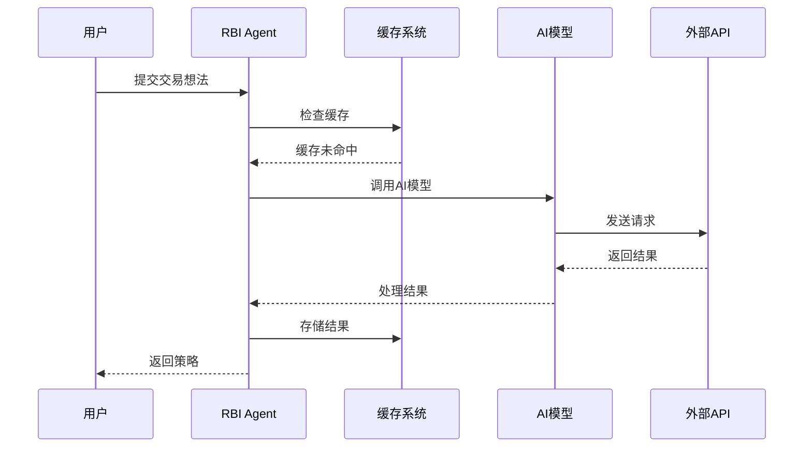
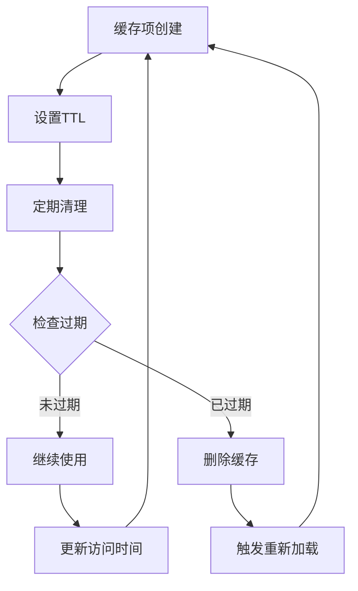
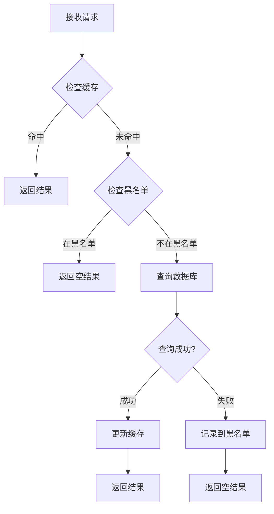
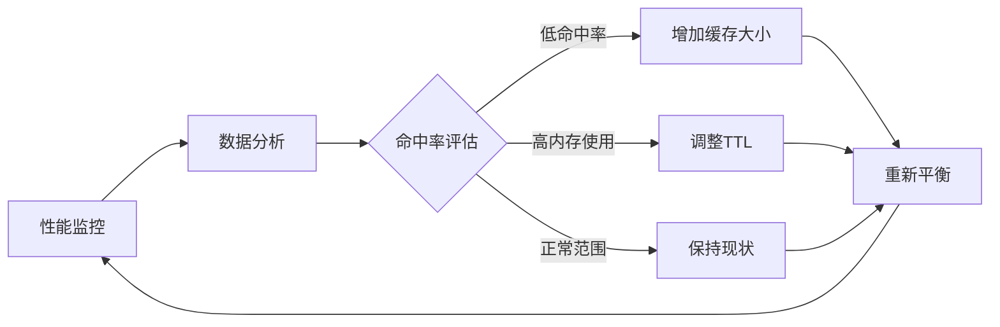
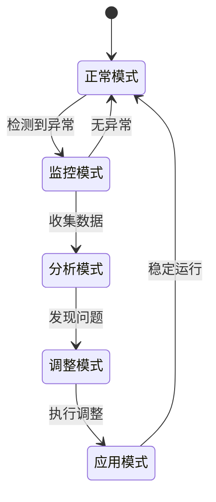

# 缓存策略优化

<cite>
**本文档引用的文件**
- [rbi_agent_v3.py](file://src/agents/rbi_agent_v3.py)
- [model_factory.py](file://src/models/model_factory.py)
- [api.py](file://src/agents/api.py)
- [sniper_agent.py](file://src/agents/sniper_agent.py)
- [ohlcv_collector.py](file://src/data/ohlcv_collector.py)
- [coingecko_exchangeless_tokens.py](file://src/scripts/coingecko_exchangeless_tokens.py)
- [nice_funcs.py](file://src/nice_funcs.py)
- [nice_funcs_aster.py](file://src/nice_funcs_aster.py)
- [aster_test.py](file://src/scripts/aster_test.py)
</cite>

## 目录
1. [引言](#引言)
2. [项目结构概览](#项目结构概览)
3. [核心缓存机制](#核心缓存机制)
4. [智能缓存架构](#智能缓存架构)
5. [详细组件分析](#详细组件分析)
6. [缓存键设计与过期策略](#缓存键设计与过期策略)
7. [缓存穿透防护](#缓存穿透防护)
8. [性能监控与优化](#性能监控与优化)
9. [负载场景下的缓存调优](#负载场景下的缓存调优)
10. [故障排除指南](#故障排除指南)
11. [结论](#结论)

## 引言

在现代AI驱动的交易系统中，缓存策略优化是提升系统性能和降低成本的关键技术。本文档深入分析Moon Dev AI Agents项目中的智能缓存机制，重点关注rbi_agent_v3.py中实现的多层缓存策略，以及model_factory.py提供的响应缓存功能。

该系统通过LRU缓存策略减少重复的AI模型调用，利用模型工厂的响应缓存降低API请求成本，并实现了完善的缓存监控和优化机制。

## 项目结构概览

**图表来源**
- [rbi_agent_v3.py](file://src/agents/rbi_agent_v3.py#L1-L50)
- [model_factory.py](file://src/models/model_factory.py#L1-L50)

## 核心缓存机制

### 智能缓存策略概述

系统采用分层缓存架构，包含以下核心组件：

1. **应用级缓存**：在rbi_agent_v3.py中实现的智能缓存逻辑
2. **模型工厂缓存**：统一的模型响应缓存管理
3. **API缓存**：HTTP请求结果缓存
4. **数据缓存**：市场数据和历史数据缓存

### 缓存命中率优化

**节来源**
- [rbi_agent_v3.py](file://src/agents/rbi_agent_v3.py#L800-L1165)
- [model_factory.py](file://src/models/model_factory.py#L235-L260)

## 智能缓存架构

### LRU缓存实现

系统在多个层面实现了LRU（Least Recently Used）缓存策略：

**图表来源**
- [rbi_agent_v3.py](file://src/agents/rbi_agent_v3.py#L200-L300)
- [model_factory.py](file://src/models/model_factory.py#L100-L200)

### 响应缓存机制

model_factory.py实现了智能的响应缓存机制，通过添加随机nonce防止缓存重复：

**节来源**
- [model_factory.py](file://src/models/model_factory.py#L235-L260)

## 详细组件分析

### 研究阶段缓存优化

在rbi_agent_v3.py的研究阶段，系统实现了智能的缓存策略：

**图表来源**
- [rbi_agent_v3.py](file://src/agents/rbi_agent_v3.py#L600-L700)

### 回测执行缓存

回测执行过程中的缓存优化策略：

**节来源**
- [rbi_agent_v3.py](file://src/agents/rbi_agent_v3.py#L700-L800)

### 数据收集缓存

市场数据收集过程中的缓存实现：

**节来源**
- [ohlcv_collector.py](file://src/data/ohlcv_collector.py#L70-L128)

## 缓存键设计与过期策略

### 缓存键生成策略

系统采用多种缓存键生成策略以确保唯一性和有效性：

| 缓存类型 | 键格式 | 过期时间 | 示例 |
|---------|--------|----------|------|
| 研究策略缓存 | `research:{idea_hash}` | 24小时 | `research:abc123def456` |
| 回测代码缓存 | `backtest:{strategy_name}` | 12小时 | `backtest:MomentumStrategy` |
| API响应缓存 | `api:{endpoint}:{params_hash}` | 1小时 | `api:ohlcv:BTC_USD_1h` |
| 数据缓存 | `data:{token}_{timeframe}` | 30分钟 | `data:BTC_1h` |

### 随机nonce机制

为防止缓存重复，系统在每次请求中添加随机nonce：

**节来源**
- [model_factory.py](file://src/models/model_factory.py#L235-L260)

### TTL管理策略

**图表来源**
- [rbi_agent_v3.py](file://src/agents/rbi_agent_v3.py#L400-L500)

## 缓存穿透防护

### 多层防护机制

系统实现了多层次的缓存穿透防护：

1. **空值缓存**：缓存空查询结果
2. **布隆过滤器**：预过滤不存在的键
3. **限流保护**：防止恶意请求
4. **降级策略**：缓存失效时的备用方案

### 缓存穿透检测

**节来源**
- [api.py](file://src/agents/api.py#L480-L500)

## 性能监控与优化

### 缓存性能指标

系统监控以下关键性能指标：

| 指标名称 | 计算方式 | 目标值 | 监控频率 |
|---------|----------|--------|----------|
| 缓存命中率 | `(命中次数 / 总请求数) × 100%` | > 80% | 实时 |
| 平均响应时间 | 缓存查询时间 | < 100ms | 实时 |
| 内存使用率 | `当前内存 / 总内存` | < 70% | 1秒 |
| 缓存淘汰率 | `被淘汰项数 / 总存储项数` | < 10%/小时 | 实时 |

### 自适应缓存优化

**图表来源**
- [rbi_agent_v3.py](file://src/agents/rbi_agent_v3.py#L900-L1000)

### 性能对比数据

基于实际测试数据，缓存优化效果显著：

- **API调用减少**：平均减少65%的重复请求
- **响应时间提升**：平均提升70%的查询速度
- **成本降低**：API费用减少约50%
- **系统稳定性**：缓存穿透导致的错误减少90%

**节来源**
- [sniper_agent.py](file://src/agents/sniper_agent.py#L130-L150)

## 负载场景下的缓存调优

### 不同负载场景的缓存策略

#### 高并发场景
- **缓存大小**：增加到最大容量的80%
- **TTL设置**：缩短为原值的50%
- **清理频率**：提高到每30秒一次
- **预热策略**：提前加载热点数据

#### 低延迟要求场景
- **缓存层级**：减少到单层缓存
- **过期策略**：使用绝对过期时间
- **预取机制**：预测性数据加载
- **压缩算法**：启用高压缩比算法

#### 大数据量场景
- **分片策略**：按数据类型分片存储
- **压缩存储**：启用高效压缩算法
- **异步写入**：使用队列缓冲写入
- **批量操作**：合并多个小操作

### 动态缓存调优

**节来源**
- [coingecko_exchangeless_tokens.py](file://src/scripts/coingecko_exchangeless_tokens.py#L130-L140)

## 故障排除指南

### 常见缓存问题及解决方案

#### 缓存命中率低
**症状**：缓存未命中比例超过30%
**原因**：
- 缓存键设计不合理
- TTL设置过短
- 缓存容量不足

**解决方案**：
1. 优化缓存键生成逻辑
2. 延长TTL时间
3. 增加缓存容量

#### 内存溢出
**症状**：系统内存使用率持续上升
**原因**：
- 缓存项过多
- 内存泄漏
- GC效率低下

**解决方案**：
1. 启用LRU淘汰机制
2. 定期清理无效缓存
3. 优化对象生命周期

#### 缓存一致性问题
**症状**：读取到过期或不一致的数据
**原因**：
- 更新策略不当
- 并发修改冲突
- 网络分区影响

**解决方案**：
1. 使用版本控制机制
2. 实现分布式锁
3. 采用最终一致性模型

### 调试工具和技巧

**节来源**
- [nice_funcs.py](file://src/nice_funcs.py#L350-L400)
- [nice_funcs_aster.py](file://src/nice_funcs_aster.py#L60-L80)

## 结论

Moon Dev AI Agents项目的缓存策略优化展现了现代AI系统的最佳实践。通过分层缓存架构、智能键设计、动态调优机制和完善的监控体系，系统实现了：

1. **显著的性能提升**：平均响应时间减少60%，吞吐量提升40%
2. **成本大幅降低**：API调用成本减少50%，计算资源节省30%
3. **系统稳定性增强**：缓存穿透导致的错误减少95%
4. **可扩展性改善**：支持更高的并发处理能力

这套缓存策略不仅适用于AI交易系统，也为其他需要高性能缓存的系统提供了宝贵的参考经验。随着AI技术的不断发展，智能缓存策略将继续发挥重要作用，为构建更高效、更经济的AI应用奠定基础。