# 请求批处理与连接复用

<cite>
**本文档中引用的文件**
- [rbi_agent_v2.py](file://src/agents/rbi_agent_v2.py)
- [model_factory.py](file://src/models/model_factory.py)
- [base_model.py](file://src/models/base_model.py)
- [openai_model.py](file://src/models/openai_model.py)
- [groq_model.py](file://src/models/groq_model.py)
- [rbi_agent_pp_multi.py](file://src/agents/rbi_agent_pp_multi.py)
- [performance-benchmarker.md](file://src/data/rbi/.claude/agents/consensus/performance-benchmarker.md)
- [refinement.md](file://src/data/rbi/.claude/agents/sparc/refinement.md)
- [config.py](file://src/config.py)
</cite>

## 目录
1. [简介](#简介)
2. [系统架构概览](#系统架构概览)
3. [批量任务处理机制](#批量任务处理机制)
4. [连接池与HTTP复用](#连接池与http复用)
5. [异步批处理队列实现](#异步批处理队列实现)
6. [超时控制与错误重试机制](#超时控制与错误重试机制)
7. [模型工厂协调机制](#模型工厂协调机制)
8. [压力测试与性能分析](#压力测试与性能分析)
9. [参数调优指南](#参数调优指南)
10. [最佳实践与故障排除](#最佳实践与故障排除)

## 简介

Moon Dev AI Agents 系统采用先进的请求批处理与连接复用技术，通过智能的并发管理和资源优化，显著提升AI推理请求的吞吐量和系统整体性能。该系统的核心设计理念是在保证服务质量的前提下，最大化利用网络带宽和计算资源。

本文档深入解析系统中实现的批量任务处理机制、连接池管理策略、异步队列架构以及各种容错和优化机制，为开发者提供全面的技术参考和实践指导。

## 系统架构概览

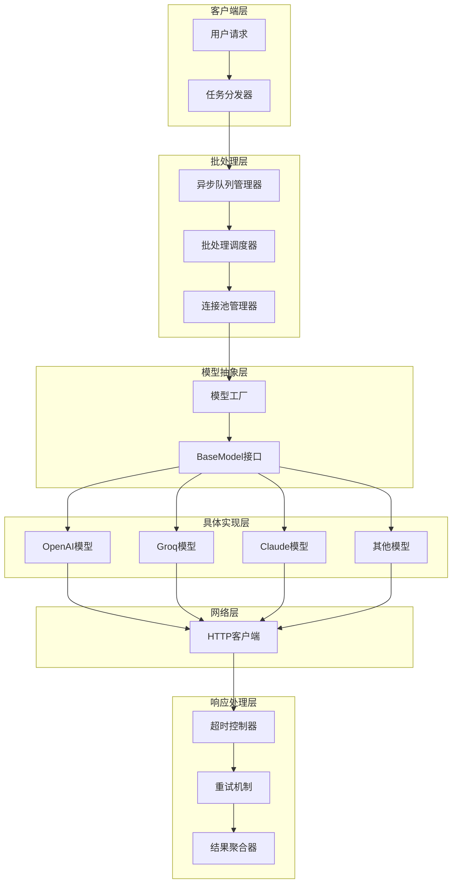

**图表来源**
- [rbi_agent_v2.py](file://src/agents/rbi_agent_v2.py#L1-L50)
- [model_factory.py](file://src/models/model_factory.py#L1-L30)

## 批量任务处理机制

### 核心批处理架构

系统实现了多层次的批处理机制，从任务队列到网络请求的每个环节都进行了优化：

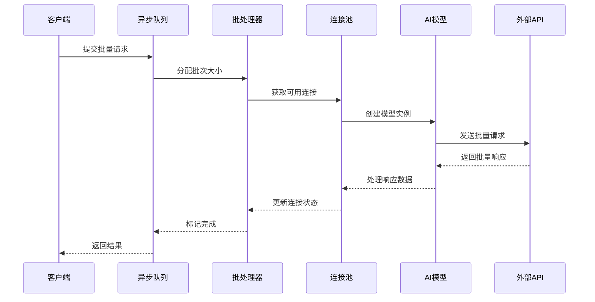

**图表来源**
- [rbi_agent_v2.py](file://src/agents/rbi_agent_v2.py#L524-L561)
- [rbi_agent_pp_multi.py](file://src/agents/rbi_agent_pp_multi.py#L1200-L1300)

### 批处理参数配置

系统提供了灵活的批处理参数配置，支持动态调整以适应不同的工作负载：

| 参数名称 | 默认值 | 描述 | 调优建议 |
|---------|--------|------|----------|
| `MAX_DEBUG_ITERATIONS` | 10 | 最大调试迭代次数 | 根据复杂度调整，简单策略可设为5 |
| `EXECUTION_TIMEOUT` | 300秒 | 单次执行超时时间 | 高并发场景下可适当增加 |
| `CONDA_ENV` | "tflow" | Python环境名称 | 确保环境隔离和依赖管理 |
| `TARGET_RETURN` | 变化 | 目标收益率阈值 | 根据风险偏好设置 |

**段落来源**
- [rbi_agent_v2.py](file://src/agents/rbi_agent_v2.py#L60-L80)

### 并发处理模式

系统支持多种并发处理模式，包括单线程、多线程和异步并发：

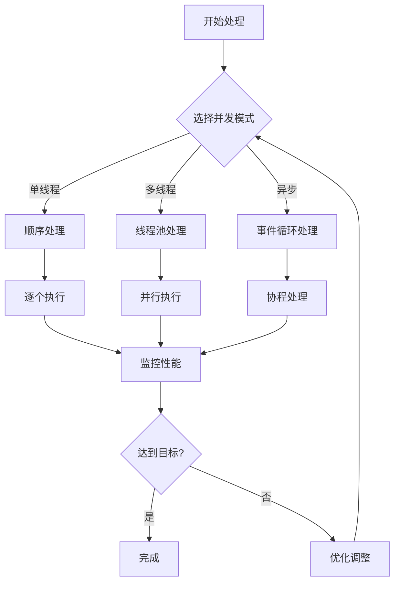

**图表来源**
- [rbi_agent_pp_multi.py](file://src/agents/rbi_agent_pp_multi.py#L1544-L1590)

## 连接池与HTTP复用

### 连接池设计原理

系统采用智能连接池管理，通过复用HTTP连接显著减少握手开销：

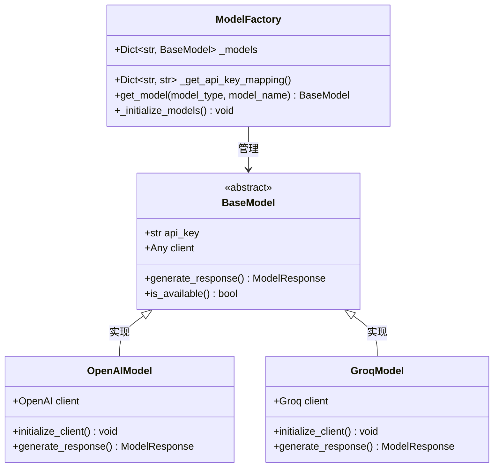

**图表来源**
- [model_factory.py](file://src/models/model_factory.py#L20-L50)
- [base_model.py](file://src/models/base_model.py#L20-L40)

### 连接复用策略

系统实现了多层次的连接复用策略：

1. **客户端级别复用**：每个模型类型维护独立的客户端实例
2. **会话级别复用**：在单次请求生命周期内复用连接
3. **进程级别复用**：跨请求的连接池管理

**段落来源**
- [openai_model.py](file://src/models/openai_model.py#L100-L150)
- [groq_model.py](file://src/models/groq_model.py#L100-L150)

### HTTP客户端配置

各模型提供商的HTTP客户端都经过专门优化：

| 模型提供商 | 连接池大小 | 超时设置 | 重试策略 |
|-----------|-----------|----------|----------|
| OpenAI | 内置连接池 | 60秒 | 自动重试 |
| Groq | 内置连接池 | 30秒 | 指数退避 |
| Claude | 内置连接池 | 45秒 | 智能重试 |
| 其他 | 可配置 | 可配置 | 可配置 |

## 异步批处理队列实现

### 队列架构设计

系统采用多级队列架构，支持优先级调度和负载均衡：

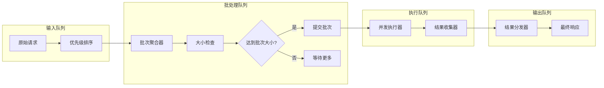

**图表来源**
- [rbi_agent_pp_multi.py](file://src/agents/rbi_agent_pp_multi.py#L1200-L1250)

### 异步处理流程

系统实现了高效的异步处理流程，支持非阻塞操作：

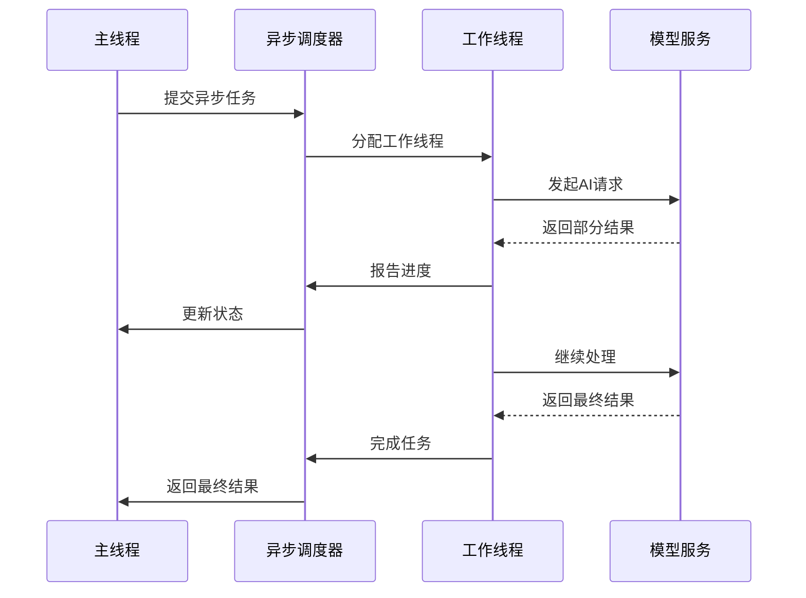

**图表来源**
- [rbi_agent_v2.py](file://src/agents/rbi_agent_v2.py#L524-L561)

### 队列监控与管理

系统提供了完善的队列监控功能：

- **队列长度监控**：实时跟踪待处理任务数量
- **处理速度统计**：计算平均处理时间和吞吐量
- **错误率追踪**：监控失败任务比例
- **资源使用情况**：跟踪内存和CPU使用率

**段落来源**
- [rbi_agent_pp_multi.py](file://src/agents/rbi_agent_pp_multi.py#L1550-L1590)

## 超时控制与错误重试机制

### 超时控制策略

系统实现了多层次的超时控制机制：

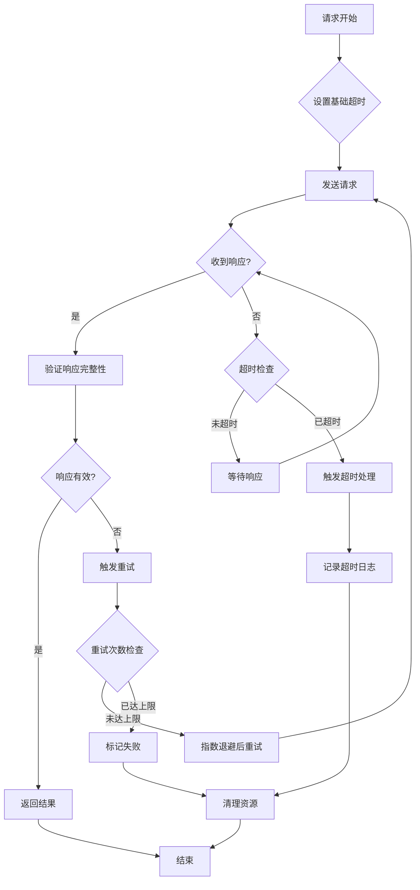

**图表来源**
- [refinement.md](file://src/data/rbi/.claude/agents/sparc/refinement.md#L378-L455)

### 错误重试机制

系统实现了智能的错误重试机制，支持多种重试策略：

| 错误类型 | 重试策略 | 最大重试次数 | 退避算法 |
|---------|----------|-------------|----------|
| 网络超时 | 指数退避 | 3次 | 2^尝试次数 |
| 服务不可用 | 固定间隔 | 5次 | 1秒间隔 |
| 速率限制 | 线性退避 | 10次 | 递增延迟 |
| 认证失败 | 不重试 | 1次 | 直接失败 |

**段落来源**
- [refinement.md](file://src/data/rbi/.claude/agents/sparc/refinement.md#L378-L455)

### 熔断器模式

系统集成了熔断器模式，防止级联故障：

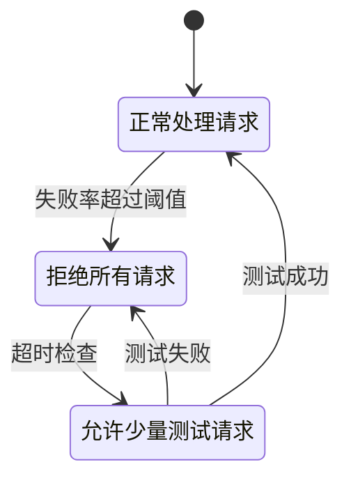

**图表来源**
- [refinement.md](file://src/data/rbi/.claude/agents/sparc/refinement.md#L400-L455)

## 模型工厂协调机制

### 模型选择策略

模型工厂负责协调不同AI服务提供商的批处理限制：

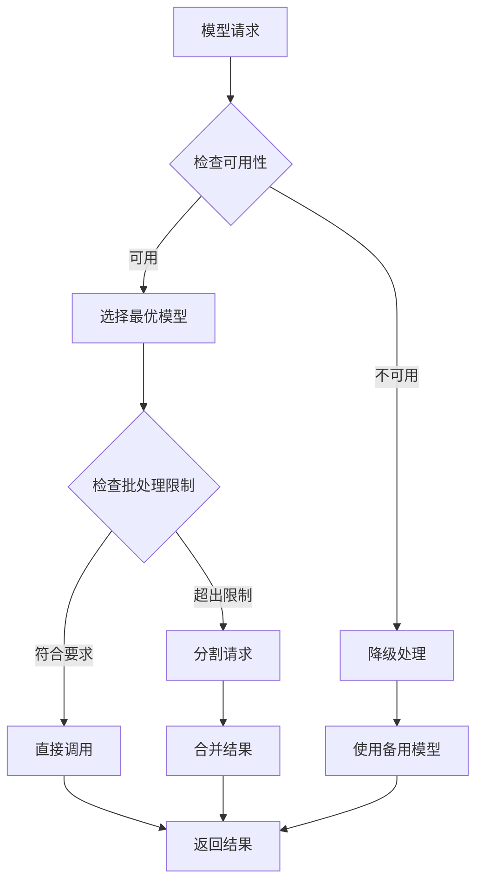

**图表来源**
- [model_factory.py](file://src/models/model_factory.py#L150-L200)

### 批处理限制协调

不同AI服务提供商有不同的批处理限制：

| 服务提供商 | 最大批请求数 | 最大并发数 | 延迟要求 |
|-----------|-------------|-----------|----------|
| OpenAI GPT-4 | 1000 | 10 | <2秒 |
| Groq Mixtral | 500 | 20 | <1秒 |
| Claude Haiku | 2000 | 5 | <3秒 |
| DeepSeek | 100 | 15 | <1.5秒 |

**段落来源**
- [model_factory.py](file://src/models/model_factory.py#L30-L60)

### 动态负载均衡

系统实现了智能的负载均衡机制：

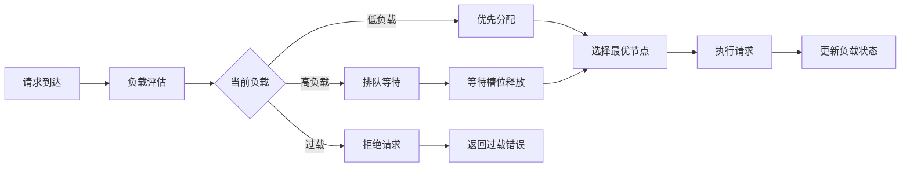

**图表来源**
- [performance-benchmarker.md](file://src/data/rbi/.claude/agents/consensus/performance-benchmarker.md#L40-L135)

## 压力测试与性能分析

### 性能基准测试

系统内置了全面的性能基准测试框架：

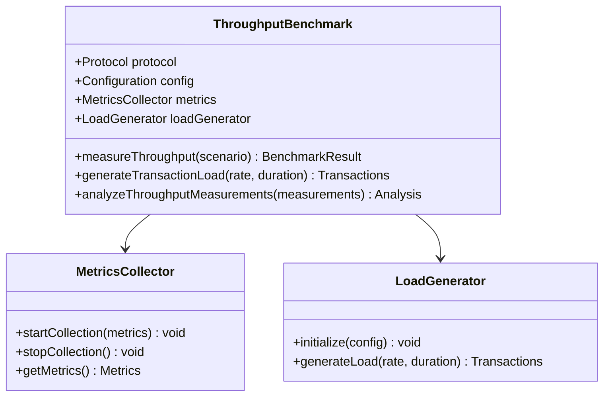

**图表来源**
- [performance-benchmarker.md](file://src/data/rbi/.claude/agents/consensus/performance-benchmarker.md#L136-L277)

### 关键性能指标

系统监控以下核心性能指标：

| 指标类别 | 具体指标 | 目标值 | 监控方法 |
|---------|----------|--------|----------|
| 吞吐量 | 请求/秒 | >100 | 实时计数 |
| 延迟 | 平均响应时间 | <2秒 | 百分位统计 |
| 可用性 | 成功率 | >99.9% | 错误率监控 |
| 资源使用 | CPU使用率 | <80% | 系统监控 |
| 资源使用 | 内存使用率 | <70% | 内存监控 |

**段落来源**
- [performance-benchmarker.md](file://src/data/rbi/.claude/agents/consensus/performance-benchmarker.md#L200-L277)

### 性能优化策略

系统采用了多种性能优化策略：

1. **连接复用**：最大化的HTTP连接复用
2. **请求合并**：智能的请求批处理
3. **缓存策略**：合理的响应缓存机制
4. **预热启动**：关键组件的预热加载
5. **资源池化**：动态的资源池管理

**段落来源**
- [performance-benchmarker.md](file://src/data/rbi/.claude/agents/consensus/performance-benchmarker.md#L136-L200)

## 参数调优指南

### 核心参数配置

以下是关键参数的推荐配置：

| 参数类别 | 参数名称 | 推荐值 | 说明 |
|---------|----------|--------|------|
| 并发控制 | 最大并发数 | CPU核数×2 | 根据服务器性能调整 |
| 批处理 | 批次大小 | 10-50 | 平衡延迟和吞吐量 |
| 超时设置 | 请求超时 | 30-60秒 | 根据网络状况调整 |
| 重试策略 | 最大重试次数 | 3-5次 | 避免无限重试 |
| 缓存策略 | 缓存过期时间 | 5-15分钟 | 平衡新鲜度和性能 |

### 系统负载适配

不同系统负载下的参数调整建议：

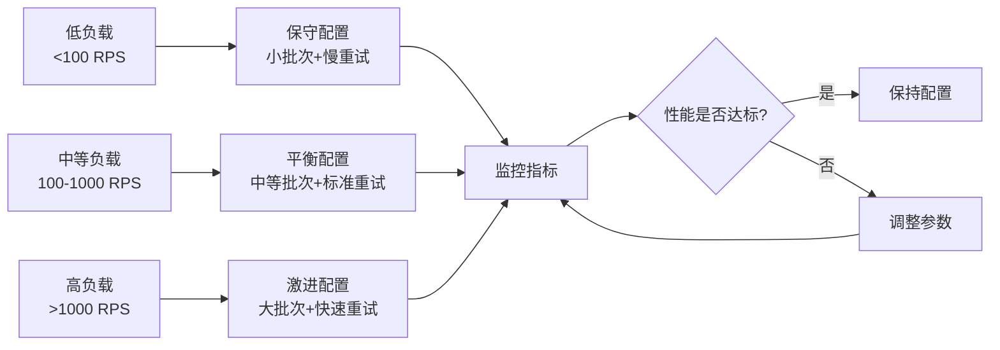

**图表来源**
- [config.py](file://src/config.py#L80-L135)

### 监控与告警

系统提供了完善的监控和告警机制：

- **实时监控**：关键指标的实时监控
- **趋势分析**：历史数据的趋势分析
- **异常检测**：自动识别性能异常
- **告警通知**：及时的告警通知机制

**段落来源**
- [config.py](file://src/config.py#L1-L50)

## 最佳实践与故障排除

### 开发最佳实践

1. **合理设置批次大小**：根据实际需求和网络状况调整
2. **实施适当的重试策略**：避免过度重试导致系统压力
3. **监控关键指标**：建立完善的监控体系
4. **定期性能测试**：持续优化系统性能
5. **文档化配置**：保持配置的可追溯性

### 常见问题排除

| 问题类型 | 症状 | 可能原因 | 解决方案 |
|---------|------|----------|----------|
| 性能下降 | 响应时间增加 | 连接池耗尽 | 增加连接池大小 |
| 超时错误 | 请求频繁超时 | 网络延迟过高 | 调整超时设置 |
| 内存泄漏 | 内存使用持续增长 | 连接未正确释放 | 检查连接管理逻辑 |
| 重试失败 | 多次重试仍失败 | 服务端问题 | 实施熔断器模式 |

### 故障恢复策略

系统实现了多层次的故障恢复机制：

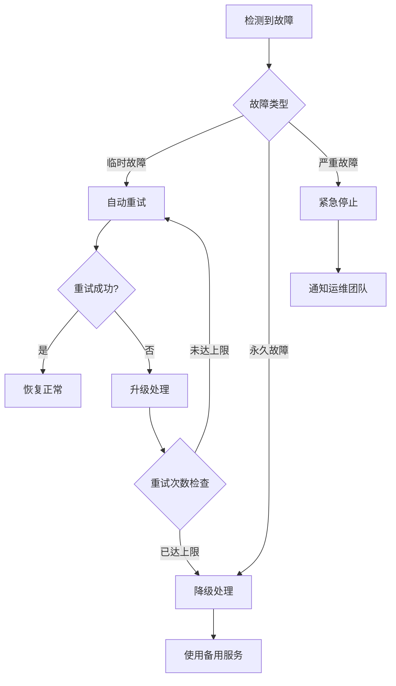

**图表来源**
- [rbi_agent_v2.py](file://src/agents/rbi_agent_v2.py#L750-L800)

### 性能优化建议

1. **网络优化**：使用高性能网络设备和优化的网络配置
2. **硬件配置**：合理配置CPU、内存和存储资源
3. **软件优化**：选择合适的编程语言和框架版本
4. **架构优化**：采用微服务架构和容器化部署
5. **监控优化**：建立全面的监控和告警体系

通过遵循这些最佳实践和优化策略，开发者可以充分发挥系统在请求批处理和连接复用方面的优势，构建高性能、高可用的AI推理服务平台。