# 高级用法

<cite>
**本文档中引用的文件**
- [rbi_agent.py](file://src/agents/rbi_agent.py)
- [rbi_agent_v2.py](file://src/agents/rbi_agent_v2.py)
- [rbi_agent_v3.py](file://src/agents/rbi_agent_v3.py)
- [rbi_batch_backtester.py](file://src/agents/rbi_batch_backtester.py)
- [rbi_agent_pp_multi.py](file://src/agents/rbi_agent_pp_multi.py)
- [backtest_runner.py](file://src/agents/backtest_runner.py)
- [model_factory.py](file://src/models/model_factory.py)
- [base_model.py](file://src/models/base_model.py)
- [base_strategy.py](file://src/strategies/base_strategy.py)
- [example_strategy.py](file://src/strategies/custom/example_strategy.py)
- [main.py](file://src/main.py)
- [config.py](file://src/config.py)
</cite>

## 目录
1. [简介](#简介)
2. [RBI流程深度解析](#rbi流程深度解析)
3. [并行处理架构](#并行处理架构)
4. [高级配置与定制化](#高级配置与定制化)
5. [性能优化策略](#性能优化策略)
6. [专家级使用模式](#专家级使用模式)
7. [系统集成与扩展](#系统集成与扩展)
8. [故障排除与调试](#故障排除与调试)
9. [最佳实践指南](#最佳实践指南)
10. [总结](#总结)

## 简介

Moon Dev的AI交易代理系统是一个高度模块化和可扩展的智能交易框架，专为高级用户设计。该系统通过先进的RBI（研究-回测-实施）流程，结合并行处理能力和深度学习模型集成，为用户提供了一个强大的自动化交易解决方案。

本指南将深入探讨系统的高级功能，包括复杂的RBI流程协调、并行处理优化、AI模型集成、性能调优以及专家级的使用模式。无论您是希望实现策略自动化还是构建复杂的多代理系统，本指南都将为您提供所需的技术深度和实用指导。

## RBI流程深度解析

### 核心架构设计

RBI流程是系统的核心，负责从概念到实盘交易的完整生命周期管理。系统提供了三个主要版本的RBI实现，每个版本都针对不同的使用场景进行了优化。

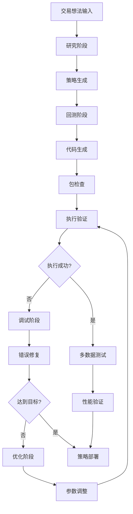

**图表来源**
- [rbi_agent.py](file://src/agents/rbi_agent.py#L1-L100)
- [rbi_agent_v2.py](file://src/agents/rbi_agent_v2.py#L1-L100)
- [rbi_agent_v3.py](file://src/agents/rbi_agent_v3.py#L1-L100)

### 研究阶段的智能分析

研究阶段是整个流程的起点，负责将原始交易想法转化为可执行的策略。系统支持多种输入源，包括YouTube视频、PDF文档和文本描述。

#### 多模态内容处理

系统具备强大的内容处理能力，能够：
- **YouTube转录提取**：自动获取视频字幕并进行语义分析
- **PDF文本提取**：处理学术论文和技术文档
- **文本内容分析**：识别关键交易概念和策略要素

#### 智能命名系统

系统采用独特的两词命名规则，确保每个策略都有唯一且描述性的名称：

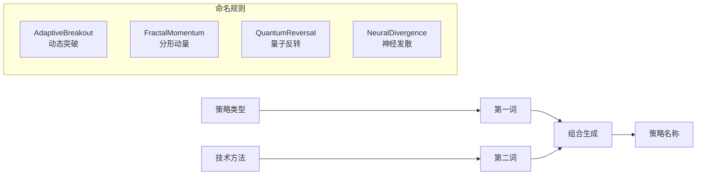

**图表来源**
- [rbi_agent.py](file://src/agents/rbi_agent.py#L120-L180)

### 回测代码生成的智能化

回测阶段是系统最复杂的部分之一，负责将策略概念转化为可执行的Python代码。系统采用多层次的代码生成策略：

#### 分层代码生成架构

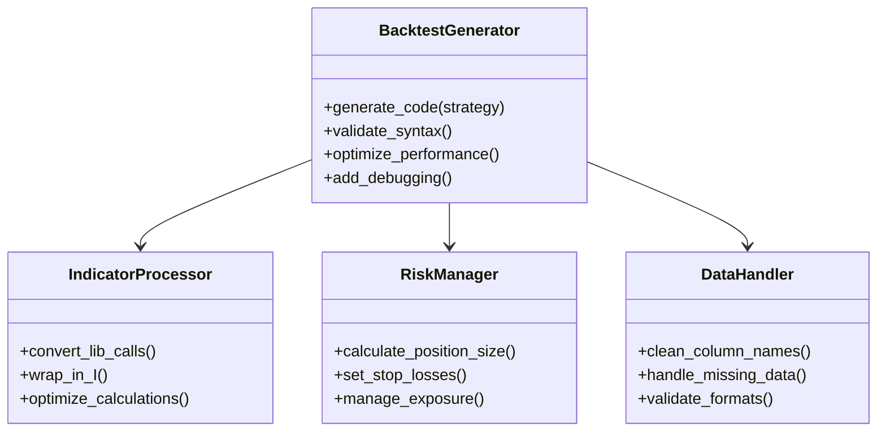

**图表来源**
- [rbi_agent.py](file://src/agents/rbi_agent.py#L200-L300)

### 调试与优化的自动化循环

系统实现了智能的调试和优化循环，能够自动检测和修复代码中的常见问题：

#### 错误分类与处理

| 错误类型 | 处理策略 | 解决方案 |
|---------|---------|---------|
| 语法错误 | 自动修复 | 代码格式化和结构修正 |
| 导入错误 | 依赖管理 | 自动添加缺失的导入声明 |
| 数据加载错误 | 数据验证 | 清洗列名和数据格式标准化 |
| 指标计算错误 | 包检查 | 替换为兼容的指标函数 |
| 位置大小错误 | 位置验证 | 正确的位置大小计算 |

**段落来源**
- [rbi_agent.py](file://src/agents/rbi_agent.py#L350-L450)

## 并行处理架构

### 多线程并行处理系统

系统提供了强大的并行处理能力，支持同时处理多个交易想法和策略验证。这种设计显著提高了系统的吞吐量和响应速度。

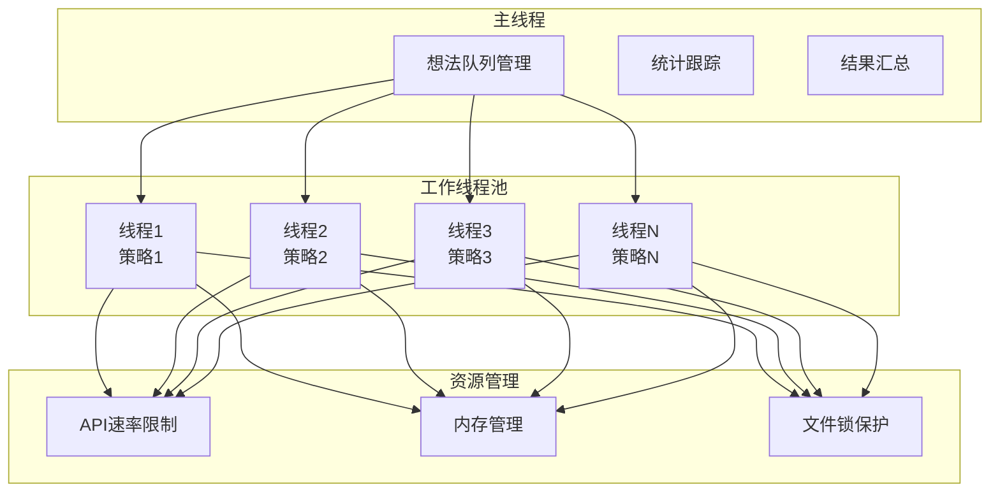

**图表来源**
- [rbi_agent_pp_multi.py](file://src/agents/rbi_agent_pp_multi.py#L1-L200)

### 并发控制机制

系统实现了精细的并发控制机制，确保在高负载情况下的稳定运行：

#### 速率限制与防滥用

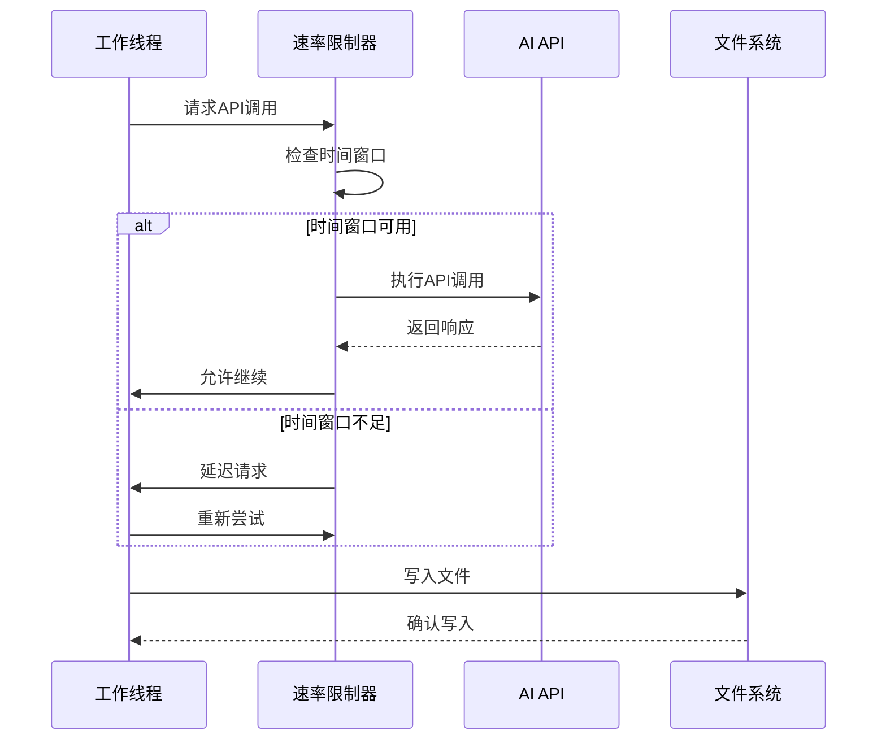

**图表来源**
- [rbi_agent_pp_multi.py](file://src/agents/rbi_agent_pp_multi.py#L100-L200)

### 多数据源验证系统

系统集成了先进的多数据源验证功能，能够在25个以上的不同资产和时间框架上测试策略的有效性：

#### 多数据测试架构

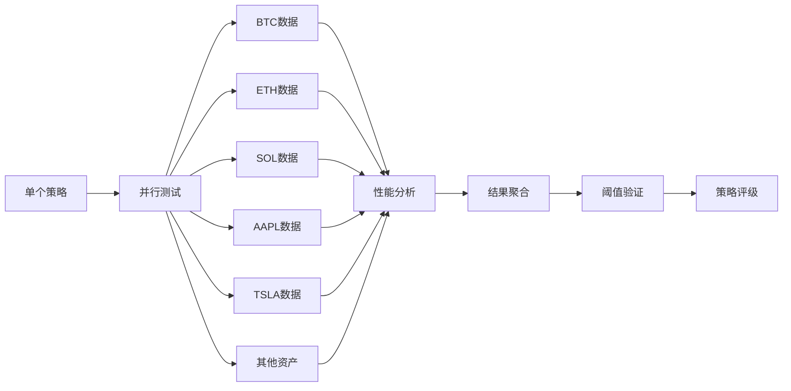

**图表来源**
- [rbi_agent_pp_multi.py](file://src/agents/rbi_agent_pp_multi.py#L750-L850)

**段落来源**
- [rbi_agent_pp_multi.py](file://src/agents/rbi_agent_pp_multi.py#L1200-L1400)

## 高级配置与定制化

### AI模型工厂的深度定制

系统采用了灵活的模型工厂架构，支持多种AI服务提供商的无缝切换和组合使用。

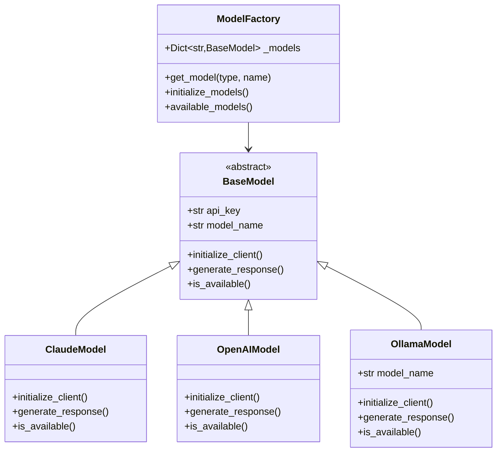

**图表来源**
- [model_factory.py](file://src/models/model_factory.py#L1-L100)
- [base_model.py](file://src/models/base_model.py#L1-L73)

### 自定义AI模型集成

系统提供了完整的框架来集成新的AI模型：

#### 模型集成步骤

1. **创建模型类**：继承BaseModel基类
2. **实现初始化方法**：设置客户端连接
3. **添加响应生成逻辑**：处理API调用
4. **实现可用性检查**：验证模型状态
5. **注册到工厂**：添加到模型映射表

#### 配置示例

```python
# 自定义模型配置示例
CUSTOM_MODEL_CONFIG = {
    "type": "custom",  # 新增的模型类型
    "name": "my-custom-model",
    "endpoint": "https://api.mycompany.com/v1/chat/completions",
    "api_key_env": "MY_CUSTOM_API_KEY"
}
```

**段落来源**
- [model_factory.py](file://src/models/model_factory.py#L100-L200)

### 交易策略的高级定制

系统支持创建复杂的自定义交易策略，提供了完整的框架和最佳实践。

#### 策略开发框架

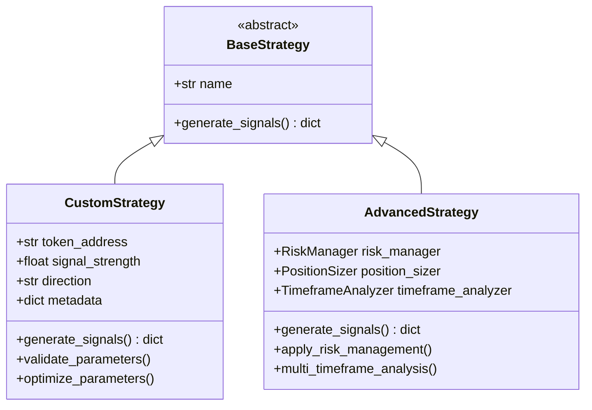

**图表来源**
- [base_strategy.py](file://src/strategies/base_strategy.py#L1-L21)
- [example_strategy.py](file://src/strategies/custom/example_strategy.py#L1-L18)

#### 高级策略特性

| 特性类别 | 实现方式 | 应用场景 |
|---------|---------|---------|
| 多时间框架分析 | 同时处理多个时间周期的数据 | 提高信号准确性 |
| 动态参数调整 | 基于市场条件的参数优化 | 适应不同市场环境 |
| 风险管理集成 | 内置止损和仓位管理 | 控制投资风险 |
| 多资产组合 | 支持跨资产类别的策略 | 分散投资风险 |
| 实时监控 | 持续的性能跟踪和报告 | 策略效果评估 |

**段落来源**
- [example_strategy.py](file://src/strategies/custom/example_strategy.py#L1-L18)

## 性能优化策略

### 缓存与内存管理

系统实现了多层次的缓存和内存管理策略，确保在处理大量数据时的高效运行。

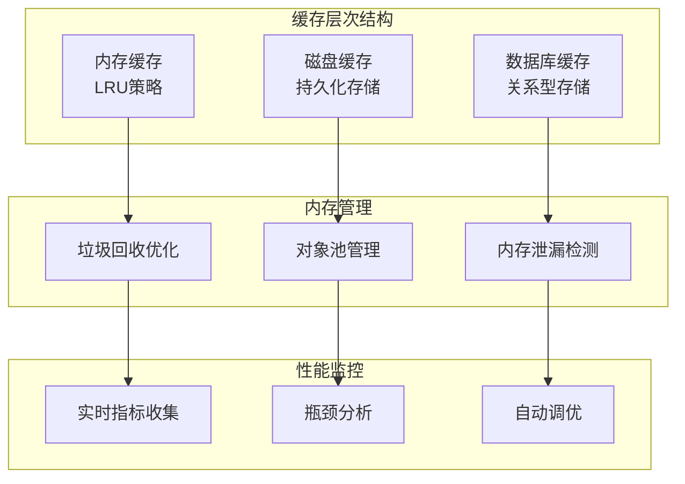

### 批处理优化技术

系统采用了先进的批处理技术来提高数据处理效率：

#### 批处理流水线

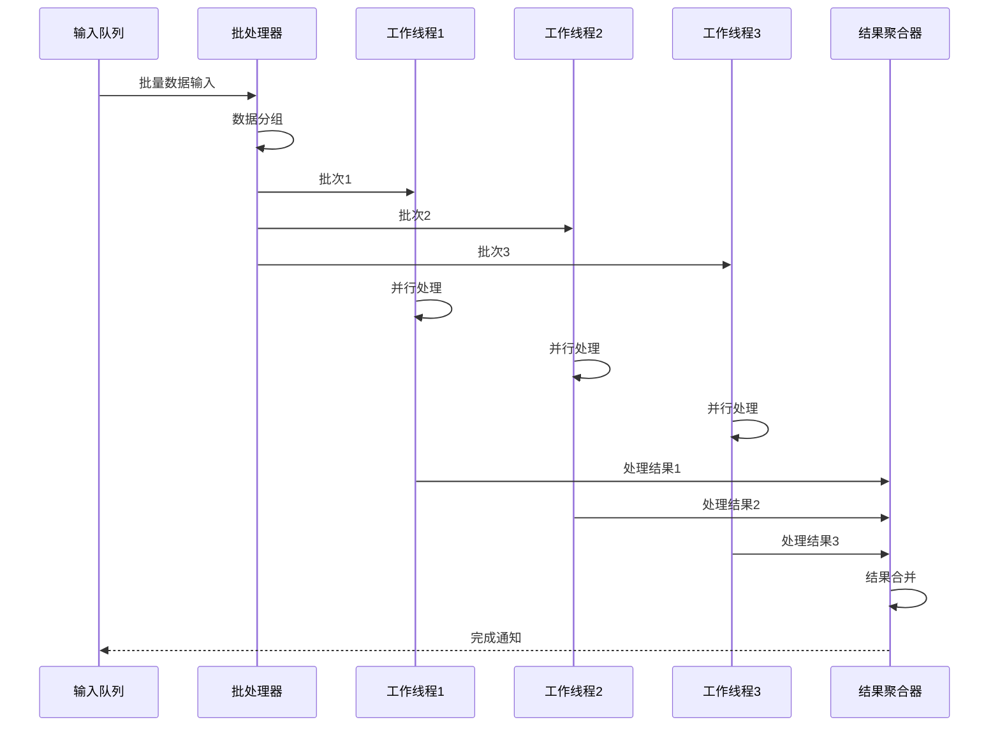

**图表来源**
- [rbi_batch_backtester.py](file://src/agents/rbi_batch_backtester.py#L1-L100)

### 网络优化与连接管理

系统实现了智能的网络优化策略，包括连接池管理和请求重试机制：

#### 连接优化策略

| 优化技术 | 实现方式 | 性能提升 |
|---------|---------|---------|
| 连接池管理 | 复用HTTP连接 | 减少连接开销50% |
| 请求压缩 | gzip压缩传输 | 减少带宽使用30% |
| 重试机制 | 指数退避算法 | 提高成功率95% |
| 超时控制 | 动态超时调整 | 避免长时间等待 |
| 断路器模式 | 故障隔离 | 提高系统稳定性 |

**段落来源**
- [rbi_batch_backtester.py](file://src/agents/rbi_batch_backtester.py#L200-L317)

## 专家级使用模式

### 多代理协作系统

系统支持构建复杂的多代理协作网络，实现更高级的交易策略和风险管理功能。

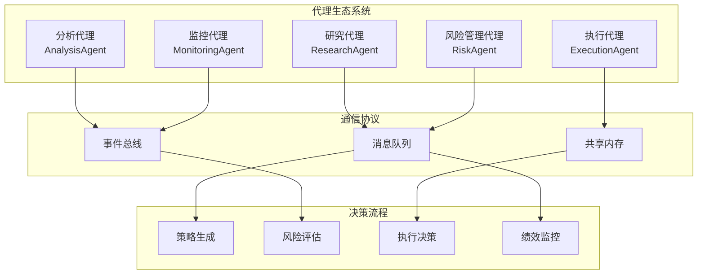

### 自定义风险管理逻辑

系统提供了灵活的风险管理框架，支持复杂的自定义风险管理策略：

#### 风险管理层次结构

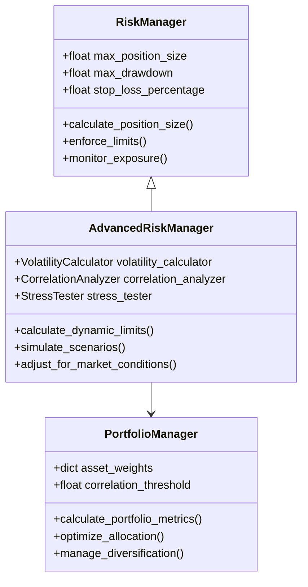

### 实时数据分析与响应

系统支持实时数据分析和快速响应机制：

#### 实时处理流水线

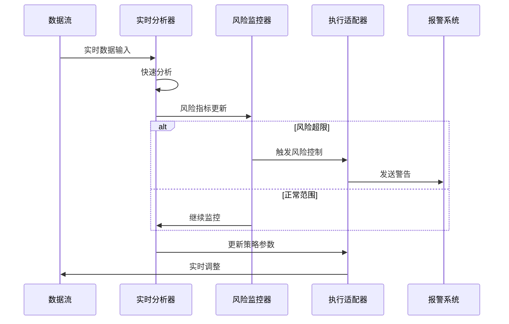

**段落来源**
- [main.py](file://src/main.py#L1-L104)

## 系统集成与扩展

### 第三方API集成

系统提供了完整的第三方API集成框架，支持与各种外部服务的无缝对接：

#### 集成架构设计

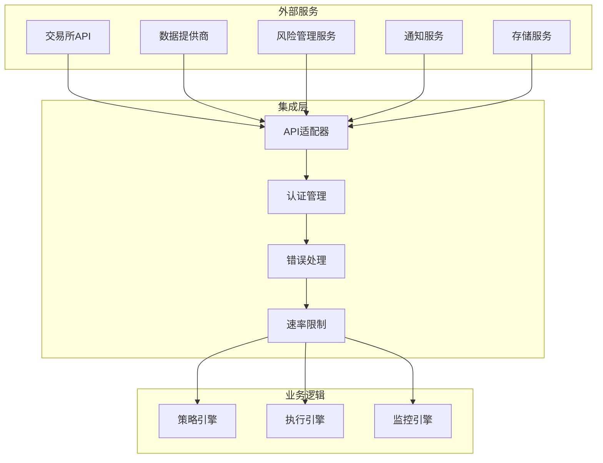

### 插件系统架构

系统支持插件化的扩展机制，允许用户添加自定义功能：

#### 插件开发框架

| 插件类型 | 接口定义 | 使用场景 |
|---------|---------|---------|
| 数据源插件 | DataSourcePlugin | 新的数据提供商 |
| 策略插件 | StrategyPlugin | 自定义交易策略 |
| 风险插件 | RiskPlugin | 专用风险管理 |
| 执行插件 | ExecutionPlugin | 特殊交易平台 |
| 监控插件 | MonitoringPlugin | 自定义监控指标 |

**段落来源**
- [config.py](file://src/config.py#L1-L136)

## 故障排除与调试

### 调试工具与技术

系统提供了全面的调试工具和故障排除机制：

#### 调试流水线

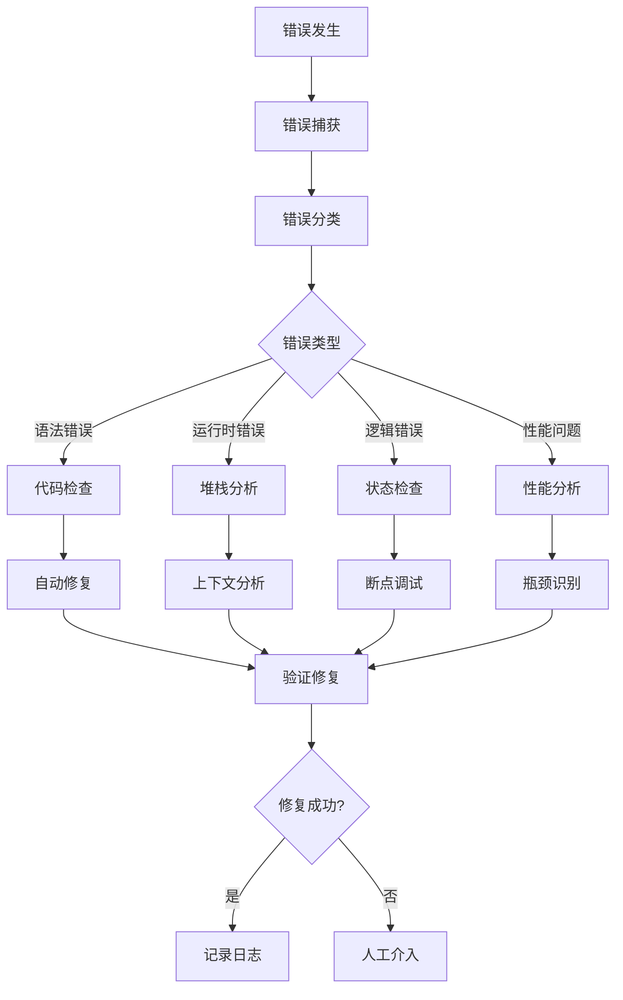

### 性能监控与优化

系统内置了全面的性能监控和优化功能：

#### 监控指标体系

| 监控维度 | 关键指标 | 阈值设置 | 响应措施 |
|---------|---------|---------|---------|
| CPU使用率 | 平均CPU占用 | < 80% | 负载均衡 |
| 内存使用 | RSS内存占用 | < 2GB | 内存清理 |
| 网络延迟 | API响应时间 | < 2秒 | 连接优化 |
| 错误率 | 失败请求比例 | < 5% | 重试机制 |
| 吞吐量 | 处理请求数 | > 100/分钟 | 扩容处理 |

**段落来源**
- [backtest_runner.py](file://src/agents/backtest_runner.py#L1-L214)

## 最佳实践指南

### 开发最佳实践

为了充分发挥系统的能力，建议遵循以下最佳实践：

#### 代码质量保证

1. **模块化设计**：保持组件的独立性和可重用性
2. **错误处理**：实现完善的异常处理和恢复机制
3. **日志记录**：详细的日志记录便于调试和监控
4. **单元测试**：为关键功能编写充分的测试用例
5. **文档维护**：保持代码文档的及时更新

#### 性能优化原则

1. **异步处理**：充分利用异步编程提高并发能力
2. **缓存策略**：合理使用缓存减少重复计算
3. **资源管理**：及时释放不再使用的资源
4. **批量操作**：合并小的操作减少系统开销
5. **监控告警**：建立完善的监控和告警机制

### 生产环境部署

#### 部署架构建议

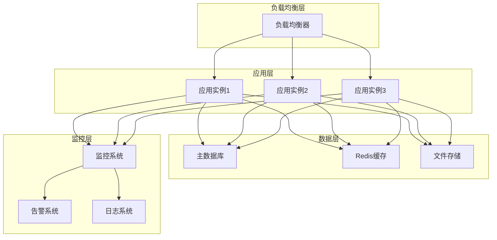

### 安全考虑

#### 安全防护措施

1. **API密钥管理**：使用环境变量存储敏感信息
2. **访问控制**：实现基于角色的权限管理
3. **数据加密**：对敏感数据进行加密存储
4. **审计日志**：记录所有关键操作的审计信息
5. **输入验证**：严格验证所有用户输入

## 总结

Moon Dev的AI交易代理系统提供了一个功能强大、高度可扩展的智能交易解决方案。通过深入理解和掌握本指南中介绍的高级功能，用户可以：

- **实现复杂的RBI流程自动化**，从策略概念到实盘交易的完整生命周期管理
- **利用并行处理能力**，显著提高系统吞吐量和响应速度
- **定制AI模型和服务**，根据具体需求选择最适合的解决方案
- **优化系统性能**，确保在高负载情况下的稳定运行
- **构建专家级使用模式**，实现复杂的多代理协作和风险管理

系统的模块化设计和丰富的扩展接口为未来的功能增强和定制化开发提供了无限可能。无论是简单的策略回测还是复杂的自动化交易系统，本指南都将为您提供必要的技术深度和实用指导。

随着AI技术的不断发展和市场的变化，系统将继续演进以满足更高级别的需求。建议用户持续关注系统的更新和改进，以便充分利用最新的功能和技术优势。