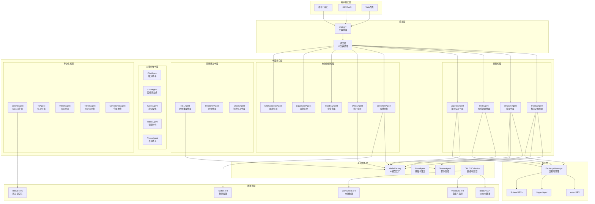
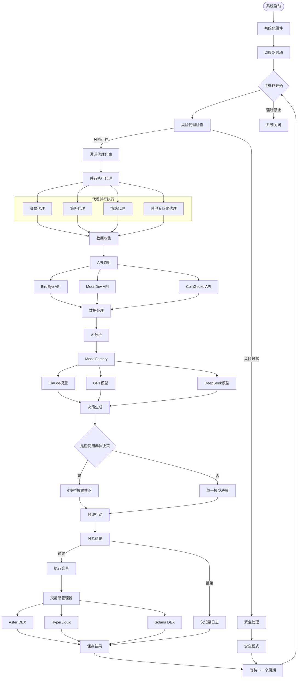

# Moon Dev AI Agents 系统架构

## 概述

Moon Dev AI Agents 是一个模块化、可扩展的AI驱动交易系统，采用多代理架构设计，支持48+个专业化AI代理协同工作，实现智能化的加密货币交易决策和执行。

## 系统架构图



## 数据流程图



## 核心组件详解

### 1. 主编排器 (main.py)

**职责**: 系统的核心控制器，负责协调所有代理的运行

**主要功能**:
- 15分钟循环调度机制
- 代理生命周期管理
- 错误处理和恢复
- 性能监控和日志记录

**关键配置**:
```python
SLEEP_BETWEEN_RUNS_MINUTES = 15
ACTIVE_AGENTS = {
    'trading': True,
    'strategy': True,
    'risk': True,
    'sentiment': True,
    # ... 其他代理配置
}
```

### 2. 代理生态系统

#### 交易核心代理
- **TradingAgent**: 核心交易决策和执行
- **StrategyAgent**: 策略信号生成和验证
- **RiskAgent**: 风险管理和仓位控制
- **CopyBotAgent**: 复制交易和跟单

#### 市场分析代理
- **SentimentAgent**: Twitter情绪分析
- **WhaleAgent**: 大户地址监控
- **FundingAgent**: 资金费率分析
- **LiquidationAgent**: 清算数据监控
- **ChartAnalysisAgent**: 技术图表分析

#### 内容创作代理
- **ChatAgent**: 智能对话助手
- **ClipsAgent**: 短视频内容生成
- **TweetAgent**: 推文内容创作
- **VideoAgent**: 视频内容制作
- **PhoneAgent**: 语音交互助手

#### 策略开发代理
- **RBI Agent**: 研究推理，从视频/PDF生成策略
- **ResearchAgent**: 市场研究和数据分析
- **SniperAgent**: 快速狙击交易

### 3. 基础设施层

#### ModelFactory (AI模型工厂)
- **统一接口**: 为所有代理提供一致的AI模型访问
- **多提供商支持**: Claude、OpenAI、DeepSeek、Groq、Gemini、Ollama
- **智能切换**: 根据任务类型自动选择最适合的模型
- **成本优化**: 平衡性能和成本

#### SwarmAgent (群体智能)
- **多模型协作**: 同时查询6个不同AI模型
- **共识机制**: 投票决策提高准确性
- **置信度计算**: 量化决策的可信程度

#### OHLCVCollector (数据收集器)
- **实时数据**: 收集最新的市场数据
- **历史数据**: 维护完整的价格历史
- **多源整合**: 整合多个数据源的信息
- **数据清洗**: 确保数据质量和一致性

### 4. 数据源集成

#### 主要API提供商
- **BirdEye API**: Solana生态系统专业数据
- **MoonDev API**: 自定义交易信号和分析
- **CoinGecko API**: 15,000+代币市场数据
- **Helius RPC**: Solana区块链交互
- **Twitter API**: 社交媒体情绪数据

### 5. 交易所集成

#### 支持的交易所
- **Aster DEX**: 去中心化期货交易
- **HyperLiquid**: 高性能永续合约
- **Solana DEXs**: 链上直接交易

## 系统特性

### 🚀 高性能特性
- **并行处理**: 多代理并行执行
- **异步IO**: 高效的网络请求处理
- **智能缓存**: 减少重复API调用
- **连接池**: 复用网络连接

### 🛡️ 安全特性
- **多层风险控制**: 代理级、系统级、交易所级
- **API密钥管理**: 安全的密钥存储和访问
- **交易限额**: 可配置的金额和频率限制
- **紧急停止**: 一键停止所有交易活动

### 📊 监控特性
- **实时监控**: 系统状态和性能指标
- **详细日志**: 完整的操作记录
- **错误追踪**: 自动错误检测和报告
- **性能分析**: 交易效果统计

### 🔧 可扩展性
- **模块化设计**: 易于添加新代理
- **插件架构**: 支持第三方扩展
- **配置驱动**: 灵活的参数配置
- **API开放**: 支持外部集成

## 部署架构

### 开发环境
```bash
# 本地开发环境
conda activate tflow
python src/main.py
```

### 生产环境
```bash
# Docker容器化部署
docker-compose up -d

# 或Kubernetes集群
kubectl apply -f k8s/
```

### 云原生支持
- **容器化**: Docker和Kubernetes支持
- **微服务**: 代理可独立部署
- **负载均衡**: 支持水平扩展
- **监控集成**: Prometheus + Grafana

## 性能指标

### 系统性能
- **响应时间**: < 2秒 (单代理决策)
- **并发处理**: 支持50+并发代理
- **内存使用**: < 2GB (正常运行)
- **CPU使用**: < 30% (平均负载)

### 交易性能
- **决策延迟**: < 5秒 (完整分析周期)
- **执行速度**: < 1秒 (订单提交)
- **成功率**: > 95% (正常网络条件)
- **滑点控制**: < 2% (默认设置)

## 故障恢复

### 自动恢复机制
- **重试策略**: 指数退避重试
- **降级服务**: 核心功能优先保障
- **状态恢复**: 自动恢复到安全状态
- **通知系统**: 错误和异常通知

### 手动恢复选项
- **紧急停止**: 立即停止所有交易
- **仓位平仓**: 强制平掉所有持仓
- **配置重置**: 恢复到默认配置
- **数据备份**: 定期数据备份和恢复

这个架构设计确保了系统的高可用性、可扩展性和安全性，为AI驱动的量化交易提供了坚实的技术基础。