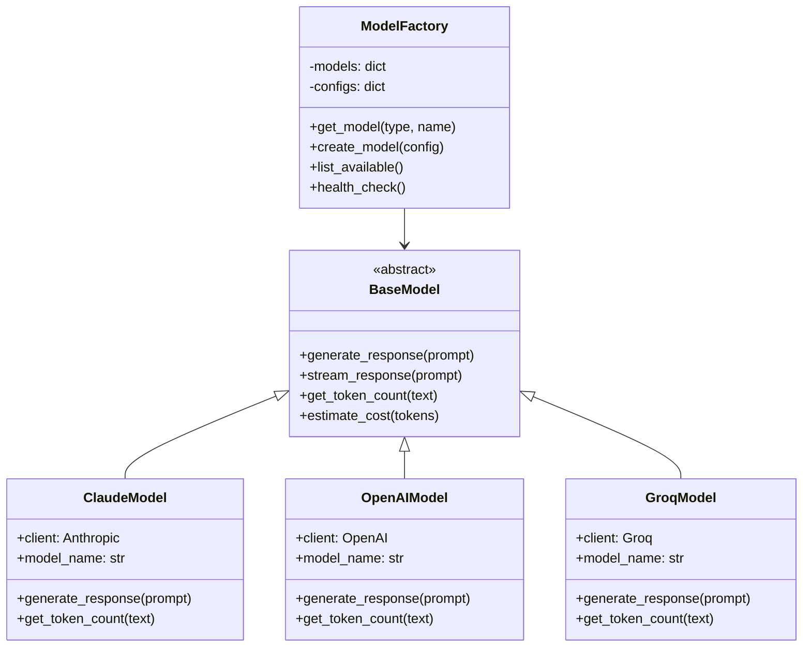

# LLM 集成指南 - ModelFactory 完全参考

## 概述

ModelFactory 是 Moon Dev AI Agents 的核心 AI 模型管理组件，提供统一的接口来访问多个主流 AI 服务提供商。它支持无缝切换不同的 AI 模型，实现了模型抽象、智能路由、成本优化和错误恢复等功能。

## 目录

1. [架构设计](#架构设计)
2. [支持的模型](#支持的模型)
3. [快速开始](#快速开始)
4. [详细配置](#详细配置)
5. [高级用法](#高级用法)
6. [性能优化](#性能优化)
7. [错误处理](#错误处理)
8. [最佳实践](#最佳实践)
9. [故障排除](#故障排除)

## 架构设计

### 核心设计原则



### 关键特性

- **统一接口**: 所有 AI 模型使用相同的 API
- **智能路由**: 根据任务类型自动选择最适合的模型
- **成本优化**: 自动选择性价比最高的模型
- **故障转移**: 模型不可用时自动切换到备用模型
- **负载均衡**: 多个模型实例之间的请求分配
- **缓存机制**: 重复请求的智能缓存

## 支持的模型

### Anthropic Claude

| 模型名称 | 特点 | 适用场景 | 成本等级 |
|---------|------|---------|---------|
| claude-3-5-sonnet-20241022 | 最强性能 | 复杂分析、创意任务 | 高 |
| claude-3-5-haiku-20241022 | 快速平衡 | 实时分析、决策 | 中 |
| claude-3-opus-20240229 | 高精度 | 关键决策、深度分析 | 最高 |
| claude-3-sonnet-20240229 | 平衡选择 | 通用任务 | 中高 |
| claude-3-haiku-20240307 | 极速响应 | 简单查询、实时处理 | 低 |

### OpenAI GPT

| 模型名称 | 特点 | 适用场景 | 成本等级 |
|---------|------|---------|---------|
| gpt-4o-2024-11-20 | 最新优化版 | 综合性能最佳 | 高 |
| gpt-4o-mini | 轻量版 | 快速响应、成本敏感 | 低 |
| gpt-4-turbo | 高性能 | 复杂任务 | 高 |
| gpt-3.5-turbo | 基础版 | 简单任务、低成本 | 最低 |

### Google Gemini

| 模型名称 | 特点 | 适用场景 | 成本等级 |
|---------|------|---------|---------|
| gemini-2.5-flash | 快速响应 | 实时分析 | 中 |
| gemini-2.0-flash-exp | 实验版本 | 最新功能测试 | 中 |
| gemini-1.5-pro | 高性能 | 复杂推理 | 高 |
| gemini-1.5-flash | 平衡选择 | 通用任务 | 中低 |

### Groq (Llama)

| 模型名称 | 特点 | 适用场景 | 成本等级 |
|---------|------|---------|---------|
| llama3-70b-8192 | 高性能 | 复杂任务 | 中 |
| mixtral-8x7b-32768 | 混合专家 | 多领域任务 | 中 |
| llama3-8b-8192 | 快速响应 | 实时处理 | 低 |

### DeepSeek

| 模型名称 | 特点 | 适用场景 | 成本等级 |
|---------|------|---------|---------|
| deepseek-reasoner | 强化推理 | 逻辑推理、策略分析 | 中 |
| deepseek-coder | 代码专用 | 代码生成、分析 | 中 |

### xAI (Grok)

| 模型名称 | 特点 | 适用场景 | 成本等级 |
|---------|------|---------|---------|
| grok-4-fast-reasoning | 快速推理 | 实时决策 | 中高 |
| grok-2-latest | 通用版本 | 综合任务 | 高 |

### Ollama (本地)

| 模型名称 | 特点 | 适用场景 | 成本等级 |
|---------|------|---------|---------|
| llama3.2 | 开源本地 | 隐私敏感、离线 | 免费 |
| codellama | 代码专用 | 本地代码生成 | 免费 |
| mistral | 轻量本地 | 资源受限环境 | 免费 |

## 快速开始

### 1. 基本使用

```python
from src.models.model_factory import ModelFactory

# 创建工厂实例
factory = ModelFactory()

# 获取默认 Claude 模型
claude_model = factory.get_model('claude')

# 生成响应
response = claude_model.generate_response(
    system_prompt="你是一个专业的金融分析师。",
    user_content="分析比特币的短期走势。",
    temperature=0.3,
    max_tokens=500
)

print(response)
```

### 2. 多模型比较

```python
# 同时使用多个模型
models = {
    'claude': factory.get_model('claude'),
    'openai': factory.get_model('openai'),
    'groq': factory.get_model('groq')
}

prompt = "现在是否应该买入以太坊？"

results = {}
for name, model in models.items():
    response = model.generate_response(
        system_prompt="你是专业的加密货币交易顾问。",
        user_content=prompt,
        temperature=0.2
    )
    results[name] = response

# 比较结果
for name, response in results.items():
    print(f"\n{name.upper()} 的建议:")
    print(response)
```

### 3. 智能路由

```python
# 根据任务类型自动选择模型
def analyze_market_sentiment(text: str) -> str:
    """分析市场情绪 - 使用快速模型"""
    model = factory.get_model('groq')  # 快速响应
    return model.generate_response(
        system_prompt="分析给定文本的市场情绪（正面/负面/中性）。",
        user_content=text,
        temperature=0.1,
        max_tokens=100
    )

def generate_trading_strategy(market_data: dict) -> str:
    """生成交易策略 - 使用高性能模型"""
    model = factory.get_model('claude-3-5-sonnet-20241022')  # 高精度
    return model.generate_response(
        system_prompt="基于市场数据生成详细的交易策略。",
        user_content=str(market_data),
        temperature=0.3,
        max_tokens=1000
    )
```

## 详细配置

### 1. 环境变量配置

在 `.env` 文件中配置 API 密钥：

```bash
# Anthropic Claude
ANTHROPIC_KEY=sk-ant-api03-...

# OpenAI
OPENAI_KEY=sk-proj-...

# Google Gemini
GEMINI_KEY=AIzaSy...

# Groq
GROQ_API_KEY=gsk_...

# DeepSeek
DEEPSEEK_KEY=sk-...

# xAI (Grok)
GROK_API_KEY=xai-...

# OpenRouter (可选)
OPENROUTER_API_KEY=sk-or-...

# Ollama 本地配置
OLLAMA_BASE_URL=http://localhost:11434
```

### 2. 模型工厂配置

```python
# 自定义模型工厂配置
from src.models.model_factory import ModelFactory

config = {
    'default_model': 'claude-3-5-haiku-20241022',
    'fallback_models': ['groq', 'openai'],
    'timeout': 30,
    'max_retries': 3,
    'cache_enabled': True,
    'cache_ttl': 300,  # 5分钟
    'cost_optimization': True,
    'model_preferences': {
        'speed': ['groq', 'claude-3-5-haiku', 'gpt-4o-mini'],
        'accuracy': ['claude-3-5-sonnet', 'gpt-4o', 'gemini-1.5-pro'],
        'cost': ['gpt-4o-mini', 'claude-3-haiku', 'groq']
    }
}

factory = ModelFactory(config)
```

### 3. 特定模型配置

```python
# Claude 模型配置
claude_config = {
    'model_name': 'claude-3-5-sonnet-20241022',
    'max_tokens': 4096,
    'temperature': 0.7,
    'timeout': 30,
    'api_key': os.getenv('ANTHROPIC_KEY'),
    'organization': None  # 组织 ID (可选)
}

claude_model = factory.create_model('claude', claude_config)

# OpenAI 模型配置
openai_config = {
    'model_name': 'gpt-4o',
    'max_tokens': 4096,
    'temperature': 0.7,
    'timeout': 30,
    'api_key': os.getenv('OPENAI_KEY'),
    'organization': os.getenv('OPENAI_ORG_ID'),
    'base_url': None  # 自定义端点 (可选)
}

openai_model = factory.create_model('openai', openai_config)
```

### 4. 批量配置

```python
# 批量配置多个模型
batch_configs = {
    'claude': {
        'models': [
            {'name': 'claude-3-5-sonnet-20241022', 'priority': 1},
            {'name': 'claude-3-5-haiku-20241022', 'priority': 2},
            {'name': 'claude-3-opus-20240229', 'priority': 3}
        ],
        'default': 'claude-3-5-sonnet-20241022'
    },
    'openai': {
        'models': [
            {'name': 'gpt-4o-2024-11-20', 'priority': 1},
            {'name': 'gpt-4o-mini', 'priority': 2}
        ],
        'default': 'gpt-4o-2024-11-20'
    }
}

factory.configure_models(batch_configs)
```

## 高级用法

### 1. 流式响应

```python
# 使用流式响应获取实时输出
model = factory.get_model('claude')

def stream_response(prompt: str):
    """流式获取响应"""
    for chunk in model.stream_response(
        system_prompt="你是一个专业的交易分析师。",
        user_content=prompt,
        temperature=0.3
    ):
        print(chunk, end='', flush=True)
    print()  # 换行

# 使用示例
stream_response("分析当前加密货币市场的主要趋势。")
```

### 2. 异步请求

```python
import asyncio
from src.models.model_factory import AsyncModelFactory

# 创建异步工厂
async_factory = AsyncModelFactory()

async def analyze_multiple_tokens(tokens: list):
    """异步分析多个代币"""
    model = await async_factory.get_model('claude')

    tasks = []
    for token in tokens:
        task = model.generate_response_async(
            system_prompt="分析代币的投资潜力。",
            user_content=f"代币: {token}",
            max_tokens=200
        )
        tasks.append(task)

    results = await asyncio.gather(*tasks)
    return dict(zip(tokens, results))

# 使用示例
tokens = ['BTC', 'ETH', 'SOL', 'AVAX']
results = asyncio.run(analyze_multiple_tokens(tokens))

for token, analysis in results.items():
    print(f"\n{token}: {analysis}")
```

### 3. 模型链和路由

```python
from src.models.model_factory import ModelChain, ModelRouter

# 创建模型链 - 依次尝试多个模型
chain = ModelChain([
    factory.get_model('claude'),
    factory.get_model('openai'),
    factory.get_model('groq')
])

response = chain.generate_response(
    system_prompt="回答用户问题。",
    user_content="什么是 DeFi？",
    fallback_on_error=True
)

# 创建智能路由器
router = ModelRouter(factory)

def smart_analysis(task_type: str, content: str):
    """根据任务类型智能选择模型"""
    if task_type == 'sentiment':
        return router.route('speed', content)
    elif task_type == 'strategy':
        return router.route('accuracy', content)
    elif task_type == 'simple_qa':
        return router.route('cost', content)
    else:
        return router.route('balanced', content)
```

### 4. 自定义模型适配器

```python
from src.models.model_factory import BaseModel

class CustomModel(BaseModel):
    """自定义模型适配器"""

    def __init__(self, api_key: str, base_url: str):
        self.api_key = api_key
        self.base_url = base_url
        self.model_name = "custom-model"

    def generate_response(
        self,
        system_prompt: str,
        user_content: str,
        temperature: float = 0.7,
        max_tokens: int = 1024
    ) -> str:
        # 实现自定义 API 调用逻辑
        headers = {
            'Authorization': f'Bearer {self.api_key}',
            'Content-Type': 'application/json'
        }

        data = {
            'model': self.model_name,
            'messages': [
                {'role': 'system', 'content': system_prompt},
                {'role': 'user', 'content': user_content}
            ],
            'temperature': temperature,
            'max_tokens': max_tokens
        }

        response = requests.post(
            f"{self.base_url}/chat/completions",
            headers=headers,
            json=data,
            timeout=30
        )

        response.raise_for_status()
        return response.json()['choices'][0]['message']['content']

    def get_token_count(self, text: str) -> int:
        # 实现自定义 token 计数逻辑
        return len(text.split()) * 1.3  # 估算

# 注册自定义模型
factory.register_model('custom', CustomModel)
```

### 5. 缓存和优化

```python
from src.models.model_factory import CachedModelFactory

# 创建带缓存的工厂
cached_factory = CachedModelFactory(
    cache_backend='redis',  # 或 'memory', 'file'
    cache_ttl=300,  # 5分钟
    cache_size=1000  # 最大缓存条目
)

# 缓存查询
def get_cached_analysis(token: str) -> str:
    """获取缓存的分析结果"""
    cache_key = f"analysis:{token}"

    # 尝试从缓存获取
    cached_result = cached_factory.get_from_cache(cache_key)
    if cached_result:
        return cached_result

    # 生成新结果
    model = cached_factory.get_model('claude')
    result = model.generate_response(
        system_prompt="分析代币的投资价值。",
        user_content=f"代币: {token}"
    )

    # 缓存结果
    cached_factory.set_cache(cache_key, result)
    return result
```

## 性能优化

### 1. 连接池管理

```python
# 配置连接池
connection_config = {
    'pool_size': 10,  # 连接池大小
    'max_overflow': 20,  # 最大溢出连接
    'pool_timeout': 30,  # 连接超时
    'pool_recycle': 3600  # 连接回收时间
}

factory = ModelFactory(connection_config=connection_config)
```

### 2. 请求批处理

```python
# 批量处理请求
def batch_analyze(prompts: list, batch_size: int = 5):
    """批量分析多个提示"""
    model = factory.get_model('claude')
    results = []

    for i in range(0, len(prompts), batch_size):
        batch = prompts[i:i + batch_size]
        batch_results = model.batch_generate_response(
            system_prompt="你是专业的分析师。",
            user_contents=batch,
            temperature=0.3
        )
        results.extend(batch_results)

    return results
```

### 3. 智能预加载

```python
# 预加载常用模型
factory.preload_models(['claude', 'openai', 'groq'])

# 预热连接
factory.warmup_connections()

# 监控模型健康状态
health_status = factory.health_check()
print(f"模型健康状态: {health_status}")
```

### 4. 成本监控

```python
from src.models.model_factory import CostTracker

# 创建成本跟踪器
cost_tracker = CostTracker()

def track_usage(model_name: str, tokens: int):
    """跟踪模型使用成本"""
    cost = cost_tracker.calculate_cost(model_name, tokens)
    cost_tracker.log_usage(model_name, tokens, cost)

    # 获取使用统计
    stats = cost_tracker.get_usage_stats()
    print(f"当前总成本: ${stats['total_cost']:.4f}")
    print(f"最常用模型: {stats['most_used_model']}")

# 集成到模型使用中
original_generate = claude_model.generate_response

def tracked_generate(*args, **kwargs):
    response = original_generate(*args, **kwargs)
    tokens = claude_model.get_token_count(response)
    track_usage('claude', tokens)
    return response

claude_model.generate_response = tracked_generate
```

## 错误处理

### 1. 自动重试

```python
# 配置重试策略
retry_config = {
    'max_retries': 3,
    'base_delay': 1.0,
    'max_delay': 60.0,
    'exponential_base': 2.0,
    'jitter': True
}

factory = ModelFactory(retry_config=retry_config)

# 或者使用装饰器
from src.models.model_factory import with_retry

@with_retry(max_retries=3, backoff_factor=2)
def reliable_analysis(prompt: str):
    model = factory.get_model('claude')
    return model.generate_response(
        system_prompt="专业分析",
        user_content=prompt
    )
```

### 2. 故障转移

```python
# 配置故障转移链
fallback_chain = [
    'claude-3-5-sonnet-20241022',  # 主要模型
    'gpt-4o-2024-11-20',          # 备选模型 1
    'gemini-1.5-pro',              # 备选模型 2
    'groq'                         # 最后备选
]

def resilient_analysis(content: str):
    """具有故障转移的分析功能"""
    for model_name in fallback_chain:
        try:
            model = factory.get_model(model_name.split('-')[0])
            return model.generate_response(
                system_prompt="分析内容",
                user_content=content
            )
        except Exception as e:
            print(f"模型 {model_name} 失败: {e}")
            continue

    raise Exception("所有模型都失败了")
```

### 3. 错误监控

```python
from src.models.model_factory import ErrorMonitor

# 创建错误监控器
error_monitor = ErrorMonitor()

def monitor_errors():
    """监控模型错误"""
    error_stats = error_monitor.get_error_stats()

    if error_stats['error_rate'] > 0.1:  # 错误率超过 10%
        print("⚠️ 高错误率警告!")
        print(f"主要错误类型: {error_stats['top_errors']}")

    # 获取详细错误日志
    recent_errors = error_monitor.get_recent_errors(limit=5)
    for error in recent_errors:
        print(f"错误: {error['type']} - {error['message']}")

# 注册错误回调
error_monitor.on_error(lambda e: print(f"捕获错误: {e}"))
```

## 最佳实践

### 1. 模型选择策略

```python
def choose_model_for_task(task_type: str, complexity: str = 'medium'):
    """根据任务类型选择最适合的模型"""

    model_matrix = {
        'sentiment': {
            'simple': 'groq',           # 快速且便宜
            'medium': 'claude-3-5-haiku',
            'complex': 'claude-3-5-sonnet'
        },
        'strategy': {
            'simple': 'gpt-4o-mini',
            'medium': 'claude-3-5-sonnet',
            'complex': 'claude-3-5-sonnet-20241022'
        },
        'analysis': {
            'simple': 'gemini-2.5-flash',
            'medium': 'gpt-4o',
            'complex': 'claude-3-5-sonnet-20241022'
        },
        'code': {
            'simple': 'gpt-4o-mini',
            'medium': 'deepseek-coder',
            'complex': 'claude-3-5-sonnet-20241022'
        }
    }

    return model_matrix.get(task_type, {}).get(complexity, 'claude-3-5-sonnet')
```

### 2. 提示词优化

```python
class PromptTemplates:
    """预定义的提示词模板"""

    SENTIMENT = """分析以下文本的市场情绪:

    文本: {text}

    请回答:
    1. 情绪倾向: [正面/负面/中性]
    2. 置信度: [0-100%]
    3. 关键词: [提取的重要词汇]
    4. 简要理由: [1-2句话解释]
    """

    TRADING_SIGNAL = """基于以下市场数据生成交易信号:

    代币: {token}
    当前价格: ${price}
    24h变化: {change_24h}%
    成交量: ${volume_24h}
    技术指标: {indicators}

    请提供:
    1. 交易建议: [BUY/SELL/HOLD]
    2. 置信度: [0-100%]
    3. 目标价格: ${target_price}
    4. 止损价格: ${stop_loss}
    5. 理由: [详细分析]
    """

# 使用模板
def generate_sentiment_analysis(text: str) -> dict:
    model = factory.get_model('groq')  # 快速模型

    response = model.generate_response(
        system_prompt="你是专业的市场情绪分析师。",
        user_content=PromptTemplates.SENTIMENT.format(text=text),
        temperature=0.1,
        max_tokens=200
    )

    return parse_sentiment_response(response)
```

### 3. 资源管理

```python
from contextlib import contextmanager

@contextmanager
def model_session(model_type: str):
    """模型会话上下文管理器"""
    model = factory.get_model(model_type)
    try:
        yield model
    finally:
        # 清理资源
        if hasattr(model, 'cleanup'):
            model.cleanup()

# 使用示例
def analyze_with_session():
    with model_session('claude') as model:
        response1 = model.generate_response("第一个问题")
        response2 = model.generate_response("第二个问题")
        return response1, response2
    # 自动清理资源
```

### 4. 监控和日志

```python
import logging
from datetime import datetime

# 配置详细日志
logging.basicConfig(
    level=logging.INFO,
    format='%(asctime)s - %(name)s - %(levelname)s - %(message)s'
)

logger = logging.getLogger('model_factory')

class ModelUsageTracker:
    """模型使用跟踪器"""

    def __init__(self):
        self.usage_stats = {}

    def track_usage(self, model_name: str, tokens: int, response_time: float):
        """跟踪模型使用情况"""
        if model_name not in self.usage_stats:
            self.usage_stats[model_name] = {
                'calls': 0,
                'total_tokens': 0,
                'total_time': 0,
                'avg_response_time': 0
            }

        stats = self.usage_stats[model_name]
        stats['calls'] += 1
        stats['total_tokens'] += tokens
        stats['total_time'] += response_time
        stats['avg_response_time'] = stats['total_time'] / stats['calls']

        logger.info(f"模型使用统计更新: {model_name} - {stats}")

    def get_report(self):
        """生成使用报告"""
        total_cost = 0
        for model_name, stats in self.usage_stats.items():
            cost = calculate_cost(model_name, stats['total_tokens'])
            total_cost += cost
            print(f"{model_name}: {stats['calls']} 次调用, ${cost:.4f}")

        print(f"总成本: ${total_cost:.4f}")

# 创建全局跟踪器
usage_tracker = ModelUsageTracker()
```

## 故障排除

### 1. 常见问题

#### API 密钥问题
```python
# 验证 API 密钥
def validate_api_keys():
    """验证所有配置的 API 密钥"""
    validations = {}

    # 验证 Anthropic
    try:
        anthropic_client = anthropic.Anthropic()
        response = anthropic_client.messages.create(
            model="claude-3-haiku-20240307",
            max_tokens=10,
            messages=[{"role": "user", "content": "Hi"}]
        )
        validations['anthropic'] = True
    except Exception as e:
        validations['anthropic'] = f"错误: {e}"

    # 验证其他提供商...

    return validations

# 运行验证
validation_results = validate_api_keys()
for provider, result in validation_results.items():
    status = "✅" if result is True else "❌"
    print(f"{status} {provider}: {result}")
```

#### 网络连接问题
```python
# 测试网络连接
def test_connectivity():
    """测试到各提供商的网络连接"""
    endpoints = {
        'anthropic': 'https://api.anthropic.com',
        'openai': 'https://api.openai.com',
        'groq': 'https://api.groq.com',
        'gemini': 'https://generativelanguage.googleapis.com'
    }

    for provider, endpoint in endpoints.items():
        try:
            response = requests.get(endpoint, timeout=5)
            if response.status_code < 500:
                print(f"✅ {provider}: 连接正常")
            else:
                print(f"⚠️ {provider}: HTTP {response.status_code}")
        except Exception as e:
            print(f"❌ {provider}: 连接失败 - {e}")
```

### 2. 性能调优

```python
# 性能基准测试
def benchmark_models(test_prompt: str = "分析 BTC 价格走势"):
    """对可用模型进行性能基准测试"""
    models_to_test = ['claude', 'openai', 'groq']
    results = {}

    for model_type in models_to_test:
        try:
            model = factory.get_model(model_type)

            # 测试响应时间
            start_time = time.time()
            response = model.generate_response(
                system_prompt="你是专业的交易分析师。",
                user_content=test_prompt,
                max_tokens=200
            )
            end_time = time.time()

            # 计算token数
            tokens = model.get_token_count(response)

            results[model_type] = {
                'response_time': end_time - start_time,
                'tokens': tokens,
                'tokens_per_second': tokens / (end_time - start_time),
                'response_length': len(response)
            }

        except Exception as e:
            results[model_type] = {'error': str(e)}

    return results

# 运行基准测试
benchmark_results = benchmark_models()
for model, stats in benchmark_results.items():
    if 'error' not in stats:
        print(f"{model}: {stats['response_time']:.2f}s, {stats['tokens_per_second']:.1f} tokens/s")
    else:
        print(f"{model}: 错误 - {stats['error']}")
```

### 3. 调试工具

```python
# 详细调试工具
class ModelDebugger:
    """模型调试工具"""

    def __init__(self, factory: ModelFactory):
        self.factory = factory

    def debug_request(self, model_type: str, prompt: str):
        """调试单个模型请求"""
        print(f"调试模型: {model_type}")
        print(f"提示词: {prompt[:100]}...")

        try:
            model = self.factory.get_model(model_type)

            # 获取模型配置
            config = model.get_config()
            print(f"模型配置: {config}")

            # 执行请求
            start_time = time.time()
            response = model.generate_response(
                system_prompt="调试模式",
                user_content=prompt,
                temperature=0.1,
                max_tokens=100
            )
            end_time = time.time()

            # 分析响应
            print(f"响应时间: {end_time - start_time:.2f}s")
            print(f"响应长度: {len(response)} 字符")
            print(f"Token数: {model.get_token_count(response)}")
            print(f"响应内容: {response[:200]}...")

        except Exception as e:
            print(f"错误详情: {e}")
            import traceback
            traceback.print_exc()

# 使用调试工具
debugger = ModelDebugger(factory)
debugger.debug_request('claude', '简单测试问题')
```

这个 LLM 集成指南提供了完整的 ModelFactory 使用说明，帮助开发者充分利用多 AI 模型的强大功能。