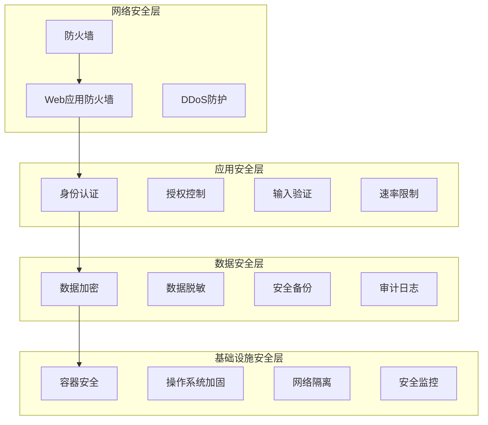

# 安全最佳实践和合规性指南

## 概述

本文档详细说明了 Moon Dev AI Agents 系统的安全架构、最佳实践和合规性要求。对于处理金融交易和敏感数据的系统来说，安全性是至关重要的。

## 目录

1. [安全架构](#安全架构)
2. [威胁模型](#威胁模型)
3. [数据保护](#数据保护)
4. [API安全](#api安全)
5. [身份认证和授权](#身份认证和授权)
6. [网络安全](#网络安全)
7. [加密和密钥管理](#加密和密钥管理)
8. [合规性要求](#合规性要求)
9. [安全监控](#安全监控)
10. [应急响应](#应急响应)

## 安全架构

### 分层安全模型



### 防御深度原则

| 层级 | 安全措施 | 目的 |
|------|---------|------|
| 网络层 | 防火墙、IDS/IPS、网络隔离 | 阻止网络攻击 |
| 应用层 | WAF、输入验证、速率限制 | 防止应用层攻击 |
| 数据层 | 加密、脱敏、访问控制 | 保护数据安全 |
| 基础设施层 | 容器安全、系统加固 | 保护底层基础设施 |

## 威胁模型

### 威胁分析

```python
# src/security/threat_model.py
from enum import Enum
from typing import Dict, List
from dataclasses import dataclass

class ThreatType(Enum):
    """威胁类型。"""
    UNAUTHORIZED_ACCESS = "unauthorized_access"
    DATA_BREACH = "data_breach"
    INJECTION = "injection"
    XSS = "cross_site_scripting"
    CSRF = "cross_site_request_forgery"
    DOS = "denial_of_service"
    PRIVILEGE_ESCALATION = "privilege_escalation"
    INSIDER_THREAT = "insider_threat"

@dataclass
class Threat:
    """威胁定义。"""
    type: ThreatType
    description: str
    likelihood: int  # 1-5
    impact: int  # 1-5
    mitigation: List[str]

class ThreatModel:
    """威胁模型。"""

    def __init__(self):
        self.threats = [
            Threat(
                ThreatType.UNAUTHORIZED_ACCESS,
                "未经授权的用户访问系统",
                likelihood=3,
                impact=5,
                mitigation=[
                    "实施强身份认证",
                    "使用多因素认证",
                    "实施最小权限原则",
                    "定期审核访问权限"
                ]
            ),
            Threat(
                ThreatType.DATA_BREACH,
                "敏感数据泄露",
                likelihood=2,
                impact=5,
                mitigation=[
                    "数据加密传输和存储",
                    "实施访问控制",
                    "数据脱敏",
                    "定期安全审计"
                ]
            ),
            Threat(
                ThreatType.INJECTION,
                "SQL/NoSQL/命令注入攻击",
                likelihood=4,
                impact=4,
                mitigation=[
                    "参数化查询",
                    "输入验证",
                    "最小权限数据库账户",
                    "Web应用防火墙"
                ]
            ),
            Threat(
                ThreatType.XSS,
                "跨站脚本攻击",
                likelihood=4,
                impact=3,
                mitigation=[
                    "输出编码",
                    "内容安全策略",
                    "输入验证",
                    "HttpOnly cookies"
                ]
            ),
            Threat(
                ThreatType.DOS,
                "拒绝服务攻击",
                likelihood=3,
                impact=4,
                mitigation=[
                    "速率限制",
                    "DDoS防护",
                    "负载均衡",
                    "资源监控"
                ]
            )
        ]

    def calculate_risk(self, threat: Threat) -> int:
        """计算风险分数。"""
        return threat.likelihood * threat.impact

    def get_high_risk_threats(self) -> List[Threat]:
        """获取高风险威胁。"""
        return [
            threat for threat in self.threats
            if self.calculate_risk(threat) >= 15
        ]
```

### 风险评估矩阵

| 可能性/影响 | 低(1) | 中(2) | 高(3) | 严重(4) | 灾难(5) |
|------------|-------|-------|-------|---------|---------|
| 很低(1) | 1 | 2 | 3 | 4 | 5 |
| 低(2) | 2 | 4 | 6 | 8 | 10 |
| 中(3) | 3 | 6 | 9 | 12 | 15 |
| 高(4) | 4 | 8 | 12 | 16 | 20 |
| 很高(5) | 5 | 10 | 15 | 20 | 25 |

**风险等级**：
- **1-5**: 低风险 - 接受
- **6-10**: 中风险 - 监控
- **11-15**: 高风险 - 缓解
- **16-25**: 严重风险 - 立即处理

## 数据保护

### 数据分类

```python
# src/security/data_classification.py
from enum import Enum
from typing import Dict, Any

class DataClassification(Enum):
    """数据分类。"""
    PUBLIC = "public"           # 公开数据
    INTERNAL = "internal"       # 内部数据
    CONFIDENTIAL = "confidential"  # 机密数据
    RESTRICTED = "restricted"   # 限制数据

class DataProtectionRequirements:
    """数据保护要求。"""

    REQUIREMENTS = {
        DataClassification.PUBLIC: {
            'encryption_at_rest': False,
            'encryption_in_transit': True,
            'access_logging': False,
            'retention_period': None
        },
        DataClassification.INTERNAL: {
            'encryption_at_rest': True,
            'encryption_in_transit': True,
            'access_logging': True,
            'retention_period': 2555  # 7年
        },
        DataClassification.CONFIDENTIAL: {
            'encryption_at_rest': True,
            'encryption_in_transit': True,
            'access_logging': True,
            'retention_period': 2555  # 7年
        },
        DataClassification.RESTRICTED: {
            'encryption_at_rest': True,
            'encryption_in_transit': True,
            'access_logging': True,
            'retention_period': 3650  # 10年
        }
    }

    @classmethod
    def classify_trading_data(cls, data_type: str) -> DataClassification:
        """对交易数据进行分类。"""
        classification_map = {
            'public_market_data': DataClassification.PUBLIC,
            'user_profile': DataClassification.INTERNAL,
            'trading_history': DataClassification.CONFIDENTIAL,
            'api_keys': DataClassification.RESTRICTED,
            'private_keys': DataClassification.RESTRICTED,
            'financial_data': DataClassification.CONFIDENTIAL
        }
        return classification_map.get(data_type, DataClassification.INTERNAL)
```

### 数据加密

```python
# src/security/encryption.py
import os
import base64
from cryptography.fernet import Fernet
from cryptography.hazmat.primitives import hashes
from cryptography.hazmat.primitives.kdf.pbkdf2 import PBKDF2HMAC
from typing import Union

class EncryptionManager:
    """加密管理器。"""

    def __init__(self, master_key: str):
        self.master_key = master_key.encode()
        self.cipher = self._create_cipher()

    def _create_cipher(self) -> Fernet:
        """创建加密器。"""
        salt = b'moon_dev_salt'  # 在生产环境中应该是随机盐
        kdf = PBKDF2HMAC(
            algorithm=hashes.SHA256(),
            length=32,
            salt=salt,
            iterations=100000,
        )
        key = base64.urlsafe_b64encode(kdf.derive(self.master_key))
        return Fernet(key)

    def encrypt_data(self, data: str) -> str:
        """加密数据。"""
        encrypted_data = self.cipher.encrypt(data.encode())
        return base64.urlsafe_b64encode(encrypted_data).decode()

    def decrypt_data(self, encrypted_data: str) -> str:
        """解密数据。"""
        encrypted_bytes = base64.urlsafe_b64decode(encrypted_data.encode())
        decrypted_data = self.cipher.decrypt(encrypted_bytes)
        return decrypted_data.decode()

    def encrypt_sensitive_field(self, value: Union[str, int, float]) -> str:
        """加密敏感字段。"""
        if value is None:
            return None
        return self.encrypt_data(str(value))

    def mask_data(self, data: str, mask_char: str = '*', visible_chars: int = 4) -> str:
        """数据脱敏。"""
        if len(data) <= visible_chars:
            return mask_char * len(data)
        return data[:visible_chars] + mask_char * (len(data) - visible_chars)

# 使用示例
encryption = EncryptionManager(os.getenv('MASTER_KEY'))

# 加密API密钥
encrypted_api_key = encryption.encrypt_data("sk-ant-api03-...")

# 数据脱敏显示
masked_key = encryption.mask_data(encrypted_api_key)
```

### 数据访问控制

```python
# src/security/access_control.py
from functools import wraps
from typing import Dict, List, Callable, Any
from enum import Enum
import jwt

class Permission(Enum):
    """权限枚举。"""
    READ_MARKET_DATA = "read_market_data"
    WRITE_TRADE_ORDERS = "write_trade_orders"
    READ_USER_DATA = "read_user_data"
    MANAGE_USERS = "manage_users"
    ACCESS_LOGS = "access_logs"
    CONFIGURE_SYSTEM = "configure_system"

class Role(Enum):
    """角色枚举。"""
    VIEWER = "viewer"
    TRADER = "trader"
    ADMIN = "admin"
    SYSTEM_ADMIN = "system_admin"

ROLE_PERMISSIONS = {
    Role.VIEWER: [Permission.READ_MARKET_DATA],
    Role.TRADER: [
        Permission.READ_MARKET_DATA,
        Permission.WRITE_TRADE_ORDERS,
        Permission.READ_USER_DATA
    ],
    Role.ADMIN: [
        Permission.READ_MARKET_DATA,
        Permission.WRITE_TRADE_ORDERS,
        Permission.READ_USER_DATA,
        Permission.MANAGE_USERS,
        Permission.ACCESS_LOGS
    ],
    Role.SYSTEM_ADMIN: list(Permission)
}

class AccessControlManager:
    """访问控制管理器。"""

    def __init__(self, secret_key: str):
        self.secret_key = secret_key

    def generate_token(self, user_id: str, role: Role, expires_in: int = 3600) -> str:
        """生成JWT令牌。"""
        payload = {
            'user_id': user_id,
            'role': role.value,
            'permissions': [p.value for p in ROLE_PERMISSIONS[role]],
            'exp': datetime.utcnow() + timedelta(seconds=expires_in)
        }
        return jwt.encode(payload, self.secret_key, algorithm='HS256')

    def verify_token(self, token: str) -> Dict[str, Any]:
        """验证JWT令牌。"""
        try:
            payload = jwt.decode(token, self.secret_key, algorithms=['HS256'])
            return payload
        except jwt.ExpiredSignatureError:
            raise Exception("Token已过期")
        except jwt.InvalidTokenError:
            raise Exception("无效的令牌")

    def has_permission(self, token: str, permission: Permission) -> bool:
        """检查权限。"""
        payload = self.verify_token(token)
        return permission.value in payload.get('permissions', [])

def require_permission(permission: Permission):
    """权限检查装饰器。"""
    def decorator(func: Callable) -> Callable:
        @wraps(func)
        def wrapper(*args, **kwargs):
            # 从请求中获取token
            token = kwargs.get('token') or getattr(args[0], 'token', None)

            if not token:
                raise Exception("缺少认证令牌")

            access_control = AccessControlManager(os.getenv('JWT_SECRET_KEY'))

            if not access_control.has_permission(token, permission):
                raise Exception("权限不足")

            return func(*args, **kwargs)
        return wrapper
    return decorator

# 使用示例
@require_permission(Permission.WRITE_TRADE_ORDERS)
def place_order(user_id: str, order_data: Dict[str, Any]):
    """下单函数。"""
    # 执行下单逻辑
    pass
```

## API安全

### 输入验证

```python
# src/security/input_validation.py
import re
from typing import Any, Dict, List
from pydantic import BaseModel, validator

class SecurityValidator:
    """安全验证器。"""

    # SQL注入检测模式
    SQL_INJECTION_PATTERNS = [
        r"(\bUNION\b.*\bSELECT\b)",
        r"(\bSELECT\b.*\bFROM\b.*\bWHERE\b)",
        r"(\bINSERT\b.*\bINTO\b)",
        r"(\bUPDATE\b.*\bSET\b)",
        r"(\bDELETE\b.*\bFROM\b)",
        r"(\bDROP\b.*\bTABLE\b)",
        r"(\bCREATE\b.*\bTABLE\b)",
        r"(\bALTER\b.*\bTABLE\b)",
        r"(--|#|\/\*|\*\/)",
        r"(\bOR\b.*\b1\b.*=\b.*\b1\b)",
        r"(\bAND\b.*\b1\b.*=\b.*\b1\b)"
    ]

    # XSS检测模式
    XSS_PATTERNS = [
        r"<script.*?>.*?</script>",
        r"javascript:",
        r"on\w+\s*=",
        r"<iframe.*?>.*?</iframe>",
        r"<object.*?>.*?</object>",
        r"<embed.*?>.*?</embed>",
        r"eval\s*\(",
        r"alert\s*\(",
        r"document\.",
        r"window\.",
        r"<.*?on\w+.*?>"
    ]

    @classmethod
    def detect_sql_injection(cls, input_string: str) -> bool:
        """检测SQL注入。"""
        if not input_string:
            return False

        input_upper = input_string.upper()
        for pattern in cls.SQL_INJECTION_PATTERNS:
            if re.search(pattern, input_upper, re.IGNORECASE):
                return True
        return False

    @classmethod
    def detect_xss(cls, input_string: str) -> bool:
        """检测XSS攻击。"""
        if not input_string:
            return False

        for pattern in cls.XSS_PATTERNS:
            if re.search(pattern, input_string, re.IGNORECASE):
                return True
        return False

    @classmethod
    def validate_token_address(cls, address: str) -> bool:
        """验证代币地址格式。"""
        # Solana地址格式验证
        pattern = r'^[1-9A-HJ-NP-Za-km-z]{32,44}$'
        return bool(re.match(pattern, address))

    @classmethod
    def validate_email(cls, email: str) -> bool:
        """验证邮箱格式。"""
        pattern = r'^[a-zA-Z0-9._%+-]+@[a-zA-Z0-9.-]+\.[a-zA-Z]{2,}$'
        return bool(re.match(pattern, email))

    @classmethod
    def sanitize_input(cls, input_string: str, max_length: int = 255) -> str:
        """清理输入。"""
        if not input_string:
            return ""

        # 移除危险字符
        dangerous_chars = ["<", ">", "&", '"', "'", "\x00", "\n", "\r", "\t"]
        sanitized = input_string

        for char in dangerous_chars:
            sanitized = sanitized.replace(char, "")

        # 限制长度
        return sanitized[:max_length]

class TradingOrderSchema(BaseModel):
    """交易订单验证模式。"""

    symbol: str
    side: str  # buy/sell
    amount: float
    price: float = None
    order_type: str = "market"

    @validator('symbol')
    def validate_symbol(cls, v):
        if not SecurityValidator.validate_token_address(v):
            raise ValueError('Invalid token address')
        return v

    @validator('side')
    def validate_side(cls, v):
        if v not in ['buy', 'sell']:
            raise ValueError('Side must be buy or sell')
        return v

    @validator('amount')
    def validate_amount(cls, v):
        if v <= 0 or v > 1000000:
            raise ValueError('Invalid amount')
        return v

    @validator('order_type')
    def validate_order_type(cls, v):
        if v not in ['market', 'limit']:
            raise ValueError('Invalid order type')
        return v

# 使用示例
def create_order(order_data: Dict[str, Any]) -> Dict[str, Any]:
    """创建订单。"""
    try:
        validated_order = TradingOrderSchema(**order_data)
        # 处理验证后的订单
        return {"success": True, "order": validated_order.dict()}
    except Exception as e:
        return {"success": False, "error": str(e)}
```

### API速率限制

```python
# src/security/rate_limiting.py
import time
import redis
from typing import Dict, Any
from collections import defaultdict

class RateLimiter:
    """速率限制器。"""

    def __init__(self, redis_client: redis.Redis):
        self.redis = redis_client
        self.local_cache = defaultdict(list)

    def is_rate_limited(
        self,
        key: str,
        limit: int,
        window: int,
        use_redis: bool = True
    ) -> bool:
        """检查是否超过速率限制。"""
        current_time = int(time.time())

        if use_redis:
            return self._redis_rate_limit(key, limit, window, current_time)
        else:
            return self._memory_rate_limit(key, limit, window, current_time)

    def _redis_rate_limit(
        self,
        key: str,
        limit: int,
        window: int,
        current_time: int
    ) -> bool:
        """Redis速率限制。"""
        pipe = self.redis.pipeline()

        # 移除过期的记录
        pipe.zremrangebyscore(key, 0, current_time - window)

        # 添加当前请求
        pipe.zadd(key, {str(current_time): current_time})

        # 获取当前窗口内的请求数
        pipe.zcard(key)

        # 设置过期时间
        pipe.expire(key, window)

        results = pipe.execute()
        request_count = results[2]

        return request_count > limit

    def _memory_rate_limit(
        self,
        key: str,
        limit: int,
        window: int,
        current_time: int
    ) -> bool:
        """内存速率限制。"""
        # 清理过期记录
        self.local_cache[key] = [
            timestamp for timestamp in self.local_cache[key]
            if timestamp > current_time - window
        ]

        # 添加当前请求
        self.local_cache[key].append(current_time)

        return len(self.local_cache[key]) > limit

# 速率限制配置
RATE_LIMITS = {
    'api_default': {'limit': 100, 'window': 3600},  # 每小时100次
    'trading': {'limit': 10, 'window': 60},        # 每分钟10次
    'login': {'limit': 5, 'window': 900},          # 每15分钟5次
    'password_reset': {'limit': 3, 'window': 3600}, # 每小时3次
}

def rate_limit_decorator(limiter: RateLimiter, limit_config: str):
    """速率限制装饰器。"""
    def decorator(func):
        @wraps(func)
        def wrapper(*args, **kwargs):
            # 获取用户标识
            user_id = kwargs.get('user_id') or getattr(args[0], 'user_id', 'anonymous')

            # 获取速率限制配置
            config = RATE_LIMITS[limit_config]
            key = f"rate_limit:{func.__name__}:{user_id}"

            if limiter.is_rate_limited(key, config['limit'], config['window']):
                raise Exception(f"Rate limit exceeded for {limit_config}")

            return func(*args, **kwargs)
        return wrapper
    return decorator

# 使用示例
@rate_limit_decorator(rate_limiter, 'trading')
def place_trading_order(user_id: str, order_data: Dict[str, Any]):
    """下单函数。"""
    # 执行下单逻辑
    pass
```

## 身份认证和授权

### 多因素认证

```python
# src/security/mfa.py
import pyotp
import qrcode
from io import BytesIO
import base64
from typing import Dict, Any

class MFAManager:
    """多因素认证管理器。"""

    def __init__(self, app_name: str = "Moon Dev AI Agents"):
        self.app_name = app_name
        self.secret_store = {}  # 实际应用中应使用数据库

    def generate_secret(self) -> str:
        """生成MFA密钥。"""
        return pyotp.random_base32()

    def generate_qr_code(self, user_email: str, secret: str) -> str:
        """生成二维码。"""
        totp_uri = pyotp.totp.TOTP(secret).provisioning_uri(
            name=user_email,
            issuer_name=self.app_name
        )

        qr = qrcode.QRCode(version=1, box_size=10, border=5)
        qr.add_data(totp_uri)
        qr.make(fit=True)

        img = qr.make_image(fill_color="black", back_color="white")

        # 转换为base64
        buffered = BytesIO()
        img.save(buffered, format="PNG")
        img_str = base64.b64encode(buffered.getvalue()).decode()

        return f"data:image/png;base64,{img_str}"

    def verify_totp(self, secret: str, token: str) -> bool:
        """验证TOTP令牌。"""
        totp = pyotp.TOTP(secret)
        return totp.verify(token, valid_window=1)  # 允许前后一个时间窗口

    def setup_mfa(self, user_id: str, user_email: str) -> Dict[str, Any]:
        """设置MFA。"""
        secret = self.generate_secret()
        qr_code = self.generate_qr_code(user_email, secret)

        # 临时存储密钥（实际应用中应安全存储）
        self.secret_store[user_id] = secret

        return {
            'secret': secret,
            'qr_code': qr_code,
            'backup_codes': self._generate_backup_codes(user_id)
        }

    def _generate_backup_codes(self, user_id: str, count: int = 10) -> List[str]:
        """生成备用码。"""
        import random
        import string

        backup_codes = []
        for _ in range(count):
            code = ''.join(random.choices(string.digits, k=8))
            backup_codes.append(code)

        # 存储备用码（实际应用中应加密存储）
        # ... 存储逻辑

        return backup_codes

class AuthenticationManager:
    """认证管理器。"""

    def __init__(self, mfa_manager: MFAManager):
        self.mfa_manager = mfa_manager
        self.session_store = {}  # 实际应用中应使用Redis

    def authenticate_user(
        self,
        username: str,
        password: str,
        mfa_token: str = None
    ) -> Dict[str, Any]:
        """用户认证。"""
        # 1. 验证用户名和密码
        user = self._verify_credentials(username, password)
        if not user:
            return {'success': False, 'error': 'Invalid credentials'}

        # 2. 检查是否需要MFA
        if user.get('mfa_enabled', False):
            if not mfa_token:
                return {
                    'success': False,
                    'error': 'MFA token required',
                    'require_mfa': True
                }

            if not self.mfa_manager.verify_totp(user['mfa_secret'], mfa_token):
                return {'success': False, 'error': 'Invalid MFA token'}

        # 3. 生成会话
        session_token = self._generate_session_token(user)

        return {
            'success': True,
            'session_token': session_token,
            'user': {
                'id': user['id'],
                'username': user['username'],
                'role': user['role']
            }
        }

    def _verify_credentials(self, username: str, password: str) -> Dict[str, Any]:
        """验证用户凭据。"""
        # 实际应用中应查询数据库并使用安全的密码验证
        # 这里只是示例
        return {
            'id': 1,
            'username': username,
            'mfa_enabled': True,
            'mfa_secret': 'MFSWIZ3FOORUGK3D',
            'role': 'trader'
        }

    def _generate_session_token(self, user: Dict[str, Any]) -> str:
        """生成会话令牌。"""
        import jwt
        import datetime

        payload = {
            'user_id': user['id'],
            'username': user['username'],
            'role': user['role'],
            'exp': datetime.utcnow() + datetime.timedelta(hours=24)
        }

        return jwt.encode(
            payload,
            os.getenv('JWT_SECRET_KEY'),
            algorithm='HS256'
        )
```

### 会话管理

```python
# src/security/session_manager.py
import uuid
import time
from typing import Dict, Any, Optional
import redis

class SessionManager:
    """会话管理器。"""

    def __init__(self, redis_client: redis.Redis, session_timeout: int = 3600):
        self.redis = redis_client
        self.session_timeout = session_timeout

    def create_session(self, user_id: str, user_data: Dict[str, Any]) -> str:
        """创建会话。"""
        session_id = str(uuid.uuid4())

        session_data = {
            'session_id': session_id,
            'user_id': user_id,
            'created_at': int(time.time()),
            'last_accessed': int(time.time()),
            'user_data': user_data
        }

        # 存储会话数据
        self.redis.setex(
            f"session:{session_id}",
            self.session_timeout,
            json.dumps(session_data)
        )

        return session_id

    def get_session(self, session_id: str) -> Optional[Dict[str, Any]]:
        """获取会话。"""
        session_data = self.redis.get(f"session:{session_id}")

        if not session_data:
            return None

        session = json.loads(session_data)

        # 更新最后访问时间
        session['last_accessed'] = int(time.time())
        self.redis.setex(
            f"session:{session_id}",
            self.session_timeout,
            json.dumps(session)
        )

        return session

    def destroy_session(self, session_id: str) -> bool:
        """销毁会话。"""
        result = self.redis.delete(f"session:{session_id}")
        return result > 0

    def is_session_valid(self, session_id: str) -> bool:
        """检查会话是否有效。"""
        session = self.get_session(session_id)
        return session is not None

    def extend_session(self, session_id: str, additional_time: int = 3600) -> bool:
        """延长会话。"""
        session = self.get_session(session_id)
        if not session:
            return False

        self.redis.expire(f"session:{session_id}", additional_time)
        return True

    def get_user_sessions(self, user_id: str) -> List[str]:
        """获取用户的所有会话。"""
        pattern = "session:*"
        user_sessions = []

        for key in self.redis.scan_iter(match=pattern):
            session_data = self.redis.get(key)
            if session_data:
                session = json.loads(session_data)
                if session.get('user_id') == user_id:
                    user_sessions.append(session['session_id'])

        return user_sessions

    def destroy_user_sessions(self, user_id: str) -> int:
        """销毁用户的所有会话。"""
        sessions = self.get_user_sessions(user_id)
        destroyed_count = 0

        for session_id in sessions:
            if self.destroy_session(session_id):
                destroyed_count += 1

        return destroyed_count

# 会话装饰器
def require_session(session_manager: SessionManager):
    """会话验证装饰器。"""
    def decorator(func):
        @wraps(func)
        def wrapper(*args, **kwargs):
            # 从请求中获取会话ID
            session_id = kwargs.get('session_id') or getattr(args[0], 'session_id', None)

            if not session_id:
                raise Exception("缺少会话ID")

            session = session_manager.get_session(session_id)
            if not session:
                raise Exception("无效的会话")

            # 将会话信息添加到kwargs
            kwargs['session'] = session

            return func(*args, **kwargs)
        return wrapper
    return decorator
```

## 网络安全

### HTTPS配置

```nginx
# nginx/ssl.conf
server {
    listen 443 ssl http2;
    server_name api.moondev.ai;

    # SSL证书配置
    ssl_certificate /etc/nginx/ssl/cert.pem;
    ssl_certificate_key /etc/nginx/ssl/key.pem;

    # SSL协议和密码套件
    ssl_protocols TLSv1.2 TLSv1.3;
    ssl_ciphers ECDHE-RSA-AES256-GCM-SHA512:DHE-RSA-AES256-GCM-SHA512:ECDHE-RSA-AES256-GCM-SHA384:DHE-RSA-AES256-GCM-SHA384;
    ssl_prefer_server_ciphers off;

    # SSL会话缓存
    ssl_session_cache shared:SSL:10m;
    ssl_session_timeout 10m;
    ssl_session_tickets off;

    # HSTS
    add_header Strict-Transport-Security "max-age=31536000; includeSubDomains; preload" always;

    # 其他安全头
    add_header X-Frame-Options DENY always;
    add_header X-Content-Type-Options nosniff always;
    add_header X-XSS-Protection "1; mode=block" always;
    add_header Referrer-Policy "strict-origin-when-cross-origin" always;

    # CSP
    add_header Content-Security-Policy "default-src 'self'; script-src 'self' 'unsafe-inline'; style-src 'self' 'unsafe-inline'; img-src 'self' data: https:; font-src 'self'; connect-src 'self'; frame-ancestors 'none';" always;
}
```

### 网络隔离

```yaml
# docker-compose.network-security.yml
version: '3.8'

networks:
  # 前端网络（负载均衡器到Web服务器）
  frontend:
    driver: bridge
    ipam:
      config:
        - subnet: 172.20.1.0/24
          gateway: 172.20.1.1

  # 应用网络（Web服务器到应用服务器）
  application:
    driver: bridge
    ipam:
      config:
        - subnet: 172.20.2.0/24
          gateway: 172.20.2.1

  # 数据网络（应用到数据库）
  database:
    driver: bridge
    ipam:
      config:
        - subnet: 172.20.3.0/24
          gateway: 172.20.3.1
    internal: true  # 内部网络，不能访问外部

  # 管理网络（运维访问）
  management:
    driver: bridge
    ipam:
      config:
        - subnet: 172.20.4.0/24
          gateway: 172.20.4.1

services:
  nginx:
    networks:
      - frontend
      - application

  app:
    networks:
      - application
      - database
      - management

  postgres:
    networks:
      - database
      - management

  redis:
    networks:
      - database
      - management

  monitoring:
    networks:
      - management
```

### 防火墙配置

```bash
#!/bin/bash
# scripts/setup-firewall.sh

# 清除现有规则
iptables -F
iptables -X
iptables -t nat -F
iptables -t nat -X

# 设置默认策略
iptables -P INPUT DROP
iptables -P FORWARD DROP
iptables -P OUTPUT ACCEPT

# 允许本地回环
iptables -A INPUT -i lo -j ACCEPT

# 允许已建立的连接
iptables -A INPUT -m state --state ESTABLISHED,RELATED -j ACCEPT

# 允许SSH（仅管理网络）
iptables -A INPUT -p tcp -s 172.20.4.0/24 --dport 22 -j ACCEPT

# 允许HTTP/HTTPS
iptables -A INPUT -p tcp --dport 80 -j ACCEPT
iptables -A INPUT -p tcp --dport 443 -j ACCEPT

# 允许内部网络通信
iptables -A INPUT -s 172.20.0.0/16 -j ACCEPT

# 防止DDoS攻击
iptables -A INPUT -p tcp --dport 80 -m limit --limit 25/minute --limit-burst 100 -j ACCEPT

# 防止端口扫描
iptables -A INPUT -m recent --name portscan --rcheck --seconds 86400 -j DROP
iptables -A INPUT -m recent --name portscan --set -j LOG --log-prefix "Portscan:"
iptables -A INPUT -m recent --name portscan --set -j DROP

# 防止SYN攻击
iptables -A INPUT -p tcp ! --syn -m state --state NEW -j DROP
iptables -A INPUT -p tcp --tcp-flags ALL ALL -j DROP
iptables -A INPUT -p tcp --tcp-flags ALL NONE -j DROP

# 保存规则
iptables-save > /etc/iptables/rules.v4

# 启用IP转发（如果需要）
echo 1 > /proc/sys/net/ipv4/ip_forward
```

## 加密和密钥管理

### 密钥管理策略

```python
# src/security/key_management.py
import os
import hashlib
import secrets
from cryptography.fernet import Fernet
from cryptography.hazmat.primitives import hashes
from cryptography.hazmat.primitives.kdf.pbkdf2 import PBKDF2HMAC
from typing import Dict, Any

class KeyManager:
    """密钥管理器。"""

    def __init__(self, master_key_path: str = "/secure/master.key"):
        self.master_key_path = master_key_path
        self.master_key = self._load_or_create_master_key()
        self.keys = {}

    def _load_or_create_master_key(self) -> bytes:
        """加载或创建主密钥。"""
        if os.path.exists(self.master_key_path):
            with open(self.master_key_path, 'rb') as f:
                return f.read()
        else:
            # 生成新的主密钥
            master_key = secrets.token_bytes(32)

            # 安全保存主密钥
            os.makedirs(os.path.dirname(self.master_key_path), exist_ok=True)
            with open(self.master_key_path, 'wb') as f:
                f.write(master_key)

            # 设置文件权限（仅所有者可读写）
            os.chmod(self.master_key_path, 0o600)

            return master_key

    def generate_key(self, key_name: str, key_type: str = "encryption") -> str:
        """生成密钥。"""
        if key_type == "encryption":
            key = Fernet.generate_key().decode()
        elif key_type == "api":
            key = f"sk-{secrets.token_hex(32)}"
        elif key_type == "jwt":
            key = secrets.token_urlsafe(32)
        else:
            key = secrets.token_hex(32)

        # 加密存储密钥
        encrypted_key = self._encrypt_data(key)

        self.keys[key_name] = {
            'encrypted_key': encrypted_key,
            'type': key_type,
            'created_at': time.time()
        }

        return key

    def get_key(self, key_name: str) -> str:
        """获取密钥。"""
        if key_name not in self.keys:
            raise KeyError(f"Key '{key_name}' not found")

        encrypted_key = self.keys[key_name]['encrypted_key']
        return self._decrypt_data(encrypted_key)

    def rotate_key(self, key_name: str) -> str:
        """轮换密钥。"""
        old_key = self.get_key(key_name)
        new_key = self.generate_key(key_name, self.keys[key_name]['type'])

        # 记录密钥轮换
        self._log_key_rotation(key_name, old_key, new_key)

        return new_key

    def _encrypt_data(self, data: str) -> str:
        """加密数据。"""
        kdf = PBKDF2HMAC(
            algorithm=hashes.SHA256(),
            length=32,
            salt=b'moon_dev_key_salt',
            iterations=100000,
        )
        key = base64.urlsafe_b64encode(kdf.derive(self.master_key))
        cipher = Fernet(key)

        encrypted_data = cipher.encrypt(data.encode())
        return base64.urlsafe_b64encode(encrypted_data).decode()

    def _decrypt_data(self, encrypted_data: str) -> str:
        """解密数据。"""
        kdf = PBKDF2HMAC(
            algorithm=hashes.SHA256(),
            length=32,
            salt=b'moon_dev_key_salt',
            iterations=100000,
        )
        key = base64.urlsafe_b64encode(kdf.derive(self.master_key))
        cipher = Fernet(key)

        encrypted_bytes = base64.urlsafe_b64decode(encrypted_data.encode())
        decrypted_data = cipher.decrypt(encrypted_bytes)
        return decrypted_data.decode()

    def _log_key_rotation(self, key_name: str, old_key: str, new_key: str):
        """记录密钥轮换。"""
        log_entry = {
            'timestamp': time.time(),
            'key_name': key_name,
            'action': 'rotation',
            'old_key_hash': hashlib.sha256(old_key.encode()).hexdigest(),
            'new_key_hash': hashlib.sha256(new_key.encode()).hexdigest()
        }

        # 实际应用中应发送到安全日志系统
        print(f"Key rotation logged: {log_entry}")

# 全局密钥管理器实例
key_manager = KeyManager()

# 预定义的密钥
API_KEYS = {
    'anthropic': 'ANTHROPIC_API_KEY',
    'openai': 'OPENAI_API_KEY',
    'groq': 'GROQ_API_KEY',
    'gemini': 'GEMINI_API_KEY'
}

def get_api_key(provider: str) -> str:
    """获取API密钥。"""
    if provider not in API_KEYS:
        raise ValueError(f"Unknown provider: {provider}")

    key_name = API_KEYS[provider]

    # 首先尝试从环境变量获取
    env_key = os.getenv(key_name)
    if env_key:
        return env_key

    # 然后尝试从密钥管理器获取
    try:
        return key_manager.get_key(f"api_{provider}")
    except KeyError:
        # 如果都没有，生成新密钥
        return key_manager.generate_key(f"api_{provider}", "api")
```

## 合规性要求

### 金融监管合规

```python
# src/compliance/regulatory.py
from enum import Enum
from typing import Dict, List, Any
from datetime import datetime, timedelta

class ComplianceRequirement(Enum):
    """合规要求。"""
    AML_KYC = "aml_kyc"                    # 反洗钱和了解客户
    DATA_PROTECTION = "data_protection"    # 数据保护
    TRANSACTION_LIMITS = "transaction_limits"  # 交易限制
    AUDIT_LOGGING = "audit_logging"        # 审计日志
    RISK_DISCLOSURE = "risk_disclosure"    # 风险披露
    PRIVACY_POLICY = "privacy_policy"      # 隐私政策

class ComplianceManager:
    """合规管理器。"""

    def __init__(self):
        self.requirements = self._initialize_requirements()
        self.audit_logs = []

    def _initialize_requirements(self) -> Dict[ComplianceRequirement, Dict[str, Any]]:
        """初始化合规要求。"""
        return {
            ComplianceRequirement.AML_KYC: {
                'description': '用户身份验证和反洗钱检查',
                'required': True,
                'check_interval': 365,  # 天
                'data_retention': 2555   # 7年
            },
            ComplianceRequirement.DATA_PROTECTION: {
                'description': '个人数据保护',
                'required': True,
                'check_interval': 90,
                'data_retention': 2555
            },
            ComplianceRequirement.TRANSACTION_LIMITS: {
                'description': '交易限额和监控',
                'required': True,
                'check_interval': 1,
                'data_retention': 2555
            },
            ComplianceRequirement.AUDIT_LOGGING: {
                'description': '完整的审计日志',
                'required': True,
                'check_interval': 1,
                'data_retention': 3650  # 10年
            },
            ComplianceRequirement.RISK_DISCLOSURE: {
                'description': '风险披露和警告',
                'required': True,
                'check_interval': 30,
                'data_retention': 2555
            },
            ComplianceRequirement.PRIVACY_POLICY: {
                'description': '隐私政策和数据处理声明',
                'required': True,
                'check_interval': 365,
                'data_retention': 2555
            }
        }

    def check_user_kyc(self, user_id: str) -> Dict[str, Any]:
        """检查用户KYC状态。"""
        # 实际应用中应查询用户数据库
        kyc_status = {
            'user_id': user_id,
            'kyc_completed': True,
            'kyc_level': 2,  # 1-基础, 2-增强, 3-高级
            'last_verified': datetime.now() - timedelta(days=30),
            'documents_verified': ['passport', 'proof_of_address'],
            'risk_score': 0.3
        }

        # 检查是否需要重新验证
        days_since_verification = (datetime.now() - kyc_status['last_verified']).days
        if days_since_verification > self.requirements[ComplianceRequirement.AML_KYC]['check_interval']:
            kyc_status['needs_reverification'] = True
        else:
            kyc_status['needs_reverification'] = False

        return kyc_status

    def validate_transaction(self, user_id: str, transaction: Dict[str, Any]) -> Dict[str, Any]:
        """验证交易合规性。"""
        validation_result = {
            'approved': True,
            'restrictions': [],
            'warnings': []
        }

        # 检查用户KYC状态
        kyc_status = self.check_user_kyc(user_id)
        if not kyc_status['kyc_completed']:
            validation_result['approved'] = False
            validation_result['restrictions'].append('KYC not completed')
            return validation_result

        # 检查交易限额
        amount = transaction.get('amount', 0)
        if amount > self._get_user_transaction_limit(user_id):
            validation_result['approved'] = False
            validation_result['restrictions'].append('Transaction exceeds limit')

        # 检查风险评分
        if kyc_status['risk_score'] > 0.7:
            validation_result['warnings'].append('High risk user - additional monitoring required')

        # 检查 sanctioned国家/地区
        if self._is_sanctioned_country(transaction.get('country')):
            validation_result['approved'] = False
            validation_result['restrictions'].append('Sanctioned country')

        return validation_result

    def _get_user_transaction_limit(self, user_id: str) -> float:
        """获取用户交易限额。"""
        # 根据KYC级别设置不同限额
        kyc_status = self.check_user_kyc(user_id)

        limits = {
            1: 1000,    # 基础KYC: $1,000
            2: 10000,   # 增强KYC: $10,000
            3: 100000   # 高级KYC: $100,000
        }

        return limits.get(kyc_status['kyc_level'], 1000)

    def _is_sanctioned_country(self, country: str) -> bool:
        """检查是否为制裁国家。"""
        # OFAC制裁国家列表
        sanctioned_countries = [
            'IR', 'KP', 'SY', 'CU', 'MM'
        ]
        return country in sanctioned_countries

    def log_audit_event(self, event_type: str, user_id: str, details: Dict[str, Any]):
        """记录审计事件。"""
        audit_log = {
            'timestamp': datetime.now().isoformat(),
            'event_type': event_type,
            'user_id': user_id,
            'details': details,
            'ip_address': details.get('ip_address'),
            'user_agent': details.get('user_agent')
        }

        self.audit_logs.append(audit_log)

        # 实际应用中应发送到审计日志系统
        print(f"Audit log: {audit_log}")

    def generate_compliance_report(self, start_date: datetime, end_date: datetime) -> Dict[str, Any]:
        """生成合规报告。"""
        # 过滤审计日志
        filtered_logs = [
            log for log in self.audit_logs
            if start_date <= datetime.fromisoformat(log['timestamp']) <= end_date
        ]

        report = {
            'report_period': {
                'start_date': start_date.isoformat(),
                'end_date': end_date.isoformat()
            },
            'total_events': len(filtered_logs),
            'event_types': {},
            'risk_events': [],
            'compliance_status': 'compliant'
        }

        # 统计事件类型
        for log in filtered_logs:
            event_type = log['event_type']
            if event_type not in report['event_types']:
                report['event_types'][event_type] = 0
            report['event_types'][event_type] += 1

        # 识别风险事件
        risk_events = [
            log for log in filtered_logs
            if 'risk' in log['details'].get('tags', [])
        ]
        report['risk_events'] = risk_events

        # 检查合规状态
        if len(risk_events) > 0:
            report['compliance_status'] = 'attention_required'

        return report

# 合规装饰器
def require_compliance(check_type: str):
    """合规检查装饰器。"""
    def decorator(func):
        @wraps(func)
        def wrapper(*args, **kwargs):
            compliance_manager = ComplianceManager()
            user_id = kwargs.get('user_id') or getattr(args[0], 'user_id', None)

            if not user_id:
                raise Exception("User ID required for compliance check")

            if check_type == 'kyc':
                kyc_status = compliance_manager.check_user_kyc(user_id)
                if not kyc_status['kyc_completed']:
                    raise Exception("KYC verification required")

            elif check_type == 'transaction':
                transaction = kwargs.get('transaction', {})
                validation = compliance_manager.validate_transaction(user_id, transaction)
                if not validation['approved']:
                    raise Exception(f"Transaction not approved: {', '.join(validation['restrictions'])}")

            return func(*args, **kwargs)
        return wrapper
    return decorator

# 使用示例
@require_compliance('kyc')
def create_trading_account(user_id: str, account_data: Dict[str, Any]):
    """创建交易账户。"""
    # 创建账户逻辑
    pass

@require_compliance('transaction')
def place_order(user_id: str, order_data: Dict[str, Any]):
    """下单交易。"""
    # 下单逻辑
    pass
```

## 安全监控

### 入侵检测系统

```python
# src/security/intrusion_detection.py
import re
import time
from collections import defaultdict, deque
from typing import Dict, List, Any, Tuple
from dataclasses import dataclass

@dataclass
class SecurityEvent:
    """安全事件。"""
    timestamp: float
    event_type: str
    source_ip: str
    user_id: str
    details: Dict[str, Any]
    severity: str  # low, medium, high, critical

class IntrusionDetectionSystem:
    """入侵检测系统。"""

    def __init__(self):
        self.events = deque(maxlen=10000)  # 保留最近10000个事件
        self.ip_reputation = {}
        self.user_behavior = defaultdict(list)
        self.anomaly_thresholds = {
            'failed_login_attempts': 5,
            'unusual_access_time': True,
            'suspicious_user_agent': True,
            'rapid_api_calls': 100,  # per minute
            'unusual_transaction_pattern': True
        }

    def detect_failed_login(self, ip_address: str, user_id: str, user_agent: str) -> List[SecurityEvent]:
        """检测失败登录。"""
        events = []

        # 记录失败登录
        event = SecurityEvent(
            timestamp=time.time(),
            event_type='failed_login',
            source_ip=ip_address,
            user_id=user_id,
            details={'user_agent': user_agent},
            severity='medium'
        )

        self.events.append(event)

        # 检查暴力破解
        recent_failures = [
            e for e in self.events
            if e.event_type == 'failed_login'
            and e.source_ip == ip_address
            and e.timestamp > time.time() - 300  # 5分钟内
        ]

        if len(recent_failures) >= self.anomaly_thresholds['failed_login_attempts']:
            events.append(SecurityEvent(
                timestamp=time.time(),
                event_type='brute_force_detected',
                source_ip=ip_address,
                user_id=user_id,
                details={'attempts': len(recent_failures)},
                severity='high'
            ))

        return events

    def detect_sql_injection_attempt(self, ip_address: str, payload: str) -> SecurityEvent:
        """检测SQL注入尝试。"""
        sql_patterns = [
            r"(\bUNION\b.*\bSELECT\b)",
            r"(\bSELECT\b.*\bFROM\b.*\bWHERE\b)",
            r"(\bINSERT\b.*\bINTO\b)",
            r"(\bUPDATE\b.*\bSET\b)",
            r"(\bDELETE\b.*\bFROM\b)",
            r"(--|#|\/\*|\*\/)",
            r"(\bOR\b.*\b1\b.*=\b.*\b1\b)",
            r"(\bAND\b.*\b1\b.*=\b.*\b1\b)"
        ]

        for pattern in sql_patterns:
            if re.search(pattern, payload, re.IGNORECASE):
                return SecurityEvent(
                    timestamp=time.time(),
                    event_type='sql_injection_attempt',
                    source_ip=ip_address,
                    user_id='unknown',
                    details={'payload': payload},
                    severity='high'
                )

        return None

    def detect_xss_attempt(self, ip_address: str, payload: str) -> SecurityEvent:
        """检测XSS尝试。"""
        xss_patterns = [
            r"<script.*?>.*?</script>",
            r"javascript:",
            r"on\w+\s*=",
            r"<iframe.*?>.*?</iframe>",
            r"eval\s*\(",
            r"alert\s*\("
        ]

        for pattern in xss_patterns:
            if re.search(pattern, payload, re.IGNORECASE):
                return SecurityEvent(
                    timestamp=time.time(),
                    event_type='xss_attempt',
                    source_ip=ip_address,
                    user_id='unknown',
                    details={'payload': payload},
                    severity='medium'
                )

        return None

    def detect_unusual_user_behavior(self, user_id: str, activity: Dict[str, Any]) -> List[SecurityEvent]:
        """检测异常用户行为。"""
        events = []

        # 记录用户行为
        self.user_behavior[user_id].append({
            'timestamp': time.time(),
            'activity': activity
        })

        # 保留最近30天的行为记录
        cutoff_time = time.time() - (30 * 24 * 3600)
        self.user_behavior[user_id] = [
            b for b in self.user_behavior[user_id]
            if b['timestamp'] > cutoff_time
        ]

        # 检测异常访问时间
        current_hour = datetime.now().hour
        user_hours = [datetime.fromtimestamp(b['timestamp']).hour for b in self.user_behavior[user_id]]

        if user_hours and current_hour not in user_hours:
            # 如果用户从未在这个时间访问过
            if len(user_hours) >= 10:  # 至少有10次访问记录
                events.append(SecurityEvent(
                    timestamp=time.time(),
                    event_type='unusual_access_time',
                    source_ip=activity.get('ip_address', 'unknown'),
                    user_id=user_id,
                    details={'access_hour': current_hour, 'usual_hours': user_hours},
                    severity='low'
                ))

        # 检测异常交易模式
        if activity.get('transaction_amount', 0) > 0:
            recent_amounts = [
                b['activity'].get('transaction_amount', 0)
                for b in self.user_behavior[user_id]
                if b['activity'].get('transaction_amount', 0) > 0
            ]

            if recent_amounts:
                avg_amount = sum(recent_amounts) / len(recent_amounts)
                current_amount = activity['transaction_amount']

                # 如果当前交易金额超过平均值的10倍
                if current_amount > avg_amount * 10:
                    events.append(SecurityEvent(
                        timestamp=time.time(),
                        event_type='unusual_transaction_pattern',
                        source_ip=activity.get('ip_address', 'unknown'),
                        user_id=user_id,
                        details={
                            'current_amount': current_amount,
                            'average_amount': avg_amount,
                            'multiplier': current_amount / avg_amount
                        },
                        severity='medium'
                    ))

        return events

    def detect_rapid_api_calls(self, ip_address: str, endpoint: str) -> SecurityEvent:
        """检测快速API调用。"""
        current_time = time.time()

        # 获取最近1分钟的API调用
        recent_calls = [
            e for e in self.events
            if e.source_ip == ip_address
            and e.event_type == 'api_call'
            and e.timestamp > current_time - 60
        ]

        if len(recent_calls) >= self.anomaly_thresholds['rapid_api_calls']:
            return SecurityEvent(
                timestamp=current_time,
                event_type='rapid_api_calls',
                source_ip=ip_address,
                user_id='unknown',
                details={
                    'calls_per_minute': len(recent_calls),
                    'endpoint': endpoint
                },
                severity='medium'
            )

        # 记录API调用
        self.events.append(SecurityEvent(
            timestamp=current_time,
            event_type='api_call',
            source_ip=ip_address,
            user_id='unknown',
            details={'endpoint': endpoint},
            severity='low'
        ))

        return None

    def get_security_summary(self, hours: int = 24) -> Dict[str, Any]:
        """获取安全摘要。"""
        cutoff_time = time.time() - (hours * 3600)
        recent_events = [e for e in self.events if e.timestamp > cutoff_time]

        summary = {
            'time_period_hours': hours,
            'total_events': len(recent_events),
            'events_by_type': defaultdict(int),
            'events_by_severity': defaultdict(int),
            'top_source_ips': defaultdict(int),
            'high_risk_events': []
        }

        for event in recent_events:
            summary['events_by_type'][event.event_type] += 1
            summary['events_by_severity'][event.severity] += 1
            summary['top_source_ips'][event.source_ip] += 1

            if event.severity in ['high', 'critical']:
                summary['high_risk_events'].append({
                    'timestamp': event.timestamp,
                    'event_type': event.event_type,
                    'source_ip': event.source_ip,
                    'user_id': event.user_id,
                    'details': event.details
                })

        # 转换为普通字典
        summary['events_by_type'] = dict(summary['events_by_type'])
        summary['events_by_severity'] = dict(summary['events_by_severity'])
        summary['top_source_ips'] = dict(sorted(
            summary['top_source_ips'].items(),
            key=lambda x: x[1],
            reverse=True
        )[:10])

        return summary
```

## 应急响应

### 安全事件响应

```python
# src/security/incident_response.py
import json
import smtplib
from email.mime.text import MIMEText
from email.mime.multipart import MIMEMultipart
from typing import Dict, List, Any
from enum import Enum

class IncidentSeverity(Enum):
    """事件严重程度。"""
    LOW = "low"
    MEDIUM = "medium"
    HIGH = "high"
    CRITICAL = "critical"

class IncidentStatus(Enum):
    """事件状态。"""
    NEW = "new"
    INVESTIGATING = "investigating"
    CONTAINED = "contained"
    RESOLVED = "resolved"
    CLOSED = "closed"

@dataclass
class SecurityIncident:
    """安全事件。"""
    id: str
    title: str
    description: str
    severity: IncidentSeverity
    status: IncidentStatus
    created_at: float
    updated_at: float
    source_ip: str
    user_id: str
    affected_systems: List[str]
    mitigation_steps: List[str]
    assigned_to: str = None
    tags: List[str] = None

class IncidentResponseManager:
    """事件响应管理器。"""

    def __init__(self):
        self.incidents = []
        self.response_procedures = self._initialize_procedures()
        self.notification_channels = []

    def _initialize_procedures(self) -> Dict[IncidentSeverity, List[str]]:
        """初始化响应程序。"""
        return {
            IncidentSeverity.LOW: [
                "记录事件日志",
                "监控事件发展",
                "评估影响范围"
            ],
            IncidentSeverity.MEDIUM: [
                "立即通知安全团队",
                "隔离受影响系统",
                "收集证据",
                "评估业务影响"
            ],
            IncidentSeverity.HIGH: [
                "激活应急响应团队",
                "立即隔离受影响系统",
                "通知管理层",
                "准备公共声明",
                "联系执法部门（如需要）"
            ],
            IncidentSeverity.CRITICAL: [
                "紧急停机受影响系统",
                "激活危机管理团队",
                "立即通知所有利益相关者",
                "准备媒体响应",
                "联系执法部门",
                "启动业务连续性计划"
            ]
        }

    def create_incident(
        self,
        title: str,
        description: str,
        severity: IncidentSeverity,
        source_ip: str,
        user_id: str,
        affected_systems: List[str]
    ) -> SecurityIncident:
        """创建安全事件。"""
        incident = SecurityIncident(
            id=f"INC-{int(time.time())}",
            title=title,
            description=description,
            severity=severity,
            status=IncidentStatus.NEW,
            created_at=time.time(),
            updated_at=time.time(),
            source_ip=source_ip,
            user_id=user_id,
            affected_systems=affected_systems,
            mitigation_steps=[]
        )

        self.incidents.append(incident)

        # 执行初始响应程序
        self._execute_initial_response(incident)

        # 发送通知
        self._send_notifications(incident)

        return incident

    def update_incident_status(
        self,
        incident_id: str,
        status: IncidentStatus,
        notes: str = None
    ) -> bool:
        """更新事件状态。"""
        incident = self._get_incident(incident_id)
        if not incident:
            return False

        incident.status = status
        incident.updated_at = time.time()

        if notes:
            incident.mitigation_steps.append(notes)

        return True

    def _execute_initial_response(self, incident: SecurityIncident):
        """执行初始响应程序。"""
        procedures = self.response_procedures[incident.severity]

        for step in procedures:
            try:
                if step == "记录事件日志":
                    self._log_incident(incident)
                elif step == "立即通知安全团队":
                    self._notify_security_team(incident)
                elif step == "隔离受影响系统":
                    self._isolate_systems(incident.affected_systems)
                elif step == "立即停机受影响系统":
                    self._shutdown_systems(incident.affected_systems)
                # ... 其他响应程序

                incident.mitigation_steps.append(f"执行: {step}")

            except Exception as e:
                print(f"执行响应程序失败 '{step}': {e}")

    def _log_incident(self, incident: SecurityIncident):
        """记录事件日志。"""
        log_entry = {
            'incident_id': incident.id,
            'title': incident.title,
            'severity': incident.severity.value,
            'created_at': incident.created_at,
            'source_ip': incident.source_ip,
            'user_id': incident.user_id,
            'affected_systems': incident.affected_systems
        }

        # 实际应用中应发送到安全日志系统
        print(f"Security incident logged: {json.dumps(log_entry, indent=2)}")

    def _notify_security_team(self, incident: SecurityIncident):
        """通知安全团队。"""
        message = f"""
安全事件警报

事件ID: {incident.id}
标题: {incident.title}
严重程度: {incident.severity.value}
描述: {incident.description}
源IP: {incident.source_ip}
用户ID: {incident.user_id}
受影响系统: {', '.join(incident.affected_systems)}

请立即采取行动。
        """

        # 发送邮件通知
        self._send_email(
            recipients=["security-team@moondev.ai"],
            subject=f"安全事件警报: {incident.title}",
            body=message
        )

    def _isolate_systems(self, systems: List[str]):
        """隔离受影响的系统。"""
        for system in systems:
            # 实际应用中应调用系统隔离API
            print(f"隔离系统: {system}")

    def _shutdown_systems(self, systems: List[str]):
        """紧急停机系统。"""
        for system in systems:
            # 实际应用中应调用系统停机API
            print(f"紧急停机系统: {system}")

    def _send_email(self, recipients: List[str], subject: str, body: str):
        """发送邮件通知。"""
        # 实际应用中应使用真正的邮件服务
        print(f"发送邮件到 {recipients}:")
        print(f"主题: {subject}")
        print(f"内容: {body}")

    def _send_notifications(self, incident: SecurityIncident):
        """发送通知。"""
        # 根据严重程度发送不同级别的通知
        if incident.severity in [IncidentSeverity.HIGH, IncidentSeverity.CRITICAL]:
            self._notify_security_team(incident)
            self._notify_management(incident)
        elif incident.severity == IncidentSeverity.MEDIUM:
            self._notify_security_team(incident)

    def _notify_management(self, incident: SecurityIncident):
        """通知管理层。"""
        # 实际应用中应通知管理层
        print(f"管理层通知: 严重安全事件 {incident.id}")

    def _get_incident(self, incident_id: str) -> SecurityIncident:
        """获取事件。"""
        for incident in self.incidents:
            if incident.id == incident_id:
                return incident
        return None

    def generate_incident_report(self, incident_id: str) -> Dict[str, Any]:
        """生成事件报告。"""
        incident = self._get_incident(incident_id)
        if not incident:
            return {'error': 'Incident not found'}

        report = {
            'incident_id': incident.id,
            'title': incident.title,
            'description': incident.description,
            'severity': incident.severity.value,
            'status': incident.status.value,
            'created_at': incident.created_at,
            'updated_at': incident.updated_at,
            'source_ip': incident.source_ip,
            'user_id': incident.user_id,
            'affected_systems': incident.affected_systems,
            'mitigation_steps': incident.mitigation_steps,
            'timeline': self._generate_incident_timeline(incident)
        }

        return report

    def _generate_incident_timeline(self, incident: SecurityIncident) -> List[Dict[str, Any]]:
        """生成事件时间线。"""
        timeline = [
            {
                'timestamp': incident.created_at,
                'event': '事件创建',
                'details': f"{incident.title} - {incident.description}"
            }
        ]

        for step in incident.mitigation_steps:
            timeline.append({
                'timestamp': incident.updated_at,
                'event': '缓解措施',
                'details': step
            })

        return timeline

# 全局事件响应管理器
incident_response = IncidentResponseManager()
```

---

这个安全最佳实践和合规性指南提供了全面的安全框架，包括威胁建模、数据保护、API安全、身份认证、网络安全、加密管理、合规性要求、安全监控和应急响应。遵循这些指南可以帮助确保 Moon Dev AI Agents 系统的安全性和合规性。