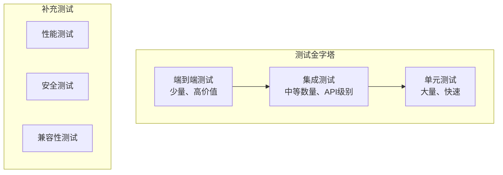

# 测试和质量保证指南

## 概述

本文档详细说明了 Moon Dev AI Agents 项目的测试策略、质量保证标准和最佳实践。我们采用多层次测试方法确保系统的可靠性、性能和安全性。

## 目录

1. [测试架构](#测试架构)
2. [测试类型](#测试类型)
3. [测试环境设置](#测试环境设置)
4. [单元测试](#单元测试)
5. [集成测试](#集成测试)
6. [端到端测试](#端到端测试)
7. [性能测试](#性能测试)
8. [安全测试](#安全测试)
9. [测试数据管理](#测试数据管理)
10. [持续集成](#持续集成)
11. [质量指标](#质量指标)

## 测试架构

### 测试金字塔



### 测试分层策略

| 层级 | 测试类型 | 数量比例 | 执行频率 | 价值 |
|------|---------|---------|---------|------|
| 单元测试 | 70% | 每次提交 | 高 | 快速反馈 |
| 集成测试 | 20% | 每次PR | 中 | 组件交互 |
| 端到端测试 | 10% | 每日构建 | 低 | 用户场景 |

## 测试类型

### 1. 单元测试 (Unit Tests)

测试单个函数、方法或类的独立功能。

**特点**：
- 快速执行（毫秒级）
- 隔离测试，无外部依赖
- 高覆盖率目标
- 模拟外部依赖

### 2. 集成测试 (Integration Tests)

测试多个组件之间的交互。

**特点**：
- 测试 API 接口
- 数据库交互
- 外部服务集成
- 中等执行时间（秒级）

### 3. 端到端测试 (E2E Tests)

测试完整的用户场景和工作流程。

**特点**：
- 模拟真实用户行为
- 完整系统测试
- 较长执行时间（分钟级）
- 高价值但数量少

### 4. 性能测试 (Performance Tests)

测试系统性能和资源使用。

**特点**：
- 响应时间测试
- 并发测试
- 负载测试
- 内存泄漏检测

### 5. 安全测试 (Security Tests)

测试系统的安全性和漏洞。

**特点**：
- 输入验证测试
- 权限控制测试
- 数据泄露检测
- 依赖漏洞扫描

## 测试环境设置

### 开发依赖

`requirements-dev.txt`:
```txt
# 测试框架
pytest==7.4.0
pytest-asyncio==0.21.0
pytest-cov==4.1.0
pytest-mock==3.11.1
pytest-xdist==3.3.1

# 性能测试
pytest-benchmark==4.0.0
memory-profiler==0.61.0

# 代码质量
black==23.7.0
isort==5.12.0
flake8==6.0.0
mypy==1.5.1
pre-commit==3.3.3

# 测试工具
factory-boy==3.3.0
faker==19.3.0
freezegun==1.2.2
responses==0.23.3
testcontainers==3.7.1

# 覆盖率报告
coverage==7.3.0
pytest-html==3.2.0
```

### pytest 配置

`pytest.ini`:
```ini
[tool:pytest]
minversion = 6.0
testpaths = tests
python_files = test_*.py
python_classes = Test*
python_functions = test_*

# 标记定义
markers =
    unit: 单元测试
    integration: 集成测试
    e2e: 端到端测试
    slow: 慢速测试
    network: 需要网络的测试
    database: 需要数据库的测试
    performance: 性能测试

# 覆盖率配置
addopts =
    --strict-markers
    --strict-config
    --cov=src
    --cov-report=html
    --cov-report=term-missing
    --cov-fail-under=80
    --tb=short

# 异步测试配置
asyncio_mode = auto
```

### 测试目录结构

```
tests/
├── unit/                   # 单元测试
│   ├── agents/
│   ├── models/
│   ├── strategies/
│   └── utils/
├── integration/            # 集成测试
│   ├── api/
│   ├── database/
│   └── external_services/
├── e2e/                   # 端到端测试
│   ├── scenarios/
│   └── workflows/
├── performance/           # 性能测试
├── security/              # 安全测试
├── fixtures/              # 测试数据
│   ├── market_data.json
│   ├── token_data.json
│   └── user_data.json
├── conftest.py           # pytest 配置
└── helpers.py            # 测试辅助函数
```

## 单元测试

### 基本结构

```python
# tests/unit/agents/test_trading_agent.py

import pytest
from unittest.mock import Mock, patch, MagicMock
from typing import Dict, Any

from src.agents.trading_agent import TradingAgent
from src.exceptions import InsufficientBalanceError, InvalidOrderError


class TestTradingAgent:
    """交易代理单元测试类。"""

    @pytest.fixture
    def agent(self) -> TradingAgent:
        """创建测试用的交易代理实例。"""
        config = {
            'max_risk': 2.0,
            'default_amount': 100.0,
            'leverage': 1
        }
        return TradingAgent(config)

    @pytest.fixture
    def mock_model_factory(self):
        """模拟模型工厂。"""
        with patch('src.agents.trading_agent.ModelFactory') as mock_factory:
            mock_model = Mock()
            mock_model.generate_response.return_value = {
                'action': 'HOLD',
                'confidence': 0.7,
                'reasoning': '市场震荡，建议观望'
            }
            mock_factory.return_value.get_model.return_value = mock_model
            yield mock_factory

    def test_init_success(self, agent: TradingAgent) -> None:
        """测试初始化成功。"""
        assert agent.config['max_risk'] == 2.0
        assert agent.config['default_amount'] == 100.0
        assert agent.config['leverage'] == 1

    def test_analyze_market_success(
        self,
        agent: TradingAgent,
        mock_market_data: Dict[str, Any]
    ) -> None:
        """测试市场分析成功场景。"""
        with patch.object(agent, '_get_market_data', return_value=mock_market_data):
            result = agent.analyze_market('BTC')

            assert result['action'] in ['BUY', 'SELL', 'HOLD']
            assert 0 <= result['confidence'] <= 1
            assert 'reasoning' in result
            assert isinstance(result['reasoning'], str)

    def test_analyze_market_invalid_token(self, agent: TradingAgent) -> None:
        """测试无效代币符号。"""
        with pytest.raises(ValueError, match="代币符号不能为空"):
            agent.analyze_market('')

    def test_analyze_market_invalid_token_length(self, agent: TradingAgent) -> None:
        """测试代币符号长度无效。"""
        with pytest.raises(ValueError, match="代币符号长度无效"):
            agent.analyze_market('AB')

    @pytest.mark.parametrize("token,expected_action", [
        ('BTC', 'BUY'),
        ('ETH', 'SELL'),
        ('SOL', 'HOLD')
    ])
    def test_analyze_different_tokens(
        self,
        agent: TradingAgent,
        mock_model_factory,
        token: str,
        expected_action: str
    ) -> None:
        """测试不同代币的分析。"""
        mock_model_factory.return_value.get_model.return_value.generate_response.return_value = {
            'action': expected_action,
            'confidence': 0.8,
            'reasoning': f'分析{token}的结果'
        }

        with patch.object(agent, '_get_market_data'):
            result = agent.analyze_market(token)
            assert result['action'] == expected_action
```

### Mock 和 Patch 的使用

```python
# tests/unit/models/test_model_factory.py

import pytest
from unittest.mock import Mock, patch, AsyncMock

from src.models.model_factory import ModelFactory, ClaudeModel


class TestModelFactory:
    """模型工厂测试类。"""

    @pytest.fixture
    def mock_anthropic_client(self):
        """模拟 Anthropic 客户端。"""
        with patch('src.models.claude_model.anthropic.Anthropic') as mock_client:
            mock_response = Mock()
            mock_response.content = [Mock(text="测试响应")]
            mock_client.return_value.messages.create.return_value = mock_response
            yield mock_client

    def test_get_claude_model_success(self, mock_anthropic_client):
        """测试获取 Claude 模型成功。"""
        factory = ModelFactory()
        model = factory.get_model('claude')

        assert isinstance(model, ClaudeModel)
        mock_anthropic_client.assert_called_once()

    def test_generate_response_with_network_error(self, mock_anthropic_client):
        """测试网络错误处理。"""
        mock_anthropic_client.return_value.messages.create.side_effect = ConnectionError("网络错误")

        factory = ModelFactory()
        model = factory.get_model('claude')

        with pytest.raises(ConnectionError):
            model.generate_response("测试提示", "用户输入")

    @patch('src.models.model_factory.time.time')
    def test_response_time_calculation(self, mock_time):
        """测试响应时间计算。"""
        # 模拟时间经过
        mock_time.side_effect = [1000.0, 1002.5]  # 开始和结束时间

        factory = ModelFactory()
        model = factory.get_model('claude')

        # 这里需要实际的响应时间测量逻辑
        # response_time = model.measure_response_time(...)
        # assert response_time == 2.5
```

### 参数化测试

```python
# tests/unit/test_risk_calculations.py

import pytest
from src.risk.calculator import RiskCalculator

class TestRiskCalculations:
    """风险计算测试类。"""

    @pytest.mark.parametrize("balance,risk_pct,expected_max", [
        (1000, 2.0, 20.0),
        (5000, 1.5, 75.0),
        (10000, 3.0, 300.0),
        (0, 2.0, 0.0),
    ])
    def test_calculate_max_risk_amount(
        self,
        balance: float,
        risk_pct: float,
        expected_max: float
    ) -> None:
        """测试最大风险金额计算。"""
        calculator = RiskCalculator()
        result = calculator.calculate_max_risk_amount(balance, risk_pct)
        assert abs(result - expected_max) < 0.01

    @pytest.mark.parametrize("positions,expected_concentration", [
        ([{'symbol': 'BTC', 'value': 1000}], 1.0),
        ([{'symbol': 'BTC', 'value': 500}, {'symbol': 'ETH', 'value': 500}], 0.5),
        ([{'symbol': 'BTC', 'value': 333}, {'symbol': 'ETH', 'value': 333}, {'symbol': 'SOL', 'value': 334}], 0.334),
    ])
    def test_calculate_concentration_risk(
        self,
        positions: list,
        expected_concentration: float
    ) -> None:
        """测试集中度风险计算。"""
        calculator = RiskCalculator()
        total_value = sum(p['value'] for p in positions)
        max_position = max(p['value'] for p in positions)

        result = calculator.calculate_concentration_risk(positions)
        expected = max_position / total_value if total_value > 0 else 0

        assert abs(result - expected) < 0.01
```

## 集成测试

### API 集成测试

```python
# tests/integration/api/test_trading_api.py

import pytest
import requests
from typing import Dict, Any

from src.api.trading_api import TradingAPI
from tests.integration.conftest import IntegrationTestConfig


class TestTradingAPIIntegration:
    """交易 API 集成测试类。"""

    @pytest.fixture
    def api_client(self):
        """创建 API 客户端。"""
        config = IntegrationTestConfig()
        return TradingAPI(
            base_url=config.api_base_url,
            api_key=config.api_key,
            timeout=config.timeout
        )

    @pytest.mark.integration
    @pytest.mark.network
    def test_get_market_data_success(self, api_client: TradingAPI) -> None:
        """测试获取市场数据成功。"""
        response = api_client.get_market_data('BTC-USDT')

        assert response['success'] is True
        assert 'price' in response['data']
        assert 'volume' in response['data']
        assert 'timestamp' in response['data']

    @pytest.mark.integration
    @pytest.mark.network
    def test_place_order_success(self, api_client: TradingAPI) -> None:
        """测试下单成功。"""
        order_data = {
            'symbol': 'BTC-USDT',
            'side': 'buy',
            'type': 'market',
            'amount': 0.001
        }

        response = api_client.place_order(order_data)

        assert response['success'] is True
        assert 'order_id' in response['data']
        assert isinstance(response['data']['order_id'], str)

    @pytest.mark.integration
    def test_place_order_insufficient_balance(self, api_client: TradingAPI) -> None:
        """测试余额不足场景。"""
        order_data = {
            'symbol': 'BTC-USDT',
            'side': 'buy',
            'type': 'market',
            'amount': 1000  # 超大金额
        }

        response = api_client.place_order(order_data)

        assert response['success'] is False
        assert 'error' in response
        assert 'balance' in response['error'].lower()
```

### 数据库集成测试

```python
# tests/integration/database/test_trading_database.py

import pytest
import sqlite3
from typing import List, Dict, Any

from src.database.trading_db import TradingDatabase
from tests.integration.conftest import DatabaseTestConfig


class TestTradingDatabaseIntegration:
    """交易数据库集成测试类。"""

    @pytest.fixture
    def db_connection(self):
        """创建测试数据库连接。"""
        config = DatabaseTestConfig()
        conn = sqlite3.connect(config.test_db_path)
        conn.row_factory = sqlite3.Row
        yield conn
        conn.close()

    @pytest.fixture
    def trading_db(self, db_connection):
        """创建交易数据库实例。"""
        return TradingDatabase(db_connection)

    @pytest.mark.database
    def test_save_trade_success(self, trading_db: TradingDatabase) -> None:
        """测试保存交易记录成功。"""
        trade_data = {
            'symbol': 'BTC-USDT',
            'side': 'buy',
            'amount': 0.001,
            'price': 45000.0,
            'timestamp': '2024-01-01T00:00:00Z'
        }

        trade_id = trading_db.save_trade(trade_data)

        assert trade_id is not None
        assert isinstance(trade_id, int)

        # 验证数据是否正确保存
        saved_trade = trading_db.get_trade(trade_id)
        assert saved_trade['symbol'] == trade_data['symbol']
        assert saved_trade['amount'] == trade_data['amount']

    @pytest.mark.database
    def test_get_trading_history(self, trading_db: TradingDatabase) -> None:
        """测试获取交易历史。"""
        # 插入测试数据
        trades = [
            {'symbol': 'BTC-USDT', 'side': 'buy', 'amount': 0.001, 'price': 45000},
            {'symbol': 'ETH-USDT', 'side': 'buy', 'amount': 0.1, 'price': 3000},
            {'symbol': 'BTC-USDT', 'side': 'sell', 'amount': 0.001, 'price': 46000}
        ]

        for trade in trades:
            trading_db.save_trade(trade)

        history = trading_db.get_trading_history(limit=10)

        assert len(history) == 3
        assert all('symbol' in trade for trade in history)

        # 按时间排序检查
        times = [trade['timestamp'] for trade in history]
        assert times == sorted(times, reverse=True)
```

## 端到端测试

### 交易流程测试

```python
# tests/e2e/test_trading_workflow.py

import pytest
import asyncio
from typing import Dict, Any

from src.main import TradingSystem
from src.config import *
from tests.e2e.conftest import E2ETestConfig


class TestTradingWorkflowE2E:
    """交易流程端到端测试类。"""

    @pytest.fixture
    async def trading_system(self):
        """创建交易系统实例。"""
        config = E2ETestConfig()
        system = TradingSystem(config)
        await system.initialize()
        yield system
        await system.cleanup()

    @pytest.mark.e2e
    @pytest.mark.slow
    async def test_complete_trading_cycle(self, trading_system) -> None:
        """测试完整交易周期。"""
        # 1. 获取市场数据
        market_data = await trading_system.get_market_data(['BTC', 'ETH'])
        assert len(market_data) == 2
        assert all('price' in data for data in market_data.values())

        # 2. 分析市场
        analysis_results = []
        for symbol, data in market_data.items():
            analysis = await trading_system.analyze_market(symbol, data)
            analysis_results.append((symbol, analysis))

        assert len(analysis_results) == 2

        # 3. 执行交易（仅测试信号生成，不实际交易）
        for symbol, analysis in analysis_results:
            if analysis['action'] == 'BUY':
                # 验证交易信号
                assert analysis['confidence'] > 0.5
                assert 'entry_price' in analysis
                assert 'stop_loss' in analysis
                assert 'take_profit' in analysis

                # 模拟执行交易（测试环境）
                order_result = await trading_system.simulate_order(
                    symbol=symbol,
                    action=analysis['action'],
                    amount=analysis['position_size']
                )

                assert order_result['success'] is True
                assert 'order_id' in order_result

    @pytest.mark.e2e
    async def test_risk_management_integration(self, trading_system) -> None:
        """测试风险管理集成。"""
        # 创建一个会导致风险超限的"虚假"交易
        large_position = {
            'symbol': 'BTC-USDT',
            'amount': 10000,  # 超大金额
            'action': 'BUY'
        }

        # 风险管理应该阻止这个交易
        risk_check = await trading_system.check_risk_limits(large_position)
        assert risk_check['approved'] is False
        assert 'reason' in risk_check

        # 正常大小的交易应该通过
        normal_position = {
            'symbol': 'BTC-USDT',
            'amount': 100,  # 正常金额
            'action': 'BUY'
        }

        risk_check = await trading_system.check_risk_limits(normal_position)
        assert risk_check['approved'] is True
```

### 性能场景测试

```python
# tests/e2e/test_performance_scenarios.py

import pytest
import asyncio
import time
from typing import List, Dict, Any

from src.main import TradingSystem


class TestPerformanceScenariosE2E:
    """性能场景端到端测试类。"""

    @pytest.mark.e2e
    @pytest.mark.performance
    async def test_concurrent_market_analysis(self) -> None:
        """测试并发市场分析性能。"""
        system = TradingSystem()
        await system.initialize()

        tokens = ['BTC', 'ETH', 'SOL', 'AVAX', 'MATIC', 'DOT', 'LINK', 'UNI']

        start_time = time.time()

        # 并发分析多个代币
        tasks = [
            system.analyze_market(token)
            for token in tokens
        ]
        results = await asyncio.gather(*tasks)

        end_time = time.time()
        total_time = end_time - start_time

        # 性能断言
        assert total_time < 30.0  # 30秒内完成
        assert len(results) == len(tokens)
        assert all(result is not None for result in results)

        # 计算平均响应时间
        avg_time_per_token = total_time / len(tokens)
        assert avg_time_per_token < 5.0  # 每个代币平均5秒内

        await system.cleanup()

    @pytest.mark.e2e
    @pytest.mark.performance
    async def test_memory_usage_stability(self) -> None:
        """测试内存使用稳定性。"""
        import psutil
        import os

        process = psutil.Process(os.getpid())
        initial_memory = process.memory_info().rss / 1024 / 1024  # MB

        system = TradingSystem()
        await system.initialize()

        # 执行大量操作
        for i in range(100):
            await system.analyze_market('BTC')
            if i % 20 == 0:
                # 强制垃圾回收
                import gc
                gc.collect()

        final_memory = process.memory_info().rss / 1024 / 1024  # MB
        memory_increase = final_memory - initial_memory

        # 内存增长不应该超过 100MB
        assert memory_increase < 100, f"内存增长过多: {memory_increase:.2f}MB"

        await system.cleanup()
```

## 性能测试

### 响应时间基准测试

```python
# tests/performance/test_benchmarks.py

import pytest
from pytest_benchmark.fixture import BenchmarkFixture

from src.models.model_factory import ModelFactory
from src.agents.trading_agent import TradingAgent


class TestPerformanceBenchmarks:
    """性能基准测试类。"""

    def test_model_response_time(self, benchmark: BenchmarkFixture) -> None:
        """测试模型响应时间。"""
        factory = ModelFactory()
        model = factory.get_model('claude')

        response = benchmark(
            model.generate_response,
            system_prompt="你是一个交易分析师。",
            user_content="分析 BTC 的短期走势。",
            max_tokens=100
        )

        assert len(response) > 10

    def test_trading_analysis_performance(
        self,
        benchmark: BenchmarkFixture,
        mock_market_data
    ) -> None:
        """测试交易分析性能。"""
        agent = TradingAgent()

        result = benchmark(
            agent.analyze_market,
            'BTC',
            mock_market_data
        )

        assert result is not None
        assert 'action' in result

    @pytest.mark.parametrize("data_size", [100, 1000, 10000])
    def test_data_processing_performance(
        self,
        benchmark: BenchmarkFixture,
        data_size: int
    ) -> None:
        """测试数据处理性能。"""
        from src.data.processor import DataProcessor

        processor = DataProcessor()
        test_data = [{'value': i} for i in range(data_size)]

        result = benchmark(
            processor.process_batch,
            test_data
        )

        assert len(result) == data_size
```

### 内存使用分析

```python
# tests/performance/test_memory_profiling.py

import pytest
from memory_profiler import profile

from src.data.ohlcv_collector import OHLCVCollector


class TestMemoryProfiling:
    """内存使用分析测试类。"""

    @pytest.mark.performance
    def test_large_dataset_processing(self) -> None:
        """测试大数据集处理的内存使用。"""

        @profile
        def process_large_dataset():
            collector = OHLCVCollector()

            # 模拟处理大量数据
            for i in range(1000):
                data = collector.generate_test_data(size=1000)
                processed = collector.process_data(data)

                # 及时释放内存
                del data
                del processed

        # 运行内存分析
        process_large_dataset()

    @pytest.mark.performance
    def test_model_factory_memory_leak(self) -> None:
        """测试模型工厂内存泄漏。"""
        import gc
        import psutil
        import os

        process = psutil.Process(os.getpid())

        initial_objects = len(gc.get_objects())
        initial_memory = process.memory_info().rss

        # 创建大量模型实例
        models = []
        for _ in range(100):
            factory = ModelFactory()
            model = factory.get_model('claude')
            models.append(model)

        # 删除模型
        del models
        gc.collect()

        final_objects = len(gc.get_objects())
        final_memory = process.memory_info().rss

        # 检查是否有内存泄漏
        object_increase = final_objects - initial_objects
        memory_increase = final_memory - initial_memory

        assert object_increase < 1000, "可能存在对象泄漏"
        assert memory_increase < 50 * 1024 * 1024, "可能存在内存泄漏"
```

## 安全测试

### 输入验证测试

```python
# tests/security/test_input_validation.py

import pytest
from src.validators.input_validator import InputValidator


class TestInputValidationSecurity:
    """输入验证安全测试类。"""

    def test_sql_injection_attempts(self) -> None:
        """测试 SQL 注入尝试。"""
        malicious_inputs = [
            "'; DROP TABLE users; --",
            "1' OR '1'='1",
            "'; INSERT INTO users VALUES ('hacker', 'password'); --",
            "1'; UPDATE users SET password='hacked'; --",
            "UNION SELECT * FROM sensitive_data"
        ]

        validator = InputValidator()

        for malicious_input in malicious_inputs:
            # 应该被拒绝或清理
            is_valid = validator.validate_token_symbol(malicious_input)
            assert not is_valid, f"恶意输入未被拒绝: {malicious_input}"

            # 清理后的输入应该是安全的
            cleaned = validator.sanitize_user_input(malicious_input)
            assert "';" not in cleaned
            assert "DROP" not in cleaned
            assert "UNION" not in cleaned

    def test_xss_prevention(self) -> None:
        """测试 XSS 攻击防护。"""
        xss_payloads = [
            "<script>alert('xss')</script>",
            "javascript:alert('xss')",
            "",
            "<svg onload=alert('xss')>",
            "'\"><script>alert('xss')</script>"
        ]

        validator = InputValidator()

        for payload in xss_payloads:
            cleaned = validator.sanitize_user_input(payload)

            # 检查危险标签是否被移除
            assert "<script>" not in cleaned
            assert "javascript:" not in cleaned
            assert "onerror=" not in cleaned
            assert "onload=" not in cleaned

    def test_path_traversal_prevention(self) -> None:
        """测试路径遍历攻击防护。"""
        path_traversal_payloads = [
            "../../../etc/passwd",
            "..\\..\\..\\windows\\system32\\config\\sam",
            "....//....//....//etc/passwd",
            "%2e%2e%2f%2e%2e%2f%2e%2e%2fetc%2fpasswd"
        ]

        validator = InputValidator()

        for payload in path_traversal_payloads:
            is_safe = validator.validate_file_path(payload)
            assert not is_safe, f"路径遍历攻击未被阻止: {payload}"
```

### 权限控制测试

```python
# tests/security/test_authorization.py

import pytest
from src.auth.permissions import PermissionManager, User, Permission


class TestAuthorizationSecurity:
    """权限控制安全测试类。"""

    @pytest.fixture
    def permission_manager(self) -> PermissionManager:
        """创建权限管理器。"""
        return PermissionManager()

    @pytest.fixture
    def regular_user(self) -> User:
        """创建普通用户。"""
        return User(
            id=1,
            username="regular_user",
            permissions=[Permission.READ_MARKET_DATA, Permission.PLACE_SMALL_ORDERS]
        )

    @pytest.fixture
    def admin_user(self) -> User:
        """创建管理员用户。"""
        return User(
            id=2,
            username="admin_user",
            permissions=Permission.all_permissions()
        )

    def test_regular_user_cannot_access_admin_functions(
        self,
        permission_manager: PermissionManager,
        regular_user: User
    ) -> None:
        """测试普通用户无法访问管理员功能。"""
        admin_permissions = [
            Permission.MANAGE_USERS,
            Permission.MODIFY_SYSTEM_CONFIG,
            Permission.VIEW_ALL_ORDERS,
            Permission.CANCEL_ANY_ORDER
        ]

        for permission in admin_permissions:
            has_permission = permission_manager.has_permission(regular_user, permission)
            assert not has_permission, f"普通用户不应该有权限: {permission}"

    def test_permission_escalation_prevention(
        self,
        permission_manager: PermissionManager,
        regular_user: User
    ) -> None:
        """测试权限提升攻击防护。"""
        # 尝试伪造权限
        fake_permissions = list(Permission.all_permissions())
        regular_user.permissions = fake_permissions

        # 权限管理器应该验证权限的真实性
        validated_permissions = permission_manager.validate_user_permissions(regular_user)

        # 验证后的权限应该是原始权限，不是伪造的权限
        assert len(validated_permissions) == len(regular_user.permissions) - len(fake_permissions)
        assert Permission.MANAGE_USERS not in validated_permissions

    def test_session_hijacking_prevention(self) -> None:
        """测试会话劫持防护。"""
        from src.auth.session import SessionManager

        session_manager = SessionManager()

        # 创建正常会话
        session_id = session_manager.create_session(user_id=1)
        assert session_id is not None

        # 尝试使用伪造的会话 ID
        fake_session_ids = [
            "fake_session_123",
            "admin_session_456",
            "../../../../etc/passwd",
            "' OR '1'='1"
        ]

        for fake_session_id in fake_session_ids:
            user = session_manager.validate_session(fake_session_id)
            assert user is None, f"伪造会话 ID 被接受: {fake_session_id}"
```

## 测试数据管理

### 测试数据工厂

```python
# tests/factories/trading_factory.py

import factory
from factory import fuzzy
from datetime import datetime, timedelta
import random

from src.models.trading import Trade, Position, MarketData


class MarketDataFactory(factory.Factory):
    """市场数据工厂。"""

    class Meta:
        model = MarketData

    symbol = fuzzy.FuzzyChoice(['BTC-USDT', 'ETH-USDT', 'SOL-USDT'])
    price = fuzzy.FuzzyFloat(1.0, 100000.0)
    volume = fuzzy.FuzzyFloat(1000.0, 10000000.0)
    change_24h = fuzzy.FuzzyFloat(-20.0, 20.0)
    timestamp = factory.LazyFunction(
        lambda: datetime.now() - timedelta(minutes=random.randint(0, 1440))
    )


class TradeFactory(factory.Factory):
    """交易记录工厂。"""

    class Meta:
        model = Trade

    symbol = fuzzy.FuzzyChoice(['BTC-USDT', 'ETH-USDT', 'SOL-USDT'])
    side = fuzzy.FuzzyChoice(['buy', 'sell'])
    amount = fuzzy.FuzzyFloat(0.001, 10.0)
    price = fuzzy.FuzzyFloat(1.0, 100000.0)
    timestamp = factory.LazyFunction(datetime.now)
    order_id = factory.FuzzyText(length=10)


class PositionFactory(factory.Factory):
    """持仓记录工厂。"""

    class Meta:
        model = Position

    symbol = fuzzy.FuzzyChoice(['BTC-USDT', 'ETH-USDT', 'SOL-USDT'])
    amount = fuzzy.FuzzyFloat(-10.0, 10.0)
    entry_price = fuzzy.FuzzyFloat(1.0, 100000.0)
    current_price = fuzzy.FuzzyFloat(1.0, 100000.0)
    unrealized_pnl = factory.LazyAttribute(
        lambda obj: (obj.current_price - obj.entry_price) * obj.amount
    )
```

### 测试数据提供者

```python
# tests/fixtures/data_providers.py

import pytest
import json
from pathlib import Path
from typing import Dict, Any, List


@pytest.fixture
def sample_market_data() -> Dict[str, Any]:
    """提供样本市场数据。"""
    return {
        'BTC-USDT': {
            'price': 45000.0,
            'volume': 25000000.0,
            'change_24h': 2.5,
            'high_24h': 46000.0,
            'low_24h': 43000.0,
            'timestamp': '2024-01-01T00:00:00Z'
        },
        'ETH-USDT': {
            'price': 3000.0,
            'volume': 15000000.0,
            'change_24h': -1.2,
            'high_24h': 3100.0,
            'low_24h': 2900.0,
            'timestamp': '2024-01-01T00:00:00Z'
        }
    }


@pytest.fixture
def ohlcv_data_series() -> List[Dict[str, Any]]:
    """提供 OHLCV 时间序列数据。"""
    data_path = Path(__file__).parent / 'ohlcv_data.json'

    if data_path.exists():
        with open(data_path) as f:
            return json.load(f)

    # 生成模拟数据
    return [
        {
            'timestamp': f'2024-01-01T{hour:02d}:00:00Z',
            'open': 45000 + (hour % 10) * 100,
            'high': 45200 + (hour % 10) * 100,
            'low': 44800 + (hour % 10) * 100,
            'close': 45100 + (hour % 10) * 100,
            'volume': 1000000 + hour * 10000
        }
        for hour in range(24)
    ]


@pytest.fixture
def trading_scenarios() -> Dict[str, Dict[str, Any]]:
    """提供交易场景数据。"""
    return {
        'bull_market': {
            'market_condition': 'bullish',
            'volatility': 'medium',
            'recommended_action': 'BUY',
            'confidence': 0.8,
            'risk_level': 'medium'
        },
        'bear_market': {
            'market_condition': 'bearish',
            'volatility': 'high',
            'recommended_action': 'SELL',
            'confidence': 0.7,
            'risk_level': 'high'
        },
        'sideways_market': {
            'market_condition': 'sideways',
            'volatility': 'low',
            'recommended_action': 'HOLD',
            'confidence': 0.6,
            'risk_level': 'low'
        }
    }
```

## 持续集成

### GitHub Actions 配置

`.github/workflows/test.yml`:
```yaml
name: Test Suite

on:
  push:
    branches: [ main, develop ]
  pull_request:
    branches: [ main ]

jobs:
  test:
    runs-on: ubuntu-latest
    strategy:
      matrix:
        python-version: [3.8, 3.9, 3.10, 3.11]

    steps:
    - uses: actions/checkout@v3

    - name: Set up Python ${{ matrix.python-version }}
      uses: actions/setup-python@v3
      with:
        python-version: ${{ matrix.python-version }}

    - name: Cache pip dependencies
      uses: actions/cache@v3
      with:
        path: ~/.cache/pip
        key: ${{ runner.os }}-pip-${{ hashFiles('**/requirements*.txt') }}
        restore-keys: |
          ${{ runner.os }}-pip-

    - name: Install dependencies
      run: |
        python -m pip install --upgrade pip
        pip install -r requirements.txt
        pip install -r requirements-dev.txt

    - name: Lint with flake8
      run: |
        flake8 src tests --count --select=E9,F63,F7,F82 --show-source --statistics
        flake8 src tests --count --exit-zero --max-complexity=10 --max-line-length=88 --statistics

    - name: Type check with mypy
      run: mypy src

    - name: Run unit tests
      run: |
        pytest tests/unit -v --cov=src --cov-report=xml

    - name: Run integration tests
      run: |
        pytest tests/integration -v --cov=src --cov-append --cov-report=xml

    - name: Upload coverage to Codecov
      uses: codecov/codecov-action@v3
      with:
        file: ./coverage.xml
        flags: unittests
        name: codecov-umbrella

  performance-test:
    runs-on: ubuntu-latest
    needs: test
    if: github.event_name == 'pull_request'

    steps:
    - uses: actions/checkout@v3

    - name: Set up Python
      uses: actions/setup-python@v3
      with:
        python-version: 3.9

    - name: Install dependencies
      run: |
        python -m pip install --upgrade pip
        pip install -r requirements.txt
        pip install -r requirements-dev.txt

    - name: Run performance tests
      run: |
        pytest tests/performance -v --benchmark-json=benchmark.json

    - name: Store benchmark result
      uses: benchmark-action/github-action-benchmark@v1
      with:
        tool: 'pytest'
        output-file-path: benchmark.json
        github-token: ${{ secrets.GITHUB_TOKEN }}
        auto-push: true
```

### 测试报告生成

`scripts/generate_test_report.py`:
```python
#!/usr/bin/env python3
"""生成测试报告脚本。"""

import os
import json
import subprocess
from pathlib import Path
from typing import Dict, Any


def run_command(command: str) -> Dict[str, Any]:
    """运行命令并返回结果。"""
    result = subprocess.run(
        command,
        shell=True,
        capture_output=True,
        text=True
    )
    return {
        'returncode': result.returncode,
        'stdout': result.stdout,
        'stderr': result.stderr
    }


def generate_test_report() -> None:
    """生成完整的测试报告。"""
    print("🧪 开始生成测试报告...")

    # 运行测试并生成覆盖率报告
    print("📊 运行测试套件...")
    test_result = run_command(
        "pytest --cov=src --cov-report=html --cov-report=xml --cov-report=term -v"
    )

    if test_result['returncode'] != 0:
        print("❌ 测试失败")
        print(test_result['stderr'])
        return

    print("✅ 测试通过")
    print(test_result['stdout'])

    # 生成性能基准报告
    print("🚀 运行性能基准测试...")
    benchmark_result = run_command(
        "pytest tests/performance --benchmark-json=benchmark.json"
    )

    if benchmark_result['returncode'] == 0:
        print("✅ 性能测试完成")

        # 处理基准测试结果
        with open('benchmark.json') as f:
            benchmark_data = json.load(f)

        print("📈 性能基准:")
        for benchmark in benchmark_data['benchmarks']:
            name = benchmark['name']
            mean = benchmark['stats']['mean']
            print(f"  {name}: {mean:.4f}s")

    # 生成质量指标报告
    print("📋 生成代码质量报告...")

    # 运行代码质量检查
    quality_checks = [
        ('代码格式检查', 'black --check src tests'),
        ('导入排序检查', 'isort --check-only src tests'),
        ('代码复杂度检查', 'radon cc src --min B'),
        ('代码重复检查', 'radon raw src')
    ]

    quality_results = {}
    for check_name, command in quality_checks:
        result = run_command(command)
        quality_results[check_name] = result['returncode'] == 0

    print("\n📊 质量检查结果:")
    for check_name, passed in quality_results.items():
        status = "✅" if passed else "❌"
        print(f"  {status} {check_name}")

    print("\n📄 测试报告生成完成!")
    print("📁 查看详细报告:")
    print("  - 覆盖率报告: htmlcov/index.html")
    print("  - 性能基准: benchmark.json")


if __name__ == "__main__":
    generate_test_report()
```

## 质量指标

### 代码覆盖率目标

| 模块 | 目标覆盖率 | 当前覆盖率 |
|------|-----------|-----------|
| 核心交易逻辑 | 95% | 待统计 |
| 风险管理 | 90% | 待统计 |
| AI 模型集成 | 85% | 待统计 |
| 数据处理 | 90% | 待统计 |
| API 接口 | 90% | 待统计 |
| 工具函数 | 95% | 待统计 |
| 整体项目 | 85% | 待统计 |

### 性能基准

| 指标 | 目标值 | 当前值 |
|------|--------|--------|
| 单元测试执行时间 | < 30秒 | 待测量 |
| 集成测试执行时间 | < 2分钟 | 待测量 |
| API 响应时间 | < 500ms | 待测量 |
| 模型推理时间 | < 5秒 | 待测量 |
| 内存使用增长 | < 50MB | 待测量 |
| CPU 使用率 | < 30% | 待测量 |

### 质量门禁

```python
# scripts/quality_gate.py

import sys
import subprocess
import xml.etree.ElementTree as ET


def check_coverage_threshold(threshold: float = 80.0) -> bool:
    """检查覆盖率是否达到阈值。"""
    try:
        # 解析覆盖率 XML 报告
        tree = ET.parse('coverage.xml')
        root = tree.getroot()

        coverage = root.find('.//coverage')
        if coverage is not None:
            coverage_percentage = float(coverage.get('line-rate', 0)) * 100
            print(f"当前覆盖率: {coverage_percentage:.1f}%")
            return coverage_percentage >= threshold
    except Exception as e:
        print(f"覆盖率检查失败: {e}")
        return False

    return False


def check_test_success() -> bool:
    """检查测试是否全部通过。"""
    result = subprocess.run(
        'pytest --tb=no -q',
        shell=True,
        capture_output=True,
        text=True
    )

    return result.returncode == 0


def main() -> None:
    """质量门禁主函数。"""
    print("🚪 执行质量门禁检查...")

    # 检查测试通过率
    if not check_test_success():
        print("❌ 测试未全部通过，质量门禁失败")
        sys.exit(1)

    # 检查覆盖率
    if not check_coverage_threshold():
        print("❌ 覆盖率未达标，质量门禁失败")
        sys.exit(1)

    print("✅ 质量门禁检查通过")
    sys.exit(0)


if __name__ == "__main__":
    main()
```

---

这个测试和质量保证指南确保了 Moon Dev AI Agents 项目的高质量交付。通过多层次测试策略和自动化质量检查，我们能够快速迭代开发，同时保持系统的可靠性和性能。